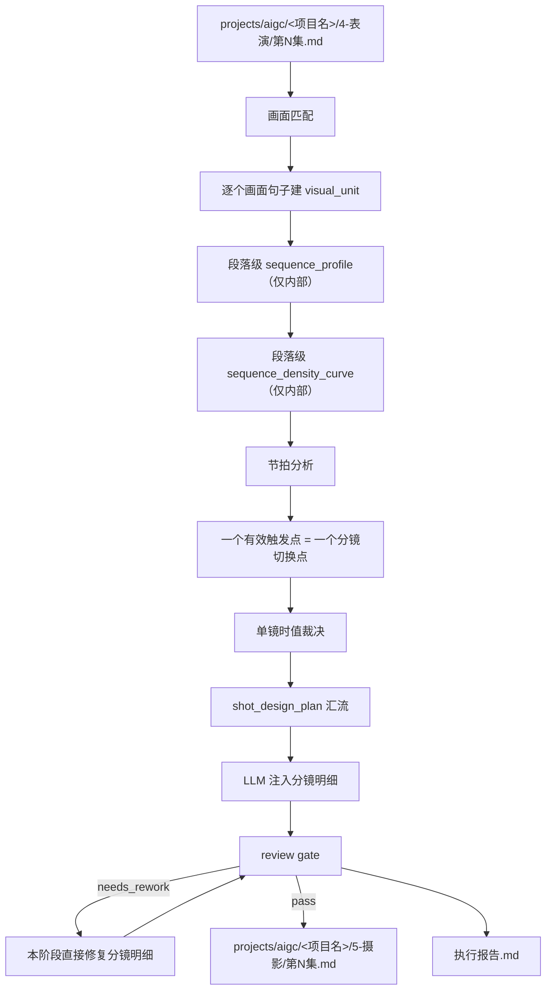
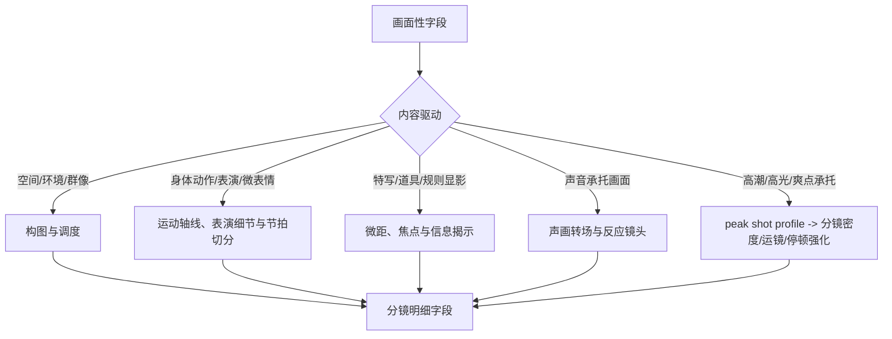

# aigc 5-摄影

`5-摄影` 负责在 `4-表演` 逐集稿基础上，为每一个画面性句子注入大师级分镜、摄影、运镜、光影和色彩设计。画面性句子关注可被摄影机处理的可见信息，包括人物造型、服装、姿态、视线、微表情、呼吸、手部动作、身体距离、场景空间、光线、色块、门窗桌椅、黑板/屏幕文字、道具状态、规则显影、异常物理变化和可视化插入段。它不改写剧情事实、对白、场景顺序或编导字段，只在命中的画面句子下方新增 `分镜明细：` 字段。组间或跨场景创意转场主创归属下游 `6-分组` 的组间首尾帧连接件；本阶段只保留镜头内部连续性、当前画面进入点和最后一镜可消费交出锚点。

`分镜明细：` 是为兼容下游 `6-分组`、图像与视频阶段保留的字段名，不是开放式文学或主题阐释标题。本字段的语义别名固定为“运镜摄影设计”：内容必须聚焦运镜手法、摄影美学、构图/机位/景别/景深/焦点/光影/色彩、同一画面内部的注意力转交，以及最后一镜交给下游连接件的可见锚点。场景变化只触发本阶段标记交出点与进入提示，不在 `5-摄影` 里裁决普通切镜、软桥接、匹配剪辑或高能转场方案。不得写抽象主题、人物心理结论、剧情寓意、价值判断、世界观解释、导演阐释或无法被摄影/剪辑执行的气氛口号。

`5-摄影` 可以建立段落级连续观看意图，但最终落盘必须保持逐画面点归属：每个 `分镜明细：` 块只服务其正上方的画面性字段或画面句子。段落级流畅只能作为内部 `sequence_profile` 影响相邻画面单位的视觉母题、注意力接力、运动家族、材质光色和交出锚点；不得把多个画面点合并成一条失主镜头，不得为了连续运镜提前吞入下一条画面句子的主体动作、对白反应、记忆段或道具揭示。

道具镜头必须通过准入门槛：只有重要道具/规则显影/证据/危险源、角色与道具发生明确互动、或当前画面需要必要环境交代时，才允许把道具作为 `visible_subject`、焦点拉移、反射/倒影或独立特写。无互动普通道具不得为了制造氛围、反射、涟漪、碰撞声或阴影关系而新增分镜；否则会迫使下游生成一个同时照顾人物和物件的奇怪角度，破坏原本流畅的人物动作衔接。

人物动作链优先于物件和镜头花样：每个 `分镜N` 先承接人物当前姿态、位置、朝向、身体接触、动作方向和注意力落点，再决定景别、运镜、焦点和道具插入。任何道具、反射、静物、光影或环境声如果不能说明互动、信息、规则/证据/危险源或必要空间交代，就不能成为切镜理由、焦点终点或时值理由。

## Context Loading Contract

- 每次调用 `$5-摄影` 时，必须同时加载同目录 `CONTEXT.md`。
- 每次调用本技能时，必须同时加载同目录 `CONTEXT.md`。
- 每次调用本技能时，必须同时识别并加载同目录 `types/` 中选中的类型包（单选或多选）。
- 若任务绑定 `projects/aigc/<项目名>/`，必须先加载项目根 `MEMORY.md`、`0-初始化/north_star.yaml` 与 `team.yaml`，再按需加载项目根 `CONTEXT/` 中与摄影、美术、风格或制作约束相关的上下文文件。
- 若本阶段执行顾问与复核流程（包含用户显式要求或仓库合同视为默认启用），必须读取 `../_shared/team-advisor-consultation-contract.md`，优先解析 `team.yaml.roles.supervision.stage_profiles."5-摄影"` 作为摄影监制载入 profile，再按共享合同回退旧字段；主 agent 必须基于本技能当前 `Thought Pass Map`、`steps/cinematography-workflow.md` 节点、目标集上下文和当前 `visual_unit` 动态派生顾问问题，要求顾问代入其角色意识、创作风格和专业水准参与节点判断、执行取舍与 gate 风险提示，并在 LLM 分镜明细注入前把可执行结论沉淀为 `advisor_consultation_packet` 作为后续任务上下文。
- 上游正文真源固定为 `projects/aigc/<项目名>/4-表演/第N集.md`，除非用户显式指定其他编导稿文件。
- 冲突优先级：用户显式请求 > 根 `AGENTS.md` / meta 规则 > 本 `SKILL.md` > `references/` / `steps/` / `types/` / `review/` / `templates/` > `agents/openai.yaml` > 项目 `MEMORY.md` > 项目 `CONTEXT/` > 本 `CONTEXT.md`。
- 核心分镜明细、节拍判断和审美设计必须由 LLM 直接完成；`scripts/` 只能做读取、标记检查、字段覆盖统计和机械校验。

## Multi-Subskill Continuous Workflow

当本主技能包被整体调用时，视为用户已授权按本级声明的同级子技能包、阶段分区或内部连续节点自动完成整个技能组任务；在满足本技能必要输入、显式选择和安全门后，不再为“是否继续下一步”额外确认。

- 无序号同级子技能包默认全选并发执行，由本主技能包汇总、裁决和写回唯一 canonical 输出。
- 数字序号子技能包或节点（如 `1-`、`2-`、`3-`）默认按数字升序串行执行，前一节点产物自动作为后一节点输入。
- 英文序号子技能包或路线（如 `A-`、`B-`、`C-`）默认按用户意图、父级路由或输入类型单选分流；只有用户明确要求对比、并跑或批量多路线时才多选。
- 卫星技能只承担查询、恢复、审查承接或辅助动作；不会因连续调度自动改写 `5-摄影` canonical 输出，除非父级合同或用户明确要求回接。
- 连续调度不得绕过本技能的阻断门：缺少必需输入、上游编导稿不可读、破坏性覆盖未授权、子技能缺失或路线歧义会造成错误 canonical 写回时，必须先停下并给出最小澄清或不可用说明。
- 每个被调度的子技能包仍必须加载自身 `SKILL.md + CONTEXT.md`；脚本只能承担机械辅助，不得替代 LLM 分镜明细主创或父级最终裁决。

## Input Contract

Accepted input:

- 项目名、项目路径、单个 `projects/aigc/<项目名>/4-表演/第N集.md` 文件，或多个集号范围。
- 用户要求“摄影”“分镜摄影”“分镜明细”“运镜”“画面句子下加分镜明细”“从 4-表演 到 5-摄影”等任务。
- 已完成或部分完成的 `4-表演` 逐集稿；默认以集为单位处理 `第N集.md`。

Required input:

- 可定位、可读取的 `4-表演/第N集.md`。
- 至少一个目标集号，或允许默认处理 `4-表演/` 中全部 `第N集.md`。
- 输入正文中存在可识别的画面性字段或画面性句子。

Optional input:

- 项目 `MEMORY.md` 中的长期摄影偏好、禁区、色彩倾向、节奏偏好。
- 项目 `0-初始化/north_star.yaml` 中的核心创作北极星、类型承诺、审美方向和不可偏离目标。
- 项目 `team.yaml` 中的团队配置、导演/摄影/美学角色口径、协作分工和可用审美参照。
- 项目 `CONTEXT/` 中的角色、美术、场景、世界观、视觉参考、镜头风格补充。
- 用户额外指定的参考导演、摄影师、影片、画幅、镜头焦段、运动强度或制作限制。

Reject or clarify when:

- 上游 `4-表演/第N集.md` 不存在、不可读，或正文缺少可处理字段。
- 用户要求重写剧情、改对白、删减原编导内容、合并集数或改变场景顺序。
- 用户要求直接生成图像提示词、视频请求、资产设计或分组拆分；这些应转交下游阶段。
- 用户要求脚本自动生成分镜明细正文；必须改为 LLM 主创、脚本只校验。

## Mode Selection

| mode | 触发信号 | 输出 |
| --- | --- | --- |
| `single_episode` | 指定单个 `第N集.md` 或单个集号 | `projects/aigc/<项目名>/5-摄影/第N集.md` |
| `episode_range` | 指定多个集号或集号范围 | 多个逐集摄影稿与更新后的执行报告 |
| `all_ready_episodes` | 未指定集号但 `4-表演/` 下有 `第N集.md` | 全部可读逐集摄影稿 |
| `repair` | 已有摄影稿缺失 `分镜明细`、分镜编号断裂、误改原文、节拍过粗/过碎、把字段写成抽象主题阐释，或把无互动道具硬写成焦点/反射/涟漪/孤立特写导致动作衔接别扭 | 最小修复后的逐集摄影稿与问题报告 |
| `stage_end_review_repair` | 任一非 `review_only` 摄影任务完成候选稿后自动进入 | 阶段内 review -> 直接修复分镜明细 -> 复审 -> canonical 写回 |
| `review_only` | 用户只要求检查 `5-摄影` 输出 | 审查报告，不改写正文，除非用户随后要求修复 |

## Advisor Consultation Mechanism

当 `5-摄影` 执行顾问与复核流程时，执行语义固定为“项目监制顾问团请教 -> 摄影参谋汇流 -> 上下文沉淀 -> 后续分镜明细任务消费”，而不是让顾问或复核结论直接主创、改写上游编导稿或替代 LLM 分镜明细注入。

1. 主 agent 先读取项目 `team.yaml`，按 `../_shared/team-advisor-consultation-contract.md` 的 `Team Roster Resolution` 解析摄影阶段监制 roster；优先使用 `roles.supervision.stage_profiles."5-摄影".members / members_ref`，再按共享合同回退到通用 `roles.supervision.members`、旧 `roles.supervising.*`、旧 `roles.production.*`、`team_setup.shared_agents` 或 `roles.planning.members`，必要时才按 team 根索引动态补位并记录原因。
2. 该流程中的顾问作为摄影监制顾问运行：围绕当前集 `4-表演` 上游正文、项目 `MEMORY.md`、`north_star.yaml`、相关 `CONTEXT/`、本技能的 `PASS-CINE-*` 思维通过点、`N*-*` 执行节点、review gate 和当前 `visual_unit`，代入各自角色意识、创作风格和专业水准提出参谋建议。
3. 顾问问题不得固定为一组摄影字段；必须从当前节点的 `input / judgment / action / evidence / gate / rework target` 派生。例如进入画面匹配时请顾问判断哪些可见信息不该漏掉，进入节拍或画面节奏时请顾问判断观看切点和张弛，进入峰值、连续性、分镜计划、注入或复审节点时请顾问用其专业风格给出节点可执行取舍。问题必须能推动当前节点执行，不得停留在泛泛“更电影感”。
4. 主 agent 负责裁决、去重和汇流，把顾问建议压缩成 `advisor_consultation_packet.must_do / must_not_do / inspiration_to_use / execution_brief`，并保留必要的 `node_ref / pass_ref / role_lens` 摘要，作为 LLM 分镜明细注入、阶段内修复和复审的额外上下文继续执行后续任务。
5. `advisor_consultation_packet` 不拥有上游 `4-表演` 原文、对白、场景顺序、字段合同或 canonical 写回权；顾问建议若与上游真源或本技能合同冲突，必须舍弃或降级为风险提示。
6. 若外部顾问与复核 provider 不可用，直接使用本地顾问与复核流程；不得把主 agent 本地顺序扮演写成外部 provider 已执行。

## Reference Loading Guide

| 场景 | 必读文件 |
| --- | --- |
| 任意摄影注入任务 | `steps/cinematography-workflow.md`、`references/visual-matching-contract.md`、`references/beat-analysis-contract.md` |
| 节拍 / 画面节奏 / 段落密度 / 镜头时值术语存在混用风险，或审查 2 镜集中、分镜密度、分镜数裁决 | `references/global-rhythm-terminology-glossary.md`，并回接 `references/beat-analysis-contract.md`、`references/visual-rhythm-analysis-contract.md`、`references/sequence-density-curve-contract.md`、`references/shot-duration-decision-contract.md` |
| 摄影创作阶段执行顾问与复核流程 / team reviewer runtime | `../_shared/team-advisor-consultation-contract.md`，并按本 `Advisor Consultation Mechanism` 执行 |
| 人物动作链优先、空间可达性、道具/环境准入与组间动作继承 | `../_shared/action-first-continuity-contract.md`、`references/shot-continuity-contract.md` |
| 角色活人感行为、多人动作-反应焦点、镜头不让所有角色同强度表演 | `../_shared/lived-in-character-behavior-contract.md`、`references/shot-continuity-contract.md` |
| 画面节奏、信息重要性、张弛有度、收敛/发散 | `references/visual-rhythm-analysis-contract.md` |
| 单镜显式时长、短剧·AIGC 默认压缩、对白台词量预算、读秒/停顿/压缩、15 秒组内节奏风险 | `references/shot-duration-decision-contract.md` |
| 高潮画面分镜强化、峰值运镜和高点余波交接 | `references/peak-shot-language-contract.md` |
| 场景变化、空间边界、注意力转交、声画/形态/动作/光色/文字交出锚点 | `references/transition-design-contract.md`（仅作 handoff 边界合同，不做创意转场主创） |
| 相邻 3-6 个画面单位共享空间、道具链、声音链、记忆插入、动作链或视觉母题，需要先形成段落级观看意图但仍逐画面点落盘 | `references/visual-sequence-alignment-contract.md` |
| 相邻画面形成连续观看段落，需要先判断整段哪里省镜头、哪里加密、哪里停顿、哪里硬切、哪里交出，或存在 5-6 镜 set-piece 链条 | `references/sequence-density-curve-contract.md` |
| 分镜生成前的细则汇流、分镜数量裁决、上下镜衔接 | `references/shot-planning-integration-contract.md` |
| 影视功能、运镜策略、AIGC 下游可消费主体/动作/构图/光色/空间 payload | `references/functional-cinematic-projection-contract.md` |
| AI 视频生成稳定性、镜头先行提示词、方向参照、光线结果、表演微动态约束 | `references/ai-video-prompt-execution-contract.md` |
| 场景身份、镜头身份、方向参照和光线结果的跨阶段共享口径 | `../_shared/scene-shot-identity-contract.md`、`references/scene-visual-constraint-contract.md`、`references/ai-video-prompt-execution-contract.md` |
| 分镜明细动态化表达、变化、组合运镜、流畅感 | `references/dynamic-lens-language-contract.md` |
| 分镜明细自然中文、反模板腔、参数内化 | `references/natural-shot-detail-writing-contract.md` |
| 镜头连续性、临近画面回顾、轴线一致、风格一致 | `references/shot-continuity-contract.md` |
| 分镜明细内部连续性、分镜间过渡锚点、运动/道具/声音/光色过渡帧、因果链要求 | `references/intra-shot-transition-contract.md` |
| 景别景深、镜头视角、镜头类型、运镜速度、经典构图、高超运镜、边界交出锚点、光影、色彩、构图方式（形状感/线条感/影调感/虚实感/节奏感/纹理质感/气势）、摄影技术参数 | `references/cinematic-technique-library.md` |
| 场景视觉约束：构图布局、构图方式、光源设置、照明类型、色彩体系、摄影技术参数（内部裁决，不进入成稿） | `references/scene-visual-constraint-contract.md` |
| 分镜明细扩展维度：角色表演（情绪/肢体/语气/镜头意识）、非角色动态（运动/陪体/前景/背景）、镜头技术（景别/运动/视角）、光影精细（变化/反射）、焦点精细（动态焦点/景深）、节奏同步 | `references/shot-detail-dimension-contract.md` |
| 镜头不只记录动作，需要明确每镜叙事功能、信息揭示、关系变化或观看结果 | `references/shot-as-narrative-contract.md` |
| 运镜不只写技术名，需要明确情绪语义、速度曲线、停止理由和观众心理变化 | `references/camera-movement-emotion-contract.md` |
| 景深/焦点不只做虚实效果，需要服务信息隐藏/揭示、主体关系、主观偏差和注意力切换 | `references/depth-of-field-narrative-contract.md` |
| 光源不只写来源或氛围，需要明确叙事功能、明暗权力、信息可见性和关系温度 | `references/light-as-narrative-contract.md` |
| 注意力引导不只靠“看见”，需要规划入口、路径、遮挡、焦点接力和离场锚点 | `references/attention-guidance-contract.md` |
| 观众心理、冲突遗产、期待/恐惧/渴望与惊讶潜力对高点和揭示/隐藏策略的影响 | `../_shared/audience-psychology-model-contract.md`，并消费上游 `audience_psychology_map` / `conflict_legacy_transfer` |
| 跨阶段情绪节奏、峰谷序列、场景情绪高度和类型情绪底色对密度曲线的约束 | `../_shared/emotional-rhythm-map-contract.md`，并消费上游 `emotional_rhythm_map.peak_valley_sequence` / `genre_emotional_coloring` |
| 道具镜头准入、无互动道具冗余、反射/涟漪/孤立特写导致动作衔接问题 | `references/visual-matching-contract.md`、`references/shot-detail-dimension-contract.md`、`references/shot-planning-integration-contract.md` |
| 判断画面句子类型与镜头策略 | `types/visual-unit-type-map.md` |
| 验收、修复和 review gate | `review/review-contract.md` |
| 阶段末审计后直接修复闭环 | 本 `Stage-End Review-Repair Contract`、`steps/cinematography-workflow.md`、`review/review-contract.md` |
| 输出样板 | `templates/output-template.md`、`templates/episode-cinematography.template.md` |
| 脚本辅助边界与机械校验 | `scripts/README.md` |
| 可复用经验 | `knowledge-base/cinematography-heuristics.md` |
| 画面属性落盘知识库：摄影构图技法、视觉审美 | `knowledge-base/摄影构图/` |
| 分镜明细落盘知识库：电影镜头语言、调度、技术 | `knowledge-base/电影镜头/` |
| 分镜明细落盘知识库（对话戏专项） | `knowledge-base/电影镜头/一流对话场景.md` |
| 产品入口元数据 | `agents/openai.yaml` |

## Visual Maps

## Execution Contract

1. 读取本 `SKILL.md + CONTEXT.md`，并在项目任务中加载项目 `MEMORY.md`、`0-初始化/north_star.yaml`、`team.yaml` 与相关 `CONTEXT/`。
2. 锁定上游 `4-表演/第N集.md`，保留 frontmatter、`【剧本正文】`、场景标题、字段顺序和原文。
3. 按 `references/visual-matching-contract.md` 执行 step1：匹配包含或等价于 `画面`、`动作`、`表演`、`描写`、`特写`、`显影` 的画面性内容；每一个画面句子成为一个分镜明细处理单位。
3.5. 按 `references/visual-sequence-alignment-contract.md` 执行段落级观看意图对齐：当相邻 3-6 个 `visual_unit` 共享空间、道具链、声音链、记忆插入、动作链或视觉母题时，形成内部 `sequence_profile` 与 `unit_ownership_map`，只用于统一视觉母题、注意力接力、运动家族、材质光色和交出锚点；道具链必须先通过道具镜头准入，不能把普通环境物自动升级为注意力接力；不得改变 `visual_unit` 的逐句归属，不得把后文主体动作、对白反应、记忆段或道具揭示提前写进当前 `分镜明细`。
3.6. 按 `references/sequence-density-curve-contract.md` 执行段落级分镜密度曲线：当相邻画面形成连续观看段落、速度阶段或动作/声画打点链条时，先形成内部 `sequence_density_curve`，裁决 `tempo_beats`、`density_ramp`、`peak_slots`、`recovery_slots`、`set_piece_chain_slots`、`sound_cut_pattern`、`density_budget` 与 `handoff_anchors`；该曲线只指导后续 `beat_map / rhythm_profile / shot_duration_decision / peak_shot_profile / shot_design_plan` 的密度和变速，不改变逐画面点归属，不允许把 5-6 镜链条变成随机堆切或新增剧情事实。
4. 按 `references/beat-analysis-contract.md` 执行 step2：先判断该画面句子的戏剧功能、注意力转移、动作相位、信息揭示、情绪转折、平台钩子、微动作、文字可读、道具交互、构图刺激和 AIGC 执行重置触发，再决定分镜切换点；`BT-01~BT-16` 命中的有效触发点默认对应一个 `分镜N`。`分镜2` 不是默认占位，但在快节奏短视频语义下，第二个有效触发点、第二个观看结果或第二个执行稳定性价值存在时即可成立。
5. 按 `references/visual-rhythm-analysis-contract.md` 执行 step2.5：根据画面句子的类型、节奏、信息重要性、情绪压力、上下文位置和命中时的 `sequence_density_curve`，判断分镜明细应收敛还是发散，决定描述密度、运动复杂度、景别变化幅度、边界清晰度和停顿倾向；低信息单一动作可收敛为 1 镜，关键显影、群像扩散、动作分相、高点承托或 set-piece 链条不得被压平为固定 2 镜。
6. 按 `references/shot-duration-decision-contract.md` 执行 step2.5D：为每个候选 `分镜N` 形成内部 `shot_duration_decision`，默认采用 `short_drama_aigc_duration_bias` 裁决 `instant / short / standard / held / long_hold`、内部估算范围、正文 `display_seconds`、停留/压缩理由和 15 秒组内节奏风险；若当前画面承载对白、旁白、画外音或听者反应，必须先按台词量估算 `dialogue_seconds_floor`，再裁决最终镜头时长。短剧·AIGC 模式下，能用 `short / standard` 成立的镜头不得升级为 `held`，`约3秒` 以上必须有台词、读秒、表演变化、复杂调度、空间重置或高点证据。落盘时每条分镜固定写成 `分镜N（约X秒）:`。
7. 按 `references/peak-shot-language-contract.md` 执行 step2.6：若上游存在 `peak_visual_policy`、`peak_visual_pass` 或明显高潮/爽点/高光承托，形成内部 `peak_shot_profile`，决定是否加强分镜密度、景别尺度、运镜速度、停顿、反应镜头和余波交出点；若无真实高点，不硬造高潮。
8. 当执行顾问与复核流程时，按共享团队顾问合同解析 `team.yaml.roles.supervision.stage_profiles."5-摄影"` 或共享回退路径；主 agent 按当前 `PASS-CINE-*` 与 `N*-*` 节点动态派生顾问问题，让摄影、导演、美术、剪辑或类型视觉顾问代入其角色意识、创作风格和专业水准，围绕该节点的判断、动作、证据、gate 与返工风险给出参谋建议。主 agent 将回答汇流为 `advisor_consultation_packet`，只吸收能推动当前节点执行的镜头指导、节奏取舍、审美取舍、风格策略和风险提示，不允许顾问改写上游编导正文。
9. 按 `references/shot-continuity-contract.md`（含动作锚点继承规则）、`references/transition-design-contract.md`、`references/visual-sequence-alignment-contract.md`、`references/sequence-density-curve-contract.md`、`references/cinematic-technique-library.md`、`references/dynamic-lens-language-contract.md`、`references/shot-as-narrative-contract.md`、`references/camera-movement-emotion-contract.md`、`references/depth-of-field-narrative-contract.md`、`references/functional-cinematic-projection-contract.md`、`references/attention-guidance-contract.md`、`references/ai-video-prompt-execution-contract.md`（含双眼特写规则、心理变化慢镜头规则）、`references/shot-duration-decision-contract.md`、`references/scene-visual-constraint-contract.md`、`references/light-as-narrative-contract.md`、`references/shot-detail-dimension-contract.md`、`references/shot-planning-integration-contract.md` 与 `knowledge-base/摄影构图/`、`knowledge-base/电影镜头/` 执行 step2.7-step2.8：先形成 `continuity_profile`，必要时形成 `handoff_profile`、`sequence_profile` 和 `sequence_density_curve`，再形成 `camera_grammar_plan`、`camera_movement_emotion_plan`、`depth_of_field_narrative_plan`、`scene_visual_constraint`（为每个 visual_unit 裁决场景级视觉约束：构图布局、构图方式、光源设置、照明类型、色彩体系和关键摄影技术参数——纯内部裁决，不进入成稿）、`light_narrative_plan`、`functional_projection_plan`、`shot_narrative_function`、`attention_guidance_plan`、`dimension_coverage`（为每条计划分镜裁决维度覆盖：审视角色表演/非角色动态/镜头技术/光影精细/焦点精细/节奏同步维度，画面中自然存在的维度就覆盖，不存在的不为凑数硬塞；道具、反射、涟漪、前景/背景物件必须先证明互动、关键信息或必要环境功能），与内部 `ai_video_prompt_execution_profile`，最后为每个 `visual_unit` 形成内部 `shot_design_plan`。该计划必须把 `beat_map`、`rhythm_profile`、`shot_duration_decision`、`dialogue_time_budget`、`peak_shot_profile`、逐画面点归属、段落级视觉母题与注意力接力、段落级密度曲线与峰值/恢复槽位、连续性与空间语法、场景/空间/注意力/声画/形态/动作/光色/文字交出锚点、景别/视角/景深/焦点/镜头类型/构图/光色/运镜等摄影语法、场景视觉约束（构图布局/构图方式/光源/色彩/摄影技术参数）、镜头叙事功能、运镜情绪、景深叙事、光源叙事、注意力引导、分镜明细维度覆盖、道具镜头准入、功能性影视投影、AI 视频镜头先行执行顺序、方向参照、光线结果、表演微动态、动态运镜合同和自然成稿合同汇流成逐分镜计划；它决定分镜数量、顺序、入口、单镜显式时长、摄影语法变化、运镜方式、速度曲线、停点、落点、显式参数取舍、维度覆盖策略、下游可消费 payload 和交出点。`shot_design_plan` 必须包含内部 `shot_count_decision`、逐镜 `shot_duration_decision`、`unit_ownership_check`、`dimension_coverage`、`shot_narrative_function`、`camera_movement_emotion_plan`、`depth_of_field_narrative_plan`、`light_narrative_plan`、`attention_guidance_plan`、`prop_shot_admission` 和视频可执行性检查，能说明为什么是 1/2/3/4 镜，若进入 `set_piece_chain_slots` 则说明为什么可扩展到 5-6 镜且每镜不可删；每镜为什么是当前长短、是否已应用短剧·AIGC 默认压缩、对白台词量是否影响时长、该镜服务哪一条上游画面句子、动作是否被镜头包裹、方向和光影是否可被下游视频稳定执行、覆盖了哪些扩展维度、是否存在未互动道具抢焦风险；禁止未形成这些计划就直接写 `分镜N`。
10. 按 `references/shot-continuity-contract.md`（含动作锚点继承规则）、`references/transition-design-contract.md`、`references/dynamic-lens-language-contract.md`、`references/camera-movement-emotion-contract.md`、`references/depth-of-field-narrative-contract.md`、`references/cinematic-technique-library.md`、`references/shot-as-narrative-contract.md`、`references/functional-cinematic-projection-contract.md`、`references/attention-guidance-contract.md`、`references/ai-video-prompt-execution-contract.md`（含双眼特写规则、心理变化慢镜头规则）、`references/shot-duration-decision-contract.md`、`references/scene-visual-constraint-contract.md`、`references/light-as-narrative-contract.md`、`references/shot-detail-dimension-contract.md`、`references/natural-shot-detail-writing-contract.md`、`knowledge-base/摄影构图/` 与 `knowledge-base/电影镜头/` 执行 step3：在每个画面句子下方新增 `分镜明细：` 字段。写作前必须在内部回顾整集中临近至少前 3 个画面句子的分镜明细表现，并消费 `advisor_consultation_packet` 中可执行指导，`shot_narrative_function`、`camera_movement_emotion_plan`、`depth_of_field_narrative_plan`、`light_narrative_plan`、`attention_guidance_plan` 与 `dimension_coverage` 中的维度覆盖计划；输出时集中描写当前画面本身，每条分镜固定使用 `分镜N（约X秒）:`，并让正文能反推出起点、运镜路径、速度变化、时值等级、停点、落点、镜头叙事功能、注意力路径、光线叙事和交出点，以及覆盖的扩展维度信息点（角色情绪/肢体语言/语气语速/镜头意识/运动特征/陪体动态/前景动态/背景动态/景别变化/镜头运动/镜头视角/光影变化/光影反射/动态焦点/节奏同步），和下游图像/视频可消费的主体、动作、运镜策略、构图锚点、光色/材质、空间接口、方向参照、光线可见结果和必要表演微动态。道具、反射、倒影、水面/杯中涟漪、餐具/纸张/桌面等物件细节只有通过 `prop_shot_admission` 时才可进入正文；若人物没有与物件互动、物件不是重要信息或必要环境交代，不得把它写成独立焦点、焦点拉移终点或多分镜衔接节点。每条 `分镜N` 还必须通过源句复述扣除测试：去掉正上方画面句子里已有的人物、动作、道具和事实后，仍能读出机位、构图、运镜路径、速度、停点、焦点、光影结果、方向参照或连续性交接；若只剩“中景/特写/镜头跟着/然后看到”等术语和顺序词，必须回到 `functional_projection_plan` 重写，不得把画面内容句子直接拆写成伪分镜。**对白场景专项规则**：当画面涉及对白时，必须先判断对白的戏剧功能、权力关系、观众知情层级和注意力路径，再在说话者、听者、双方空间关系、道具压力、画外声源、反应空白或群像层次之间选择镜头焦点；只有说话主体的微表情、眼神、嘴部动作本身承担新的观看信息时，才安排说话主体特写。禁止机械正反打、每句都给说话者表情特写、说话者/听话者覆盖式配平；对白场景应通过遮挡、焦点接力、反应延迟、轴线稳定、身体距离、光线可见性和离场锚点体现信息差和潜台词。对于已有角色表演点（情绪转折、肢体反应、表演张力），必须针对性配合镜头角度或运镜方式，使镜头语言与表演意图融洽呼应并突出表演重点。**人物情绪特写专项规则**：涉及情绪转折、关系停顿、内心挣扎、心理变化的画面句子，必须为相关人物安排正面近景或正面特写镜头；眼睛特写必须拍摄双眼（正面上半脸或正面眼部区域，框住眉骨到鼻尖），不得只拍单眼侧面——AI 视频生成器在侧面单眼特写时容易生成畸形五官；人物情绪变化强烈时（震惊、崩溃、突然醒悟、强忍情绪），节奏需放慢，通过慢镜头（极慢推轨/长停顿）或多角度正面切换（正面中景→正面近景→正面眼部双眼特写，每个角度 1-2 秒，用硬切或焦点跳切串联）减慢画面节奏，不得在此时使用快速运镜或复杂环绕；独白场景的情绪表达继续用面部肌肉、呼吸、视线等微动态，非独白场景的动机描写（"紧张""愤怒""压抑""心痛"等）必须转译为可见的面部肌肉变化（眉心竖纹、咬肌收紧、鼻翼张合、嘴角下拉）和具体身体动作（手指抓紧衣角、肩膀内收、呼吸变浅、喉结滚动），这些变化必须是 AI 视频能通过提示词表达的可见物理动作。显式秒数不得替代镜头语言；如果写 `约3秒` 以上，正文必须通过对白承托、读秒、静止、极慢运动、复杂调度或框内变化证明它在短剧·AIGC 节奏里成立。`分镜明细：` 字段只允许承载运镜手法、摄影美学、扩展维度信息点、同一画面内部注意力转交和可消费交出锚点；场景变化只要求处理上一画面交出点与下一画面进入提示，组间或跨场景创意转场交给 `6-分组` 连接件。抽象主题、心理解释、世界观解释、导演阐释、不可执行气氛口号、随机好看句、无互动道具填充、画面内容拆写/复述、参数清单腔、维度标签腔和完整视频提示词分栏模板只能作为内部判断，不得显式写入该字段。
11. 将 LLM 注入后的摄影稿先视为 `candidate_cinematography`，按 `review/review-contract.md` 执行验收；脚本只能做机械字段检查与分镜数量分布提示，不能替代分镜明细主创或质量 review。若机械校验提示 2 镜集中，候选稿只需回到 `beat_map / rhythm_profile / sequence_density_curve / shot_count_decision` 抽样确认 `分镜2` 是否有有效触发、观看结果或 AIGC 执行稳定性价值；2 镜集中本身不构成阻断项。验收必须把 `GATE-CINE-15A` 的 AI 视频执行稳定性、`GATE-CINE-15B` 的非复述型分镜、`GATE-CINE-26` 的场景/镜头身份、`GATE-CINE-27` 的双人轴线与 180 度规则、`GATE-CINE-28` 的镜头叙事功能、`GATE-CINE-29` 的运镜/景深叙事、`GATE-CINE-30` 的光源叙事、`GATE-CINE-31` 的注意力引导和 `GATE-CINE-32` 的对白场景去模板化视为阶段末阻断门，而不是非阻断建议。若外部顾问 provider 不可用，直接使用本地顾问与复核流程。
12. 若 review 发现阻断项，必须在本阶段直接修复 `分镜明细` 覆盖、分镜编号、节拍、张弛、时值分配、连续性、专业可执行、源句复述扣除失败、AI 视频执行稳定性、峰值分镜、分镜计划汇流或报告证据，并复审通过；不得改写 `4-表演` 原文。
13. 复审通过后写入 `projects/aigc/<项目名>/5-摄影/第N集.md`，并生成或更新 `projects/aigc/<项目名>/5-摄影/执行报告.md`。

## Stage-End Review-Repair Contract

`5-摄影` 不另设独立“摄影润色”阶段。每次生成或修复候选摄影稿后，必须在本阶段内部完成末段审计和直接修复闭环，只有复审通过的结果才允许写回 canonical `5-摄影/第N集.md`。

固定执行语义：

1. `N7-INJECT` 产物先视为 `candidate_cinematography`，不是终稿。
2. `N8-REVIEW` 按 `review/review-contract.md` 审计画面覆盖、分镜编号、节拍、画面节奏、镜头时值、思维·执行节点完整、摄影语法变化、功能性影视投影、非复述型分镜、道具镜头准入、AI 视频执行稳定性、AIGC 下游可消费性、连续性、专业可执行、动态流畅、自然成稿、空间一致、戏剧服务、原文保真、高潮分镜和输出路径。
3. 若 verdict 为 `needs_rework`，必须在本阶段直接执行 `N8R-DIRECT-REPAIR`，只修 `分镜明细：`、`分镜N`、镜头连续性、节奏张弛、镜头时值、摄影语法变化、功能 payload、源句复述扣除失败、无互动道具冗余、AI 视频执行稳定性、峰值分镜、报告和证据字段；不得改写 `4-表演` 原文、对白、场景标题、字段顺序或剧情事实。
4. 修复后必须执行 `N8R-REVIEW-AGAIN`；复审仍失败时继续最小修复循环，或在源层冲突、输入缺失、权限不可用时输出不可用说明，不得把失败稿推进下游。
5. `review_only` 只产出审查报告，不自动修复；除此之外的生成、批量和 repair 模式都默认启用本闭环。
6. `执行报告.md` 必须记录本轮 review verdict、repair actions、复审结果、未修复风险和是否允许进入 `6-分组` / 后续设计与视频链路。

## Script And Metadata Contract

| path | role |
| --- | --- |
| `scripts/README.md` | 说明脚本只能承担机械辅助，不替代 LLM 分镜明细创作 |
| `scripts/validate_cinematography_markup.py` | 可选机械校验：检查画面性字段后是否就近存在 `分镜明细：`、连续 `分镜N`，并提示分镜数量分布异常 |
| `agents/openai.yaml` | 提供产品侧入口元数据，默认提示必须显式提到 `$5-摄影` |

## Field Mapping

| field_id | 输出/证据 | 内容要求 | 失败码 |
| --- | --- | --- | --- |
| `FIELD-CINE-01` | 输入取证 | source performance episode、项目记忆、north star、team 配置、相关上下文、目标集号明确 | `FAIL-CINE-01` |
| `FIELD-CINE-02` | 画面匹配 | 所有画面性句子被识别，非画面字段不被强行注入 | `FAIL-CINE-02` |
| `FIELD-CINE-03` | 节拍判断 | 分镜数量来自有效触发点，不按固定数量灌水；`BT-01~BT-16` 命中后默认可落为 `分镜N`；`分镜2` 需要第二个有效触发、观看结果或 AIGC 执行稳定性价值；2 镜集中提示只触发抽样复核，不默认阻断 | `FAIL-CINE-03` / `FAIL-CINE-03A` |
| `FIELD-CINE-04` | 运镜摄影设计（字段名：分镜明细） | 每个命中句子下方有 `分镜明细：` 和连续 `分镜N（约X秒）:`；字段内容聚焦运镜手法、摄影美学、构图/机位/景别/景深/焦点/光影/色彩、内部注意力转交和可消费交出锚点，不输出抽象主题阐释 | `FAIL-CINE-04` |
| `FIELD-CINE-05` | 连续性 | 当前分镜明细回看临近至少前 3 个画面单位，保持轴线、运动方向、景别梯度、光色和风格连贯 | `FAIL-CINE-05` |
| `FIELD-CINE-06` | 节奏张弛 | 根据类型、节奏和信息重要性决定收敛/发散，避免轻信息过度炫技或重信息写得太薄 | `FAIL-CINE-06` |
| `FIELD-CINE-07` | 专业性 | 内部锁定景别景深、镜头视角、镜头类型、运镜速度、构图、组合运镜、边界交出锚点、光影、色彩中的必要项；成稿只显式写当前节拍最关键的摄影选择，且表达呈现动态变化 | `FAIL-CINE-07` |
| `FIELD-CINE-08` | 保真 | 不改写原 `4-表演` 字段、对白、场景顺序和剧情事实 | `FAIL-CINE-08` |
| `FIELD-CINE-09` | 输出落盘 | `5-摄影/第N集.md` 与 `执行报告.md` 可复查 | `FAIL-CINE-09` |
| `FIELD-CINE-10` | 高潮分镜 | 上游高点被识别为 `peak_visual_unit`，并以分镜密度、运镜、景别、停顿、反应镜头或余波交出点强化，不新增事实 | `FAIL-CINE-10` |
| `FIELD-CINE-11` | Team advisor consult | 执行顾问与复核流程时已按 `team.yaml` 请教项目监制顾问，顾问问题同步于当前 `PASS-CINE-*` / `N*-*` 思维·执行节点，并把角色意识、创作风格、专业水准转化为后续任务上下文；不可用时有本地 checklist 结果 | `FAIL-CINE-11` |
| `FIELD-CINE-12` | 阶段末闭环 | candidate 已审计、阻断项已直接修复并复审，执行报告记录 verdict 和 repair actions | `FAIL-CINE-12` |
| `FIELD-CINE-13` | 分镜计划汇流 | 每个 `visual_unit` 在输出前已形成 `shot_design_plan`；每个 `分镜N` 可回指节拍触发、节奏密度、连续性入口、技法选择、落点和交出点 | `FAIL-CINE-13` |
| `FIELD-CINE-14` | 自然成稿 | `分镜明细` 读起来是自然中文镜头文字，避免参数清单、模板句法、连续同构句和“高级/丝滑/电影感”等空泛效果词 | `FAIL-CINE-05G` |
| `FIELD-CINE-15` | 功能性影视投影与 AI 视频执行稳定性 | 每个 `分镜N` 能抽取 shot_function、visible_subject、action_phase、camera_movement_plan、composition_anchor、light_color_material、continuity_handoff 和下游图像/视频可消费点，并能还原镜头先行、方向参照、光线结果和必要表演微动态 | `FAIL-CINE-05H` / `FAIL-CINE-05N` |
| `FIELD-CINE-16` | 摄影语法变化 | 每个 `visual_unit` 已内部裁决景别梯度、镜头视角、景深/焦点、镜头类型、构图锚点、光色母题和运镜变化；变化必须服务节拍、空间、信息或情绪，不随机换技法 | `FAIL-CINE-05I` |
| `FIELD-CINE-17` | 镜头时值 | 每个 `分镜N` 已内部形成 `shot_duration_decision`，默认应用短剧·AIGC 压缩偏置，能说明时值等级、正文 `display_seconds`、对白台词量预算、可读/停顿/压缩理由和 15 秒组内节奏风险；成稿固定写成 `分镜N（约X秒）:`，且秒数与镜头语言一致，`约3秒` 以上有明确必要性 | `FAIL-CINE-05L` |
| `FIELD-CINE-18` | 逐画面点归属与段落对齐 | 相邻画面单位可形成内部 `sequence_profile`，但每个 `分镜明细` 只服务正上方画面句子；每条 `分镜N` 能回指所属 `visual_unit`，没有为段落流畅提前吞入后文主体动作、对白反应、记忆段、道具揭示或跨场景连接方案 | `FAIL-CINE-05M` |
| `FIELD-CINE-19` | 段落密度曲线 | 连续观看段落已形成内部 `sequence_density_curve`，能说明整段的 `tempo_beats`、`density_ramp`、`peak_slots`、`recovery_slots`、`set_piece_chain_slots`、`sound_cut_pattern`、`density_budget` 与 `handoff_anchors`；高密度块有真实峰值证据，低信息块被节制，5-6 镜链条每镜都有独立结果且不失主 | `FAIL-CINE-03D` / `FAIL-CINE-03E` |
| `FIELD-CINE-19A` | 动作锚点跨组继承 | 跨分镜组或跨镜头切换时，当前人物的姿态、位置、身体接触状态（如坐着/站着/坐在什么上/拥抱/牵手）已携带进下一组首镜或下一镜的开头，没有发生姿态断裂 | `FAIL-CINE-19A` |
| `FIELD-CINE-19B` | 双眼正面特写 | 眼睛特写一律为正面双眼（正面上半脸，眉骨到鼻尖），不得写单眼侧面特写；AI 视频执行稳定性已检查镜头方向和景框限定词 | `FAIL-CINE-19B` |
| `FIELD-CINE-19C` | 抽象情绪词转译 | 非独白场景的抽象情绪词（"紧张""愤怒""压抑""心痛"等）已转译为可见面部肌肉变化和具体身体动作；AI 视频生成器无法理解心理标签，只接受可见物理动作 | `FAIL-CINE-19C` |
| `FIELD-CINE-19D` | 心理变化慢镜头/多角度 | 人物情绪剧烈变化时（震惊、崩溃、突然醒悟、强忍情绪）的节奏已放慢：通过慢镜头（极慢推轨/长停顿）或正面多角度切换实现，不使用快速运镜或复杂环绕 | `FAIL-CINE-19D` |
| `FIELD-CINE-20` | 场景视觉约束（内部裁决） | 每个 visual_unit 已内部形成 `scene_visual_constraint`，覆盖构图布局、构图方式核心选择、光源设置、色彩体系、关键摄影技术参数；同一场景视觉约束不变时只裁决一次，变化时可重新裁决；纯内部裁决，不进入成稿正文 | `FAIL-CINE-05P` |
| `FIELD-CINE-21` | 分镜明细维度覆盖 | 每个 `visual_unit` 输出前已在 `shot_design_plan` 中形成 `dimension_coverage`；每条 `分镜N` 的自然语句覆盖了与当前画面戏剧任务匹配的扩展维度信息点（角色表演/非角色动态/镜头技术/光影精细/焦点精细/节奏同步），信息点融入自然中文而非标签列表 | `FAIL-CINE-05Q` |
| `FIELD-CINE-22` | 非复述型分镜明细 | 每条 `分镜N` 已通过源句复述扣除测试：删除上游原句已有主体、动作、道具和事实后，仍能读出摄影机如何看、动、停、转焦、布光或交接；不得只是把正上方画面句子拆写成画面内容顺序 | `FAIL-CINE-05R` |
| `FIELD-CINE-23` | 道具镜头准入 | 道具、反射、倒影、涟漪、餐具/杯子/纸张/桌面等物件细节只有在角色互动、重要道具/规则/证据/危险源或必要环境交代时成为焦点；普通无互动道具不新增独立镜头、不抢动作衔接 | `FAIL-CINE-05S` |
| `FIELD-CINE-24` | 动作链优先分镜 | 每条 `分镜N` 可读出人物 entry_state/action_vector/reachable_target/exit_state；镜头、焦点、物件和环境声服务人物动作链，不为了无互动对象改变角度、切点或时值 | `FAIL-ACTION-FIRST-01` / `FAIL-ACTION-FIRST-02` / `FAIL-ACTION-FIRST-04` |
| `FIELD-CINE-25` | 动作-反应焦点 | 多人 beat 的镜头计划能区分 `action_driver/reaction_receiver/ambient_participants`；镜头先看行动如何影响反应，不为同时照顾所有角色而牺牲轴线、动作链或观看焦点 | `FAIL-LIVED-IN-02` / `FAIL-CINE-05U` |
| `FIELD-CINE-26` | 场景/镜头身份 | 每个需要进入下游图像或视频的分镜能先锁定 `scene_identity` 与 `shot_identity`：年代/空间功能/环境声基底/材质光影、摄影机位置朝向、相对画面方向和动作在镜头内部发生 | `FAIL-SCENE-IDENTITY-01` / `FAIL-SHOT-IDENTITY-01` / `FAIL-DIRECTION-REF-01` |
| `FIELD-CINE-27` | 双人轴线与 180 度规则 | 双人/多人对峙、追逐、动作、逼问或谈判场先锁定 line of action、screen left/right、中间空间锚点和同侧 180 度拍摄半区；每条关键分镜的下游 payload 重复 `axis_continuity_anchor`；换轴必须有中性、主观或运动桥接 | `FAIL-CINE-05V` |
| `FIELD-CINE-28` | 镜头叙事功能 | 每条计划分镜已形成 `shot_narrative_function`：说明该镜带来的信息、关系、情绪、动作结果或观看变化，删除后会损失什么 | `FAIL-CINE-05W` |
| `FIELD-CINE-29` | 运镜与景深叙事 | 运镜有 `camera_movement_emotion_plan`，景深/焦点有 `depth_of_field_narrative_plan`；二者服务情绪压力、信息揭示、主观偏差、注意力转移或空间权力，而非孤立技法名 | `FAIL-CINE-05X` |
| `FIELD-CINE-30` | 光源叙事 | 每个关键分镜或场景约束已形成 `light_narrative_plan`：光源、明暗、轮廓、阴影、反射和色温承担叙事功能，不只是氛围形容词 | `FAIL-CINE-05Y` |
| `FIELD-CINE-31` | 注意力引导 | 每个 visual_unit 已形成 `attention_guidance_plan`：观众入口、路径、遮挡/显影、焦点接力和离场锚点清楚，不一次性全信息展示 | `FAIL-CINE-05Z` |
| `FIELD-CINE-32` | 对白场景去模板化 | 对白场景已形成 `dialogue_scene_variation_plan`：焦点选择来自戏剧功能、权力关系、观众知情层级和注意力路径，不机械正反打、不每句都给说话者表情特写 | `FAIL-DIALOGUE-CINEMATOGRAPHY-TEMPLATE` |

## Thought Pass Map

| step_id | pass_name | input | judgment | output |
| --- | --- | --- | --- | --- |
| `PASS-CINE-00` | 真源与项目语境锁定 | 用户请求、目标集、上游 `4-表演`、项目 `MEMORY.md`、north star、team 与相关 `CONTEXT/` | 本轮吃什么真源、哪些长期视觉偏好/禁区/制作限制必须生效，哪些内容不得被 `5-摄影` 改写 | `source_context_profile` |
| `PASS-CINE-01` | 画面单位边界 | `4-表演/第N集.md` 字段行、`source_context_profile`、`visual-matching-contract.md` | 是否属于可被摄影机处理的画面句子；一条画面句子是否需要拆成多个 `visual_unit` 或保持整体 | `visual_unit list` |
| `PASS-CINE-02` | 类型与摄影任务画像 | `visual_unit list`、`types/visual-unit-type-map.md`、项目语境 | 当前画面主要任务是建立空间、动作调度、表演承托、信息显影、规则/恐怖入侵、关系停顿、群像压迫、记忆插入、触觉材质建立、对白身体锚点还是边界交出；相邻画面是否存在段落统筹关系和归属风险 | `type_profile`、`visual_unit_function`、`sequence_relation`、`ownership_risk` |
| `PASS-CINE-02S` | 段落观看意图与画面点归属 | 相邻 3-6 个 `visual_unit`、`visual-sequence-alignment-contract.md`、场景/道具/声音/记忆/动作链 | 是否需要内部 `sequence_profile`；段落级视觉母题、注意力接力和运动家族如何服务相邻块；道具链是否通过准入而非普通环境物硬升级；哪些主体动作、对白反应、记忆段或道具揭示不得跨块外溢 | `sequence_profile`、`unit_ownership_map`、`forbidden_bleed` |
| `PASS-CINE-02D` | 段落密度曲线与变速画像 | 相邻 `visual_unit`、`sequence_profile`、`unit_ownership_map`、段落速度阶段、动作/声音打点、顾问参谋、`sequence-density-curve-contract.md` | 整段应该怎样变速；哪里省镜头、哪里加密、哪里停顿、哪里硬切、哪里交出；是否存在允许 5-6 镜的 set-piece 链条；高密度后是否需要恢复或反压 | `sequence_density_curve`、`tempo_beats`、`density_ramp`、`peak_slots`、`recovery_slots`、`set_piece_chain_slots`、`sound_cut_pattern`、`density_budget` |
| `PASS-CINE-03` | 节拍分析 | 单个 `visual_unit`、`visual_unit_function` | 注意力、动作相位、信息揭示、情绪转折、空间关系、声画接口、平台钩子、微动作、文字可读、道具交互、构图刺激或 AIGC 执行重置是否形成有效触发点；哪些触发点可例外合并；是否存在第二个观看策略或执行稳定性价值 | `beat_map`、`effective_trigger list` |
| `PASS-CINE-04` | 画面节奏与密度 | `visual_unit`、`beat_map`、命中时的 `sequence_density_curve`、上下文位置 | 当前画面应收敛、标准展开、发散强化还是突发断裂；分镜数量、句子密度、运动复杂度和停顿时长如何匹配信息重要性；是否存在 2 镜模板化风险；是否符合整段密度槽位 | `rhythm_profile` |
| `PASS-CINE-04D` | 镜头时值裁决 | `visual_unit`、关联对白/旁白、`beat_map`、`rhythm_profile`、上下文节奏、下游 15 秒分组约束 | 每个分镜应快速通过、标准承接、读秒停留还是长停顿；是否已应用短剧·AIGC 默认压缩；对白台词量是否形成最低时长；缩短一半会丢失什么，拉长一倍是否只会拖慢；正文应显示多少秒 | `duration_profile`、`shot_duration_decision`、`dialogue_time_budget`、`duration_mode` |
| `PASS-CINE-05` | 高点与余波策略 | `visual_unit`、`beat_map`、`rhythm_profile`、上游 peak 证据 | 当前画面是否是高点；是否需要加强分镜密度、景别尺度、运镜速度、停顿、反应镜头或余波交出点 | `peak_shot_profile` |
| `PASS-CINE-06` | 顾问请教汇流 | `team.yaml`、共享顾问合同、当前 `PASS-CINE-*` / `N*-*` 节点、`visual_unit` 与阶段目标 | 是否已基于当前思维·执行节点向项目监制顾问提出参谋问题，并将其角色意识、创作风格和专业水准汇流为可执行上下文 | `advisor_consultation_packet` |
| `PASS-CINE-07` | 连续性与空间语法 | 当前 `visual_unit`、`peak_shot_profile`、`advisor_consultation_packet`、`../_shared/action-first-continuity-contract.md`、`../_shared/lived-in-character-behavior-contract.md`、命中时的 `sequence_profile` / `unit_ownership_map` 与临近前 3 个分镜明细块 | 轴线、运动方向、景别梯度、景深/焦点、光色母题、空间位置、人物姿态、身体接触和注意力落点应延续、重置还是有动机跳变；双人/多人对峙、追逐、动作或强关系场是否已锁定 line of action、screen left/right、同侧 180 度半区和换轴桥接；段落母题如何只服务当前画面点归属；镜头是否服从人物动作链；多人 beat 是否明确行动者与反应者 | `continuity_profile`、`axis_position_lock`、`camera_half_space`、`axis_change_bridge`、`action_first_continuity_check`、`action_reaction_focus_plan` |
| `PASS-CINE-07T` | 边界交出点检查 | `visual_unit`、场景/空间/时间/叙事段落变化、`continuity_profile`、`rhythm_profile`、临近交出点 | 是否存在场景边界、空间重置、注意力转交、动作承接、声音先行、形态/颜色、信息显影或高点余波；只记录可见交出锚点、进入提示和连续性风险，不裁决转场方案 | `handoff_profile` |
| `PASS-CINE-08` | 摄影语法选择 | `visual_unit_function`、`beat_map`、`rhythm_profile`、`shot_duration_decision`、`peak_shot_profile`、`continuity_profile`、`handoff_profile`、技法库、`camera-movement-emotion-contract.md`、`depth-of-field-narrative-contract.md` | 每个 beat 需要什么景别梯度、镜头视角、景深/焦点、镜头类型、构图锚点、光影色彩、运镜方式、速度变化和停留方式；运镜与景深必须有情绪、信息、主观或权力动机；哪些必须显式写，哪些只作为内部约束 | `camera_grammar_plan`、`camera_movement_emotion_plan`、`depth_of_field_narrative_plan` |
| `PASS-CINE-08B` | 场景视觉约束（内部裁决） | `camera_grammar_plan`、`continuity_profile`、`../_shared/scene-shot-identity-contract.md`、`references/scene-visual-constraint-contract.md`、`references/light-as-narrative-contract.md`、技法库构图方式/摄影技术参数分区 | 当前 visual_unit 的场景级视觉约束：先锁定年代/空间功能/环境声基底/材质年代感和天然光影，再裁决构图布局（主体/陪体/前景/背景分配）、构图方式（形状感/线条感/影调感/虚实感/节奏感/纹理质感/气势中最关键的 2-3 个子维度）、光源设置（主光/辅助光/逆光效果）、照明类型、色彩体系（色相/明度/饱和度/色温/色彩心理）和关键摄影技术参数；光源必须承担信息、权力、情绪、关系、危险或空间身份功能；同一场景视觉约束不变时只裁决一次；纯内部裁决，不进入成稿 | `scene_visual_constraint`、`scene_identity_profile`、`light_narrative_plan` |
| `PASS-CINE-09` | 功能与下游投影 | `camera_grammar_plan`、`scene_visual_constraint`、`scene_identity_profile`、`shot_duration_decision`、功能性投影合同、AI 视频提示词执行合同、动态运镜合同、分镜明细维度合同、`shot-as-narrative-contract.md`、`attention-guidance-contract.md`、`../_shared/action-first-continuity-contract.md`、`../_shared/lived-in-character-behavior-contract.md`、`../_shared/scene-shot-identity-contract.md`、下游图像/视频消费要求 | 每个分镜是否能抽取主体、动作相位、运镜策略、时值等级、构图锚点、光色材质、空间接口、连续性交接和图像/视频可执行 payload；每镜必须有 `shot_narrative_function`，每个 visual_unit 必须有 `attention_guidance_plan`；道具/反射/涟漪等物件焦点是否通过 `prop_shot_admission`；镜头是否先包裹人物动作链而非物件；多人 beat 是否保留行动-反应因果焦点，而不是人人同强度表演；是否符合场景/镜头身份先行、方向参照明确、双人轴线逐镜重复、光线写结果、表演微动态可见；是否通过源句复述扣除测试；维度覆盖是否匹配画面句子的戏剧任务和信息密度 | `functional_projection_plan`、`shot_narrative_function`、`attention_guidance_plan`、`dimension_coverage`、`prop_shot_admission`、`action_first_continuity_check`、`action_reaction_focus_plan`、`ai_video_prompt_execution_profile`、`axis_continuity_anchor`、`scene_shot_identity_profile`、`paraphrase_subtraction_check` |
| `PASS-CINE-10` | 分镜计划汇流 | `beat_map`、`rhythm_profile`、`shot_duration_decision`、`peak_shot_profile`、`sequence_profile`、`sequence_density_curve`、`unit_ownership_map`、`forbidden_bleed`、`continuity_profile`、`camera_grammar_plan`、`camera_movement_emotion_plan`、`depth_of_field_narrative_plan`、`scene_visual_constraint`、`light_narrative_plan`、`functional_projection_plan`、`shot_narrative_function`、`attention_guidance_plan`、`dimension_coverage`、`ai_video_prompt_execution_profile`、`paraphrase_subtraction_check`、自然成稿合同 | 每个分镜的数量、顺序、入口、时值、运镜路径、停点、落点、显式参数取舍、维度覆盖策略、下游 payload、交出点和画面点归属是否由前序判断共同决定；`shot_count_decision` 是否能解释 1/2/3/4 镜，命中 set-piece 时是否能解释 5-6 镜不可删；`shot_duration_decision` 是否能解释每镜长短，`unit_ownership_check` 是否能说明服务哪条上游画面句子，`paraphrase_subtraction_check` 是否证明不是画面内容复述，`dimension_coverage` 是否能说明覆盖了哪些扩展维度，视频执行检查是否能解释镜头先行、方向和光影，且每镜能说明叙事功能、运镜/景深情绪、光源功能和注意力路径 | `shot_design_plan` |
| `PASS-CINE-11` | 分镜明细注入 | `shot_design_plan`、`scene_visual_constraint`、`dimension_coverage`、`shot_narrative_function`、`camera_movement_emotion_plan`、`depth_of_field_narrative_plan`、`light_narrative_plan`、`attention_guidance_plan`、`paraphrase_subtraction_check`、`advisor_consultation_packet`、功能性投影合同、自然成稿合同、场景视觉约束合同、分镜明细维度合同 | 为每个画面句子注入 `分镜明细：` 块；哪些影视功能、可见主体、动作相位、运镜策略、构图锚点、光色材质、扩展维度信息点、注意力路径和摄影选择最服务当前节拍，哪些必须进入下游可消费文本；最终自然句去掉源句事实后仍能读出摄影决策和观看变化 | `分镜明细` 块 |
| `PASS-CINE-12` | 审查修复闭环 | candidate 摄影稿、review gate、上游真源 | 是否覆盖、连续、保真、专业、自然、功能投影、非复述型分镜、AI 视频执行稳定、下游可消费；阻断项是否已在本阶段最小修复并复审通过 | review result、repair result |

## Pass Table

| pass_id | must_do | evidence | Rework Entry |
| --- | --- | --- | --- |
| `PASS-CINE-00` | 锁定输入真源、项目语境、长期视觉偏好/禁区和不改写边界 | `source_context_profile`、source path、项目上下文摘要 | 本 `Context Loading Contract` |
| `PASS-CINE-01` | 找到 `画面/动作/表演/描写/特写/显影` 等画面性内容，并确定 visual_unit 边界 | 命中行清单、场景锚点、visual_unit list | `references/visual-matching-contract.md` |
| `PASS-CINE-02` | 为每个 visual_unit 建立类型画像、摄影任务、段落关系和归属风险 | type_profile、visual_unit_function、sequence_relation、ownership_risk | `types/visual-unit-type-map.md` |
| `PASS-CINE-02S` | 必要时形成段落级 `sequence_profile`，但同步锁定每个画面点的 `unit_ownership_map` 和禁止外溢项 | sequence scope、视觉母题链、attention relay、movement family、unit ownership、forbidden bleed | `references/visual-sequence-alignment-contract.md` |
| `PASS-CINE-02D` | 必要时形成段落级 `sequence_density_curve`，先裁决整段变速、峰值密度槽位、恢复槽位、声音切点、5-6 镜 set-piece 例外和密度预算，再回流到单句 `beat_map/rhythm_profile` | `tempo_beats`、`density_ramp`、`peak_slots`、`recovery_slots`、`set_piece_chain_slots`、`sound_cut_pattern`、`density_budget`、`handoff_anchors`、`density_curve_summary` | `references/sequence-density-curve-contract.md` |
| `PASS-CINE-03` | 为每个画面句子判断有效触发点，不把 2 镜当无理由占位 | `分镜N` 数量与切换理由，`分镜2` 的第二触发/观看结果/执行稳定性价值 | `references/beat-analysis-contract.md` |
| `PASS-CINE-04` | 判断该收敛还是发散，并抽查 2 镜集中风险 | rhythm profile、描述密度、运动复杂度、边界清晰度、分镜数量分布复核 | `references/visual-rhythm-analysis-contract.md` |
| `PASS-CINE-04D` | 为每个计划分镜裁决时值等级、正文显示秒数、短剧·AIGC 压缩偏置、对白台词量预算和停顿/压缩理由 | duration profile、shot_duration_decision、dialogue_time_budget、duration_mode、连续同长/过短/过长风险、15 秒分组节奏风险 | `references/shot-duration-decision-contract.md` |
| `PASS-CINE-05` | 对上游高点形成 `peak_shot_profile` | 高点证据、峰值分镜/运镜/停顿/余波策略 | `references/peak-shot-language-contract.md` |
| `PASS-CINE-06` | 执行顾问与复核流程时完成项目监制顾问请教、上下文沉淀或使用本地流程；顾问问题必须同步于当前思维·执行节点 | roster 来源、node/pass 来源、角色视角、可执行指导或本地流程 | `../_shared/team-advisor-consultation-contract.md` + 本 `Advisor Consultation Mechanism` |
| `PASS-CINE-07` | 回看临近至少前 3 个画面单位并建立空间语法；双人/多人强关系场锁定 180 度轴线；多人 beat 明确行动-反应焦点 | continuity profile、轴线/运动方向/光色/景别梯度/景深焦点/空间入口、`axis_position_lock`、`camera_half_space`、`axis_change_bridge`、action_reaction_focus_plan | `references/shot-continuity-contract.md`、`../_shared/lived-in-character-behavior-contract.md` |
| `PASS-CINE-07T` | 判断边界交出点与进入提示 | `handoff_profile`、场景变化交出点/进入提示、可见交出锚点、连续性风险 | `references/transition-design-contract.md` |
| `PASS-CINE-08` | 选择最小充分的摄影语法变化，并为运镜与景深建立叙事情绪动机 | `camera_grammar_plan`、景别梯度、视角策略、`camera_movement_emotion_plan`、`depth_of_field_narrative_plan`、镜头类型、构图、光色、运镜速度 | `references/cinematic-technique-library.md`、`references/dynamic-lens-language-contract.md`、`references/camera-movement-emotion-contract.md`、`references/depth-of-field-narrative-contract.md` |
| `PASS-CINE-09` | 完成功能性影视投影、镜头叙事功能、注意力引导、道具镜头准入、AI 视频执行稳定性和下游消费 payload | `functional_projection_plan`、`shot_narrative_function`、`attention_guidance_plan`、`prop_shot_admission`、`ai_video_prompt_execution_profile`、`axis_continuity_anchor`、主体/动作/运镜/构图/光色/空间/交接接口、方向参照、光线结果、微动态可见性 | `references/functional-cinematic-projection-contract.md`、`references/shot-as-narrative-contract.md`、`references/attention-guidance-contract.md`、`references/shot-detail-dimension-contract.md`、`references/ai-video-prompt-execution-contract.md` |
| `PASS-CINE-10` | 在输出前形成 `shot_design_plan`，将 references 细则真实汇流到分镜数量、顺序、单镜显式时长、对白台词量预算、逐画面点归属、段落密度槽位、边界交出锚点、摄影语法、镜头叙事功能、运镜/景深情绪、光源叙事、注意力引导、功能 payload、AI 视频镜头先行执行顺序和衔接 | 每个分镜可回指 beat/rhythm/duration/dialogue/sequence density/sequence ownership/continuity/handoff/camera/function/downstream payload/ai-video execution；每个 visual_unit 有 `shot_count_decision`、`density_curve_check`、逐镜 `shot_duration_decision`、`unit_ownership_check`、`shot_narrative_function`、`camera_movement_emotion_plan`、`depth_of_field_narrative_plan`、`light_narrative_plan`、`attention_guidance_plan` 和视频可执行性检查；命中 5-6 镜 set-piece 时有逐镜不可删证明 | `references/shot-planning-integration-contract.md`、`references/sequence-density-curve-contract.md`、`references/shot-as-narrative-contract.md`、`references/camera-movement-emotion-contract.md`、`references/depth-of-field-narrative-contract.md`、`references/light-as-narrative-contract.md`、`references/attention-guidance-contract.md`、`references/ai-video-prompt-execution-contract.md` |
| `PASS-CINE-11` | 写出大师级但可执行、可下游消费的动态分镜明细 | 每条分镜固定为 `分镜N（约X秒）:`；可反推起点、运镜路径、速度曲线、时值等级、停点、落点、叙事功能、注意力路径和交出点；可抽取主体、动作、运镜、构图锚点、光色材质、空间接口、方向参照、光线可见结果和表演微动态；技术选择内化为自然中文，避免模板腔、参数清单和完整提示词分栏 | `references/functional-cinematic-projection-contract.md`、`references/shot-as-narrative-contract.md`、`references/camera-movement-emotion-contract.md`、`references/depth-of-field-narrative-contract.md`、`references/light-as-narrative-contract.md`、`references/attention-guidance-contract.md`、`references/ai-video-prompt-execution-contract.md`、`references/shot-duration-decision-contract.md`、`references/dynamic-lens-language-contract.md`、`references/cinematic-technique-library.md`、`references/natural-shot-detail-writing-contract.md` |
| `PASS-CINE-12` | 做覆盖率、连续编号、保真、功能投影、AI 视频执行稳定性、自然成稿和复审门禁 | review 结果、AI video execution gate 结果、repair actions、re-review verdict | `review/review-contract.md`、`Stage-End Review-Repair Contract` |

## Root-Cause Execution Contract (Mandatory)

出现以下问题时，必须沿链路上溯并修复源层合同：

- 漏掉 `画面`、`动作`、`表演`、`描写`、`特写`、`显影` 等画面性字段，或漏掉字段标签未显式命中但内容可见的微表情、呼吸、姿态、视线、手部动作、身体距离等表演细节。
- 对每条画面句子机械固定为 1 个、2 个、3 个或 4 个分镜，而不是按节拍判断。
- `分镜明细` 只写空泛形容词，没有景别、景深、镜头视角、镜头类型、运镜速度、构图、机位、运动、光影、色彩或交出锚点的可执行选择。
- `分镜明细` 把字段名理解成抽象表达空间，输出主题寓意、心理结论、世界观解释、导演阐释或无法执行的气氛口号，而不是运镜手法、摄影美学和可见交出锚点。
- `分镜明细` 把场景视觉约束误入正文：场景视觉约束是纯内部裁决，不以参数清单或标签形式出现在成稿中。
- `分镜明细` 只是把正上方画面句子拆成镜头 1/2/3，或把原句名词、动作和道具事实改写成“中景/特写/镜头跟着”的画面内容复述，无法通过源句复述扣除测试。
- `分镜明细` 为了氛围或所谓高级感，把无互动普通道具写成焦点拉移、倒影、杯中涟漪、餐具轻响、纸角阴影或桌面特写；该物件没有角色互动、关键信息、规则显影、证据/危险源或必要环境交代，导致人物动作衔接被迫改角度。
- 多人 beat 的分镜让所有角色同等强度表演，或为了同时照顾每个人的表情/小动作而制造奇怪角度；没有明确行动者、反应者和背景参与者，导致动作-反应因果焦点丢失。
- `分镜明细` 只列静态参数，无法反推出动态变化、组合运镜、速度曲线或注意力转移路径。
- `分镜明细` 能说明切换点却无法判断每个分镜该快速通过、标准承接、读秒停留还是长停顿，导致数量对了但观看时值错误。
- `分镜明细` 为了满足动态要求而反复套用“从……以……变化到……最终……”句式，读起来像模板填空或参数说明书。
- `分镜明细` 表达顺滑或句式好看，但无法抽取可见主体、动作相位、运镜方式、速度曲线、停点、构图锚点、光色材质、空间接口或下游 AIGC 可消费点。
- 每条分镜只记录“谁做了什么”，无法说明该镜带来什么叙事功能、信息变化、关系变化、情绪压力、观看发现或动作结果。
- 运镜只写推拉摇移跟或复杂运动名，没有说明速度、停止点、情绪语义、主观距离变化或观众心理变化；景深/焦点只写虚实效果，没有承担隐藏、揭示、关系隔离、主观偏差或注意力转移。
- 光线只写左侧光、顶光、柔光、冷光等来源或氛围词，无法说明它照亮什么、遮蔽什么、制造什么权力/关系/危险/信息可见性。
- 注意力引导一次性把全信息展示给观众，缺少进入点、遮挡、显影路径、焦点接力和离场锚点，导致镜头像资料图而不是观看过程。
- references 细则只被加载或引用，没有在输出前汇流为 `shot_design_plan`，导致分镜数量、顺序、技法和衔接像随机生成。
- 为了段落级连续运镜，把多个画面点合并成一条失主镜头，或把后文主体动作、对白反应、记忆段、道具揭示提前写进当前画面句子的 `分镜明细`。
- 当前分镜明细不回看临近画面，导致轴线、运动方向、光色、景别或空间位置无动机跳变。
- 双人/多人对峙、追逐、动作或谈判场没有建立 line of action、screen left/right 和同侧 180 度半区；只在第一镜写空间关系，后续关键分镜没有重复 `axis_continuity_anchor`，导致 AI 生图/视频随机左右反转；或直接越轴而没有中性、主观、运动镜头或角色换位桥接。
- 轻信息画面过度铺陈，重信息画面又过分简略，导致整集节奏没有张弛。
- 只做单句分镜数量判断，没有形成段落级 `sequence_density_curve`，导致整场戏没有”日常/压迫/爆点/反压/交出”等速度变化，或连续动作链被机械压平/随机加密。
- 上游存在高潮/爽点/高光画面，但摄影稿按普通画面处理，或为了强化高点新增事实、对白、动作结果。
- 眼睛特写只写”特写”却不指定正面双眼，AI 视频生成器生成了侧面单眼特写导致五官畸形——必须在眼部特写时显式写”双眼””正面眼部””眉骨到鼻尖”等景框限定词。
- 跨分镜组时未携带动作锚点，导致下一组首镜人物姿态与上一组结尾断裂（上一组坐着，下一组站着），这是 AI 视频生成器最常见的穿帮原因——必须在 `continuity_profile` 中检查并携带持续性动作锚点。
- 抽象情绪词（”紧张””愤怒””压抑””心痛”）进入分镜明细，但 AI 视频生成器无法将这些心理标签转化为可见动作——必须在 `performance_microdynamic` 审查时将抽象情绪词替换为可见面部肌肉变化和身体动作。
- 人物情绪剧烈变化时（震惊、崩溃、突然醒悟）未放慢节奏，导致关键表演瞬间一闪而过——必须在 `rhythm_profile` 中将该类画面的 `tempo` 标记为 `slow_burn` 或 `hold`，并用慢镜头或多角度正面切换落实。
- 为了镜头炫技而改写原编导稿事实、对白或场景顺序。
- 脚本、模板拼接或规则补句替代 LLM 的摄影主创判断。
- 执行顾问与复核流程时跳过 `team.yaml` 监制顾问请教、没有把摄影参谋指导沉淀为后续上下文，或把主 agent 本地模拟顾问说成外部 provider 调度。
- review 发现阻断项后未在本阶段直接修复和复审，却把候选稿写成终稿或推进下游。

必经链路：

`Symptom -> Direct Script/Prompt/顾问与复核流程 Overreach -> 5-摄影 Section Owner -> AGENTS.md LLM-first / 顾问与复核流程 / Skill 2.0 Rule`

## Output Contract

### Required output

1. 逐集摄影稿固定写入 `projects/aigc/<项目名>/5-摄影/第N集.md`。
2. 阶段执行报告写入或更新 `projects/aigc/<项目名>/5-摄影/执行报告.md`。
3. 每个逐集摄影稿必须完整保留 `4-表演/第N集.md` 原结构，并在每个画面性句子下方新增 `分镜明细：`。
4. `分镜明细：` 下方使用 `分镜1（约X秒）: ...` 起始的连续编号；`分镜2`、`分镜3`、`分镜4` 只在有效触发点存在时追加，分镜数量由触发点分析、画面节奏和 `shot_count_decision` 共同决定。
5. 每个 `分镜N` 必须在内部形成 `shot_duration_decision`：说明该镜是 `instant / short / standard / held / long_hold` 中哪一类、是否已应用短剧·AIGC 默认压缩、正文显示 `约X秒`、为什么需要快速通过或停留、对白/旁白台词量是否形成最低时长、缩短一半会丢失什么、拉长一倍是否只会拖慢，以及是否影响下游 15 秒分组节奏。逐集正文必须显式写成 `分镜N（约X秒）:`；`约3秒` 以上必须有台词、读秒、表演变化、复杂调度、空间重置或高点证据。
6. `分镜明细：` 是兼容字段名，实际内容必须按”运镜摄影设计”写作：能被摄影、分镜、现场调度或后续图像/视频阶段执行，不得只写抽象气氛词、主题寓意、心理结论、世界观解释或导演阐释；每个分镜必须在内部锁定必要的景别/景深、镜头视角、镜头类型、运镜速度等摄影执行参数，按 `shot-detail-dimension-contract.md` 裁决维度覆盖（角色表演/非角色动态/镜头技术/光影精细/焦点精细/节奏同步），但成稿只显式写当前节拍最关键的 1-2 个摄影选择和最密集的维度信息点，并用自然中文呈现运动路径、显式时长、维度信息和变化结果。场景变化只需标记上一画面交出点与下一画面进入提示；创意转场方案、强度和连接件提示由 `6-分组` 裁决。
7. 每个画面句子的分镜明细必须在内部回顾临近至少前 3 个画面单位；输出时不显式展示该回顾。若发生跨轴线、反向运动、光色突变、景别断崖或空间跳跃，才在分镜明细中简短给出反应镜头、建立镜头、焦点转移或声画交出锚点作为动机。
8. 每个 `visual_unit` 输出前必须形成内部 `shot_design_plan`；最终 `分镜N` 的数量、顺序、入口、时值等级、运镜路径、速度曲线、停点、落点、交出点和下游可消费 payload 必须能从该计划反推，不得只增加分镜数量但缺少递进、衔接、时值取舍、运镜策略或生图/视频可执行锚点。若当前段落命中 `sequence_density_curve`，`shot_design_plan` 还必须说明当前块属于 `density_ramp` 的哪个槽位，是否为 `peak_slot / recovery_slot / set_piece_chain_slot`，以及为什么该密度服务整段变速。
9. 相邻画面单位可先形成内部 `sequence_profile`，但逐集正文必须按 `visual_unit` 分块落盘；每条 `分镜N` 必须能回指正上方画面句子，不得为了整段流畅吞并其他画面点或越权写 `6-分组` 连接方案。
10. 道具镜头准入必须在 `shot_design_plan` 中完成：通过准入的道具可成为焦点、反射、特写或交出锚点；未通过准入的普通物件只能作为环境背景被轻写，不能新增独立镜头、焦点拉移、倒影/涟漪/碰撞声或让镜头为了兼顾物件而改变人物动作衔接。

### Output format

| output_id | format |
| --- | --- |
| `OUTPUT-CINE-EPISODE` | Markdown 摄影分镜明细稿 |
| `OUTPUT-CINE-REPORT` | Markdown 执行报告 |

### Output path

| output_id | canonical path |
| --- | --- |
| `OUTPUT-CINE-EPISODE` | `projects/aigc/<项目名>/5-摄影/第N集.md` |
| `OUTPUT-CINE-REPORT` | `projects/aigc/<项目名>/5-摄影/执行报告.md` |

### Naming convention

- 逐集摄影稿命名为 `第N集.md`。
- 阶段报告命名为 `执行报告.md`。
- 不创建 `第N集-摄影.md`、`shot-language.md`、`cinematography.md` 等平行真源。
- `分镜N` 从 1 开始，在单个画面句子的 `分镜明细：` 字段内连续编号；不同画面句子重新从 `分镜1` 开始。

### Completion gate

- 已读取本 `SKILL.md + CONTEXT.md`，并在项目任务中加载项目 `MEMORY.md`、`0-初始化/north_star.yaml`、`team.yaml` 与相关 `CONTEXT/`。
- 上游 `4-表演/第N集.md` 可回指，输出 frontmatter 记录 `source_performance_path`。
- 所有命中的画面性句子下方均有 `分镜明细：` 字段；非画面字段没有被滥加。
- 每个 `分镜明细：` 块至少有 `分镜1（约X秒）:`，多分镜编号连续，且每个分镜对应明确的有效触发点、观看结果或 AIGC 执行稳定性价值。
- 每个 `分镜明细：` 块在输出前已完成 `shot_design_plan` 汇流；每个 `分镜N` 都以 `分镜N（约X秒）:` 落盘，并能反推起点、运镜路径、速度曲线、时值等级、停点、落点、节拍动机、交出点、维度覆盖和下游可消费 payload，多分镜之间首尾相接并形成快慢/停顿接力，但不机械暴露内部字段。
- 每条计划分镜已形成 `shot_narrative_function`，能说明它带来的信息、动作、关系、情绪或观看变化；删除后若不损失任何观看结果，必须删并或重写。
- 运镜与景深已形成叙事化内部计划：`camera_movement_emotion_plan` 说明速度、距离、停点和情绪语义，`depth_of_field_narrative_plan` 说明焦点/虚实如何服务隐藏、揭示、关系或主观偏差。
- 光源叙事已进入 `scene_visual_constraint` 与 `shot_design_plan`：关键光线能说明照亮对象、阴影/轮廓结果、信息可见性、权力关系或情绪温度，而不是只写来源词。
- 每个 visual_unit 已形成 `attention_guidance_plan`，明确观众先看哪里、如何转移、何时获得关键信息、最后交给哪里；成稿不一次性全信息展示。
- 场景视觉约束已在内部裁决：每个场景的构图布局、构图方式核心选择、光源设置、色彩体系和关键摄影技术参数已形成内部 `scene_visual_constraint`，逐镜分镜明细在约束框架内展开；同一场景视觉约束不变时只裁决一次，变化时可重新裁决。
- 每条 `分镜N` 的自然语句覆盖了当前画面中自然存在的扩展维度信息点；维度数量完全取决于画面句子实际承载的信息——有角色就写角色表演，有陪体就写陪体动态，没有则跳过；维度信息融入自然中文而非标签列表。
- 道具、反射、倒影、涟漪、餐具/杯子/纸张/桌面等物件细节均通过道具镜头准入；未与人物互动、非重要信息/规则/证据/危险源、非必要环境交代的普通道具没有被写成焦点、独立特写或多分镜衔接节点。
- 动作链优先检查已进入 `continuity_profile` 与 `shot_design_plan`：每个涉及人物的分镜先承接当前姿态、站位、朝向、身体接触、动作方向和注意力落点；镜头切点、焦点和时值不得为了无互动对象牺牲人物动作连续性。
- 动作-反应焦点已进入 `continuity_profile` 与 `shot_design_plan`：多人 beat 明确谁推动动作、谁接住反应、谁只维持背景状态；镜头不为了让每个人都表演而牺牲轴线、动作链、视线关系或主体焦点。
- 双人轴线与 180 度规则已进入 `continuity_profile`、`ai_video_prompt_execution_profile` 与 `shot_design_plan`：对峙、追逐、动作、逼问或谈判场已锁定 line of action、screen left/right、中间空间锚点和同侧 180 度半区；每条关键分镜重复 `axis_continuity_anchor`；换轴使用中性、主观、可见运动镜头或角色换位桥接。
- 连续观看段落已完成 `sequence_density_curve` 检查：低信息段收敛，关键段加密，高点后有恢复/反压/交出；5-6 镜 set-piece 只在连续动作结果或声音打点真实存在时成立。
- 当相邻 3-6 个画面单位共享空间、道具链、声音链、记忆插入、动作链或视觉母题时，已内部形成 `sequence_profile` 与 `unit_ownership_map`；最终输出仍逐画面点落盘，每条分镜都能说明自己服务哪条上游画面句子，且没有发生跨块主体动作、对白反应、记忆段、道具揭示或转场方案外溢。
- 分镜明细根据画面类型、节奏和信息重要性张弛有度：过场和低信息句收敛，关键揭示/强情绪/空间重置句发散强化；节奏标签留在内部判断，不显式输出。
- 每个计划分镜已完成 `shot_duration_decision`：正文显示秒数、对白台词量预算、文字/道具/微表情/空间关系/认知高点有足够可读时间，低信息动作、重复交出点和无新增信息的停顿已压缩；显式秒数与镜头语言一致。
- 上游存在 `peak_visual_policy`、`peak_visual_pass` 或明显高潮/爽点/高光承托时，摄影稿必须完成峰值分镜强化：高点具备清晰节拍、镜头策略、观看停顿或断裂、反应/结果/余波交接，且不新增事实或对白。
- 执行顾问与复核流程时，已按 `team.yaml.roles.supervision.stage_profiles."5-摄影"` 或共享合同回退路径形成 `advisor_consultation_packet`；顾问问题同步于当前 `PASS-CINE-*` / `N*-*` 思维·执行节点，已把顾问的角色意识、创作风格和专业水准沉淀为后续 LLM 分镜明细注入、修复和复审上下文；若不可用，直接使用本地流程。
- `分镜明细：` 字段按运镜摄影设计验收：内部锁定景别景深、镜头视角、镜头类型、运镜方式、运镜速度、速度曲线、时值等级、正文显示秒数、停点、经典电影构图、构图方式（形状感/线条感/影调感/虚实感/节奏感/纹理质感/气势）、摄影技术参数、高超运镜、可消费交出锚点、光影美学、色彩美学、场景视觉约束和分镜明细维度覆盖中的必要项，成稿以自然中文呈现动态变化、观看长短、维度信息和注意力转移；同时回看临近至少前 3 个画面单位，保持整集镜头表现的连贯性、一致性和空间方向感，并服从当前画面句子的戏剧任务。每条分镜必须能被下游抽取为主体、动作、运镜、时值、构图锚点、光色/材质、空间和交接接口。字段不得显式输出抽象主题、心理解释、世界观解释、导演阐释、不可执行的气氛口号、随机好看句、参数清单、维度标签列表或模板句法。
- 每条 `分镜N` 通过源句复述扣除测试；删除上游原句已有主体、动作、道具和事实后，仍保留可执行摄影决策。若只是把画面内容句子直接拆写或复述成多个镜头，必须按 `FAIL-CINE-05R` 返工。
- 原编导稿事实、对白、场景标题和字段顺序未被改写。
- 已运行 `scripts/validate_cinematography_markup.py` 完成机械校验，并按 `review/review-contract.md` 完成质量 review；机械校验不得替代 `GATE-CINE-*` 质量门禁。若发现阻断项，已在本阶段内完成最小直接修复并复审通过，结果写入 `执行报告.md`。
