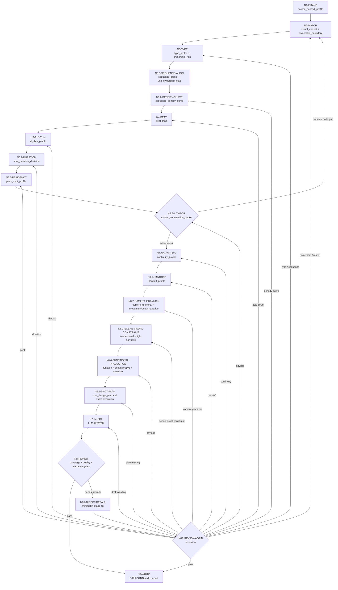

# Cinematography Workflow

本文件定义 `5-摄影` 的思行一体化执行节点。

## Business Requirement Analysis

| slot | answer |
| --- | --- |
| `business_goal` | 给 `4-表演` 逐集稿的每个画面句子注入可执行的大师级运镜摄影设计；`分镜明细：` 仅作为下游兼容字段名 |
| `business_object` | Markdown 编导稿中的字段化画面句子 |
| `constraint_profile` | 保真、逐集落盘、LLM 主创、动态引用、下游可执行、顾问与复核流程 摄影监制上下文沉淀 |
| `success_criteria` | 每个命中句子下有按节拍生成的 `分镜明细：分镜N`，内容聚焦运镜手法、摄影美学、内部注意力转交和可消费交出锚点，且专业、克制、服务剧情 |
| `non_goals` | 不改剧情、不改对白、不生成图像提示词、不替代下游视频阶段 |
| `complexity_source` | 真源语境锁定、画面匹配覆盖率、类型画像、段落观看意图与逐画面点归属、段落密度曲线与变速画像、节拍判断、画面节奏张弛、镜头时值裁决、高潮分镜强化、监制顾问参谋汇流、连续性与空间语法、边界交出点、摄影语法变化、功能性影视投影、梯度描述完整性、镜内/镜间连贯性、AI 视频镜头先行执行稳定性、shot_design_plan 汇流、自然成稿和保真约束 |
| `topology_fit` | 串行主干 + 类型分流 + 顾问与复核流程的顾问分支 + review 汇流 |

## Node Network

| node_id | objective | inputs | actions | evidence | route_out | gate |
| --- | --- | --- | --- | --- | --- | --- |
| `N1-INTAKE` | 锁定项目、集号、输入真源和上下文 | 用户请求、`4-表演/第N集.md`、项目 `MEMORY.md`、north star、team 与相关 `CONTEXT/` | 定位文件，读取相关上下文，确认不改原文，抽取长期视觉偏好、禁区、制作限制和下游约束 | `source_context_profile`、source path、episode list | `N2-MATCH` | 输入可读、真源明确、项目语境不与上游事实冲突 |
| `N2-MATCH` | 执行 step1 画面匹配与归属边界建立 | `references/visual-matching-contract.md`、正文行、`source_context_profile` | 找出所有 visual_unit，记录场景锚点、匹配理由和 ownership_boundary；每个命中行仍是独立归属单位 | visual_unit list、ownership_boundary | `N3-TYPE` | 命中行覆盖画面性字段，且每个 visual_unit 可回指唯一上游字段 |
| `N3-TYPE` | 判断画面句子类型与摄影任务画像 | visual_unit list、`types/visual-unit-type-map.md`、`source_context_profile` | 为每个 visual_unit 建立 visual category、`visual_unit_function`、`sequence_relation`、`ownership_risk` 和审美策略，区分空间建立、动作调度、表演承托、信息显影、恐怖入侵、关系停顿、群像压迫、记忆插入、触觉材质建立、对白身体锚点或边界交出 | type_profile、visual_unit_function、sequence_relation、ownership_risk | `N3.5-SEQUENCE-ALIGN` | 类型画像能覆盖主要字段，且不会把非画面字段误判为视觉任务；高 ownership_risk 已标记 |
| `N3.5-SEQUENCE-ALIGN` | 建立段落观看意图但锁住逐画面点归属 | visual_unit list、type_profile、sequence_relation、ownership_risk、相邻 3-6 个单位、`references/visual-sequence-alignment-contract.md`、场景/道具/声音/动作/记忆线索 | 判断是否需要 `sequence_profile`；提炼视觉母题链、attention relay、movement family、texture_palette_continuity；为每个 visual_unit 建立 `unit_ownership_map` 和 `forbidden_bleed`，禁止后文动作、对白反应、记忆段或道具揭示提前外溢 | `sequence_profile`、`unit_ownership_map`、`forbidden_bleed` | `N3.6-DENSITY-CURVE` | 段落意图只作为内部连续性上下文；不改变逐句注入边界，不合并 visual_unit，不写 `6-分组` 连接方案 |
| `N3.6-DENSITY-CURVE` | 建立段落级密度曲线与变速画像 | visual_unit list、type_profile、sequence_profile、unit_ownership_map、forbidden_bleed、相邻 3-8 个单位、动作/声音打点、顾问参谋、上游 `emotional_rhythm_map.peak_valley_sequence`、`genre_emotional_coloring`、`references/sequence-density-curve-contract.md`、`../_shared/emotional-rhythm-map-contract.md` | 判断整段如何变速：哪里收敛、哪里加密、哪里硬切、哪里停顿、哪里交出；消费情绪峰谷、height、transition 和类型底色，避免低谷场过密、高点场过薄或类型底色消失；标记 `peak_slots`、`recovery_slots`、`set_piece_chain_slots`、`sound_cut_pattern` 和 `density_budget`；允许真实连续动作/声画打点扩展到 5-6 镜，但每镜必须有独立结果 | `sequence_density_curve`、`emotional_rhythm_density_evidence`、`tempo_beats`、`density_ramp`、`peak_slots`、`recovery_slots`、`set_piece_chain_slots`、`sound_cut_pattern`、`density_budget` | `N4-BEAT` | 曲线只指导密度与变速，不改变逐画面点归属；高密度槽有真实峰值证据并回指情绪峰谷，低信息或低谷槽被收敛，5-6 镜链条每镜不可删 |
| `N4-BEAT` | 执行 step2 节拍/触发点分析 | visual_unit、sequence_density_curve、`references/beat-analysis-contract.md`、`references/global-rhythm-terminology-glossary.md` | 判断有效触发点并裁决分镜数量；快节奏平台默认一个有效触发点对应一个分镜，只有能在同镜清楚完成且不损失观看结果时才合并；当有效触发点数量大于最终分镜数时必须形成 `trigger_merge_exception`；命中 `sound_cut_pattern` 或 `set_piece_chain_slots` 时按可见结果逐拍裁决 | beat_map、effective_trigger list、trigger_merge_exception | `N5-RHYTHM` | 每个 visual_unit 至少 1 个有效触发点；`分镜2` 有第二个有效触发、观看结果或执行稳定性价值；1 镜块不得吞入多个未证明可合并的 beat；5-6 镜链条每镜都有新动作相位、撞点、声音或结果 |
| `N5-RHYTHM` | 执行 step2.5 画面节奏分析 | visual_unit、beat_map、sequence_density_curve、上下文密度、`references/visual-rhythm-analysis-contract.md` | 判断收敛/发散、描述密度、运动复杂度、边界清晰度，并校准 1/2/3/4 镜是否匹配信息重要性；命中 set-piece 链条时裁决 5-6 镜是否真实必要 | rhythm_profile | `N5.2-DURATION` | 当前画面有张弛策略；低信息不硬撑 2 镜，关键信息不被压平为 2 镜；高密度后存在恢复或反压 |
| `N5.2-DURATION` | 执行 step2.5D 镜头时值裁决 | visual_unit、关联对白/旁白、beat_map、rhythm_profile、上下文节奏、下游 15 秒组内约束、`references/shot-duration-decision-contract.md` | 为每个候选分镜裁决 `instant / short / standard / held / long_hold`、内部估算范围、正文 `display_seconds`、对白台词量预算、停顿/压缩理由和过短/过长风险；默认应用短剧·AIGC 时值压缩，判断缩短一半会丢失什么、拉长一倍是否只会拖慢 | duration_profile、shot_duration_decision、dialogue_time_budget、duration_mode | `N5.5-PEAK-SHOT` | 每个候选分镜有显式秒数和时值理由；对白/文字/道具/微表情/空间关系有足够可读时间，低信息停顿已压缩，`约3秒` 以上有明确必要性 |
| `N5.5-PEAK-SHOT` | 执行 step2.6 高点与余波策略 | visual_unit、beat_map、rhythm_profile、shot_duration_decision、上游 `peak_visual_policy` 或高点证据、上游 `audience_psychology_map`、`conflict_legacy_transfer`、`references/peak-shot-language-contract.md`、`../_shared/audience-psychology-model-contract.md` | 识别 `peak_visual_unit`，消费观众恐惧、渴望、期待和冲突遗产，决定分镜密度、镜头运动、景别尺度、停顿/断裂、反应镜头、误导/揭示方向和余波交出点 | peak_shot_profile、audience_peak_attention_evidence | `N5.6-ADVISOR` | 高点强化可回指上游和观众心理，不新增事实；高点时值符合动作/认知/关系/恐怖类型，并回应或有意颠覆观众期待 |
| `N5.6-ADVISOR` | 顾问与复核流程 摄影监制参谋汇流 | `team.yaml`、共享顾问合同、当前 `PASS-CINE-*` / `N*-*` 节点、visual_unit、sequence_density_curve、beat_map、rhythm_profile、shot_duration_decision、peak_shot_profile、项目 `MEMORY.md`、`north_star.yaml` 与相关 `CONTEXT/` | 启动或按不可用说明处理 `team.yaml.roles.supervision.stage_profiles."5-摄影"` 或共享合同回退路径中的摄影监制顾问；主 agent 从当前思维·执行节点的 input、judgment、action、evidence、gate 和 rework target 派生顾问问题，要求顾问代入角色意识、创作风格和专业水准提出参谋指导；若段落密度曲线命中，顾问必须给出 `tempo_curve_advice`、峰值/恢复槽位或风险提示；主 agent 汇流为后续任务上下文 | `advisor_consultation_packet` 或本地 checklist 结果 | `N6-CONTINUITY` | packet 已包含 roster 来源、node/pass 来源、角色视角、可执行指导、风险提示、`tempo_curve_advice` 和 `execution_brief` |
| `N6-CONTINUITY` | 回看临近分镜明细并建立连续性与空间语法 | rhythm_profile、peak_shot_profile、`advisor_consultation_packet`、前 3 个 visual_unit、`sequence_profile`、`unit_ownership_map`、`references/shot-continuity-contract.md`、`references/visual-sequence-alignment-contract.md` | 建立轴线、运动方向、景别梯度、景深/焦点、光色母题、空间位置和注意力交接策略；双人/多人对峙、追逐、动作或强关系场必须锁定 `axis_line / screen_position_lock / middle_spatial_anchor / camera_half_space / axis_change_bridge`；吸收段落视觉母题和运动家族，但只服务当前 visual_unit 的归属任务 | continuity_profile、axis_position_lock、camera_half_space、axis_change_bridge | `N6.1-HANDOFF` | 当前镜头有进入点、空间轴线、screen left/right 锁、同侧 180 度半区或明确换轴桥接、变化动机、交出点和清楚的画面点归属 |
| `N6.1-HANDOFF` | 判断边界交出点与进入提示 | visual_unit、type_profile、rhythm_profile、continuity_profile、场景/空间/时间/叙事段落变化、`references/transition-design-contract.md` | 场景变化或边界风险只形成 `handoff_profile`；记录可见交出锚点、进入提示和连续性风险，不裁决普通切镜、软桥接、匹配剪辑或高能转场方案 | handoff_profile | `N6.2-CAMERA-GRAMMAR` | 场景变化有交出点和进入提示；没有在本阶段落盘创意转场方案 |
| `N6.2-CAMERA-GRAMMAR` | 选择摄影语法与变化梯度 | visual_unit、type_profile、beat_map、rhythm_profile、shot_duration_decision、peak_shot_profile、continuity_profile、handoff_profile、`references/cinematic-technique-library.md`、`references/dynamic-lens-language-contract.md`、`references/camera-movement-emotion-contract.md`、`references/depth-of-field-narrative-contract.md` | 为每个 beat 选择最小充分的景别/景深、镜头视角、镜头类型、构图、光影、色彩、运镜方式、速度曲线和停点；明确哪些变化延续、哪些变化重置、哪些变化必须显式写；运镜必须说明情绪语义、速度和停点，景深/焦点必须说明隐藏、揭示、隔离、主观偏差或注意力转交功能；运镜速度和停点服从时值裁决 | camera_grammar_plan、camera_movement_emotion_plan、depth_of_field_narrative_plan | `N6.3-SCENE-VISUAL-CONSTRAINT` | 技法选择服务节拍、空间、信息、情绪、时值、主观距离、景深叙事或边界交出，不随机换景别/视角/镜头类型/虚实效果 |
| `N6.3-SCENE-VISUAL-CONSTRAINT` | 裁决场景级视觉约束（纯内部裁决，不进入成稿） | visual_unit、camera_grammar_plan、continuity_profile、`references/scene-visual-constraint-contract.md`、`references/light-as-narrative-contract.md`、`references/cinematic-technique-library.md`、`knowledge-base/摄影构图/` | 为当前 visual_unit 形成内部 `scene_visual_constraint`：构图布局（主体/陪体/前景/背景分配）、构图方式（从形状感/线条感/影调感/虚实感/节奏感/纹理质感/气势中选取当前最关键的 2-3 个子维度）、光源设置（主光源/辅助光/逆光的效果描述）、照明类型、色彩体系（色相/明度/饱和度/色温/色彩心理）和摄影技术参数（机型/光圈/快门/ISO/焦距/分辨率中影响画面的关键选择）；同步形成 `light_narrative_plan`，说明光源承担的信息显影、遮蔽、权力关系、危险预告、关系温度或空间身份功能。该约束是内部裁决，不出现在最终正文成稿中；同一场景内视觉约束不变时只裁决一次，视觉约束发生重大变化时可重新裁决 | scene_visual_constraint、light_narrative_plan | `N6.4-FUNCTIONAL-PROJECTION` | 场景视觉约束覆盖构图布局、构图方式、光源、色彩和关键摄影技术参数；光线有可见结果和叙事功能；不输出参数清单，只沉淀为内部可消费的场景级视觉约束 |
| `N6.4-FUNCTIONAL-PROJECTION` | 建立功能性影视投影与下游 payload | camera_grammar_plan、scene_visual_constraint、beat_map、shot_duration_decision、dialogue_time_budget、`long_dialogue_beat_map`、`long_dialogue_delivery_map`、continuity_profile、handoff_profile、上游 `audience_psychology_map`、`conflict_legacy_transfer`、`references/functional-cinematic-projection-contract.md`、`references/shot-as-narrative-contract.md`、`references/attention-guidance-contract.md`、`references/ai-video-prompt-execution-contract.md`、`references/functional-cinematic-projection-contract.md#Gradient-Shot-Detail-Sufficiency`、`../_shared/audience-psychology-model-contract.md`、下游图像/视频消费要求 | 为每个计划分镜锁定影视功能、镜头叙事功能、可见主体、动作相位、运镜计划、显式时长、对白/旁白承托、构图锚点、光色/材质、空间接口、连续性交接、交出锚点和 AIGC 下游消费点；消费观众惊讶潜力、期待/恐惧/渴望和冲突遗产，决定揭示、隐藏、误导、反应延迟和离场锚点；为当前 visual_unit 建立 `attention_guidance_plan`，说明观众入口、遮挡/显影、焦点接力、信息获得点和离场锚点；对白场景额外形成 `dialogue_scene_variation_plan`，说明焦点落在说话者、听者、双方空间、道具压力、画外声源、群像或反应空白的理由，禁止机械正反打和每句说话者特写；长对白场景进一步形成 `long_dialogue_visual_plan`，逐 beat 说明焦点、反应链、跨镜时值和连续性交接；同步消费 `scene_visual_constraint` 确保逐镜 payload 与场景视觉约束一致；双人/多人轴线已锁时，将 screen left/right、两人连线、中间锚点和摄影机同侧 180 度半区写入 `axis_continuity_anchor`；按 `functional-cinematic-projection-contract.md#Gradient-Shot-Detail-Sufficiency` 为每条计划分镜裁决 L0/L1/L2/L3 与维度覆盖（角色表演/非角色动态/镜头技术/光影精细/焦点精细/节奏同步），形成 `sufficiency_grade_profile` 和 `dimension_coverage`；对每个候选分镜执行源句复述扣除测试，确认它不是把上游画面句子拆写或复述成镜头顺序 | functional_projection_plan、shot_narrative_function、audience_reveal_hide_strategy、dialogue_scene_variation_plan、long_dialogue_visual_plan、attention_guidance_plan、ai_video_prompt_execution_profile、axis_continuity_anchor、sufficiency_grade_profile、paraphrase_subtraction_check | `N6.5-SHOT-PLAN` | 每个候选分镜能指导生图和视频，并能说明 L0/L1/L2/L3 裁决如何匹配画面任务、信息重要性、动作复杂度、情绪强度、段落位置和下游风险；删掉或缩短后会损失明确观看信息、叙事功能、注意力转移、观众心理策略或台词承托；不存在动作与运镜割裂、方向含混、左右反转、直接越轴、光线空泛、全信息平铺、对白场景模板化、长对白单镜采访化、画面内容拆写或为完整性堆砌镜头；维度覆盖与画面句子的戏剧任务和信息密度匹配 |
| `N6.5-SHOT-PLAN` | 汇流 references 形成逐分镜计划 | visual_unit、type_profile、sequence_density_curve、emotional_rhythm_density_evidence、beat_map、rhythm_profile、shot_duration_decision、dialogue_time_budget、peak_shot_profile、audience_peak_attention_evidence、sequence_profile、unit_ownership_map、forbidden_bleed、continuity_profile、handoff_profile、camera_grammar_plan、camera_movement_emotion_plan、depth_of_field_narrative_plan、scene_visual_constraint、light_narrative_plan、functional_projection_plan、shot_narrative_function、audience_reveal_hide_strategy、dialogue_scene_variation_plan、attention_guidance_plan、ai_video_prompt_execution_profile、sufficiency_grade_profile、paraphrase_subtraction_check、`advisor_consultation_packet`、`references/shot-planning-integration-contract.md`、`references/visual-sequence-alignment-contract.md`、`references/sequence-density-curve-contract.md`、`references/shot-continuity-contract.md`、`references/intra-shot-transition-contract.md`、`references/shot-as-narrative-contract.md`、`references/camera-movement-emotion-contract.md`、`references/depth-of-field-narrative-contract.md`、`references/light-as-narrative-contract.md`、`references/attention-guidance-contract.md`、`references/ai-video-prompt-execution-contract.md`、`references/functional-cinematic-projection-contract.md#Gradient-Shot-Detail-Sufficiency`、`../_shared/audience-psychology-model-contract.md`、`../_shared/emotional-rhythm-map-contract.md`、动态运镜合同、自然成稿合同 | 为每个 visual_unit 形成内部 `shot_design_plan`；裁决分镜数量、顺序、入口、单镜显式时长、对白台词量承托、运镜路径、速度曲线、停点、落点、边界交出锚点、摄影语法、显式参数取舍、镜头叙事功能、运镜情绪、景深叙事、光源叙事、观众心理揭示/隐藏策略、对白场景焦点变化、注意力路径、功能 payload、`sufficiency_grade_profile`（L0/L1/L2/L3 与启用维度池）、AI 视频镜头先行执行顺序、方向参照、`axis_continuity_anchor`、光线结果、表演微动态、交出点、`unit_ownership_check`、`entry/action_anchor/exit/handoff` 连续性四字段和非复述性检查；消费 `scene_visual_constraint` 将场景视觉约束（构图布局、构图方式、光源、色彩、关键摄影技术参数）纳入计划的场景级框架；消费 `dimension_coverage` 确保每条计划分镜的维度覆盖与戏剧任务和信息密度匹配；若命中 `sequence_density_curve`，必须说明当前分镜属于 `density_ramp` 的哪个槽位，是否为 `peak_slot/recovery_slot/set_piece_chain_slot`；同一块多分镜时必须说明相邻分镜的物理因果链或过渡锚点，跨块时必须说明人物姿态、轴线、运动方向、光色或声音余波如何继承；删除没有新观看策略、叙事功能、时值理由、台词承托、观众心理价值、下游消费价值、当前画面点归属、梯度完整性、连贯性、非复述性或视频执行稳定性的随机分镜 | shot_design_plan | `N7-INJECT` | 每个计划分镜可回指 beat/rhythm/duration/dialogue/sequence density/emotional rhythm/audience psychology/sequence ownership/continuity/handoff/axis/camera/movement emotion/depth/light/attention/scene visual constraint/dimension coverage/function/gradient sufficiency/downstream/ai-video execution/paraphrase subtraction/naturalness；不存在跨画面点外溢、动作镜头割裂、方向含混、左右反转、直接越轴、光线结果缺失、注意力一次性平铺、对白场景模板化、画面内容拆写、镜内因果黑洞或块间凭空重启 |
| `N7-INJECT` | 执行 step3 运镜摄影设计注入 | `shot_design_plan`、`sequence_profile`、`unit_ownership_map`、`forbidden_bleed`、`advisor_consultation_packet`、`references/visual-sequence-alignment-contract.md`、`references/functional-cinematic-projection-contract.md`、`references/shot-continuity-contract.md`、`references/intra-shot-transition-contract.md`、`references/shot-as-narrative-contract.md`、`references/attention-guidance-contract.md`、`references/ai-video-prompt-execution-contract.md`、`references/shot-duration-decision-contract.md`、`references/dynamic-lens-language-contract.md`、`references/cinematic-technique-library.md`、`references/natural-shot-detail-writing-contract.md`、`references/scene-visual-constraint-contract.md`、`references/functional-cinematic-projection-contract.md#Gradient-Shot-Detail-Sufficiency`、`knowledge-base/电影镜头/` | LLM 直写 `分镜明细：` 与 `分镜N（约X秒）`；严格投影 `shot_design_plan`，把参数、时值裁决、AI 视频执行稳定性、维度覆盖、镜头叙事功能、运镜/景深/光源叙事、注意力路径、梯度完整性、非复述性、镜内因果链、块间动作锚点继承和段落连续性压成自然画面文字；每条 `分镜N` 的自然语句应覆盖 `sufficiency_grade_profile` 与 `dimension_coverage` 中选取的维度，将维度信息点融入自然中文而非标签列表；每个块只写当前画面点拥有的主体/动作/道具/对白承托，同时新增可执行摄影决策，吸收顾问参谋上下文但不改写上游真源；字段内容不得输出抽象主题、心理结论、世界观解释、导演阐释、不可执行气氛口号、随机好看句、画面内容拆写/复述、参数清单、提示词分栏模板、命令式负向词、模板句法、跨块失主镜头或为了完整性而堆砌的无效分镜 | enriched episode draft | `N8-REVIEW` | 原文保留，注入块紧跟命中句子；字段语义纯度、维度覆盖、逐画面点归属、摄影语法变化、镜头叙事功能、运镜/景深/光源叙事、注意力引导、功能性投影、梯度完整性、镜内/镜间连贯性、非复述性、AI 视频执行稳定性、显式时长、对白承托和自然成稿通过；每个分镜能说明其 L0/L1/L2/L3 梯度与启用维度，并能反推出当前梯度所需的起点、运镜路径、速度、时值等级、停点、落点、动机、交出点、所属 visual_unit、维度覆盖、下游消费 payload、方向参照、光线结果、必要微动态和 `entry/action_anchor/exit/handoff`；顾问上下文未越权 |
| `N8-REVIEW` | 执行质量与机械门禁 | candidate enriched draft、`review/review-contract.md`、可选 validator | 检查覆盖、连续编号、节奏张弛、1 镜吞多 beat、镜头时值、摄影语法变化、shot_design_plan 投影、reference gate 覆盖、镜头叙事功能、运镜/景深/光源叙事、注意力引导、对白场景去模板化、长对白镜头承托、功能性投影、梯度完整性、镜内/镜间连贯性、源句复述扣除测试、AI 视频执行稳定性、场景/镜头身份、双人轴线与 180 度规则、连续性、保真、专业性和自然成稿，定位 repair target | review result、repair targets、single_shot_multi_beat_review、reference_gate_coverage_review | `N8R-DIRECT-REPAIR` 或 `N9-WRITE` | 无阻断项才可写回；`GATE-CINE-04E`、`GATE-CINE-15A`、`GATE-CINE-15B`、`GATE-CINE-15C`、`GATE-CINE-15D`、`GATE-CINE-17A`、`GATE-CINE-26`、`GATE-CINE-27`、`GATE-CINE-28`、`GATE-CINE-29`、`GATE-CINE-30`、`GATE-CINE-31`、`GATE-CINE-32` 和 `GATE-CINE-33` 失败不得降级为 followup |
| `N8R-DIRECT-REPAIR` | 阶段内直接修复阻断项 | repair targets、candidate enriched draft、上游编导稿 | 最小修复 `分镜明细`、`分镜N`、连续性、节奏张弛、镜头时值、源句复述扣除失败、AI 视频执行稳定性、峰值分镜、专业可执行或报告证据；不改上游原文 | repaired draft、repair actions | `N8R-REVIEW-AGAIN` | 修复范围不越权 |
| `N8R-REVIEW-AGAIN` | 复审修复稿 | repaired draft、repair actions、上游编导稿 | 复跑阻断 gate；通过则准入写回，失败则回最早责任节点 | re-review verdict | `N9-WRITE` 或 `N2-MATCH/N3-TYPE/N3.5-SEQUENCE-ALIGN/N4-BEAT/N5-RHYTHM/N5.2-DURATION/N5.5-PEAK-SHOT/N5.6-ADVISOR/N6-CONTINUITY/N6.1-HANDOFF/N6.2-CAMERA-GRAMMAR/N6.3-SCENE-VISUAL-CONSTRAINT/N6.4-FUNCTIONAL-PROJECTION/N6.5-SHOT-PLAN/N7-INJECT/N8R-DIRECT-REPAIR` | 复审通过或明确阻断 |
| `N9-WRITE` | 落盘与报告 | enriched draft、review result | 写入 `5-摄影/第N集.md`，更新报告 | output path、report path | done | 路径和命名符合 Output Contract |

## Mermaid Topology



## Branch Rules

- `N2-MATCH` 中标签命中和语义命中可以并行思考，但必须汇总为单一 visual_unit list，并为每个 visual_unit 记录 ownership_boundary。
- `N3-TYPE` 必须消费已经形成的 visual_unit list；不得在画面匹配前凭字段标签预设摄影类型。类型画像必须补 `sequence_relation` 与 `ownership_risk`，供 `N3.5-SEQUENCE-ALIGN` 判断是否需要段落统筹。
- `N3.5-SEQUENCE-ALIGN` 只在相邻画面单位确有共享空间、道具链、声音链、动作链、记忆插入或视觉母题时启用；没有段落级连续需求时不得硬造 `sequence_profile`。
- `N3.5-SEQUENCE-ALIGN` 不得改变 `visual_unit` 边界，也不得让 `sequence_profile` 合并多个画面句子；每个命中行仍在其正下方独立落 `分镜明细：`。
- `N3.5-SEQUENCE-ALIGN` 必须为每个段落内 visual_unit 建立 `unit_ownership_map`，明确当前块拥有的主体、动作相位、道具/文字/身体锚点、对白承托和禁止外溢项；后文主体动作、对白反应、记忆段和道具揭示不得提前进入前一块。
- `N3.6-DENSITY-CURVE` 在相邻画面形成连续观看段落、速度阶段、动作链、声音打点或分镜分布风险时启用；它只建立 `tempo_beats / density_ramp / peak_slots / recovery_slots / set_piece_chain_slots / sound_cut_pattern / density_budget / handoff_anchors`，不改变 `visual_unit` 边界。
- `N3.6-DENSITY-CURVE` 必须先问整段“哪里省、哪里加密、哪里停、哪里硬切、哪里交出”，再让单个 `visual_unit` 进入 `N4-BEAT`；不得只靠单句节拍导致整场同密度。
- `N3.6-DENSITY-CURVE` 若上游存在 `emotional_rhythm_map`，必须消费 `peak_valley_sequence`、height、transition 和类型底色；高点场不能被普通密度压平，低谷/冷场不能被无故堆满。
- `N3.6-DENSITY-CURVE` 允许真实 `set_piece_chain` 扩展到 5-6 镜，但必须逐镜证明独立起点、撞点、动作结果、声音打点或反应落点；答不上来的镜头必须删并。
- `N3.6-DENSITY-CURVE` 必须安排高密度后的 `recovery_slot` 或反压/余波/交出锚点；连续全满视为节奏失败。
- `N4-BEAT` 先给每个 visual_unit 独立判断，不允许跨句共用分镜编号，也不允许把上一条或模板中的 2 镜结构继承为默认数量。
- `N4-BEAT` 采用 `trigger-first`：`BT-01~BT-16` 命中的有效触发点默认 1:1 落为 `分镜N`；合并只是例外，必须证明不损失观看结果、平台节奏、下游 payload 或动作连续性。
- `N4-BEAT` 不只防止无效加镜，也必须防止 1 镜吞多 beat：若源句或候选 `分镜1` 内部出现主体切换、空间转移、动作分相、声画转交、信息揭示、情绪转折、注意力对象改变或 AIGC 执行重置，最终仍为 1 镜时必须形成 `trigger_merge_exception`；缺证明按 `FAIL-CINE-03F` 回到本节点。
- `N4-BEAT` 必须消费命中时的 `sequence_density_curve`：若当前块处于 `conserve/recovery` 槽位，优先证明少镜能否成立；若处于 `peak/set_piece_chain` 槽位，优先证明新增每一镜会带来什么必要结果。
- `N5-RHYTHM` 必须判断当前画面句子该收敛还是发散；不允许所有画面句子同等华丽。
- `N5-RHYTHM` 必须执行数量分布警戒：同一集或同一场出现 2 镜绝对集中时，抽样回查低信息、关键显影、群像和高点块，修正被硬撑或压平的分镜数。
- `N5-RHYTHM` 必须执行密度曲线警戒：同一段连续多个块都高密度、同长、同速，或没有从日常/压迫/爆点/反压/交出等阶段中形成速度差，回到 `N3.6-DENSITY-CURVE` 重做 `density_budget`。
- `N5.2-DURATION` 必须为每个候选分镜形成 `shot_duration_decision`；不得只写“慢推/快切/停顿”而没有说明为什么需要当前长短。
- `N5.2-DURATION` 必须为每个候选分镜形成正文 `display_seconds`，落盘格式固定为 `分镜N（约X秒）:`；缺少显式秒数视为机械 gate 失败。
- `N5.2-DURATION` 遇到 `对白画面`、`旁白画面`、画外音或听者反应镜头时，必须先估算台词量下限，再裁决该镜时长；长对白可跨多个分镜承托，但必须说明每镜承载哪段台词或反应。
- `N5.2-DURATION` 必须执行时值分布警戒：连续多个分镜同为 `held/long_hold` 时检查是否拖慢 15 秒组内节奏，连续多个 `instant/short` 时检查文字、道具、微表情和空间关系是否不可读。
- `N5.2-DURATION` 必须处理冲突时值：同一镜既要惊吓冲击又要文字可读时，拆成冲击镜与读秒/反应镜；不得让单镜同时承担互相冲突的观看任务。
- `N5.2-DURATION` 默认应用短剧·AIGC 时值压缩：能用 `short / standard` 成立的，不升级为 `held`；`约3秒` 以上且 `tempo` 不为 `slow_burn/hold` 时必须有台词、读秒、表演变化、复杂调度、空间重置或高点证据；情绪类 `slow_burn/hold` 镜头可进入 held/long_hold，但必须由可见微动态、静止压力、极慢运动或框内变化证明；AIGC 工具片段时长不得反推拉长单镜叙事时值。
- `N5.5-PEAK-SHOT` 只强化上游已有高点或明显 `micro_payoff`，不得把普通画面硬拔成高潮；强化必须体现为分镜密度、运镜速度、景别尺度、停顿、反应镜头或余波交出点的有动机变化。
- `N5.5-PEAK-SHOT` 必须消费 `audience_psychology_map` 中的 audience_fear、audience_desire 和 audience_expectation；高点策略必须回应、延迟或有意颠覆观众期待，而不是只按画面强度加镜头。
- 若执行顾问与复核流程，`N5.6-ADVISOR` 必须在 `N6-CONTINUITY` 和 `N7-INJECT` 前完成；顾问问题必须同步于当前思维·执行节点，顾问参谋只转化为 `advisor_consultation_packet` 上下文，不直接写分镜明细，不替换上游事实、对白或场景顺序。
- `N6-CONTINUITY` 必须回看临近至少前 3 个画面单位；不足 3 个时回看已有全部单位并建立本场景的初始轴线、运动方向、景别梯度、景深/焦点逻辑和光色母题。
- `N6-CONTINUITY` 遇到双人对峙、追逐、动作、逼问、谈判或互相凝视时，必须先建立两人 line of action、screen left/right、middle_spatial_anchor 和 `camera_half_space`；后续镜头默认在同侧 180 度半区内选正机位、侧机位、过肩或主观视角。
- `N6-CONTINUITY` 若需要换轴，必须先给 `axis_change_bridge`：中性镜头、主观视角、可见运动镜头或明确角色换位。直接把主角/对手左右反转视为连续性失败。
- `N6-CONTINUITY` 可以消费 `sequence_profile` 的视觉母题、材质光色、运动家族和注意力接力，但每个承接点必须回到当前 `visual_unit` 的主体、动作、信息或对白身体锚点，不得只服务整段气氛。
- `N6.1-HANDOFF` 必须把场景变化视为边界风险并形成 `handoff_profile`；普通场景变化也至少要有上一画面交出点和下一画面进入提示，不得让下一场景凭空开始。
- `N6.1-HANDOFF` 不得把场景变化升级为创意转场；形态、动作、声音、光线、颜色、文字或高点余波只作为可见交出锚点记录，连接方式由 `6-分组` 裁决。
- `N6.2-CAMERA-GRAMMAR` 必须把景别、景深/焦点、镜头视角、镜头类型、构图、光影、色彩、运镜方式和速度变化作为一套摄影语法裁决；不得只在成稿阶段临时挑”特写/推近/俯拍”等孤立词。
- `N6.2-CAMERA-GRAMMAR` 的变化必须有动机：远景建立、中景调度、近景加压、特写揭示；视角变化必须服务权力关系、主观发现、空间重置、观察关系或信息显影。
- `N6.2-CAMERA-GRAMMAR` 必须为运镜建立 `camera_movement_emotion_plan`：推、拉、摇、移、跟、环绕、手持或静止都要说明情绪语义、主观距离变化、速度曲线和停止理由；只写技术名视为失败。
- `N6.2-CAMERA-GRAMMAR` 必须为景深/焦点建立 `depth_of_field_narrative_plan`：虚实、焦点转移、失焦或深焦必须承担隐藏/揭示、关系隔离、主观偏差、空间压迫或注意力转交功能；不能只作为“好看”的质感词。
- `N6.3-SCENE-VISUAL-CONSTRAINT` 必须在 `N6.2-CAMERA-GRAMMAR` 之后、`N6.4-FUNCTIONAL-PROJECTION` 之前完成；它消费 `camera_grammar_plan` 和 `continuity_profile`，形成内部 `scene_visual_constraint`。
- `N6.3-SCENE-VISUAL-CONSTRAINT` 必须为每个 visual_unit 裁决构图布局（主体/陪体/前景/背景分配）、构图方式（从形状感/线条感/影调感/虚实感/节奏感/纹理质感/气势中选取 2-3 个子维度）、光源设置（主光/辅助光/逆光效果）、照明类型、色彩体系（色相/明度/饱和度/色温/色彩心理）和关键摄影技术参数。
- `N6.3-SCENE-VISUAL-CONSTRAINT` 只形成内部裁决计划，不进入成稿正文；同一场景内视觉约束不变时只裁决一次，视觉约束发生重大变化时可重新裁决。
- `N6.3-SCENE-VISUAL-CONSTRAINT` 必须形成 `light_narrative_plan`：光线要说明照亮对象、遮蔽对象、阴影/轮廓结果、信息可见性、权力关系、情绪温度或危险预告；不得只停留在左侧光、顶光、柔光、冷光等来源词。
- `N6.4-FUNCTIONAL-PROJECTION` 必须为每条候选分镜形成 `shot_narrative_function`：该镜带来什么新信息、关系变化、动作结果、情绪压力、观看发现或交出价值；删除后无损失的镜头不得进入计划。
- `N6.4-FUNCTIONAL-PROJECTION` 必须为每个 visual_unit 形成 `attention_guidance_plan`：观众从哪里进入，经过什么遮挡/显影/焦点接力获得关键信息，最后交给哪个动作、目光、光线或空间锚点；不得一次性全信息平铺。
- `N6.4-FUNCTIONAL-PROJECTION` 必须消费 `audience_psychology_map` 的 audience_surprise_potential，决定揭示、隐藏、误导、延迟反应或离场锚点；不得把观众应未知的信息正面平铺。
- `N6.4-FUNCTIONAL-PROJECTION` 遇到对白场景必须形成 `dialogue_scene_variation_plan`：焦点选择要来自戏剧功能、权力关系、观众知情层级和注意力路径；禁止机械正反打、每句都给说话者表情特写、说话者/听话者覆盖式配平。遇到长对白还必须形成 `long_dialogue_visual_plan`：逐 beat 消费 `long_dialogue_beat_map` / `long_dialogue_delivery_map`，在说话者、听者、手部/道具、空间压力、群像、画外声源和沉默余波之间分配焦点与时值。
- `N6.4-FUNCTIONAL-PROJECTION` 必须把每个候选分镜投影为主体、动作相位、运镜计划、构图锚点、光色/材质、空间接口、连续性交接和下游消费点；同时形成 `ai_video_prompt_execution_profile`，检查镜头是否从一开始包裹动作、方向是否相对镜头/画面明确、光线是否写成可见结果、表演是否落到微动态。缺少关键 payload 或视频执行稳定性的候选分镜不得进入 `shot_design_plan`。
- `N6.4-FUNCTIONAL-PROJECTION` 对已建立双人/多人轴线的分镜必须形成 `axis_continuity_anchor`，逐镜重复 screen left/right、中间锚点和摄影机同侧 180 度半区；只在第一镜交代轴线不够。
- `N6.4-FUNCTIONAL-PROJECTION` 必须消费 `scene_visual_constraint` 确保逐镜 payload 与场景视觉约束一致。
- `N6.4-FUNCTIONAL-PROJECTION` 必须按 `references/functional-cinematic-projection-contract.md#Gradient-Shot-Detail-Sufficiency` 为每条计划分镜裁决 L0/L1/L2/L3 描述梯度和维度覆盖，形成 `dimension_coverage`：遵循"应有则有、没有不必强制"原则——画面中自然存在的维度就覆盖，不存在的不为凑数硬塞；禁止虚构画面中不存在的信息。
- `N6.4-FUNCTIONAL-PROJECTION` 必须执行源句复述扣除测试：删除上游画面句子已有主体、动作、道具和事实后，候选分镜仍需保留机位、构图、运镜路径、速度、停点、焦点、光影结果、方向参照或连续性交接；只剩景别词、顺序词或空泛效果词时不得进入 `shot_design_plan`。
- `N6.5-SHOT-PLAN` 是 references 进入最终输出的硬门：不得跳过；分镜数量增加必须来自新的注意力、信息、动作相位、空间关系、情绪压力、摄影语法变化、运镜策略或边界交出锚点。
- `N6.5-SHOT-PLAN` 必须执行 `unit_ownership_check`：每条计划分镜都能说明其服务哪条上游画面句子；若只能说明“服务整段流畅”或“让段落更电影感”，必须移动到所属 visual_unit、重写为当前画面点的进入/交出锚点，或删除。
- `N6.5-SHOT-PLAN` 必须显式形成内部 `shot_count_decision`：先列出有效触发点，再说明每个 `分镜N` 对应的观看结果、平台刺激或 AIGC 执行稳定性价值；2 镜可以是快节奏平台常规密度，3-4 镜需对应关键揭示、群像扩散、动作分相、空间重置、高点承托、平台钩子连续推进或 AIGC 执行重置。
- `N6.5-SHOT-PLAN` 若消费 `set_piece_chain_slots`，可将单个 `visual_unit` 扩展到 5-6 镜；但每一镜都必须有新动作相位、撞点、声音打点、结果钉镜、反应落点或必要交出接口，并写入 `shot_count_decision` 的不可删证明。
- `N6.5-SHOT-PLAN` 必须显式形成逐镜 `shot_duration_decision`：先证明为什么不是更短，再证明为什么不是更长；长停顿必须服务可读性、表演、空间或高点，短镜必须不牺牲必要信息；短剧·AIGC 模式下优先压到最短可成立时值。
- `N6.5-SHOT-PLAN` 必须把 `display_seconds` 与镜头语言绑定：括号里的 `约X秒` 必须能从对白承托、读秒、静止、极慢运动、动作完成或反应落点中看出原因。
- `N6.5-SHOT-PLAN` 必须汇流 `shot_narrative_function / camera_movement_emotion_plan / depth_of_field_narrative_plan / light_narrative_plan / attention_guidance_plan`；若分镜数量、运镜、景深、光线或注意力路径无法回指这些计划，不得进入 `N7-INJECT`。
- `N6.5-SHOT-PLAN` 的 `shot_narrative_function` 不能全部都是 reveal；必须有 conceal / misdirect / compare 等多样性——一个 visual_unit 内若所有镜头叙事功能相同，说明观看策略单薄，必须回到 `N6.4-FUNCTIONAL-PROJECTION` 补充。
- `N6.5-SHOT-PLAN` 必须保证同一 `visual_unit` 内相邻分镜首尾相接：上一条的落点必须成为下一条的入口、反应、动作、声音、光色、焦点、运镜变化或交出锚点。
- `N6.5-SHOT-PLAN` 必须保证同一 `visual_unit` 内相邻分镜形成时值接力：短镜制造冲击，标准镜交代动作，held 镜给读秒或反应；不得每镜同长同速。
- `N6.5-SHOT-PLAN` 必须执行 AI 视频执行稳定性检查：最终分镜应能按“镜头类型/运动/构图 -> 人物动作 -> 微动态 -> 光线结果 -> 环境承托”的顺序改写为视频提示词；涉及移动时必须有“朝镜头、远离摄像机、画面左侧/右侧、前景/后景、三分位、门框/课桌通道”等参照；重要光影必须写出亮面、暗面、阴影、轮廓、反光或背景层次。
- `N6.5-SHOT-PLAN` 必须把双人/多人轴线纳入最终计划：每条关键分镜能说明是否延续同轴、在哪个半区拍、谁在 screen left/right、是否需要中性/主观/运动桥接；缺少 `axis_continuity_anchor` 的动作/对峙分镜不得进入 `N7-INJECT`。
- `N7-INJECT` 的技法选择可同时参考构图、运镜、边界交出、光影、色彩，但最终输出必须凝成可执行、连贯、张弛得当的自然分镜句；不要把内部参数逐项摊开。
- `N7-INJECT` 必须把非复述性写进自然句：可以使用上游已有主体和动作，但必须新增摄影机观看方式；不得把“谁做了什么/物件是什么”直接拆成多个镜头。
- `N7-INJECT` 的段落级流畅只能体现在当前块的入口、落点、视觉母题延续和交出锚点；不得把多个画面点写成一条长分镜，也不得把下一块的主体动作、对白反应、记忆段或道具揭示提前写进当前块。
- 若 `N7-INJECT` 把 `分镜明细：` 写成抽象阐释，必须回退：把抽象判断翻译为可见的景别、机位、镜头类型、运镜速度、焦点、构图、光影、色彩或交出锚点；无法转译的内容删除。
- 若 `N7-INJECT` 输出太简略，无法反推起点、路径、速度、落点、动机或交出点，必须回到 `N6.5-SHOT-PLAN` 重建计划后再写。
- 若 `N7-INJECT` 输出缺少 `分镜N（约X秒）`，或能反推切换点但无法反推每镜时值，或把所有镜头写成同样长短和速度，必须回到 `N5.2-DURATION` 与 `N6.5-SHOT-PLAN`。
- 若 `N7-INJECT` 输出连续同构、参数堆叠或模板填空腔，必须回到 `references/natural-shot-detail-writing-contract.md` 重写成自然中文；不得只替换形容词。
- 若 `N7-INJECT` 输出看起来顺但无法抽取主体、动作相位、运镜计划、构图锚点、光色材质或下游消费点，必须回到 `references/functional-cinematic-projection-contract.md` 和 `N6.5-SHOT-PLAN`，不得靠润色解决。
- 若 `N7-INJECT` 输出只是画面内容拆写/复述，源句复述扣除后无法读出摄影决策，必须回到 `N6.4-FUNCTIONAL-PROJECTION` 和 `N6.5-SHOT-PLAN` 重建 `paraphrase_subtraction_check`；不得靠补几个景别词通过。
- 若 `N7-INJECT` 输出动作先发生、镜头后补，或方向只写“向前/后退/左边/右边”，或光线只写“侧光/顶光/电影感光线”，必须回到 `references/ai-video-prompt-execution-contract.md`、`N6.4-FUNCTIONAL-PROJECTION` 和 `N6.5-SHOT-PLAN`，重建镜头先行、方向参照和光线结果。
- 若 `N7-INJECT` 输出双人/多人对峙、追逐或动作时主角/对手左右关系反复，或直接越轴而没有中性/主观/运动桥接，必须回到 `references/shot-continuity-contract.md`、`references/ai-video-prompt-execution-contract.md`、`N6-CONTINUITY`、`N6.4-FUNCTIONAL-PROJECTION` 和 `N6.5-SHOT-PLAN`，重建 `axis_position_lock` 与 `axis_continuity_anchor`。
- 若 `N7-INJECT` 输出整体流畅但无法判断当前分镜属于哪条上游画面句子，或出现跨块主体动作、对白反应、记忆段、道具揭示外溢，必须回到 `N3.5-SEQUENCE-ALIGN`、`N3.6-DENSITY-CURVE` 与 `N6.5-SHOT-PLAN` 重建 `unit_ownership_map`、`density_budget` 和 `unit_ownership_check`。
- 若 `N7-INJECT` 缺少景别/视角/景深/焦点/镜头类型的变化逻辑，或相邻镜头只是随机换技法，必须回到 `N6.2-CAMERA-GRAMMAR`；不得在成稿里补几个摄影词冒充专业性。
- 若 `N7-INJECT` 输出只记录动作，没有任何镜头叙事功能、观看发现或删除损失，必须回到 `N6.4-FUNCTIONAL-PROJECTION` 与 `N6.5-SHOT-PLAN` 重建 `shot_narrative_function`。
- 若 `N7-INJECT` 输出的运镜或景深只是技术名，没有情绪语义、焦点理由、主观距离或信息显影作用，必须回到 `N6.2-CAMERA-GRAMMAR` 重建 `camera_movement_emotion_plan` 与 `depth_of_field_narrative_plan`。
- 若 `N7-INJECT` 输出的光线只有来源词或氛围词，没有照亮/遮蔽对象、阴影轮廓结果、权力关系或信息可见性，必须回到 `N6.3-SCENE-VISUAL-CONSTRAINT` 重建 `light_narrative_plan`。
- 若 `N7-INJECT` 输出一次性全信息展示、没有入口/遮挡/显影/焦点接力/离场锚点，必须回到 `N6.4-FUNCTIONAL-PROJECTION` 重建 `attention_guidance_plan`。
- 若 `N7-INJECT` 输出对白场景模板化，连续使用正反打、每句台词都给说话者特写，或无法说明焦点为什么落在说话者/听者/空间/道具/画外声源/群像之一，必须回到 `N6.4-FUNCTIONAL-PROJECTION` 重建 `dialogue_scene_variation_plan` 和 `attention_guidance_plan`。若长对白被单镜采访式吞掉，或每个节拍都拍同一说话者同一景别，必须重建 `long_dialogue_visual_plan`。
- 任一节点发现需要改写剧情或对白才能成立，必须回退：分镜明细应服务原句，而不是修补原句。
- 若 review 发现 顾问与复核流程 启用但缺 `team.yaml` 监制顾问请教、节点同步问题、角色意识/创作风格/专业水准参谋或上下文沉淀，回到 `N5.6-ADVISOR`。
- 若 review 发现上游高点被压平，回到 `N5.5-PEAK-SHOT`；若发现高潮强化导致跳轴、跳色或风格断裂，继续回到 `N6-CONTINUITY`。
- 若 review 发现场景变化没有交出点/进入提示，或把创意转场方案落在 `5-摄影`，回到 `N6.1-HANDOFF` 和 `N6.5-SHOT-PLAN`。
- 若 review 发现分镜随机、上下衔接差、数量多但无递进、摄影语法随机、功能 payload 缺失、画面内容拆写/复述、输出过短或 references 未真实汇流，按责任回到 `N6.2-CAMERA-GRAMMAR`、`N6.3-SCENE-VISUAL-CONSTRAINT`、`N6.4-FUNCTIONAL-PROJECTION` 或 `N6.5-SHOT-PLAN`。
- 若 review 发现场景视觉约束缺失、构图布局不清、光源/色彩基准未在内部裁决中形成，回到 `N6.3-SCENE-VISUAL-CONSTRAINT` 和 `N6.5-SHOT-PLAN`。
- 若 review 发现分镜明细维度覆盖不足：画面中确实存在角色表演信息（情绪/肢体/语气/镜头意识）却未被摄影机表达，或存在陪体/前景/背景动态、光影反射/动态焦点/节奏同步等维度却被忽略，回到 `N6.4-FUNCTIONAL-PROJECTION` 和 `N6.5-SHOT-PLAN` 重建维度覆盖后重写。注意：画面中不存在的信息不应当被要求覆盖。
- 若 review 发现整场节奏平均、全满、全空、没有峰值/恢复槽，或 5-6 镜链条没有逐镜结果证明，回到 `N3.6-DENSITY-CURVE`、`N4-BEAT`、`N5-RHYTHM` 与 `N6.5-SHOT-PLAN`。
- 若机械校验提示 2 镜集中，先抽样复核低信息/关键揭示/群像/高点/set-piece 块；只有发现 `分镜2` 无有效触发、无观看结果或无执行稳定性价值时，才回到 `N3.6-DENSITY-CURVE`、`N4-BEAT`、`N5-RHYTHM` 与 `N6.5-SHOT-PLAN`。
- 若 review 发现 1 镜块吞入多个有效触发点，或 `分镜1` 内已经写出多段观看动作却没有拆镜/合并例外证明，回到 `N4-BEAT`、`N5-RHYTHM` 与 `N6.5-SHOT-PLAN`；若是低信息同镜可完成，则补内部 `trigger_merge_exception` 和报告证据。
- 若 review 发现被加载的 `references/` 细则没有审核落点，或解释性 glossary/example guard 被当作独立阻断真源，回到 `review/review-contract.md#Reference-Review-Gate-Matrix` 与 `N8-REVIEW` 补齐 PASS/N、gate、fail code 和报告证据；缺口影响分镜数量、时值、连续性或 payload 时，再回最早责任节点修复正文。
- 若 review 发现 AI 视频执行稳定性失败，包括动作镜头割裂、方向参照含混、光线只写光源或抽象效果、情绪没有可见微动态、提示词分栏模板落入正文，按责任回到 `N6.4-FUNCTIONAL-PROJECTION`、`N6.5-SHOT-PLAN` 或 `N7-INJECT`。
- 若 review 发现文字/道具/微表情被快速切走、低信息镜头被拖长、普通氛围镜普遍超过 `standard`、连续同长同速或 15 秒组内节奏风险，回到 `N5.2-DURATION`、`N6.2-CAMERA-GRAMMAR` 或 `N6.5-SHOT-PLAN`。
- 若 review 发现对白/旁白台词量未进入时值预算，或台词未说完画面就切走，回到 `N5.2-DURATION` 与 `N6.5-SHOT-PLAN`。
- 若 review 发现可由本阶段修复的覆盖、编号、节拍、张弛、计划汇流、连续性或专业性问题，先进入 `N8R-DIRECT-REPAIR` 并复审；不得跳过复审写回。
- 若所有镜头叙事功能都是 reveal/emphasize，缺少 conceal/misdirect/compare，回到 N6.4 补充。
- 若运镜选择只有技术理由没有情绪语义，回到 N6.2 补充。
- 若景深只是默认全清晰没有叙事理由，回到 N6.3 补充。
- 若光源设置没有叙事功能标注，回到 N6.3 补充。
- 若分镜没有注意力引导策略，回到 N6.5 补充。

## Node Dependency Invariants

- `N2-MATCH` 是 `N3-TYPE` 的前置条件：没有 visual_unit list 与 ownership_boundary，不得生成类型画像、段落关系或摄影任务画像。
- `N3-TYPE` 是 `N3.5-SEQUENCE-ALIGN` 的前置条件：没有 `sequence_relation` 与 `ownership_risk`，不得判断段落级统筹是否成立。
- `N3.5-SEQUENCE-ALIGN` 是后续连续性和计划汇流的可选但强约束前置：一旦命中段落统筹，`N6-CONTINUITY`、`N6.5-SHOT-PLAN` 与 `N7-INJECT` 必须消费 `sequence_profile`、`unit_ownership_map` 和 `forbidden_bleed`。
- `N3.6-DENSITY-CURVE` 是段落级节奏规划的可选但强约束前置：一旦命中连续观看段落、速度阶段、动作链、声音打点或分布风险，`N4-BEAT`、`N5-RHYTHM`、`N5.2-DURATION`、`N5.5-PEAK-SHOT`、`N6.5-SHOT-PLAN` 与 `N8-REVIEW` 必须消费 `sequence_density_curve`；若上游存在 `emotional_rhythm_map`，还必须消费 `peak_valley_sequence`，不得让摄影密度脱离整集情绪峰谷。
- `N3.5-SEQUENCE-ALIGN` 与 `N3.6-DENSITY-CURVE` 的边界固定：`N3.5` 只裁决段落观看意图、画面点归属、禁止外溢项和相邻块的视觉母题/注意力接力；`N3.6` 只裁决整段密度、峰值/恢复槽、速度阶段和分镜预算。`N3.6` 不得改写 `unit_ownership_map`，`N3.5` 不得替代密度曲线决定每块镜头数量。
- `N5-RHYTHM` 与 `N5.2-DURATION` 的边界固定：`N5` 只裁决当前画面应收敛、标准展开、发散强化还是突发断裂，以及分镜数量分布风险；`N5.2` 才裁决逐镜 `duration_mode`、正文 `display_seconds`、对白台词量下限和 15 秒组内风险。`N5` 不直接写秒数，`N5.2` 不擅自增加 beat，只能在时值冲突时回到 `N4-BEAT` 或 `N5-RHYTHM`。
- `N6.5-SHOT-PLAN` 是最终成稿硬门：`N7-INJECT` 只能投影 `shot_design_plan`，不得绕过 beat/rhythm/duration/sequence ownership/continuity/handoff/camera/function/paraphrase subtraction 判断直接写自然句。
- review 返工必须回到最早责任节点：归属错回 `N2-MATCH` 或 `N3.5-SEQUENCE-ALIGN`，类型错回 `N3-TYPE`，段落密度错回 `N3.6-DENSITY-CURVE`，数量错回 `N4-BEAT` / `N5-RHYTHM`，时值错回 `N5.2-DURATION`，语法错回 `N6.2-CAMERA-GRAMMAR`，payload、源句复述扣除或 AI 视频执行稳定性错回 `N6.4-FUNCTIONAL-PROJECTION`，计划缺环或视频执行稳定性未汇流回 `N6.5-SHOT-PLAN`，正文模板腔回 `N7-INJECT`。

## Output Shape Per Visual Unit

```markdown
### 场景1：内景 教室 - 日

动作画面：林寂猛地睁开眼，身体在座位上僵住，视线从白光里落回现实。
分镜明细：
分镜1（约2秒）: 白光还压在林寂的瞳孔里，镜头慢慢贴近他僵住的眼角；过曝退下去时，焦点刚好落在重新合上的视线。
分镜2（约3秒）: 画面从他的眼神退到肩膀和课桌边，轻微手持让身体的僵硬露出来，最后把视线留给教室前方。
```

不同画面句子的 `分镜N` 均从 `分镜1` 重新编号。
上例是两段观看策略同时存在时的示例，不是固定两镜模板；低信息或单一反应块可以只有 `分镜1`，关键显影、群像扩散、动作分相、平台钩子或高点承托可按有效触发点扩展到 `分镜3` / `分镜4`。
