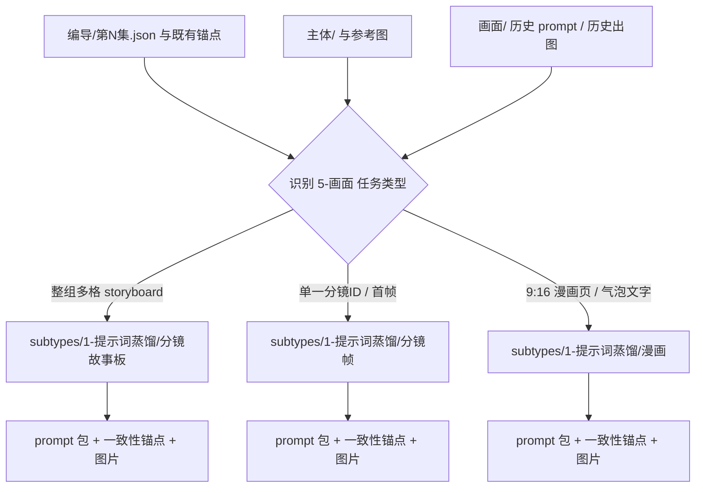
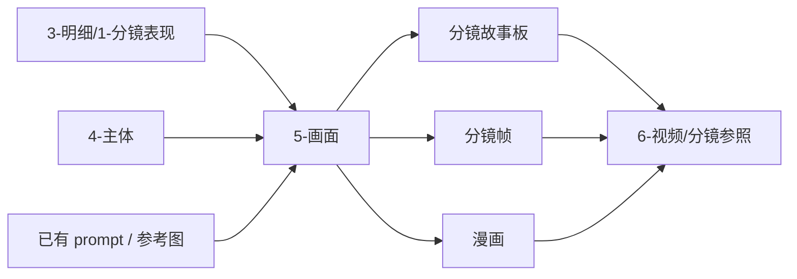

# aigc 5-画面

## 概述

`5-画面` 是 `aigc` 技能树里承接 `3-明细` 与 `4-主体` 的画面生成阶段真源。

它不再与上游 `3-明细/1-分镜表现` 重叠去重新定义镜头事实，而是围绕已经存在的脚本锚点、主体资产、历史 prompt、参考图和既有出图结果，继续推进为三类可消费画面产物：

1. `分镜故事板`
2. `分镜帧`
3. `漫画`

当前阶段首先回答四件事：

1. 哪些已有文件才是本轮画面任务的权威输入
2. 当前任务应进入哪一个唯一画面类型子路径
3. 该子路径需要怎样的 prompt 组合与一致性锚点
4. 画面产物应落到 `projects/<项目名>/画面/` 的哪里

本次结构已按最新内容输出型规范重构为：

- `SKILL.md` 只保留阶段主合同、边界、门禁、回指和 Mermaid 摘要
- `references/` 承载思维链、执行流程、路由策略与输出契约细则
- 三个 `subtypes/*` 继续作为唯一可执行子技能入口，不改变既有内容基底与 canonical landing

## When to Use

- 需要把 `projects/<项目名>/编导/第N集.json` 中已经稳定的分镜组/分镜明细，推进成 prompt 包、一致性策略与图像产物。
- 需要判断当前应做整组 storyboard、单帧图，还是漫画化页面。
- 需要说明 `5-画面` 与 `3-明细/1-分镜表现`、`4-主体`、`6-视频` 的边界。
- 用户只说“做 5-画面 / 做图 / 出画面”而没有明确子路径，但当前仓已经有可消费文件。

## When Not to Use

- 上游 `projects/<项目名>/编导/第N集.json` 还没有形成合法 `分镜组列表[]` / `分镜明细[]`，或 shared schema 尚未对齐。
- 当前任务本质上仍是写文本、补运镜、补光影或补主体设定。
- 当前任务已经进入 `6-视频` 的执行包、镜头参照或模型调用层。

## 阶段职责边界

### `5-画面` 拥有

- 画面阶段父级路由合同
- 三个画面类型子路径的主职责与默认入口解释
- 基于已有文件的 prompt 组合与一致性处理总入口
- `projects/<项目名>/画面/` 阶段真源落点
- 上游脚本锚点到下游图像资产的消费关系

### `5-画面` 不拥有

- 重新改写 `3-明细` 的剧情事实与镜头事实
- 重新生成 `4-主体` 的角色/场景/道具真源
- 直接替代 `6-视频` 的视频执行包与模型调度

## Visual Maps

## Canonical Module References

| 模块 | 作用 | 真源文件 |
| --- | --- | --- |
| 思维链 | 承载字段主表、thought pass 与返工入口 | `references/chain-of-thought.md` |
| 执行流程 | 承载落点、输入合同、阶段 workflow 与 handoff | `references/execution-flow.md` |
| 类型策略 | 承载 VSM 变量、情况、策略映射与默认路由 | `references/type-strategies.md` |
| 输出契约 | 承载阶段级交付、子路径总表与验收面 | `references/output-template.md` |

硬规则：

1. 根 `SKILL.md` 是唯一主合同；`references/` 是模块化细则承载层，不是并行第二真源。
2. 路由、流程、字段与输出模板若需升级，优先回写对应 `references/*.md`。
3. 三个子路径依然是唯一可执行入口；根技能只负责判路与阶段治理，不代写叶子产物。

## Route Summary

- 默认 tranche precedence：`分镜故事板 -> 分镜帧 / 漫画`
- 若任务只命中一个子路径，则只推荐一个主入口
- 若用户只说“做 5-画面 / 做图”，默认先进入最宽容的 `分镜故事板`
- 若上游缺少合法 `分镜组列表[] / 分镜明细[]`，则停止进入本阶段并回退到 `2-组间 / 3-明细`
- 详细变量登记、情况判定、策略映射与 unknown 回退见 `references/type-strategies.md`

## Execution Summary

- 本阶段的第一事实源改为 `projects/<项目名>/编导/第N集.json`，结构口径固定遵循 `.agents/skills/aigc/_shared/director_episode_output.schema.json`
- `4-主体`、已有参考图和历史出图只作为一致性参照与资产锚点来源，不反向改写镜头事实
- 阶段级产物统一写回 `projects/<项目名>/画面/`，并由 `validation-report.md` 记录路由、prompt 组合、一致性与验收
- 详细输入合同、canonical landing、workflow 与 handoff 见 `references/execution-flow.md`

## Output Summary

- 根技能负责阶段级落点、prompt 组合约束、阶段验收与下一阶段 handoff
- 子技能分别负责：组级 `分镜故事板`、单帧 `分镜帧`、页级 `漫画`
- 各子路径主产物、阶段交付与阶段验收面见 `references/output-template.md`

## Field System Summary

- 阶段字段体系仍保持 `FIELD-VIS-ROOT-01` 到 `FIELD-VIS-ROOT-04`
- 具体的字段主表、thought pass 与 pass table 已下沉到 `references/chain-of-thought.md`

## Root-Cause Execution Contract (Mandatory)

当出现以下症状时，必须先修父级 `5-画面` 合同：

- 用户只说“做图 / 做 5-画面”，却被错误推进到不匹配的子路径
- 执行者绕过已有文件，直接凭空发明 prompt 或镜头事实
- `分镜帧` 或 `漫画` 被误当成 `分镜故事板` 的必经下游
- 上游没有合法 `分镜组列表[] / 分镜明细[]` 仍被直接送进 `5-画面`
- 只出图片，不写 prompt 包、一致性依据或验收记录
- 产物路径继续沿用旧仓 `output/影片/...` 而不是当前 `projects/<项目名>/画面/`

必经链路：

`Symptom -> Direct Technical Cause -> Rule Source -> Meta Rule Source -> Fix Landing Points`

优先检查：

- `Rule Source`
  - `.agents/skills/aigc/5-画面/SKILL.md`
  - `.agents/skills/aigc/5-画面/CONTEXT.md`
  - `.agents/skills/aigc/5-画面/subtypes/*/SKILL.md`
- `Meta Rule Source`
  - `.agents/skills/aigc/SKILL.md`
  - 根 `AGENTS.md`

## Context Preload (Mandatory)

- 执行前先加载 `.agents/skills/aigc/SKILL.md + CONTEXT.md`。
- 再加载本 `SKILL.md + CONTEXT.md`。
- 建议同时按需读取 `references/*.md` 以获取模块细则。
- 进入子路径时，继续加载对应 `subtypes/<子路径>/SKILL.md + CONTEXT.md`。
- 优先级遵循：用户显式请求 > 根 `AGENTS.md` > `.agents/skills/aigc/SKILL.md` > 本 `SKILL.md` > 各级 `CONTEXT.md`。
