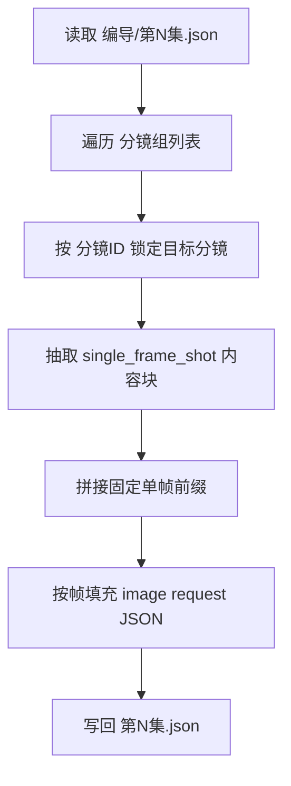

# 5-画面 / 分镜帧

## 概述

`分镜帧` 负责把 `projects/<项目名>/编导/第N集.json` 中某一个明确分镜，整理为 **单一 `分镜ID` 的图像生成请求 JSON**。

交付类型：`内容输出型`

当前子技能名描述的是“单帧目标”，输出结构则对齐 `6-视频/subtypes/1-提示词蒸馏/首帧参照` 的单目标收束方式，并统一落到 `5-画面/_shared` 的图像模板真源。

当前设计重点不是直接生成图片，而是先把每个目标分镜整理成：

1. 共享模板兼容的 `meta`
2. 面向单帧图像的 `prompt_style`
3. 图像生成侧 `model` 参数骨架与参照图预留位
4. 由固定单帧前缀与 `single_frame_shot` 内容块拼成的 `prompt`
5. 对应的 `prompt_char_count`

其中：

- 上游默认路径固定为 `projects/<项目名>/编导/第N集.json`
- shared schema 固定为 `.agents/skills/aigc/_shared/director_episode_output.schema.json`
- shared JSON 模板固定为 `.agents/skills/aigc/5-画面/_shared/image-generation-input.template.json`
- 当前只输出 `json`，不输出 `.txt`
- `single_frame_shot` 内容按目标分镜与所属分镜组上下文组织，不做文字压缩

## When to Use

- 需要把单一 `分镜ID` 整理成单帧图像生成请求 JSON。
- 需要从上游脚本中抽出某一镜的静态画面锚点。
- 用户明确说“单帧 / 首帧 / 按分镜ID 出图”。
- 需要先完成 `1-提示词蒸馏`，后续再进入 `2-一致性处理` 或 `3-图像生成`。

## When Not to Use

- 任务是整组多格 storyboard，应进入 `分镜故事板`。
- 任务是气泡文字、漫画页布局或 9:16 漫画改编，应进入 `漫画`。
- 当前还无法确定唯一 `分镜ID`。

## 子技能边界

### `分镜帧` 拥有

- 单一 `分镜ID` -> 图像请求条目的一对一转换合同
- `single_frame_shot` 的单帧内容归纳规则
- 固定单帧前缀的 prompt 组织规则
- 对 `5-画面/_shared` 图像入参模板的局部填充规则

### `分镜帧` 不拥有

- 组级 storyboard sheet 合同
- 漫画页文字系统与版式规划
- 一致性二次处理与真实图片生成
- 上游镜头事实改写

## Visual Maps

## Canonical Module References

| 模块 | 作用 | 真源文件 |
| --- | --- | --- |
| 思维链 | 承载字段主表、thought pass 与返工入口 | `references/chain-of-thought.md` |
| 执行流程 | 承载落点、输入合同、workflow 与 handoff | `references/execution-flow.md` |
| 类型策略 | 承载 VSM 变量、情况、策略映射与回退 | `references/type-strategies.md` |
| 输出契约 | 承载 JSON 骨架、最低要求与文件清单 | `references/output-template.md` |

## Execution Summary

- 每个目标 `分镜ID` 只生成 1 条图像请求对象。
- `prompt` 固定由单帧专属英文前缀与 `single_frame_shot` 内容块组成。
- `single_frame_shot` 必须覆盖目标分镜所属组的必要上下文与该目标分镜的全部镜级内容。
- 当前只输出 `第N集.json`；后续一致性处理与真实生成由其他子技能继续消费。
- `prompt_style` 独立承载类型、语言和可选字数限制。
- `prompt_char_count` 位于顶层，用于统计和验收。
- `model.reference_images` 保留上传顺序位。
- `model.image_markers` 承担图片 URL、关联主体和 `图1/图2/...` 顺序标记。
- 详细 canonical landing、输入合同、workflow 与 handoff 见 `references/execution-flow.md`。

## Output Summary

- canonical 主产物：`projects/<项目名>/5-画面/分镜帧/第N集/第N集.json`
- 可选追溯文件：`projects/<项目名>/5-画面/分镜帧/第N集/_manifest.json`
- 共享模板真源：`.agents/skills/aigc/5-画面/_shared/image-generation-input.template.json`
- 当前无 `.txt` 派生视图
- 详细 JSON 结构、prompt 规则与最小追溯要求见 `references/output-template.md`

## Strategy Summary

- 判定顺序仍为：`唯一 ID 是否成立 -> single_frame_shot 内容块是否完整 -> 是否只需 JSON -> 共享模板字段是否齐全`
- 变量登记、情况判定、策略映射与回退规则见 `references/type-strategies.md`

## Field System Summary

- 字段体系仍保持 `FIELD-SB-FRAME-01` 到 `FIELD-SB-FRAME-04`
- thought pass 与 pass table 见 `references/chain-of-thought.md`

## Root-Cause Execution Contract (Mandatory)

当出现以下症状时，必须先修本子技能合同：

- `分镜ID` 仍停留在组内局部编号，无法全局回链
- 仍把图片落盘当主产物，而不是单帧图像请求 JSON
- `single_frame_shot` 变成整组剧情梗概或大段对白
- prompt 没有以固定单帧前缀开头
- 共享模板字段被删改，尤其是 `reference_images` 或 `image_markers`

必经链路：

`Symptom -> Direct Technical Cause -> Rule Source -> Meta Rule Source -> Fix Landing Points`

优先检查：

- `Rule Source`
  - `.agents/skills/aigc/5-画面/subtypes/1-提示词蒸馏/分镜帧/SKILL.md`
  - `.agents/skills/aigc/5-画面/subtypes/1-提示词蒸馏/分镜帧/CONTEXT.md`
- `Meta Rule Source`
  - `.agents/skills/aigc/5-画面/SKILL.md`
  - `.agents/skills/aigc/SKILL.md`
  - 根 `AGENTS.md`

## Context Preload (Mandatory)

- 执行前先加载 `.agents/skills/aigc/5-画面/SKILL.md + CONTEXT.md`。
- 再加载本 `SKILL.md + CONTEXT.md`。
- 建议同时读取 `references/*.md` 与 `.agents/skills/aigc/5-画面/_shared/image-generation-input.template.json`。
- 优先级遵循：用户显式请求 > 根 `AGENTS.md` > `.agents/skills/aigc/SKILL.md` > `.agents/skills/aigc/5-画面/SKILL.md` > 本 `SKILL.md` > 各级 `CONTEXT.md`。
