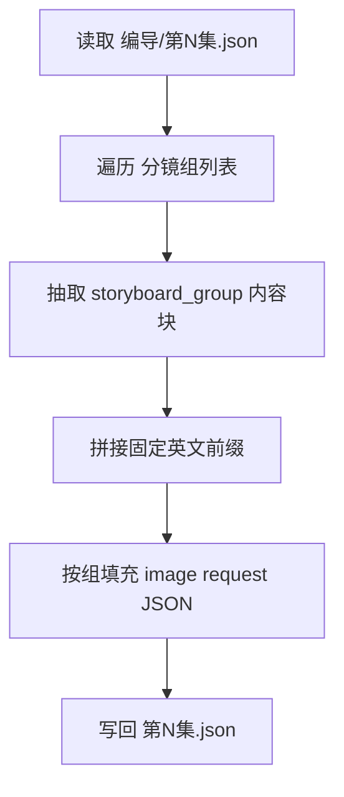
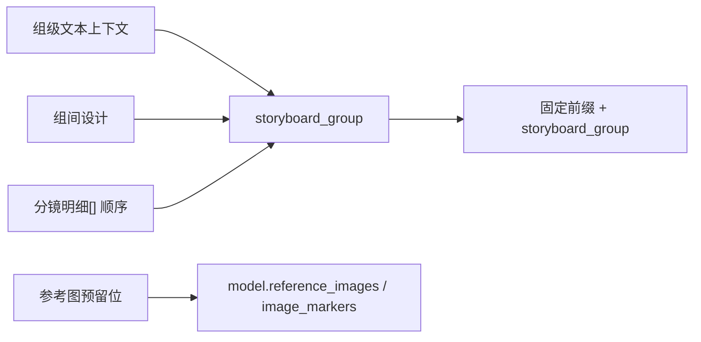

# 5-画面 / 分镜故事板

## 概述

`分镜故事板` 是 `5-画面` 阶段的默认主入口。

当前子技能名描述的是“多格分镜故事板目标”，输出结构则全面对齐 `6-视频/.agents/skills/aigc/5-画面/_shared/image-generation-input.template.json` 的共享模板化配置方式。

它负责把 `projects/<项目名>/编导/第N集.json` 中符合 `.agents/skills/aigc/_shared/director_episode_output.schema.json` 的 `final_output.main_content.分镜组列表[]`，整理为 **每个分镜组 1 条图像生成请求 JSON**。

交付类型：`内容输出型`

当前设计重点不是直接生成图片，而是先把每个分镜组整理成：

1. 共享模板兼容的 `meta`
2. 面向多格故事板的 `prompt_style`
3. 图像生成侧 `model` 参数骨架与参照图预留位
4. 由固定英文前缀与 `storyboard_group` 内容块拼成的 `prompt`
5. 对应的 `prompt_char_count`

其中：

- 上游默认路径固定为 `projects/<项目名>/编导/第N集.json`
- shared schema 固定为 `.agents/skills/aigc/_shared/director_episode_output.schema.json`
- shared JSON 模板固定为 `.agents/skills/aigc/5-画面/_shared/image-generation-input.template.json`
- 当前只输出 `json`，不输出 `.txt`
- `storyboard_group` 内容可以直接使用上游信息，不做文字压缩

## When to Use

- 需要把一个分镜组整理成多格 storyboard 的图像生成请求 JSON。
- 用户说的是“storyboard / 故事板 / 多格分镜”，而不是单帧或漫画页。
- 需要先完成 `1-提示词蒸馏`，后续再进入 `2-一致性处理` 或 `3-图像生成`。

## When Not to Use

- 目标是按单一 `分镜ID` 生成首帧或单帧图，应进入 `分镜帧`。
- 目标是 9:16 漫画单页、气泡文字与漫画页节奏，应进入 `漫画`。
- 上游 `projects/<项目名>/编导/第N集.json` 还没有形成合法 `分镜组列表`，或 shared schema 口径未对齐。

## 子技能边界

### `分镜故事板` 拥有

- 分镜组 -> 图像请求条目的一对一转换合同
- 固定前缀 + `storyboard_group` 的 prompt 组织规则
- 对 `5-画面/_shared` 图像入参模板的局部填充规则

### `分镜故事板` 不拥有

- 单帧级输出合同
- 漫画页文字系统与版式规划
- 一致性二次处理与真实图片生成
- 上游镜头事实重写

## Visual Maps

## Canonical Module References

| 模块     | 作用                                    | 真源文件                           |
| -------- | --------------------------------------- | ---------------------------------- |
| 思维链   | 承载字段主表、thought pass 与返工入口   | `references/chain-of-thought.md` |
| 执行流程 | 承载落点、输入合同、workflow 与 handoff | `references/execution-flow.md`   |
| 类型策略 | 承载 VSM 变量、情况、策略映射与回退     | `references/type-strategies.md`  |
| 输出契约 | 承载 JSON 骨架、最低要求与文件清单      | `references/output-template.md`  |

## Execution Summary

- 每个 `分镜组` 只生成 1 条图像请求对象。
- `prompt` 固定由英文前缀与 `storyboard_group` 内容块组成。
- `storyboard_group` 必须覆盖该组的 `剧本正文`、`组间设计` 与全部 `分镜明细[]`。
- 当前只输出 `第N集.json`；后续一致性处理与真实生成由其他子技能继续消费。
- `prompt_style` 独立承载类型、语言和可选字数限制。
- `prompt_char_count` 位于顶层，用于统计和验收。
- `model.reference_images` 保留上传顺序位。
- `model.image_markers` 承担图片 URL、关联主体和 `图1/图2/...` 顺序标记。
- 详细 canonical landing、输入合同、workflow 与 handoff 见 `references/execution-flow.md`。

## Output Summary

- canonical 主产物：`projects/<项目名>/5-画面/分镜故事板/第N集/第N集.json`
- 可选追溯文件：`projects/<项目名>/5-画面/分镜故事板/第N集/_manifest.json`
- 共享模板真源：`.agents/skills/aigc/5-画面/_shared/image-generation-input.template.json`
- 当前无 `.txt` 派生视图
- 详细 JSON 结构、prompt 规则与最小追溯要求见 `references/output-template.md`

## Strategy Summary

- 判定顺序仍为：`组边界是否稳定 -> storyboard_group 内容块是否完整 -> 是否只需 JSON -> 共享模板字段是否齐全`
- 变量登记、情况判定、策略映射与回退规则见 `references/type-strategies.md`

## Field System Summary

- 字段体系仍保持 `FIELD-SB-SHEET-01` 到 `FIELD-SB-SHEET-04`
- thought pass 与 pass table 见 `references/chain-of-thought.md`

## Root-Cause Execution Contract (Mandatory)

当出现以下症状时，必须先修本子技能合同：

- 仍把图片落盘当主产物，而不是组级图像请求 JSON
- prompt 没有以固定英文前缀开头
- `storyboard_group` 没覆盖完整组级与镜级信息
- 共享模板字段被删改，尤其是 `reference_images` 或 `image_markers`

必经链路：

`Symptom -> Direct Technical Cause -> Rule Source -> Meta Rule Source -> Fix Landing Points`

优先检查：

- `Rule Source`
  - `.agents/skills/aigc/5-画面/subtypes/1-提示词蒸馏/分镜故事板/SKILL.md`
  - `.agents/skills/aigc/5-画面/subtypes/1-提示词蒸馏/分镜故事板/CONTEXT.md`
- `Meta Rule Source`
  - `.agents/skills/aigc/5-画面/SKILL.md`
  - `.agents/skills/aigc/SKILL.md`
  - 根 `AGENTS.md`

## Context Preload (Mandatory)

- 执行前先加载 `.agents/skills/aigc/5-画面/SKILL.md + CONTEXT.md`。
- 再加载本 `SKILL.md + CONTEXT.md`。
- 建议同时读取 `references/*.md` 与 `.agents/skills/aigc/5-画面/_shared/image-generation-input.template.json`。
- 优先级遵循：用户显式请求 > 根 `AGENTS.md` > `.agents/skills/aigc/SKILL.md` > `.agents/skills/aigc/5-画面/SKILL.md` > 本 `SKILL.md` > 各级 `CONTEXT.md`。
