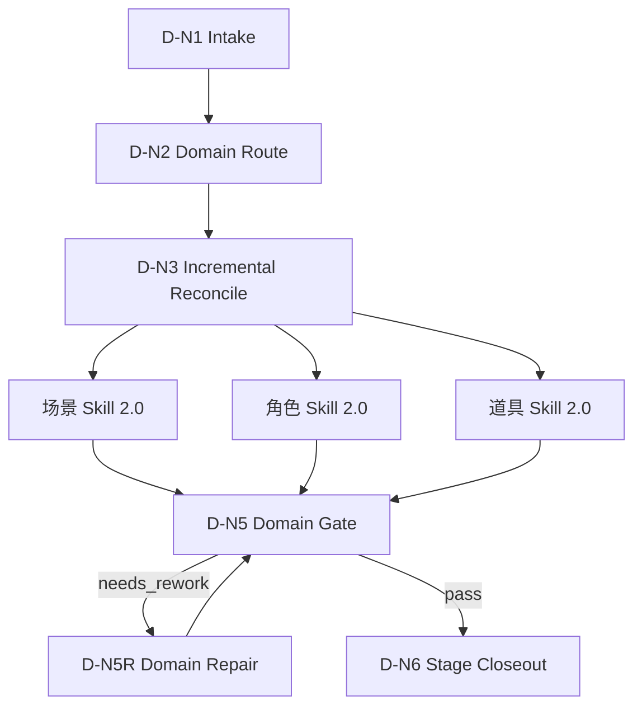

# 5-设计 思行网络

## Node Network

| node_id | input | action | output | gate |
| --- | --- | --- | --- | --- |
| `D-N1-INTAKE` | 用户请求、项目名、集数、候选输入文件 | 锁定项目根与 5-设计 输出根 | `design_scope` | `projects/aigc/<项目名>/5-设计/` 可定位或可创建 |
| `D-N2-DOMAIN` | `design_scope` | 判定命中 `场景 / 角色 / 道具` 域集合 | `domain_routes` | 至少一个 active 域 |
| `D-N3-RECONCILE` | `domain_routes`、上游 `4-分组`、既有 5-设计产物 | 识别全量/增量范围、已消费集数、主体合并与缺口 | `reconcile_delta` | 分批上游不得跳过对账 |
| `D-N4-DISPATCH` | `domain_routes`、`reconcile_delta` | 加载对应域级 `SKILL.md + CONTEXT.md` | `domain_execution_plan` | 不调度未命中域，只处理缺口 |
| `D-N5-DOMAIN-GATE` | 域级输出 | 检查域内 `1-清单 + 2-设计 + 3-生成` leaf 产物 | `domain_verdicts` | 输出位于对应域内子目录且未静默覆盖 |
| `D-N5R-DOMAIN-REPAIR` | `domain_verdicts` 中的失败 findings | 路由回对应域级 leaf 执行 direct repair 并复审 | `domain_repair_results` | 父级不直接补写业务真源；失败域复审通过或明确阻断 |
| `D-N6-CLOSEOUT` | `domain_verdicts`、`domain_repair_results` | 按需写阶段 `validation-report.md` | `stage_verdict` | 失败可回指具体域级 owner；未通过域不得伪装通过 |

## Failure Routing

| symptom | route |
| --- | --- |
| 旧 tranche 路径仍被引用 | `D-N2-DOMAIN -> registry/routes/shared runtime 修复` |
| 新增 `4-分组` 后重复主体、漏设计或静默覆盖 | `D-N3-RECONCILE -> incremental-reconciliation-contract.md -> 对应域 1-清单/2-设计/3-生成` |
| 域级包缺 Skill 2.0 分区 | `D-N4-DISPATCH -> skill-工作车间结构修复` |
| 父级或下游仍要求 5-设计 根目录平铺业务真源 | `D-N5-DOMAIN-GATE -> 对应域 SKILL.md Output Contract` |
| 设计模板或面板 JSON 漂移 | `D-N5-DOMAIN-GATE -> 对应域 templates/review` |
| 域级 review 失败后父级试图直接补业务正文 | `D-N5R-DOMAIN-REPAIR -> 对应域 leaf review/review-contract.md` |

## Mermaid

