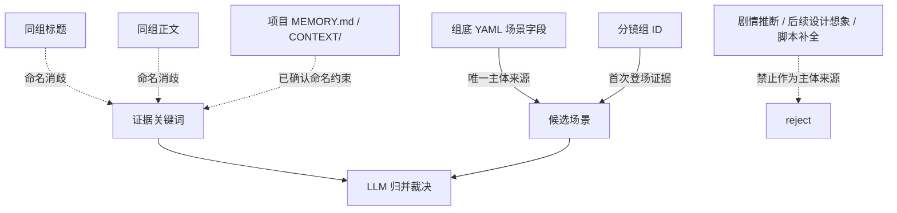

# Source And Merge Contract

## 上游真源

- 唯一准确信息来源：`projects/aigc/<项目名>/4-分组/第N集.md` 每个分镜组底部 YAML 的 `场景` 字段。
- 证据回查来源：同一分镜组正文、场景标题、分镜组 ID。
- 禁止来源：未被 `场景` 字段支持的剧情推断、后续设计想象、脚本自动补全。

## Source Trust Map

## 候选记录

每个候选场景至少记录：

| field | meaning |
| --- | --- |
| `source_episode` | 来源集号或文件名 |
| `group_id` | 来源分镜组 ID |
| `yaml_scene_value` | 组底 YAML 的 `场景` 原值 |
| `evidence_keywords` | 同组标题或正文中的消歧关键词 |

候选记录是 LLM 归并的证据，不直接等于最终输出表。

## 归并规则

1. 精确同名默认归并。
2. 明确别名、代称、简称、全称默认归并，但关键词中保留原文证据。
3. 同一地点不同时段或状态默认归并；若状态导致独立资产制作需求，可以拆分。
4. 同一地点的不同区域、房间、门口、走廊、天台、地下空间等默认保守区分。
5. 跨场景、移动路线、组合地点应拆成可制作空间，除非 YAML 明确只表达一个泛称空间。
6. 无法裁决时保留风险待核，不用脚本或模板强行二选一。

## 输出字段映射

| 输出字段 | 来源与规则 |
| --- | --- |
| `名称` | LLM 归并后的 canonical 场景名 |
| `首次登场` | 归并后最早出现的分镜组 ID，可附集号 |
| `原文描述（关键词式）` | YAML 原值、别名证据、标题/正文消歧关键词；不扩写设计 |
