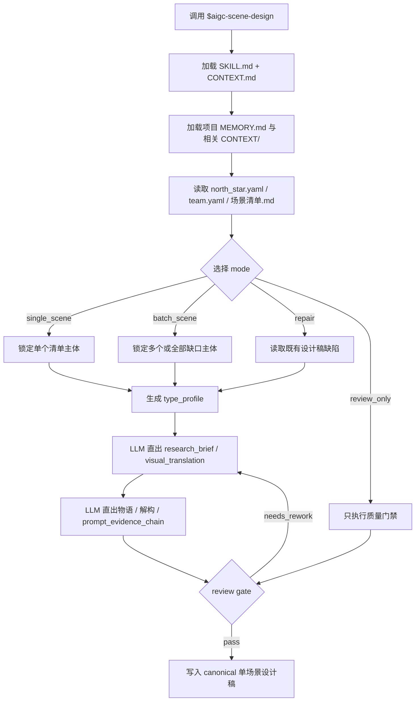
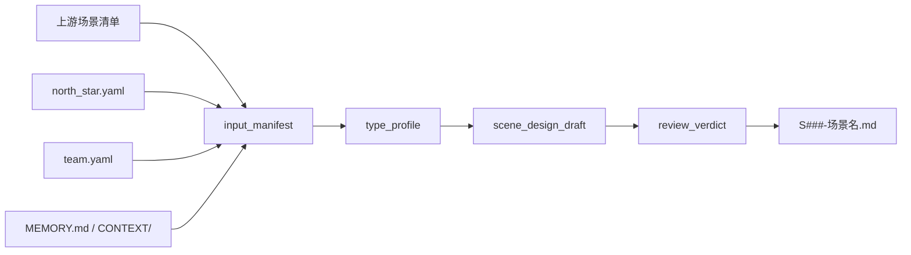
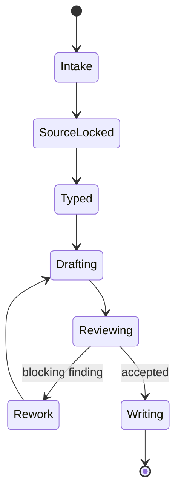

# aigc 5-设计 / 场景 / 2-设计

`$aigc-scene-design` 消费上游 `$aigc-scene-list` 的汇总式场景清单，为每个场景主体输出可制作、可审查、可进入图像生成阶段的单场景细目设计稿。核心创作、研究判断、空间想象、摄影语汇和提示词蒸馏必须由 LLM 直接完成；脚本只允许承担读取、字段校验、文件命名归一、字数检查和目录检查等机械辅助。研究层不是孤立考据段，必须形成 `research_brief -> source_posture -> uncertainty_register -> visual_translation -> prompt_evidence_chain` 的可追溯设计证据链。

## Context Loading Contract

- 每次调用 `$aigc-scene-design` 时，必须同时加载同目录 `CONTEXT.md`。
- 每次调用本技能时，必须同时识别并加载同目录 `types/` 中选中的类型包（单选或多选）。
- 若任务绑定 `projects/aigc/<项目名>/`，必须先加载项目根 `MEMORY.md`，再按需加载项目根 `CONTEXT/` 中与世界观、地理、年代、建筑、美术风格、摄影风格相关的上下文。
- 必须读取上游 `projects/aigc/<项目名>/5-设计/场景/1-清单/场景清单.md`；该清单只提供主体索引和原文证据，不替代本阶段的设计判断。
- 必须读取 `projects/aigc/<项目名>/0-初始化/north_star.yaml`，提取全局审美方向、故事母题、禁区和全局风格提示词。
- 必须读取 `projects/aigc/<项目名>/team.yaml`，提取与设计、美术、建筑、摄影、导演或大师监制相关的上下文；该上下文作为风格约束和审查视角，不替代场景设计正文。
- 固定画面约束：场景设计默认只输出纯空镜空间设计，不得出现人物、人体局部、剪影、倒影或可识别人类存在；英文提示词必须显式包含 `empty shot, no people, no human figures` 等等价约束。
- 冲突优先级：用户显式请求 > 根 `AGENTS.md` / meta 规则 > 本 `SKILL.md` > `references/` / `steps/` / `review/` / `types/` / `templates/` > `agents/openai.yaml` > 项目 `MEMORY.md` > 项目 `CONTEXT/` > 本 `CONTEXT.md`。
- 本 skill 在仓库治理口径下声明 reviewer -> subagent 默认路径：研究考据、Scene Design、Cinematography、Prompt Review 可作为并行 reviewer 路径；实际 dispatch 必须服从当前 system / developer / tool / user 优先级。若上层策略阻断、工具不可用或用户显式禁用，必须降级为本地 review checklist，并报告阻断层级、原计划路径、实际路径和未启动 reviewer。

## Positioning

本阶段拥有单场景设计稿的业务真源权。它不拥有 `1-清单/场景清单.md` 的主体增删权，不拥有 `3-生成` 的图片生成权，也不把研究资料、提示词或大师上下文写回上游清单。

## Input Contract

Accepted input:

- 项目名、项目路径或目标 `projects/aigc/<项目名>/`。
- 单个场景名、多个场景名、场景清单行号，或“处理全部场景设计”的请求。
- 已存在的 `projects/aigc/<项目名>/5-设计/场景/1-清单/场景清单.md`。
- 用户补充的建筑风格、地理原型、年代、摄影倾向、禁区或参考资料。

Required input:

- 可读取的项目根 `MEMORY.md` 和相关 `CONTEXT/`，若缺失必须报告并使用临时护栏。
- 可读取的 `0-初始化/north_star.yaml` 与 `team.yaml`。
- 可读取的 `5-设计/场景/1-清单/场景清单.md`，且至少包含 `名称`、`首次登场`、`原文描述（关键词式）` 三列。
- 至少一个目标场景主体；未指定时默认处理清单中尚未存在设计稿的全部场景。

Optional input:

- 用户指定的全球风格提示词、建筑风格词、视觉参考、年代考据源或禁用元素。
- 已存在的单场景设计稿，用于 repair、review 或增量改写。
- 网络搜索许可；仅当涉及冷门建筑、地域、历史、材质或仪式信息，且本地项目资料不足时使用。

Reject or clarify when:

- 上游场景清单不存在或列结构无法识别。
- `north_star.yaml` 或 `team.yaml` 不存在且用户不允许临时降级。
- 用户要求脚本自动生成研究、物语、空间解构、摄影设计或提示词。
- 用户要求本阶段直接改写上游清单、生成图片、批量提交 registry 或覆盖其他 worker 的技能包。

## Mode Selection

| mode | 触发信号 | 输出 |
| --- | --- | --- |
| `single_scene` | 指定一个场景主体 | 单个 `S###-<场景名>.md` |
| `batch_scene` | 指定多个场景或要求处理全部 | 多个单场景设计稿与可选执行报告 |
| `incremental_fill` | 上游清单 merge 后存在新增场景或 `design-manifest.yaml` 标出 `design_gaps` | 只为缺设计稿的场景补齐设计，不覆盖既有设计稿 |
| `repair` | 已有设计稿缺字段、提示词超长、证据不足或风格漂移 | 最小修复后的设计稿 |
| `review_only` | 用户只要求审查场景设计 | 审查结论，不改写文件，除非用户随后要求修复 |

## Visual Maps

## Reference Loading Guide

| 场景 | 必读文件 |
| --- | --- |
| 任意场景设计任务 | `references/scene-design-contract.md`、`steps/scene-design-workflow.md` |
| 清单 merge 后的设计缺口补齐 | `../../references/incremental-reconciliation-contract.md` |
| 场景类型、空间粒度、建筑/自然/超现实分型 | `types/scene-design-type-map.md` |
| 输出质量审查、subagents/reviewer 降级口径 | `review/review-contract.md` |
| 输出样板和字段顺序 | `templates/output-template.md` |
| 脚本辅助边界 | `scripts/README.md` |
| 可复用经验 | `knowledge-base/scene-design-heuristics.md` |
| 产品入口元数据 | `agents/openai.yaml` |

## Execution Contract

1. 读取本 `SKILL.md + CONTEXT.md`，并在项目任务中加载项目根 `MEMORY.md` 与相关项目 `CONTEXT/`。
2. 读取 `north_star.yaml`、`team.yaml`、上游 `场景清单.md` 和可选 `projects/aigc/<项目名>/5-设计/场景/design-manifest.yaml`，建立 `input_manifest`。
3. 按用户指定、清单缺口或 manifest 的 `design_gaps` 选择目标场景，不新增未在上游清单出现的场景主体；已有设计稿默认跳过，除非用户明确要求 repair / regenerate。
4. 按 `types/scene-design-type-map.md` 形成 `type_profile`：现实建筑、自然地貌、城市街区、室内空间、交通/过渡空间、仪式空间、超现实/异化空间、复合空间等。
5. 按 `references/scene-design-contract.md` 由 LLM 完成研究层闭环：`research_brief`、`source_posture`、`uncertainty_register`、`visual_translation`；冷门信息可在许可条件下网络搜索，并记录来源、推断边界或未解不确定性。
6. 按 `references/scene-design-contract.md` 由 LLM 完成物语、解构、英文提示词与 `prompt_evidence_chain`；提示词中的关键空间、材质、光线、构图和风格 token 必须能回指研究或设计依据。
7. 按 `templates/output-template.md` 输出单场景 Markdown，必须包含：名称/首次登场/原文描述复述、研究考据/Research Brief、物语、解构、提示词设计。
8. `解构` 必须分为 `Scene Design` 与 `Cinematography` 字段；`提示词设计` 必须引用全局风格提示词和建筑风格，并输出英文提示词，长度不超过 2000 characters。
9. 画面固定为纯空镜；摄影字段和英文提示词不得引入人物、人体局部、剪影、倒影或人群。
10. 写入 `projects/aigc/<项目名>/5-设计/场景/2-设计/S###-<场景名>.md`；批量任务可写入可选 `执行报告.md`，并可更新 `design-manifest.yaml` 的 `design_file` 与 `design_gaps`。
11. 按 `review/review-contract.md` 执行交付验收；subagents 被工具层阻断时，必须使用本地 review checklist 并显式报告降级。

## Field Mapping

| field_id | 输出/证据 | 内容要求 | 失败码 |
| --- | --- | --- | --- |
| `FIELD-SCENE-DESIGN-01` | 输入取证 | 可回指项目根、`north_star.yaml`、`team.yaml`、上游场景清单行 | `FAIL-SCENE-DESIGN-01` |
| `FIELD-SCENE-DESIGN-02` | 场景主体 | 主体来自上游清单，不新增平行清单真源 | `FAIL-SCENE-DESIGN-02` |
| `FIELD-SCENE-DESIGN-02A` | 增量补缺 | 只处理缺设计稿或用户指定 repair 的主体，未静默覆盖既有设计稿 | `FAIL-SCENE-DESIGN-02A` |
| `FIELD-SCENE-DESIGN-03` | 研究层闭环 | 包含 `research_brief`、`source_posture`、`uncertainty_register`、`visual_translation`，并与类型画像相关 | `FAIL-SCENE-DESIGN-03` |
| `FIELD-SCENE-DESIGN-04` | 物语 | 解释空间与角色关系、叙事和主题的关系，不写成剧情正文，不让人物入画 | `FAIL-SCENE-DESIGN-04` |
| `FIELD-SCENE-DESIGN-05` | 解构 | 包含 `Scene Design` 与 `Cinematography` 两组字段 | `FAIL-SCENE-DESIGN-05` |
| `FIELD-SCENE-DESIGN-06` | 提示词 | 引用全局风格提示词和建筑风格，英文，不超过 2000 characters | `FAIL-SCENE-DESIGN-06` |
| `FIELD-SCENE-DESIGN-07` | LLM-first | 脚本没有生成核心创作正文或提示词 | `FAIL-SCENE-DESIGN-07` |
| `FIELD-SCENE-DESIGN-08` | 写入边界 | 只写项目 `5-设计/场景/2-设计` 输出，不改 registry 或其他技能 | `FAIL-SCENE-DESIGN-08` |
| `FIELD-SCENE-DESIGN-09` | 纯空镜约束 | 摄影与 prompt 明确为纯空镜，不出现人物、人体局部、剪影、倒影或人群 | `FAIL-SCENE-DESIGN-09` |
| `FIELD-SCENE-DESIGN-10` | Prompt 证据链 | `prompt_evidence_chain` 将关键 prompt token 回指来源、推断或设计翻译 | `FAIL-SCENE-DESIGN-10` |

## Thought Pass Map

| step_id | pass_name | input | judgment | output |
| --- | --- | --- | --- | --- |
| `PASS-SCENE-DESIGN-01` | 输入锁定 | 项目路径、`north_star.yaml`、`team.yaml`、`场景清单.md` | 三个核心来源是否可读，缺口是否需要降级报告 | `input_manifest` |
| `PASS-SCENE-DESIGN-02` | 主体选择 | 用户指定项、上游清单或 manifest | 是否只处理清单已有场景，是否需要跳过已有设计稿或补 `design_gaps` | `target_scene_list` |
| `PASS-SCENE-DESIGN-03` | 类型画像 | 场景名、原文关键词、项目资料 | 场景类型、建筑风格入口、研究需求和摄影风险 | `type_profile` |
| `PASS-SCENE-DESIGN-04` | 研究简报 | 上游证据、north star、team、type profile | 来源姿态、不确定性和视觉翻译是否足以支撑设计 | `research_brief` |
| `PASS-SCENE-DESIGN-05` | LLM 设计 | research brief、north star、team、type profile | 物语、解构、提示词和 prompt 证据链是否由 LLM 直出 | `scene_design_draft` |
| `PASS-SCENE-DESIGN-06` | reviewer 汇流 | 设计稿草案与 review contract | subagents 或本地 checklist 是否通过门禁 | `review_verdict` |
| `PASS-SCENE-DESIGN-07` | 落盘验收 | accepted draft | 路径、命名、字段、prompt 字符数是否合规 | `S###-<场景名>.md` |

## Pass Table

| pass_id | must_do | evidence | Rework Entry |
| --- | --- | --- | --- |
| `PASS-SCENE-DESIGN-01` | 读取技能与项目上下文，建立来源清单 | `input_manifest` | `steps/scene-design-workflow.md` |
| `PASS-SCENE-DESIGN-02` | 从上游 `场景清单.md` 选择目标主体 | `target_scene_list` | `references/scene-design-contract.md` |
| `PASS-SCENE-DESIGN-03` | 生成 `type_profile` 并确定建筑/空间风格入口 | `type_profile` | `types/scene-design-type-map.md` |
| `PASS-SCENE-DESIGN-04` | 由 LLM 直写 `research_brief`、来源姿态、不确定性和视觉翻译 | `research_brief` | `references/scene-design-contract.md` |
| `PASS-SCENE-DESIGN-05` | 由 LLM 直写物语、解构、英文提示词和 `prompt_evidence_chain` | `scene_design_draft` | `templates/output-template.md` |
| `PASS-SCENE-DESIGN-06` | 执行 subagents/reviewer 或本地等价 review | `review_verdict` | `review/review-contract.md` |
| `PASS-SCENE-DESIGN-07` | 写入 canonical 单场景设计稿 | output file path | `SKILL.md` Output Contract |

## Root-Cause Execution Contract (Mandatory)

出现以下问题时，必须沿链路上溯并修复源层合同：

- 从剧情想象新增了上游清单没有的场景主体。
- 上游清单增量更新后，没有识别缺设计稿主体，或覆盖了已有场景设计稿。
- 未读取 `north_star.yaml` 或 `team.yaml` 就生成风格判断。
- 研究考据由脚本、模板拼接或无来源断言替代 LLM 判断。
- 研究层只有百科式段落，没有 `research_brief`、来源姿态、不确定性和视觉翻译。
- 英文提示词关键 token 无法通过 `prompt_evidence_chain` 回指来源、推断或设计选择。
- `解构` 缺少 `Scene Design` 或 `Cinematography` 字段。
- 英文提示词没有引用全局风格提示词和建筑风格，或超过 2000 characters。
- 场景 prompt 或摄影设计允许人物、人体局部、剪影、倒影或人群进入画面。
- 把本阶段输出写回 `1-清单`、`3-生成`、registry、父级目录或其他 worker 范围。

必经链路：

`Symptom -> Direct Script/Prompt Overreach -> 场景设计 Section Owner -> Scene Design Contract -> AGENTS.md LLM-first / Skill 2.0 Rule`

## Output Contract

### Required output

1. 每个目标场景输出一个单场景细目设计 Markdown。
2. 每个设计稿必须包含：`名称`、`首次登场`、`原文描述复述`、`研究考据 / Research Brief`、`物语`、`解构`、`提示词设计`。
3. `研究考据 / Research Brief` 必须包含 `research_brief`、`source_posture`、`uncertainty_register`、`visual_translation`，并明确哪些信息来自上游资料、常识推断、网络来源或未解不确定性。
4. `解构` 必须包含 `Scene Design` 与 `Cinematography` 字段。
5. `提示词设计` 必须包含全局风格提示词引用、建筑风格引用、`prompt_evidence_chain` 和英文提示词；英文提示词不超过 2000 characters。
6. 画面固定为纯空镜，不得出现人物、人体局部、剪影、倒影或可识别人类存在。
7. 可选执行报告记录输入范围、已生成文件、降级情况、冷门信息检索情况和 review verdict。
8. 可选更新 `projects/aigc/<项目名>/5-设计/场景/design-manifest.yaml`，记录 `design_file` 和剩余 `design_gaps`；manifest 不替代设计稿真源。

### Output format

| output_id | format |
| --- | --- |
| `OUTPUT-SCENE-DESIGN` | Markdown 单场景设计稿 |
| `OUTPUT-SCENE-DESIGN-REPORT` | Markdown 执行报告，可选 |

### Output path

| output_id | canonical path |
| --- | --- |
| `OUTPUT-SCENE-DESIGN` | `projects/aigc/<项目名>/5-设计/场景/2-设计/S###-<场景名>.md` |
| `OUTPUT-SCENE-DESIGN-REPORT` | `projects/aigc/<项目名>/5-设计/场景/2-设计/执行报告.md` |
| `OUTPUT-SCENE-MANIFEST` | `projects/aigc/<项目名>/5-设计/场景/design-manifest.yaml` |

### Naming convention

- `S###` 使用上游 `场景清单.md` 中目标场景的顺序，从 `S001` 起补零。
- 已有 `S###-<场景名>.md` 不因清单 merge 或新增场景而重排；新增场景追加下一个可用 `S###`。
- `<场景名>` 使用上游 canonical 场景名，文件名中 `/\:*?"<>|` 与换行替换为 `-`。
- 不创建 `scene-design.md`、`场景设计.md`、`全部场景.md` 或其他平行总稿，除非用户显式要求额外汇总导出。

### Completion gate

- 已读取本 `SKILL.md + CONTEXT.md`，并在项目任务中加载项目 `MEMORY.md` 与相关项目 `CONTEXT/`。
- 已读取 `north_star.yaml`、`team.yaml` 和上游 `场景清单.md`。
- 每个输出文件都能回指上游清单行的 `名称`、`首次登场`、`原文描述（关键词式）`。
- 已识别并跳过既有设计稿；仅补齐缺设计稿或用户明确指定 repair 的主体。
- 每个设计稿包含 required output 中的全部板块和字段。
- 研究层已经产出 `research_brief`、`source_posture`、`uncertainty_register` 与 `visual_translation`，没有把猜测写成事实。
- 英文提示词不超过 2000 characters，且显式承接全局风格提示词与建筑风格。
- `prompt_evidence_chain` 能解释关键 prompt token 来自哪条来源事实、推断或设计翻译。
- 英文提示词和摄影字段明确固定为纯空镜，并包含 `no people / no human figures` 等负向约束。
- 未使用脚本生成核心创作正文、研究判断、空间设计、摄影设计或提示词。
- 已执行 `review/review-contract.md` 的验收，或写明等价人工 review 结果与 subagent 降级原因。
