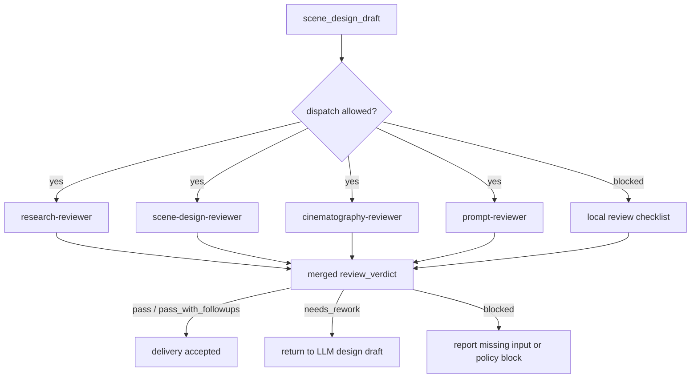

# Review Contract

本文件定义 `$aigc-scene-design` 的质量门禁、subagents/reviewer 路径和降级口径。

## Default Reviewer Path

在当前上层策略允许真实 dispatch，且用户显式要求或仓库治理合同视为已授权时，默认 reviewer 路径如下：

| reviewer | scope | blocking checks |
| --- | --- | --- |
| `research-reviewer` | 研究考据、冷门信息、事实/推断边界 | 无研究依据、冷门事实无来源策略 |
| `scene-design-reviewer` | Scene Design 字段、空间结构、材质、可制作资产 | 缺空间结构、缺建筑风格、不可制作 |
| `cinematography-reviewer` | 摄影字段、构图、光线、镜头逻辑 | 与场景无关、泛电影感、缺光线/镜头 |
| `prompt-reviewer` | 英文 prompt、全局风格、建筑风格、字符数 | 非英文、超 2000 characters、缺引用 |

若当前 system/developer/tool 层无法真实启动 subagents，允许降级为本地 checklist，但必须报告：

- 阻断来源层级。
- 原计划 reviewer 路径。
- 实际采用的降级路径。
- 哪些 reviewer 没有真实启动。

## Reviewer Merge Map



## Review Dimensions

| dimension | checks |
| --- | --- |
| source | 每个设计稿可回指上游清单行、north star 和 team |
| structure | 模板板块齐全，`Scene Design` / `Cinematography` 分开 |
| research | 研究与场景类型相关，冷门信息有来源策略 |
| story | 物语服务主题和人物关系，不新增剧情事实 |
| design | 空间结构、材质、色彩、陈设、动线和资产提示明确 |
| cinematography | 镜头、光线、构图、焦段、运动与空间匹配 |
| prompt | 英文、<= 2000 characters、承接全局风格和建筑风格，并显式固定纯空镜/no people |
| fixed_visual | 是否为纯空镜；无人物、人体局部、剪影、倒影或人群 |
| boundary | 不改 `1-清单`、不生成图像、不改 registry、不触碰其他 worker 包 |
| llm_first | 核心正文不是脚本生成 |

## Verdict Model

| verdict | meaning |
| --- | --- |
| `pass` | 可进入后续场景生成阶段 |
| `pass_with_followups` | 可交付，但有非阻断补强项 |
| `needs_rework` | 有阻断缺陷，必须返工 |
| `blocked` | 缺输入、缺权限或上层策略阻断 |

## Finding Shape

```yaml
finding:
  severity: critical | high | medium | low
  dimension: source | structure | research | story | design | cinematography | prompt | fixed_visual | boundary | llm_first
  symptom: ""
  direct_cause: ""
  source_contract: ""
  rework_target: ""
```

## Gate Rule

不得在以下情况宣布完成：

- 缺少 `north_star.yaml`、`team.yaml` 或上游 `场景清单.md`，且未报告降级。
- 输出文件缺少 required sections。
- `解构` 未拆分为 `Scene Design` 和 `Cinematography`。
- 英文提示词超过 2000 characters。
- 摄影字段或英文提示词出现人物、人体局部、剪影、倒影、人群，或未明确 `no people / no human figures`。
- 由脚本生成核心创作正文或提示词。
- 写入范围越过 `projects/aigc/<项目名>/4-设计/场景/2-设计`。
