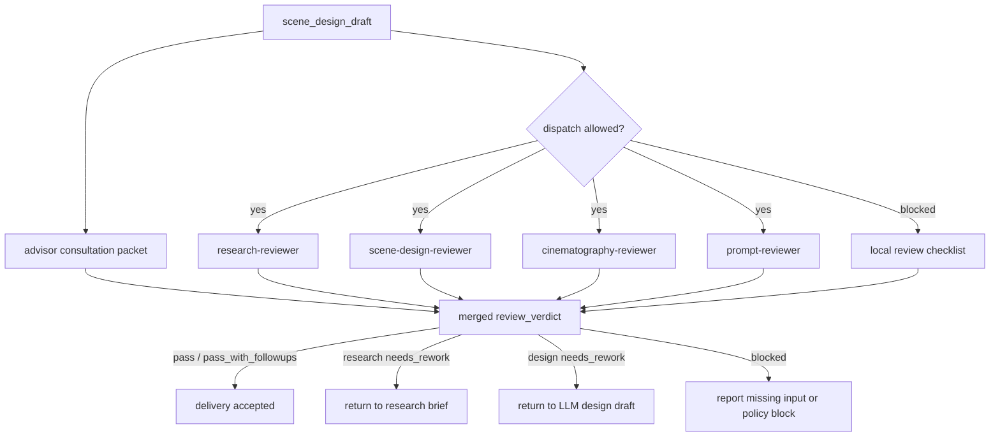

# Review Contract

本文件定义 `$aigc-scene-design` 的质量门禁、subagents/reviewer 路径和降级口径。

## Default Reviewer Path

在当前上层策略允许真实 dispatch，且用户显式要求或仓库治理合同视为已授权时，默认 reviewer 路径如下：

默认顾问路径按 `../../../_shared/team-advisor-consultation-contract.md` 执行：先从项目 `team.yaml` 解析监制 roster，请教场景/建筑/美术/摄影/导演相关顾问，形成 `advisor_consultation_packet` 后再进入单场景设计与 reviewer 汇流。

| reviewer | scope | blocking checks |
| --- | --- | --- |
| `research-reviewer` | `research_brief`、来源姿态、冷门信息、事实/推断边界、不确定性与视觉翻译 | 无研究简报、冷门事实无来源策略、猜测伪装事实、研究无法落到可见设计 |
| `scene-design-reviewer` | Scene Design 字段、空间结构、材质、可制作资产 | 缺空间结构、缺建筑风格、不可制作 |
| `cinematography-reviewer` | 摄影字段、构图、光线、镜头逻辑 | 与场景无关、泛电影感、缺光线/镜头 |
| `prompt-reviewer` | 英文 prompt 主体 ID 开头、全局风格、建筑风格、时间与地域锚点、`prompt_evidence_chain`、字符数 | 非英文、未以主体 ID 号开头、超 2000 characters、缺引用、缺时间或地域、关键 token 无证据链 |

若当前 system/developer/tool 层无法真实启动 subagents，允许降级为本地 checklist，但必须报告：

- 阻断来源层级。
- 原计划 reviewer 路径。
- 实际采用的降级路径。
- 哪些 advisor / reviewer 没有真实启动。

## Reviewer Merge Map



## Review Dimensions

| dimension | checks |
| --- | --- |
| source | 每个设计稿可回指上游清单行、north star 和 team |
| structure | 模板板块齐全，`## 4. 解构` 下方先写 `主体ID号：<主体ID>`，`Scene Design` / `Cinematography` 分开 |
| research | 研究与场景类型相关，包含 `research_brief`、来源姿态、证据矩阵和不确定性处理 |
| visual_translation | 研究判断能翻译为空间结构、材料、光线、陈设、构图或 prompt token |
| story | 物语服务主题和人物关系，不新增剧情事实 |
| design | 空间结构、材质、色彩、陈设、动线和资产提示明确 |
| cinematography | 镜头、光线、构图、焦段、运动与空间匹配 |
| prompt | 英文、以主体 ID 号开头、<= 2000 characters、承接全局风格、建筑风格、时间和地域，并显式固定纯空镜/no people；prompt 前缀与解构主体 ID、提示词设计主体 ID 完全一致；最终英文整合 prompt 已吸收 `## 4. 解构` 的全部有效 Scene Design 与 Cinematography 信息，而不是只补前缀/后缀 |
| prompt_evidence_chain | 关键 prompt token 能回指 `research_brief`、`visual_translation`、Scene Design 或 Cinematography，并包含 `deconstruction_coverage` 来说明解构槽位如何进入、合并或被剔除 |
| fixed_visual | 是否为纯空镜；无人物、人体局部、剪影、倒影或人群 |
| advisor_consultation | 是否按 `team.yaml` 请教项目监制顾问，问题是否具体，指导是否落入空间结构、材质光线、空镜构图、no people 或 prompt evidence |
| boundary | 不改 `1-清单`、不生成图像、不改 registry、不触碰其他 worker 包 |
| llm_first | 核心正文不是脚本生成 |

## Verdict Model

| verdict | meaning |
| --- | --- |
| `pass` | 可进入后续场景生成阶段 |
| `pass_with_followups` | 可交付，但有非阻断补强项 |
| `needs_rework` | 有阻断缺陷，必须返工 |
| `blocked` | 缺输入、缺权限或上层策略阻断 |

## Finding Shape

```yaml
finding:
  severity: critical | high | medium | low
  dimension: source | structure | research | visual_translation | story | design | cinematography | prompt | prompt_evidence_chain | fixed_visual | advisor_consultation | boundary | llm_first
  symptom: ""
  direct_cause: ""
  source_contract: ""
  rework_target: ""
```

## Gate Rule

不得在以下情况宣布完成：

- 缺少 `north_star.yaml`、`team.yaml` 或上游 `场景清单.md`，且未报告降级。
- 输出文件缺少 required sections。
- 研究层缺少 `research_brief`、`source_posture`、`uncertainty_register` 或 `visual_translation`。
- 冷门、具体或高风险事实没有来源姿态，或把 `scene_inference` / `unresolved` 写成确定事实。
- `解构` 未拆分为 `Scene Design` 和 `Cinematography`。
- `## 4. 解构` 下方缺少 `主体ID号：<主体ID>`，或该 ID 与 `## 5. 提示词设计` 主体 ID / 英文 prompt 前缀不一致。
- 英文提示词超过 2000 characters。
- 英文提示词没有以主体 ID 号开头。
- 英文提示词缺少显式时间 token 或地域 token，或时间/地域 token 不能通过 `prompt_evidence_chain` 回指来源姿态、推断或不确定性处理。
- 英文提示词只拼接主体 ID、风格、时间地域或 no people 等前缀/后缀，未覆盖 `## 4. 解构` 中 Scene Design 与 Cinematography 的全部有效空间、材质、光线、构图和镜头信息。
- `prompt_evidence_chain` 缺失，或关键 prompt token 无法回指研究、视觉翻译或设计依据。
- 摄影字段或英文提示词出现人物、人体局部、剪影、倒影、人群，或未明确 `no people / no human figures`。
- 默认 subagents / reviewer 路径启用时，缺少 `advisor_consultation_packet`，或顾问问题没有落到空间结构、材质光线、空镜构图、no people、prompt evidence。
- 由脚本生成核心创作正文或提示词。
- 写入范围越过 `projects/aigc/<项目名>/5-设计/场景/2-设计`。
