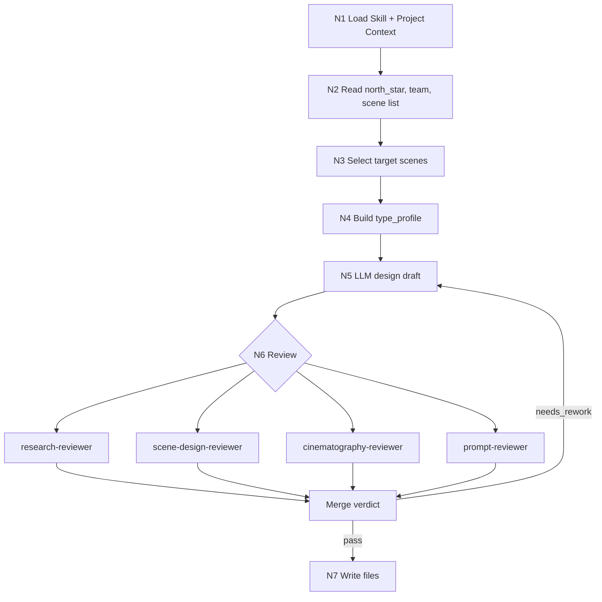

# Scene Design Workflow

## Business Requirement Analysis

| slot | answer |
| --- | --- |
| `business_goal` | 将上游场景清单扩展为单场景细目设计稿 |
| `business_object` | `场景清单.md` 的单个场景主体与项目级上下文 |
| `constraint_profile` | LLM-first、项目风格继承、字段完整、输出路径边界、prompt 长度 |
| `success_criteria` | 设计稿可回指上游，包含研究/物语/解构/prompt，且可进入图像生成 |
| `non_goals` | 不改清单、不生成图片、不改 registry、不写其他 worker 包 |
| `complexity_source` | 场景类型分型、团队监制上下文、研究可靠性和批量一致性 |
| `topology_fit` | 串行输入锁定 + 类型分流 + 可并行 reviewer + 汇流验收 |

## Node Network

| node_id | objective | inputs | actions | evidence | route_out | gate |
| --- | --- | --- | --- | --- | --- | --- |
| `N1-LOAD` | 加载技能与项目上下文 | `SKILL.md`、`CONTEXT.md`、项目 `MEMORY.md`、项目 `CONTEXT/` | 锁定强制规则、项目偏好、禁区 | loaded context list | `N2-SOURCES` | 必需上下文缺失已报告 |
| `N2-SOURCES` | 建立输入证据 | `north_star.yaml`、`team.yaml`、`场景清单.md` | 提取全局风格、团队监制、清单行 | `input_manifest` | `N3-SELECT` | 三个核心来源可回指 |
| `N3-SELECT` | 选择目标场景 | 用户指定或清单缺口 | 确定单个/批量场景与 `S###` 编号 | target scene list | `N4-TYPE` | 不新增清单外主体 |
| `N4-TYPE` | 形成类型画像 | 目标场景、清单关键词、项目资料 | 按 `types/` 判定空间类型、研究重点和风格入口 | `type_profile` | `N5-DESIGN` | 类型画像足以指导设计 |
| `N5-DESIGN` | LLM 直出设计正文 | 上游证据、north star、team、type profile | 写研究考据、物语、Scene Design、Cinematography、prompt | draft markdown | `N6-REVIEW` | 核心正文非脚本生成 |
| `N6-REVIEW` | 质量门禁与 reviewer 汇流 | draft markdown、review contract | 执行 subagents 或本地 checklist，修复阻断项 | review verdict | `N7-WRITE` 或 `N5-DESIGN` | verdict 非阻断 |
| `N7-WRITE` | 落盘与报告 | accepted draft | 写入 canonical 路径，可选执行报告 | output files | done | 路径和命名正确 |

## Branch And Merge

## Evidence Rules

- `input_manifest` 至少记录项目路径、清单路径、north star 路径、team 路径和目标场景行。
- `type_profile` 至少记录 `scene_type`、`research_focus`、`architecture_style_entry`、`cinematography_risk`。
- `review verdict` 至少记录字段完整性、prompt 字符数、LLM-first 边界和写入路径。
