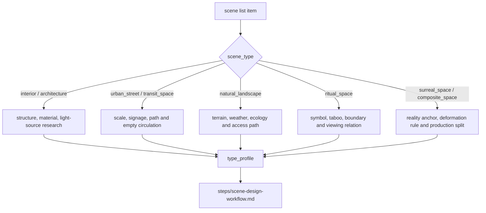

# Scene Design Type Map

本文件承载 `$aigc-scene-design` 的类型变量和分型策略。执行时先生成 `type_profile`，再进入 `steps/scene-design-workflow.md`。

## Type Variables

| variable | values |
| --- | --- |
| `scene_type` | `interior`、`architecture`、`urban_street`、`natural_landscape`、`transit_space`、`ritual_space`、`surreal_space`、`composite_space` |
| `reality_level` | `realist`、`stylized_realist`、`symbolic`、`surreal` |
| `asset_granularity` | `single_set`、`multi_zone`、`establishing_environment`、`detail_corner` |
| `research_need` | `low`、`medium`、`high` |
| `architecture_style_source` | `north_star`、`team_yaml`、`user_input`、`scene_inference`、`web_research_allowed` |

## Strategy Matrix

| scene_type | research_focus | scene design emphasis | cinematography emphasis | prompt risk |
| --- | --- | --- | --- | --- |
| `interior` | 平面布局、家具、生活痕迹、光源 | 材质、陈设密度、空间动线与缺席痕迹 | 景深、遮挡、窗光/人工光 | 容易变成泛室内图或误引入人物 |
| `architecture` | 建筑类型、年代、结构、材料 | 立面、比例、入口、空间边界 | 机位高度、透视线、体量感 | 建筑风格标签空泛 |
| `urban_street` | 街道尺度、招牌、交通、公共生活痕迹 | 街景层次、铺面、路面、杂物 | 纵深、灯光变化、雨雾/车灯/招牌动势 | 过度赛博、过度复古或误引入人群 |
| `natural_landscape` | 地形、植被、水体、气候 | 可达路径、自然纹理、尺度 | 广角/长焦、天气、地平线 | 缺少故事专属锚点 |
| `transit_space` | 过渡路径、方向、节点 | 门、桥、楼梯、走廊、站台 | 运动镜头、引导线、压迫感 | 只剩功能描述 |
| `ritual_space` | 符号、禁忌、仪式动线 | 对称、供物、材质、神圣边界 | 静态凝视、低速运动、光束 | 误用文化符号 |
| `surreal_space` | 现实锚点和变形逻辑 | 规则化异化、尺度破坏、材质反常 | 不稳定构图、非自然光 | 抽象到不可生成 |
| `composite_space` | 子空间边界和制作粒度 | 拆分区域、共用元素、转场点 | 空间关系、连续性镜头 | 多空间塞入一个 prompt |

## Type Profile Template

```yaml
type_profile:
  scene_type:
  reality_level:
  asset_granularity:
  research_need:
  architecture_style_source:
  architecture_style_entry:
  research_focus:
  scene_design_emphasis:
  cinematography_emphasis:
  prompt_risk:
```

## Type Route Map



## Network Search Permission

`research_need: high` 且本地资料不足时，允许网络搜索冷门建筑、地域、历史、材质、仪式或自然地理信息。搜索只为 LLM 判断提供证据；输出必须避免长篇引用，且标注来源策略或不确定性。
