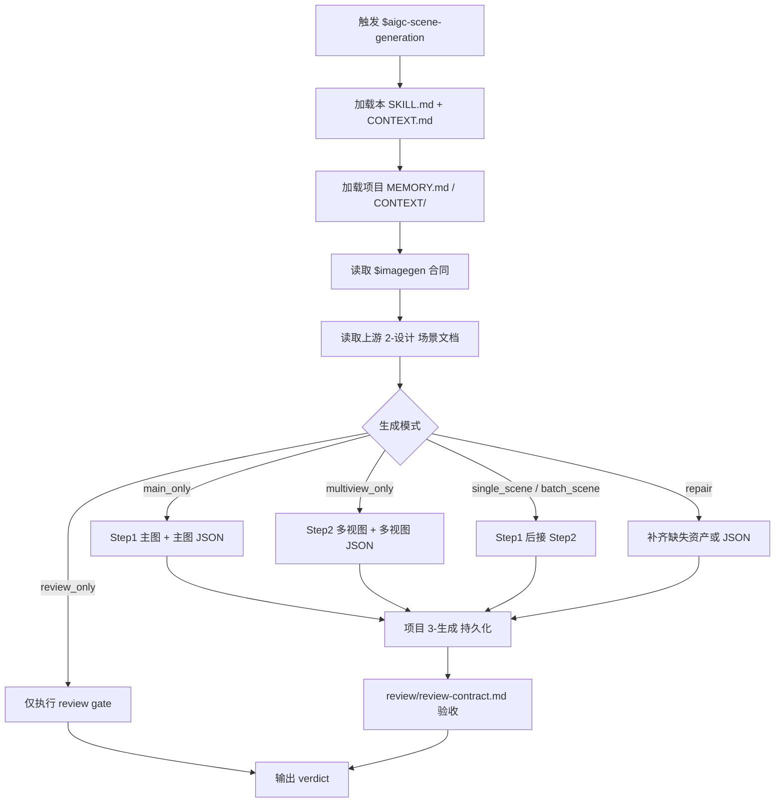
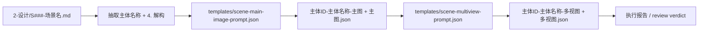
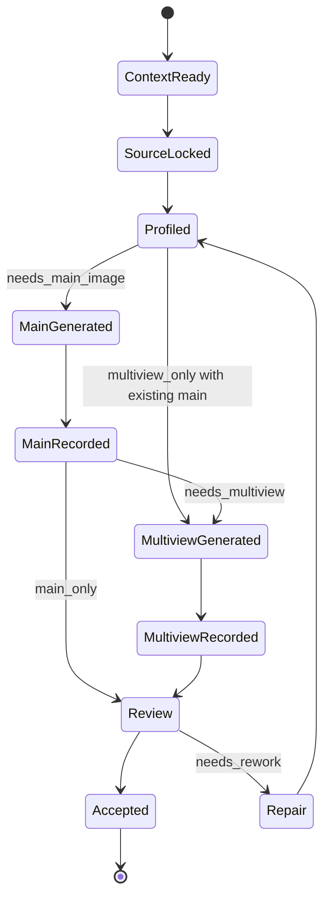

# aigc 5-设计 / 场景 / 3-生成

`$aigc-scene-generation` 消费上游 `$aigc-scene-design` 已完成的单场景设计文档，调用 `$imagegen` 生成场景主图与场景多视图主体设计图。本阶段只执行图像生成、提示词 JSON 落盘、路径归档与质量复核，不重新设计场景主体、不改写上游设计真源。

## Context Loading Contract

- 每次调用 `$aigc-scene-generation` 时，必须同时加载同目录 `CONTEXT.md`。
- 每次调用本技能时，必须同时识别并加载同目录 `types/` 中选中的类型包（单选或多选）。
- 若任务绑定 `projects/aigc/<项目名>/`，必须先加载项目根 `MEMORY.md`，再按需加载项目根 `CONTEXT/` 中与场景、美术、摄影、建筑、世界观相关的上下文。
- 必须读取目标场景的上游设计文档：`projects/aigc/<项目名>/5-设计/场景/2-设计/S###-<场景名>.md`。
- 必须读取 `$imagegen` 的 `.agents/skills/cli/imagegen/SKILL.md + CONTEXT.md`，并按其默认策略调用内建 `image_gen`；CLI/API fallback 只在用户显式要求或确认时使用。
- 冲突优先级：用户显式请求 > 根 `AGENTS.md` / meta 规则 > 本 `SKILL.md` > `references/` / `steps/` / `review/` / `types/` / `templates/` > `agents/openai.yaml` > 项目 `MEMORY.md` > 项目 `CONTEXT/` > 本 `CONTEXT.md`。
- 本 skill 默认启用真实 subagents 模式；若当前工具层无法真实 dispatch，必须报告阻断层级、原计划 reviewer 路径、实际降级路径与未启动的角色。

## Positioning

本阶段拥有 `projects/aigc/<项目名>/5-设计/场景/3-生成` 下场景生成资产与提示词 JSON 的交付权。它不拥有上游 `2-设计` 设计文档的业务真源权，不新增或重命名场景主体，不改 registry、父级技能、角色/道具生成技能或其他 worker 的输出。

## Input Contract

Accepted input:

- 项目名、项目路径或目标 `projects/aigc/<项目名>/`。
- 单个场景名、多个场景名、设计文档路径，或“处理全部场景生成”的请求。
- 已存在的上游 `projects/aigc/<项目名>/5-设计/场景/2-设计/S###-<场景名>.md`。
- 用户补充的生成轮次、重试策略、输出格式或明确的 CLI/API/model 控制要求。

Required input:

- 可读取的项目根 `MEMORY.md` 和相关 `CONTEXT/`；若缺失必须报告并使用临时护栏。
- 可读取的上游单场景设计文档，且包含 `4. 解构`。
- 每个目标场景必须有一个 canonical 主体名称和一个可追溯的主体 ID；主体 ID 优先读取上游设计文档 `## 4. 解构` 下方的 `主体ID号：<主体ID>`，缺失时从 `S###-<场景名>.md` 文件名前缀派生。
- 可用的 `$imagegen` 执行路径；默认使用内建 `image_gen`，生成后需把项目交付资产持久化到 workspace。执行 Step2 多视图前，作为 reference image 的场景主图必须先通过 `view_image` 检视进入对话上下文。

Optional input:

- 已存在的主图，用于只执行 Step2 多视图生成。
- 用户批准的重生成、覆盖或版本化命名策略。
- 用户显式指定的分辨率、宽高比、图片格式或模型参数。

Reject or clarify when:

- 上游设计文档不存在、缺少 `4. 解构`，或解构内容无法定位。
- 用户要求本阶段重新设计场景、改写 `2-设计` 文档、补写研究考据或重蒸馏主体设计。
- 用户要求静默覆盖已有项目资产但没有明确替换意图。
- 用户要求修改 registry、父目录、其他技能或角色/道具 worker 范围。

## Mode Selection

| mode | 触发信号 | 输出 |
| --- | --- | --- |
| `single_scene` | 指定一个场景设计文档或场景名 | 单场景主图、主图提示词 JSON、多视图图、多视图提示词 JSON |
| `batch_scene` | 指定多个场景或要求处理全部 | 多组场景生成资产与可选执行报告 |
| `main_only` | 只要求 Step1 或缺少可用主图 | `主体ID-主体名称-主图` 与对应 JSON |
| `multiview_only` | 已有主图且只要求 Step2 | `主体ID-主体名称-多视图` 与对应 JSON |
| `incremental_fill` | `design-manifest.yaml` 或 `2-设计` 显示存在 `generation_gaps` | 只补缺主图、多视图或 JSON，不覆盖既有资产 |
| `repair` | 已有生成资产不完整、提示词 JSON 缺失、路径不合规 | 最小补齐或版本化重生 |
| `review_only` | 只要求审查生成资产 | 审查结论，不改写文件，除非用户随后要求修复 |

## Reference Loading Guide

| 场景 | 必读文件 |
| --- | --- |
| 任意场景生成任务 | `references/scene-generation-contract.md`、`steps/scene-generation-workflow.md` |
| 设计稿增量后的生成缺口补齐 | `../../references/incremental-reconciliation-contract.md` |
| 输入类型、批量/单体/修复策略 | `types/scene-generation-type-map.md` |
| 输出质量审查、subagents/reviewer 降级口径 | `review/review-contract.md` |
| 主图/多视图提示词模板和输出报告模板 | `templates/scene-main-image-prompt.json`、`templates/scene-multiview-prompt.json`、`templates/output-template.md` |
| 脚本辅助边界 | `scripts/README.md` |
| 可复用经验 | `knowledge-base/scene-generation-heuristics.md` |
| 产品入口元数据 | `agents/openai.yaml` |

## Visual Maps

## Execution Contract

1. 读取本 `SKILL.md + CONTEXT.md`，并在项目任务中加载项目 `MEMORY.md` 与相关项目 `CONTEXT/`。
2. 读取 `$imagegen` 的 `SKILL.md + CONTEXT.md`，锁定内建 `image_gen` 默认路线、2K 目标与项目持久化要求。
3. 读取目标上游场景设计文档和可选 `projects/aigc/<项目名>/5-设计/场景/design-manifest.yaml`，只抽取主体名称、来源文件、`4. 解构` 与必要的设计约束，不重新设计主体；不得再把 `提示词设计` 的英文整合 prompt 作为导入给 gpt-image-2 的源文本。
4. 按 `types/scene-generation-type-map.md` 形成 `generation_profile`，决定 `main_only`、`multiview_only`、`single_scene`、`batch_scene`、`incremental_fill` 或 `repair`；已有主图、多视图和 JSON 默认跳过，覆盖必须有明确授权。
5. Step1：按 `templates/scene-main-image-prompt.json` 直接引用每份设计文档的 `4. 解构` 生成单主体场景主图，保存为 `主体ID-主体名称-主图`，并落同名 JSON 提示词记录。
6. Step2：套用 `templates/scene-multiview-prompt.json`，以对应 `主体ID-主体名称-主图` 作为参照图；调用 built-in `image_gen` 前必须先对该主图执行 `view_image`，标注为 `scene main image / multiview reference`，使其进入对话上下文后再生成 `主体ID-主体名称-多视图`，并落同名 JSON 提示词记录。
7. 所有项目交付资产写入 `projects/aigc/<项目名>/5-设计/场景/3-生成`；不得只停留在 `$CODEX_HOME/generated_images`；可更新 `design-manifest.yaml` 的 `generation_assets` 与 `generation_gaps`。
8. 按 `review/review-contract.md` 执行交付验收；subagents 被工具层阻断时，使用本地 review checklist 并显式报告降级。

## Root-Cause Execution Contract

出现以下问题时，必须沿链路上溯并修复源层合同：

- 从生成阶段重新设计、扩写或替换上游场景主体。
- 未读取上游 `2-设计` 文档就生成图片。
- 只生成图片但不落 JSON 提示词记录。
- 新设计稿追加后没有识别生成缺口，或覆盖了已有主图、多视图或 JSON。
- 多视图没有使用对应主图作为参照图。
- 多视图使用本地主图作为参照但未先 `view_image` 进入对话上下文。
- 项目资产仍只在 `$CODEX_HOME/generated_images`，未持久化到项目路径。
- 覆盖已有资产、改 registry、改父级目录或改其他 worker 范围。

必经链路：

`Symptom -> Direct Generation/Prompt Overreach -> 场景生成 Section Owner -> Scene Generation Contract -> AGENTS.md LLM-first / Skill 2.0 Rule`

## Field Mapping

| field_id | 输出/证据 | 内容要求 | 失败码 |
| --- | --- | --- | --- |
| `FIELD-SCENE-GEN-01` | 输入取证 | 可回指项目根与上游 `2-设计` 文件 | `FAIL-SCENE-GEN-01` |
| `FIELD-SCENE-GEN-02` | 主体边界 | 主体来自上游设计文档，不新增、不重设计 | `FAIL-SCENE-GEN-02` |
| `FIELD-SCENE-GEN-03` | 主图生成 | 每个目标场景生成 `主体ID-主体名称-主图` | `FAIL-SCENE-GEN-03` |
| `FIELD-SCENE-GEN-04` | 多视图生成 | 以对应主图为参照生成 `主体ID-主体名称-多视图`，且主图已 `view_image` 进入对话上下文 | `FAIL-SCENE-GEN-04` |
| `FIELD-SCENE-GEN-05` | JSON 记录 | 主图和多视图均有同名提示词 JSON | `FAIL-SCENE-GEN-05` |
| `FIELD-SCENE-GEN-06` | imagegen 合同 | 默认使用内建 `image_gen`，CLI/API fallback 有显式许可 | `FAIL-SCENE-GEN-06` |
| `FIELD-SCENE-GEN-07` | 项目持久化 | 资产落在项目 `3-生成` 目录 | `FAIL-SCENE-GEN-07` |
| `FIELD-SCENE-GEN-08` | 写入边界 | 不改上游设计、registry、父目录或其他 worker 范围 | `FAIL-SCENE-GEN-08` |

## Output Contract

### Required output

1. 每个目标场景输出一张单主体主图：`主体ID-主体名称-主图`。
2. 每个目标场景输出一张多视图主体设计图：`主体ID-主体名称-多视图`。
3. 每张图片必须有同名 JSON 提示词记录。
4. 多视图生成必须以同一主体的主图作为参照图；真实生成模式下，该本地主图已先通过 `view_image` 检视进入对话上下文，并记录 `reference_context_status: visible_in_conversation_context`。
5. 可选执行报告记录输入范围、已生成文件、imagegen 模式、降级情况和 review verdict。
6. 可选更新 `projects/aigc/<项目名>/5-设计/场景/design-manifest.yaml`，记录 `generation_assets` 和剩余 `generation_gaps`；manifest 不替代生成资产真源。

### Output format

| output_id | format |
| --- | --- |
| `OUTPUT-SCENE-MAIN-IMAGE` | PNG/JPEG/WebP bitmap image，默认 2K 目标，除非用户指定 |
| `OUTPUT-SCENE-MAIN-PROMPT` | JSON prompt record |
| `OUTPUT-SCENE-MULTIVIEW-IMAGE` | PNG/JPEG/WebP bitmap image，默认 16:9 九宫格多视图 |
| `OUTPUT-SCENE-MULTIVIEW-PROMPT` | JSON prompt record |
| `OUTPUT-SCENE-GENERATION-REPORT` | Markdown 执行报告，可选 |

### Output path

| output_id | canonical path |
| --- | --- |
| `OUTPUT-SCENE-MAIN-IMAGE` | `projects/aigc/<项目名>/5-设计/场景/3-生成/<主体ID>-<主体名称>-主图.<ext>` |
| `OUTPUT-SCENE-MAIN-PROMPT` | `projects/aigc/<项目名>/5-设计/场景/3-生成/<主体ID>-<主体名称>-主图.json` |
| `OUTPUT-SCENE-MULTIVIEW-IMAGE` | `projects/aigc/<项目名>/5-设计/场景/3-生成/<主体ID>-<主体名称>-多视图.<ext>` |
| `OUTPUT-SCENE-MULTIVIEW-PROMPT` | `projects/aigc/<项目名>/5-设计/场景/3-生成/<主体ID>-<主体名称>-多视图.json` |
| `OUTPUT-SCENE-GENERATION-REPORT` | `projects/aigc/<项目名>/5-设计/场景/3-生成/执行报告.md` |
| `OUTPUT-SCENE-MANIFEST` | `projects/aigc/<项目名>/5-设计/场景/design-manifest.yaml` |

### Naming convention

- `<主体ID>` 优先使用上游设计文档 `## 4. 解构` 下方的 `主体ID号：<主体ID>`；若缺失，使用设计文件名前缀 `S###`，并在 JSON 中记录派生来源。
- `<主体名称>` 使用上游设计文档中的 canonical 场景名称，文件名中 `/\:*?"<>|` 与换行替换为 `-`。
- 主图固定命名为 `<主体ID>-<主体名称>-主图`。
- 多视图固定命名为 `<主体ID>-<主体名称>-多视图`。
- 如同名资产已存在且未获覆盖许可，使用 `-v2`、`-v3` 等版本后缀，并在 JSON 中记录 `supersedes` 或 `variant_of`。
- 增量补缺默认跳过已有完整资产，只生成缺失的主图、多视图或 JSON。

### Completion gate

- 已读取本 `SKILL.md + CONTEXT.md`、项目记忆/上下文、上游设计文档与 `$imagegen` 合同。
- 每个目标场景都能回指一个上游 `2-设计` 文档。
- 每个主图 JSON 记录包含 `subject_id`、来源设计文档、抽取的上游 `4. 解构`、imagegen 模式、输出路径和 review 状态。
- 每个多视图 JSON 记录包含 `subject_id`、来源设计文档、主图参照路径、`reference_context_status`、多视图模板版本、最终 prompt、输出路径和 review 状态。
- 项目交付图片已持久化到 `projects/aigc/<项目名>/5-设计/场景/3-生成`。
- 已识别并跳过既有完整资产；仅补齐缺主图、缺多视图、缺 JSON 或用户明确指定 repair 的主体。
- 未重新设计主体，未改写上游设计，未修改边界外文件。
- 已执行 `review/review-contract.md` 的验收，或写明等价人工 review 结果与 subagent 降级原因。
