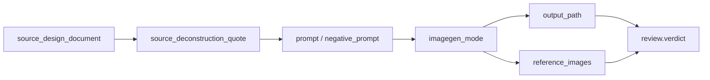

# Scene Generation Contract

## Scope

This reference owns the detailed business contract for `$aigc-scene-generation`.

The skill consumes completed upstream scene design markdown files and produces project-bound bitmap assets plus JSON prompt records. It does not own scene research, scene design, cinematography design, prompt distillation, registry updates, or parent skill governance.

## Source Inputs

Required source document:

```text
projects/aigc/<项目名>/5-设计/场景/2-设计/S###-<场景名>.md
```

Required fields or recoverable sections:

- Scene name from the document title or `名称`.
- Subject ID from `## 4. 解构` line `主体ID号：<主体ID>`; if absent, recover it from the source filename prefix such as `S###`.
- Source design document path.
- `## 4. 解构`.
- Global style and architecture style references when present.

If the source document lacks a usable `4. 解构` section, stop and report `FAIL-SCENE-GEN-01`; do not invent a new scene prompt in this stage or fall back to the old English integrated prompt.

## Step1 Main Image Contract

Step1 creates one primary scene image per source design document.

Prompt source:

- Load `templates/scene-main-image-prompt.json`.
- Use the upstream `4. 解构` content as the main prompt body.
- Preserve upstream scene identity, era, architecture, material, lighting, and no-human constraints.
- Add only operational delivery details required by `$imagegen`, such as default 2K target and project persistence.

Output:

```text
projects/aigc/<项目名>/5-设计/场景/3-生成/<主体ID>-<主体名称>-主图.<ext>
projects/aigc/<项目名>/5-设计/场景/3-生成/<主体ID>-<主体名称>-主图.json
```

## Step2 Multi-View Contract

Step2 creates one multi-view scene design sheet per source design document.

Prompt source:

- Load `templates/scene-multiview-prompt.json`.
- Set `reference_main_image` to the generated or user-provided `主体ID-主体名称-主图`.
- Set `source_deconstruction` to the upstream design document's `4. 解构` content.
- `critical_requirements` may directly cite the upstream design document's `4. 解构` as the primary scene truth; do not use the former `提示词设计` English integrated prompt as the gpt-image-2 source.

The multi-view sheet must read as views of one coherent scene, not nine unrelated spaces.

Output:

```text
projects/aigc/<项目名>/5-设计/场景/3-生成/<主体ID>-<主体名称>-多视图.<ext>
projects/aigc/<项目名>/5-设计/场景/3-生成/<主体ID>-<主体名称>-多视图.json
```

## JSON Prompt Record Contract

Each prompt JSON should include:

- `schema`
- `skill_id`
- `stage`
- `source_design_document`
- `subject_id`
- `subject_id_source`
- `subject_name`
- `image_role`
- `imagegen_mode`
- `prompt`
- `negative_prompt`
- `reference_images`
- `output_path`
- `review`
- `created_at`

For versioned outputs, include `variant_of` or `supersedes`.

## Evidence Chain



The evidence chain is blocking for completion: every generated bitmap must be recoverable from a same-name JSON record that names the upstream source, prompt lineage, imagegen mode, output path and review state.

## Boundary Rules

- Do not modify upstream design documents.
- Do not generate design text by script or template.
- Do not alter registry, route files, parent directories, sibling role/prop skills, or other workers' files.
- Do not silently overwrite existing generated assets.
- Do not use CLI/API fallback unless the user explicitly opted in or confirmed it after being asked.
