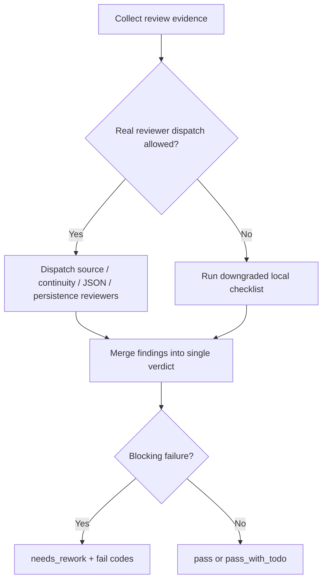

# Review Contract

## Default Review Path

This skill may use reviewer/subagent paths for:

- Source contract review.
- Image continuity review.
- Prompt JSON completeness review.
- Project persistence review.

If real subagent dispatch is unavailable due to system, developer, or tool limits, use the local checklist below and report the downgrade.



## Reviewer Matrix

| reviewer_role | focus | blocking failures | fallback owner |
| --- | --- | --- | --- |
| `source-contract-reviewer` | Upstream design doc traceability and no-redesign boundary | missing source doc, invented prompt, upstream rewrite | local `REV-SCENE-GEN-01/02` |
| `continuity-reviewer` | Main image to multi-view identity continuity | missing main reference, nine unrelated spaces, people/silhouette drift | local `REV-SCENE-GEN-04/07` |
| `json-record-reviewer` | Same-name JSON completeness and reproducibility fields | missing JSON, missing source/prompt/mode/path/review | local `REV-SCENE-GEN-05` |
| `persistence-reviewer` | Workspace project-bound final paths | asset remains only in `$CODEX_HOME`, output path mismatch | local `REV-SCENE-GEN-03/08` |

## Local Checklist

| check_id | gate | pass criteria | fail code |
| --- | --- | --- | --- |
| `REV-SCENE-GEN-01` | Source | Each output traces to one upstream `2-设计` document | `FAIL-SCENE-GEN-01` |
| `REV-SCENE-GEN-02` | Boundary | No scene redesign, no upstream rewrite, no out-of-bound files | `FAIL-SCENE-GEN-02` |
| `REV-SCENE-GEN-03` | Main image | `主体ID-主体名称-主图` exists under project `3-生成` | `FAIL-SCENE-GEN-03` |
| `REV-SCENE-GEN-04` | Multi-view image | `主体ID-主体名称-多视图` exists and used main image as reference | `FAIL-SCENE-GEN-04` |
| `REV-SCENE-GEN-05` | JSON records | Each image has same-name JSON with `subject_id`, source, prompt, mode, path, review | `FAIL-SCENE-GEN-05` |
| `REV-SCENE-GEN-06` | Imagegen route | Built-in imagegen used by default; CLI/API has explicit opt-in | `FAIL-SCENE-GEN-06` |
| `REV-SCENE-GEN-07` | Visual continuity | Multi-view sheet presents one coherent scene identity | `FAIL-SCENE-GEN-07` |
| `REV-SCENE-GEN-08` | Persistence | No project-bound final remains only in `$CODEX_HOME` | `FAIL-SCENE-GEN-08` |

## Verdict Schema

```yaml
verdict: pass | pass_with_todo | needs_rework
reviewer: scene-generation-review
subagent_status: real_dispatch | downgraded_local_checklist
source_documents: []
outputs: []
findings: []
subject_id_required: true
notes: ""
```

## Downgrade Report Fields

When reviewer/subagent dispatch is blocked by a higher-priority policy or tool limit, record:

```yaml
downgrade:
  blocked_by: system | developer | tool | user
  planned_path: "source-contract-reviewer + continuity-reviewer + json-record-reviewer + persistence-reviewer"
  actual_path: "local checklist in review/review-contract.md"
  reviewers_not_started: []
```

`pass_with_todo` is allowed only for non-blocking visual polish issues. Missing source, missing JSON, missing project persistence, or out-of-bound writes require `needs_rework`.
