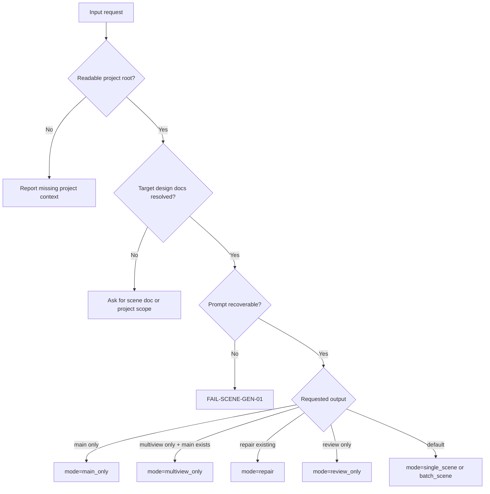

# Scene Generation Type Map

## Type Profile Fields

```yaml
generation_profile:
  project_root: ""
  source_design_documents: []
  target_subjects: []
  mode: single_scene | batch_scene | main_only | multiview_only | repair | review_only
  imagegen_route: built_in_generate | built_in_edit | cli_fallback
  output_conflict_policy: version | overwrite_with_permission | skip
  needs_main_image: true
  needs_multiview: true
  existing_main_image: ""
  reference_images: []
```

## Mode Matrix

| type_id | trigger | required source | route | output |
| --- | --- | --- | --- | --- |
| `TYPE-SCENE-GEN-01` | Single scene design doc | One upstream design document | Step1 then Step2 | Main image/JSON and multi-view image/JSON |
| `TYPE-SCENE-GEN-02` | Multiple scene design docs | List of upstream design documents | Repeat Step1/Step2 per doc | Batch asset set |
| `TYPE-SCENE-GEN-03` | Main image only | Upstream design document | Step1 only | Main image/JSON |
| `TYPE-SCENE-GEN-04` | Multi-view only | Upstream design document and existing main image | Step2 only | Multi-view image/JSON |
| `TYPE-SCENE-GEN-05` | Repair missing JSON or misplaced image | Existing asset plus source doc | Mechanical repair, optional regeneration | Completed pair or versioned replacement |
| `TYPE-SCENE-GEN-06` | Review only | Existing outputs | Review contract only | Verdict/report |

## Routing Matrix

| profile signal | steps impact | references impact | review impact |
| --- | --- | --- | --- |
| `needs_main_image=true` | Must execute `N4-MAIN` and `N5-MAIN-JSON` | Enforce Step1 Main Image Contract | Check main image path and same-name JSON |
| `needs_multiview=true` | Must execute `N6-MULTIVIEW` and `N7-MULTIVIEW-JSON` | Enforce Step2 Multi-View Contract | Check reference main image continuity |
| `existing_main_image` present | May skip Step1 only if path is readable and role is clear | Treat as user-provided continuity anchor | Verify source pairing in JSON |
| `output_conflict_policy=version` | Add `-v2`, `-v3` or stable equivalent | Apply naming convention without overwriting | Check `variant_of` or `supersedes` |
| `imagegen_route=cli_fallback` | Pause unless user explicitly opted in | Read `$imagegen` fallback boundary | Record permission and mode in verdict |
| `mode=review_only` | No write nodes may run | Boundary rules remain active | Verdict is the only output |

## Decision Gates



## Filename Sanitization

Replace these characters in `<主体名称>` with `-`:

```text
/\:*?"<>|
```

Also replace newlines and trim leading/trailing whitespace. Do not change the display name inside JSON unless the upstream canonical name itself changed.
