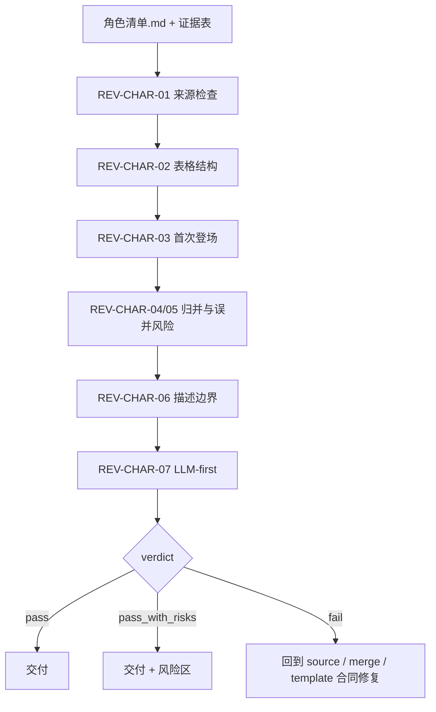

# Review Contract

## Default Provider

- 默认辅助 provider：`code-reviewer` 或等价人工 review。
- 用途：检查角色清单的来源、三列表格、首次登场、归并质量、描述边界和 LLM-first 边界。
- 若上层策略或当前环境不允许真实启动 reviewer/subagent，则降级为本地 review checklist，并在交付说明中记录阻断层级、原计划 provider、实际降级路径和未启动的 reviewer。

## Review Scope

审查对象是 `projects/aigc/<项目名>/4-设计/角色/1-清单/角色清单.md` 与可选 `执行报告.md`。审查不改写上游 `4-分组` 文件。

## Review Flow



## Required Checks

| check_id | check | pass_condition | severity |
| --- | --- | --- | --- |
| `REV-CHAR-01` | 上游来源 | 每个条目来自 `4-分组` 组底 YAML `角色` 字段 | blocker |
| `REV-CHAR-02` | 表格结构 | 表头精确为 `名称`、`首次登场`、`原文描述（关键词式）` | blocker |
| `REV-CHAR-03` | 首次登场 | 每行首次登场是可回指分镜组 ID，必要时带集文件名 | major |
| `REV-CHAR-04` | 归并质量 | 别名、代称和同一角色不同称呼已归并，低置信度项有风险记录 | major |
| `REV-CHAR-05` | 误并风险 | 不同角色没有因同职业、同泛称或同群体身份被硬合并 | major |
| `REV-CHAR-06` | 描述边界 | `原文描述（关键词式）` 不含外貌设计、性格扩写或剧情推断 | major |
| `REV-CHAR-07` | LLM-first | 没有脚本生成归并判断或 canonical 清单正文 | blocker |

## Verdict

| verdict | meaning |
| --- | --- |
| `pass` | 无 blocker，major 风险已解决或可接受 |
| `pass_with_risks` | 无 blocker，但仍有待人工确认的别名或上游 YAML 缺口 |
| `fail` | 存在 blocker，必须回到对应 source/merge/template 合同修复 |

## Finding Shape

```yaml
finding:
  check_id: REV-CHAR-00
  severity: blocker | major | minor
  symptom: ""
  evidence: ""
  rework_target: references/source-and-merge-contract.md | steps/character-list-workflow.md | types/character-identity-type-map.md | templates/output-template.md
```

## Provider Note

可使用机械脚本辅助检查表头、路径、重复名称和分镜组 ID 形态；归并质量必须由 LLM 或人工 review 裁决。
