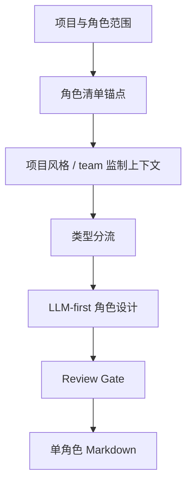

# aigc 5-设计/角色/2-设计

角色细目设计 Skill 2.0 包，用于从 `projects/aigc/<项目名>/4-设计/角色/1-清单/角色清单.md` 读取角色清单，并结合 `0-初始化/north_star.yaml` 与 `team.yaml` 输出单角色设计稿。

## Directory Tree

```text
2-设计/
├── references/
│   └── character-design-contract.md
├── scripts/
│   └── README.md
├── templates/
│   └── output-template.md
├── review/
│   └── review-contract.md
├── steps/
│   └── character-design-workflow.md
├── knowledge-base/
│   └── character-design-heuristics.md
├── types/
│   └── character-design-type-map.md
├── agents/
│   └── openai.yaml
├── CHANGELOG.md
├── SKILL.md
├── CONTEXT.md
└── README.md
```

## Quick Entry

- 调用名：`$aigc-design-character-detail`
- 上游真源：`projects/aigc/<项目名>/4-设计/角色/1-清单/角色清单.md`
- 项目上下文：`projects/aigc/<项目名>/0-初始化/north_star.yaml`、`projects/aigc/<项目名>/team.yaml`
- Canonical 输出：`projects/aigc/<项目名>/4-设计/角色/2-设计/<角色名>.md`

## Workflow Snapshot



## Guardrails

- 研究考据、物语、解构、服装、摄影和英文提示词由 LLM 直接创作。
- 脚本只能读取、校验、统计和汇总，不能生成角色设计正文。
- 默认启用真实 subagents；若 runtime 阻断，必须报告降级层级和未启动的角色/reviewer。
- 本技能不修改 registry、父级目录、上游清单、场景/道具技能或最终生成阶段。
- 固定为纯色背景全身定妆照，不置身剧情场景、建筑空间、街景、室内陈设或复杂环境。
- 英文 prompt 必须包含 `full-body costume fitting photo, solid color background, no scene environment` 等等价约束。
