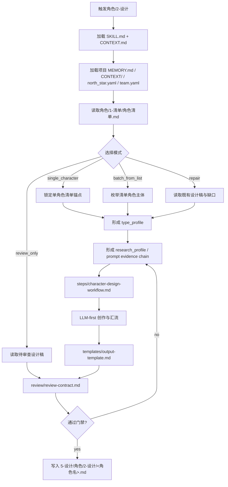
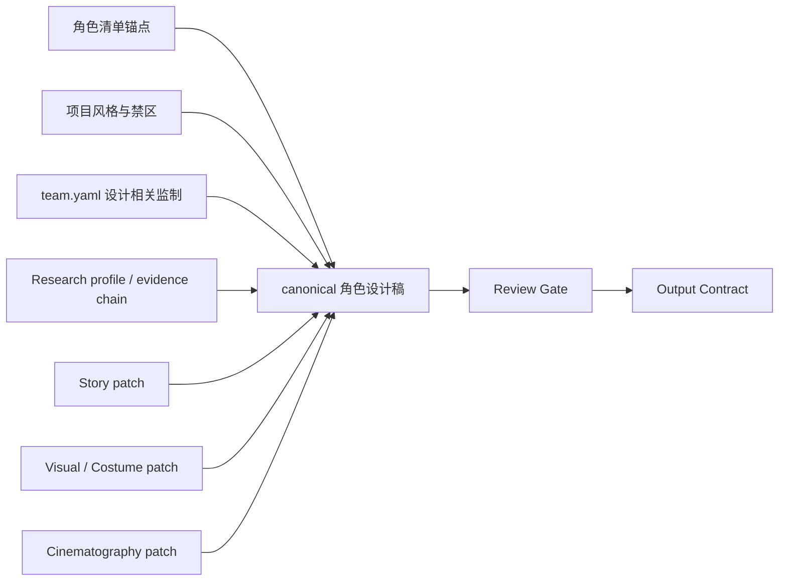
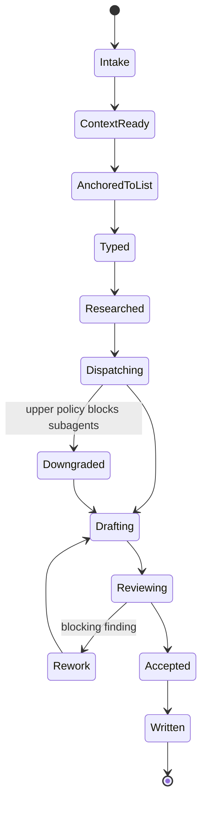

# aigc 5-设计/角色/2-设计

`角色/2-设计` 消费上游 `角色/1-清单` 的汇总式清单输出，把每个角色主体扩展为可进入后续图像生成、服装设计和镜头设计的细目设计稿。它只负责角色主体设计，不生成最终图片、不替代 `3-生成`，也不改写上游清单真源。

## Context Loading Contract

- 每次调用 `$aigc-design-character-detail` 时，必须同时加载同目录 `CONTEXT.md`。
- 若任务绑定 `projects/aigc/<项目名>/`，必须先加载项目根 `MEMORY.md`，再按需加载项目根 `CONTEXT/` 中与角色、风格、服装、禁区和既有设定相关的上下文文件。
- 项目运行时必须读取 `projects/aigc/<项目名>/0-初始化/north_star.yaml`，用于抽取全局风格、主题方向、影像基调和项目禁区。
- 项目运行时必须读取 `projects/aigc/<项目名>/team.yaml`，只消费与角色、服装、美术、摄影、导演或设计监制相关的大师上下文；不得把无关成员意见硬塞进角色设计稿。
- 上游角色入口固定为 `projects/aigc/<项目名>/5-设计/角色/1-清单/角色清单.md`；清单字段至少包含 `名称`、`首次登场`、`原文描述（关键词式）`。
- 固定画面约束：角色设计默认是纯色背景全身定妆照，不得置身于剧情场景、建筑空间、街景、室内陈设或复杂环境中；英文提示词必须显式包含 `full-body costume fitting photo, solid color background, no scene environment` 等等价约束。
- 冲突优先级：用户显式请求 > 根 `AGENTS.md` / meta 规则 > 本 `SKILL.md` > `references/` / `steps/` / `types/` / `review/` / `templates/` > `agents/openai.yaml` > 项目 `MEMORY.md` > 项目 `CONTEXT/` > 本 `CONTEXT.md`。
- 研究考据、物语、视觉解构、服装细节、摄影描述和英文提示词必须由 LLM 直接创作；`scripts/` 只能做读取、分发、字段校验、路径创建、长度检查和 manifest 汇总等机械辅助。
- 研究层必须转化为可执行设计证据链：身份、职业、阶层、地域年代、服饰工艺、身体姿态、禁区、不确定性和 prompt evidence chain 均需落到后续角色外观、服装、姿态、摄影或英文提示词，不允许停留在资料摘抄。

## Subagent Dispatch Contract

- 本技能默认启用真实 subagents 模式；用户点名本技能或父级路由命中本技能时，视为已许可按仓库合同启动 subagents。
- 推荐运行时路径：主 agent 路由并汇流，按单个角色主体启动 `Worker-Character` 子任务；如 runtime 支持更细分 dispatch，可在每个角色内并行启动 `Research`、`Story`、`Visual/Costume`、`Cinematography` reviewer 或 worker，并由主 agent 汇总为唯一设计稿。
- subagents 只能返回局部 patch、risk note 或 reviewer finding；最终 canonical markdown 由主 agent 按模板聚合落盘。
- 若当前 system / developer / tool / user 层阻断真实 subagent dispatch，必须显式报告阻断层级、原计划 subagent 路径、实际降级路径和未真实启动的角色/ reviewer。

## Input Contract

Accepted input:

- 项目名、项目路径、单个角色名、角色范围，或“角色 2-设计 / 角色细目设计 / 从角色清单生成角色设计稿”等任务。
- 已存在的 `projects/aigc/<项目名>/5-设计/角色/1-清单/角色清单.md`。
- 项目初始化文件 `0-初始化/north_star.yaml` 与 `team.yaml`。

Required input:

- 可定位、可读取的项目根 `projects/aigc/<项目名>/`。
- 可读取的上游 `角色清单.md`，且每个待设计角色至少有 `名称`、`首次登场`、`原文描述（关键词式）`。
- 可读取的 `north_star.yaml` 和 `team.yaml`；若缺失，必须在输出中标记上下文缺口，不得伪造全局风格或大师监制。

Optional input:

- 用户指定的角色优先级、单角色目标、时代/地域考据要求、服装材质偏好、摄影风格偏好或禁区。
- 项目 `CONTEXT/` 中已有视觉设定、服装设定、世界观材料、角色关系说明或风格提示词。
- 网络搜索许可；仅用于冷门历史、地域、职业、器物、服饰或文化考据，且必须记录来源摘要和使用边界。

Reject or clarify when:

- 用户要求跳过 `角色/1-清单`，直接凭剧情印象批量生成角色设计稿。
- 用户要求脚本自动生成研究、设计、物语或提示词正文。
- 用户要求把场景、道具、最终图片或视频生成结果写入本路径。
- 同一角色主体在清单中无法区分，且没有足够上下文裁决，应先返回上游清单修复建议。

## Mode Selection

| mode | 触发信号 | 输出 |
| --- | --- | --- |
| `single_character` | 指定单个角色名或清单行 | 单个角色细目设计 markdown |
| `batch_from_list` | 给定项目且未限制角色 | 每个清单角色一个 markdown，可附批量执行报告 |
| `repair` | 已有设计稿缺字段、提示词超长、与清单或项目风格冲突 | 最小修复后的角色设计稿 |
| `review_only` | 用户只要求检查角色设计稿 | 审查报告，不改写 canonical 设计稿，除非用户随后要求修复 |

## Reference Loading Guide

| 场景 | 必读文件 |
| --- | --- |
| 任意角色细目设计任务 | `references/character-design-contract.md`、`steps/character-design-workflow.md` |
| 角色类型、主体粒度和设计深度分流 | `types/character-design-type-map.md` |
| 输出验收、subagent/reviewer 汇流和风险分级 | `review/review-contract.md` |
| 输出样板 | `templates/output-template.md` |
| 脚本辅助边界与机械校验 | `scripts/README.md` |
| 可复用经验 | `knowledge-base/character-design-heuristics.md` |
| 产品入口元数据 | `agents/openai.yaml` |

## Visual Maps

## Execution Contract

1. 读取本 `SKILL.md + CONTEXT.md`，并在项目任务中加载项目 `MEMORY.md`、相关项目 `CONTEXT/`、`north_star.yaml` 和 `team.yaml`。
2. 读取上游 `角色清单.md`，锁定待设计角色主体、首次登场和原文描述关键词；不得新增清单外角色作为 canonical 输出。
3. 按 `types/character-design-type-map.md` 判定角色主体类型，形成 `type_profile`。
4. 形成 `research_profile`：将清单、项目上下文与必要考据转化为身份、职业、阶层、地域年代、服饰工艺、身体姿态、禁区、不确定性和 prompt evidence chain。
5. 按 subagent 合同分发角色任务；若真实 dispatch 被阻断，按降级口径执行并记录。
6. 由 LLM 完成研究考据、物语、视觉解构、服装解构、摄影描述和英文提示词；冷门信息可按允许条件搜索并保留来源摘要。
7. 摄影描述和英文提示词固定为纯色背景全身定妆照，不得把角色置入具体场景或复杂环境。
8. 使用 `templates/output-template.md` 为每个角色生成唯一 markdown，写入 `projects/aigc/<项目名>/5-设计/角色/2-设计/`。
9. 按 `review/review-contract.md` 检查字段完整、清单可回指、项目风格一致、研究证据链、LLM-first、英文提示词不超过 2000 字符。

## Field Mapping

| field_id | 输出/证据 | 内容要求 | 失败码 |
| --- | --- | --- | --- |
| `FIELD-CHAR-DESIGN-01` | 上游清单锚点 | 名称、首次登场、原文描述复述可回指 `角色/1-清单` | `FAIL-CHAR-DESIGN-01` |
| `FIELD-CHAR-DESIGN-02` | 项目风格锚点 | `north_star.yaml` 的全局风格、主题、禁区已消费并显式折入提示词 | `FAIL-CHAR-DESIGN-02` |
| `FIELD-CHAR-DESIGN-03` | 监制上下文 | `team.yaml` 中设计相关大师语境已选择性消费，不无关堆砌 | `FAIL-CHAR-DESIGN-03` |
| `FIELD-CHAR-DESIGN-04` | 解构字段 | `Identity & Story Pressure`、`Visual Drivers`、`Detailed Character Design`、`Detailed Costume Design`、`Cinematography` 全部存在 | `FAIL-CHAR-DESIGN-04` |
| `FIELD-CHAR-DESIGN-05` | 提示词 | 英文、含全局风格提示词与服装风格、不超过 2000 字符 | `FAIL-CHAR-DESIGN-05` |
| `FIELD-CHAR-DESIGN-06` | LLM-first | 脚本没有生成研究、物语、解构或提示词正文 | `FAIL-CHAR-DESIGN-06` |
| `FIELD-CHAR-DESIGN-07` | Subagents | 默认真实 dispatch；阻断时有完整降级报告 | `FAIL-CHAR-DESIGN-07` |
| `FIELD-CHAR-DESIGN-08` | 定妆照约束 | 默认为纯色背景全身定妆照，不置身剧情场景或复杂环境 | `FAIL-CHAR-DESIGN-08` |
| `FIELD-CHAR-DESIGN-09` | 研究证据链 | 身份、职业、阶层、地域年代、服饰工艺、身体姿态、禁区、不确定性和 prompt evidence chain 均有结论并回流到设计字段 | `FAIL-CHAR-DESIGN-09` |

## Root-Cause Execution Contract (Mandatory)

出现以下问题时，必须沿链路上溯并修复源层合同：

- 设计稿脱离 `角色/1-清单`，新增或替换 canonical 角色主体。
- 没有消费 `north_star.yaml` / `team.yaml`，却声称符合项目风格或大师监制。
- 研究考据、物语、设计解构或提示词由脚本拼接、模板灌字或启发式扩写生成。
- 角色设计变成图片生成执行、场景设计、道具设计或最终视频提示词。
- 英文提示词未引用全局风格与服装风格，或超过 2000 字符。
- 角色 prompt 或摄影字段把角色放进具体场景、建筑空间、街景、室内陈设或复杂背景，而不是纯色背景全身定妆照。
- 研究层只写资料、风格口号或世界观摘要，没有转化为身份/职业/阶层/地域年代/服饰工艺/身体姿态/禁区/不确定性和 prompt evidence chain。
- 默认 subagents 路径被静默跳过，且没有报告阻断层级和降级路径。

必经链路：

`Symptom -> Direct Script/Subagent/Prompt Overreach -> 角色/2-设计 Section Owner -> AGENTS.md LLM-first / Subagent / Skill 2.0 Rule`

## Output Contract

### Required output

1. 每个待设计角色输出一份细目设计 markdown。
2. 输出必须包含：`名称 / 首次登场 / 原文描述复述`、`研究考据`、`物语`、`解构`、`提示词设计`。
3. `研究考据` 必须包含字段：`Identity Evidence`、`Occupation / Class Evidence`、`Region & Era Evidence`、`Costume Craft Evidence`、`Body & Posture Evidence`、`Taboo / Safety Constraints`、`Uncertainty Notes`、`Prompt Evidence Chain`。
4. `解构` 必须包含字段：`Identity & Story Pressure`、`Visual Drivers`、`Detailed Character Design`、`Detailed Costume Design`、`Cinematography`。
5. `提示词设计` 必须为英文、引用全局风格提示词与服装风格，并控制在 2000 字符内。
6. 画面固定为纯色背景全身定妆照，不得置身具体场景、建筑空间、街景、室内陈设或复杂环境。

### Output format

| output_id | format |
| --- | --- |
| `OUTPUT-CHARACTER-DESIGN` | Markdown 单角色设计稿，使用 `templates/output-template.md` |
| `OUTPUT-CHARACTER-DESIGN-REPORT` | Markdown 执行或审查报告，可选 |

### Output path

| output_id | canonical path |
| --- | --- |
| `OUTPUT-CHARACTER-DESIGN` | `projects/aigc/<项目名>/5-设计/角色/2-设计/<角色名>.md` |
| `OUTPUT-CHARACTER-DESIGN-REPORT` | `projects/aigc/<项目名>/5-设计/角色/2-设计/执行报告.md` |

### Naming convention

- 角色设计稿默认命名为 `<角色名>.md`。
- 若角色名包含路径分隔符、控制字符或与现有角色冲突，使用安全名 `<角色名>__<首次登场ID>.md`。
- 首次登场沿用上游清单格式，例如 `第N集.md / 1-1-1`。
- 本技能不改写 `角色清单.md`；发现清单问题时只在报告中提出上游修复建议。

### Completion gate

- 已读取本 `SKILL.md + CONTEXT.md`，并在项目任务中加载项目 `MEMORY.md`、相关项目 `CONTEXT/`、`north_star.yaml` 和 `team.yaml`。
- 待设计角色均来自 `角色/1-清单/角色清单.md`。
- 每份设计稿字段齐全，且研究、物语、解构和提示词由 LLM 直接创作。
- 研究层已从资料转化为设计证据链，并明确不确定性与禁区。
- 英文提示词含全局风格提示词与服装风格，且长度不超过 2000 字符。
- Cinematography 与英文提示词固定为 `full-body costume fitting photo`、纯色背景、无场景环境。
- 已执行 `review/review-contract.md` 的人工审查或等价机械校验。
- subagents 默认路径已真实启动；若被上层阻断，已记录降级报告。
