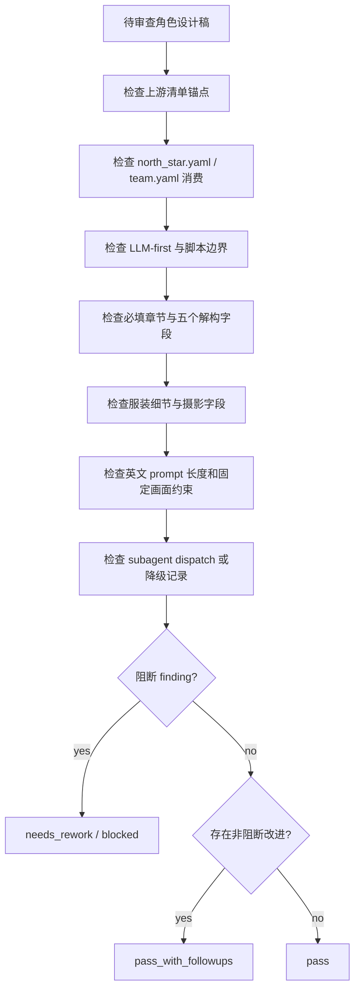

# Review Contract

本文件定义 `角色/2-设计` 的质量门禁、subagent 汇流审查和验收输出。

## Default Reviewer Path

- 默认启用真实 subagents / reviewers。
- 推荐 reviewer：`character-research-reviewer`、`visual-costume-reviewer`、`cinematography-reviewer`、`prompt-length-reviewer`。
- 若当前环境无真实 subagent 工具，主 agent 必须报告工具层阻断，并采用本地顺序 checklist 作为降级 review；不得把降级说成真实并行执行。

## Review Dimensions

| dimension | checks |
| --- | --- |
| upstream_anchor | 角色名称、首次登场、原文描述复述是否来自 `角色清单.md` |
| project_context | 是否读取并体现 `north_star.yaml` 和 `team.yaml` 的相关设计上下文 |
| llm_first | 研究、物语、解构和提示词是否由 LLM 直接完成，脚本未替代主创 |
| required_sections | 是否包含研究考据、物语、解构、提示词设计 |
| decomposition | 五个解构字段是否齐全且内容不互相串位 |
| costume | 服装是否含廓形、材质、色彩、配件、使用痕迹或功能逻辑 |
| cinematography | 是否固定为纯色背景全身定妆照，而非剧情场景或环境肖像 |
| prompt | 英文、融合全局风格和服装风格、不超过 2000 字符 |
| fixed_visual | 是否包含 full-body costume fitting photo、solid color background、no scene environment |
| subagents | 默认 dispatch 是否真实启动；阻断时降级记录是否完整 |
| scope | 是否未修改父级、registry、上游清单或其他 worker 范围 |

## Verdict Model

| verdict | meaning |
| --- | --- |
| `pass` | 可作为角色细目设计稿交付 |
| `pass_with_followups` | 可交付，但存在非阻断改进项 |
| `needs_rework` | 字段、风格、prompt 或锚点存在阻断问题 |
| `blocked` | 缺少上游清单、项目初始化上下文或被上层策略阻断 |

## Finding Shape

```yaml
finding:
  severity: critical | high | medium | low
  dimension: upstream_anchor | project_context | llm_first | sections | costume | cinematography | prompt | fixed_visual | subagents | scope
  symptom: ""
  direct_cause: ""
  source_contract: ""
  rework_target: ""
```

## Review Flow Map



## Gate Rule

不得宣布完成：

- 任一设计稿缺少模板必填块。
- 英文提示词超过 2000 字符。
- 摄影字段或英文提示词把角色放进具体场景、建筑空间、街景、室内陈设或复杂环境。
- 缺少全身定妆照、纯色背景或 no scene environment 约束。
- 未消费 `north_star.yaml` 和 `team.yaml` 却声称项目风格对齐。
- 脚本生成了创作正文。
- 默认 subagent 路径被跳过且无降级说明。
- 任务改动越过 `.agents/skills/aigc/5-设计/角色/2-设计/**` 或项目输出路径。
