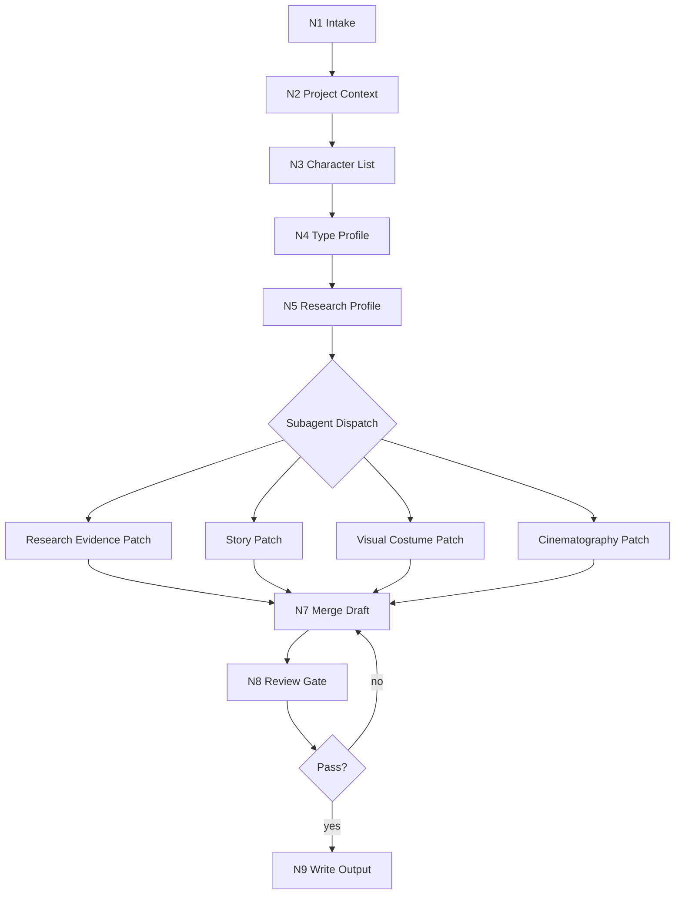

# Character Design Workflow

本文件定义 `角色/2-设计` 的思行一体化流程。执行时先判断、再行动、再留证据。

## Topology

混合拓扑：项目上下文串行锁定，角色主体可并行分发给 subagents，最后统一汇流和 review。

## Thinking-Action Nodes

| node_id | objective | inputs | actions | evidence | route_out | gate |
| --- | --- | --- | --- | --- | --- | --- |
| `N1-INTAKE` | 锁定项目、角色范围和不动范围 | 用户请求、项目路径 | 解析项目名、角色名、批量范围和只读边界 | `execution_scope` | `N2-PROJECT-CONTEXT` | 项目路径明确 |
| `N2-PROJECT-CONTEXT` | 加载项目风格和监制上下文 | `MEMORY.md`、`CONTEXT/`、`north_star.yaml`、`team.yaml` | 抽取全局风格、服装风格、设计相关大师上下文和禁区 | `project_design_context` | `N3-CHARACTER-LIST` | 缺失项已记录 |
| `N3-CHARACTER-LIST` | 锁定清单角色锚点 | `角色清单.md` | 读取待设计角色的名称、首次登场、原文描述关键词 | `character_intake_table` | `N4-TYPE-PROFILE` | 每个角色来自清单 |
| `N4-TYPE-PROFILE` | 判定角色类型和设计深度 | 清单行、项目上下文 | 应用 `types/character-design-type-map.md`，决定研究深度、考据许可和不确定性口径 | `type_profile` | `N5-RESEARCH-PROFILE` | 类型、深度和风险明确 |
| `N5-RESEARCH-PROFILE` | 把研究转化为设计证据链 | `character_intake_table`、`project_design_context`、`type_profile`、必要外部来源 | LLM 生成身份、职业、阶层、地域年代、服饰工艺、身体姿态、禁区、不确定性和 prompt evidence chain；搜索只作辅助证据 | `research_profile` | `N6-SUBAGENT-DISPATCH` | 每个研究镜头都有设计转化 |
| `N6-SUBAGENT-DISPATCH` | 启动默认 subagents 或记录降级 | `type_profile`、`research_profile`、runtime 能力 | 分发研究证据、物语、视觉服装、摄影 patch；阻断时本地顺序执行并记录 | `subagent_or_downgrade_record` | `N7-MERGE-DRAFT` | 不静默跳过 subagents |
| `N7-MERGE-DRAFT` | 生成单一 canonical 设计稿 | 各 patch、模板 | LLM 汇流并写完整设计稿，不保留互相竞争的并列稿；prompt 短语必须可回指 evidence chain | `character_design_draft` | `N8-REVIEW-GATE` | 字段齐全 |
| `N8-REVIEW-GATE` | 审查字段、风格、研究证据链、prompt 和 LLM-first | draft、review 合同 | 检查清单锚点、项目风格、研究镜头、解构字段、prompt 长度、脚本边界 | `review_result` | `N9-WRITE-OUTPUT` 或 `N7-MERGE-DRAFT` | 无阻断 finding |
| `N9-WRITE-OUTPUT` | 落盘 canonical markdown | 通过审查的设计稿 | 写入 `5-设计/角色/2-设计/<角色名>.md`，必要时写报告 | output files | done | 文件路径正确 |

## Research Profile Evidence Gate

`N5-RESEARCH-PROFILE` 必须产出以下最小证据表，供后续 `N7-MERGE-DRAFT` 消费：

| evidence_slot | minimum content | must feed |
| --- | --- | --- |
| `identity` | 身份标签、身份冲突、与清单锚点的关系 | `Identity & Story Pressure`、prompt 主体 |
| `occupation_class` | 职业/劳动/权力位置、阶层痕迹、资源边界 | 身体姿态、服装材质、配饰克制 |
| `region_era` | 地域、年代、气候、制度或审美限制 | 发型、廓形、色彩、禁用元素 |
| `costume_craft` | 剪裁、面料、闭合方式、层次、磨损与使用逻辑 | `Detailed Costume Design`、prompt 服装短语 |
| `body_posture` | 身高比例、重心、手部位置、职业肌肉记忆 | `Detailed Character Design / Body`、`Cinematography` |
| `taboo_constraints` | 项目禁区、文化误读、安全风险、固定画面禁区 | guardrails、negative prompt 判断 |
| `uncertainty` | 清单事实、LLM 推演、待确认项和置信度 | `Uncertainty Notes`、执行报告风险 |
| `prompt_evidence_chain` | `evidence -> design decision -> prompt phrase` | 英文 prompt 的关键短语 |

## Failure Routes

| fail_code | symptom | rework_entry |
| --- | --- | --- |
| `FAIL-NO-LIST` | 找不到上游 `角色清单.md` | 回到 `N3-CHARACTER-LIST`，请求或生成上游清单 |
| `FAIL-NO-STYLE` | 未读取 `north_star.yaml` 或无法提炼全局风格 | 回到 `N2-PROJECT-CONTEXT` |
| `FAIL-RESEARCH-FLAT` | 研究层只有资料摘录，没有转化为设计决策 | 回到 `N5-RESEARCH-PROFILE` 补 evidence chain |
| `FAIL-UNCERTAINTY-HIDDEN` | 低证据推演被写成事实 | 回到 `N5-RESEARCH-PROFILE` 标注来源、置信度和待确认项 |
| `FAIL-SUBAGENT-SKIPPED` | 默认 subagent 路径被静默跳过 | 回到 `N6-SUBAGENT-DISPATCH` 并补降级报告 |
| `FAIL-PROMPT-LONG` | 英文提示词超过 2000 字符 | 回到 `N7-MERGE-DRAFT` 压缩 prompt |
| `FAIL-SCRIPT-AUTHORSHIP` | 脚本生成创作正文 | 停用脚本输出，回到 LLM 汇流 |
