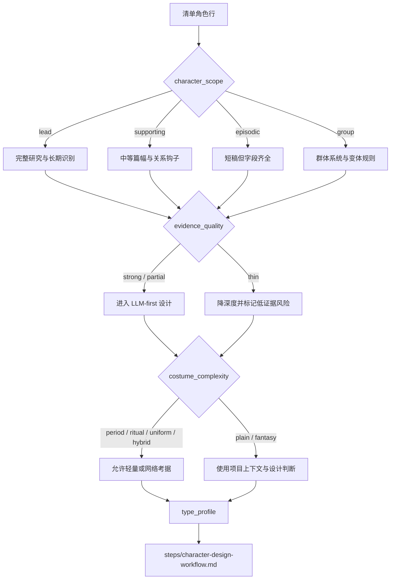

# Character Design Type Map

本文件定义 `角色/2-设计` 的类型变量和分型策略。它不替代 `steps/` 的执行流程。

## Type Variables

| variable | values | use |
| --- | --- | --- |
| `character_scope` | `lead` / `supporting` / `episodic` / `group` | 决定研究、物语和细节密度 |
| `evidence_quality` | `strong` / `partial` / `thin` | 决定是否需要风险提示或上游修复建议 |
| `research_need` | `none` / `light` / `web_allowed` | 决定是否允许网络搜索 |
| `costume_complexity` | `plain` / `period` / `ritual` / `uniform` / `fantasy` / `hybrid` | 决定服装字段重点 |
| `cinematic_role` | `heroic` / `intimate` / `threat` / `comic` / `background_anchor` / `mystery` | 决定摄影字段语言 |

## Strategy Matrix

| type_profile | route | design emphasis | review risk |
| --- | --- | --- | --- |
| `lead + strong` | 完整研究、物语、视觉服装、摄影 | 角色矛盾、长期视觉识别、跨场景一致性 | 避免过度百科化 |
| `supporting + strong/partial` | 中等篇幅设计 | 与主线关系、单一强视觉钩子、服装功能 | 避免主角化 |
| `episodic + partial/thin` | 短稿但字段齐全 | 首次登场辨识度、动作功能、镜头记忆点 | 避免凭空补复杂背景 |
| `group` | 群像主体设计 | 群体轮廓、统一服装系统、个体差异规则 | 避免假装每个个体都有姓名 |
| `period/ritual/uniform` costume | 允许轻量或网络考据 | 廓形、材质、礼制、磨损和职业功能 | 避免历史/文化误写 |
| `thin evidence` | 先降深度 | 明确哪些来自清单，哪些是设计推演 | 必须标记低证据风险 |

## Routing Map

## Web Search Routing

| condition | allowed_action | required_record |
| --- | --- | --- |
| 冷门服饰、职业或地域 | 搜索 1 到 3 个可信来源 | 来源名称、链接或摘要、使用边界 |
| 真实历史人物或事件影射 | 搜索并交叉核对 | 不把单一来源写成事实 |
| 普通现代日常角色 | 默认不搜索 | 直接用项目上下文设计 |

## Depth Rules

- 所有类型都必须保留模板必填字段。
- 低证据角色可以短，但不能缺字段。
- 主角与高复杂服装角色必须在 `Detailed Costume Design` 中写到材质、层次、配件和使用痕迹。
- 群像角色的提示词应强调群体系统和可重复变体，不虚构具体姓名。
