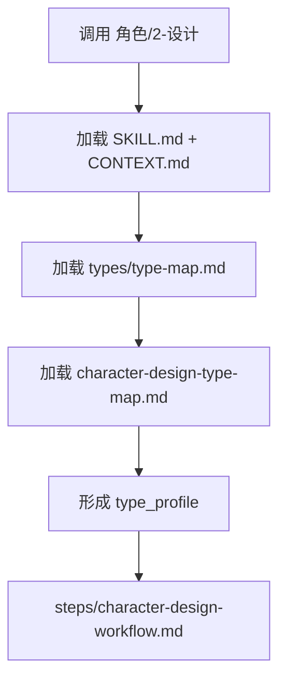

# Type Map

## Package Index

| package | role |
| --- | --- |
| `character-design-type-map.md` | 判断角色主体粒度、设计深度、研究需求、服装/摄影/prompt 处理策略 |

## Default Package Rule

- 默认加载 `character-design-type-map.md`。
- 单角色与批量角色都先形成 `type_profile`，再进入 `steps/character-design-workflow.md`。
- 本索引只负责类型包发现，不替代 `SKILL.md` 的输入、输出、team advisor consultation 或 review 合同。

## Loading Flow

