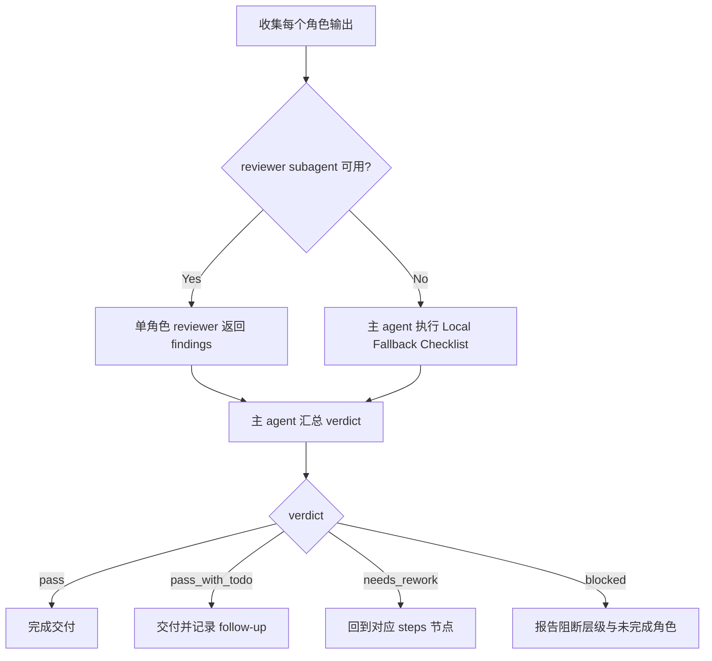

# Review Contract

本文件定义 `角色/3-生成` 的质量门禁、审查口径和 verdict 结构。

## Review Scope

检查对象：

- 主图图片与主图 JSON。
- 多视图图片与多视图 JSON。
- 上游设计文档回链。
- imagegen 执行模式与项目持久化证据。

不检查对象：

- 不重新评判角色设计是否“够好”；该职责属于 `角色/2-设计`。
- 不审查场景、道具、视频或分镜产物。

## Checklist

| check_id | requirement | fail code |
| --- | --- | --- |
| `REV-CHAR-GEN-01` | 每个 JSON 都有 `source_design_path`，且源文件存在 | `FAIL-SOURCE-LINK` |
| `REV-CHAR-GEN-02` | 主图 prompt 来自源设计文档 `提示词设计`，未重写主体设定 | `FAIL-PROMPT-DRIFT` |
| `REV-CHAR-GEN-03` | 真实生成模式下 `<主体名称>-主图.<ext>` 存在于输出目录 | `FAIL-MAIN-IMAGE` |
| `REV-CHAR-GEN-04` | 多视图 JSON 的 `reference_image_path` 指向对应主图 | `FAIL-REFERENCE` |
| `REV-CHAR-GEN-05` | 真实生成模式下 `<主体名称>-多视图.<ext>` 存在于输出目录 | `FAIL-MULTIVIEW-IMAGE` |
| `REV-CHAR-GEN-06` | 图片与 JSON 命名符合 `<主体名称>-主图`、`<主体名称>-多视图` | `FAIL-NAMING` |
| `REV-CHAR-GEN-07` | prompt-only 模式没有伪造图片路径，阻断原因清楚 | `FAIL-PROMPT-ONLY-CLAIM` |
| `REV-CHAR-GEN-08` | 未修改上游 `2-设计` 文档或其他技能目录 | `FAIL-WRITE-BOUNDARY` |

## Verdict Schema

```yaml
subject_name: ""
mode: "real_generation | prompt_only | review_only"
verdict: "pass | pass_with_todo | blocked | needs_rework"
source_design_path: ""
main_image_path: ""
main_prompt_json_path: ""
multiview_image_path: ""
multiview_prompt_json_path: ""
reference_image_path: ""
imagegen_mode: ""
findings: []
notes: ""
```

## Provider Guidance

- 默认由执行 agent 做本地 gate 审查。
- 仓库层默认允许按单角色使用 reviewer subagent 返回 findings；最终 verdict 仍由主 agent 汇总，reviewer 不拥有业务主真源改写权。
- 若 system / developer / tool / user 层阻断 reviewer subagent，按 `SKILL.md` 的 subagent 降级口径报告，并执行下方本地降级 checklist。

## Local Fallback Checklist

当真实 reviewer subagent 不可用时，主 agent 必须至少完成以下本地复核：

1. 核对每个 JSON 的 `source_design_path` 指向存在的 `2-设计` 文档。
2. 核对主图 prompt 与设计文档 `提示词设计` 有明确回链，没有新增身份、服装、时代或叙事事实。
3. 核对多视图 JSON 的 `reference_image_path` 指向同一角色主图，且不跨角色复用。
4. 核对真实生成模式下图片文件存在，并位于 `projects/aigc/<项目名>/5-设计/角色/3-生成/`。
5. 核对 prompt-only 模式没有伪造图片路径，且 `blocked_reason` 可解释。
6. 核对本轮没有修改上游 `2-设计`、父级 registry、场景/道具目录或其他 worker 范围。

## Review Flow Map


