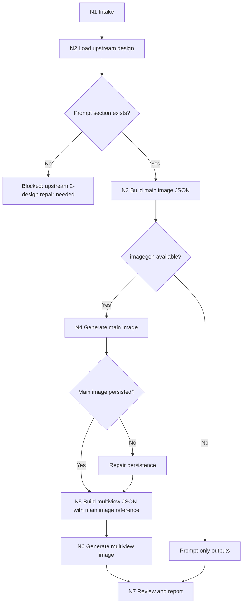
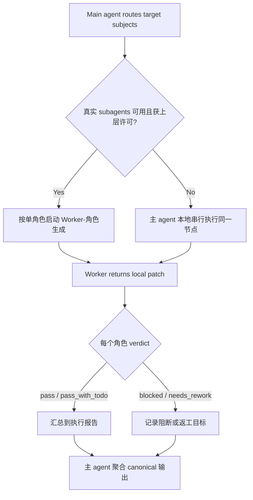
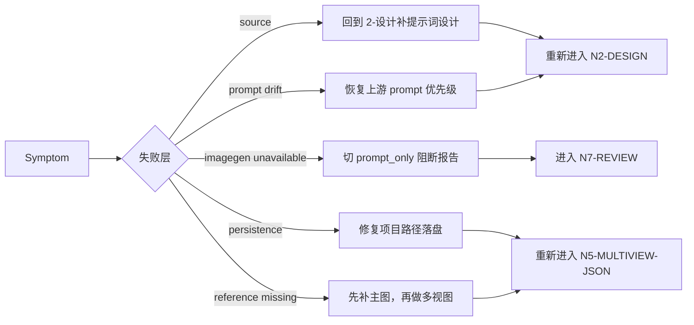

# Character Generation Workflow

本文件定义 `角色/3-生成` 的思行节点。每个节点同时包含判断、动作、证据、路由和 gate。

## Workflow Map



## Dispatch And Convergence Map



## Failure Recovery Map



## Nodes

| node_id | judge | action | evidence | next_gate |
| --- | --- | --- | --- | --- |
| `N1-INTAKE` | 项目根、角色范围、覆盖策略是否明确 | 锁定 `generation_profile` 和输出目录 | project_root、target_subjects、overwrite_policy | `N2-DESIGN` |
| `N2-DESIGN` | 每个目标是否有上游设计文档和 `提示词设计` | 读取设计文档，抽取 subject_name 与 source prompt | source_design_path、source_prompt_section | `GATE-PROMPT` |
| `N3-MAIN-JSON` | 主图 prompt 是否只来自设计文档 | 按主图模板写 JSON | `<主体名称>-主图.json` | `GATE-IMAGEGEN` |
| `N4-MAIN-IMAGE` | imagegen 可用且输出不会未经许可覆盖 | 调用 imagegen 生成单主体图并持久化 | `<主体名称>-主图.<ext>` | `GATE-MAIN-PERSISTED` |
| `N5-MULTIVIEW-JSON` | 主图参照图是否存在 | 套用多视图模板并写 JSON | `<主体名称>-多视图.json`、reference_image_path | `GATE-REFERENCE` |
| `N6-MULTIVIEW-IMAGE` | 多视图 prompt 与参照图是否匹配 | 调用 imagegen 生成多视图主体设计图 | `<主体名称>-多视图.<ext>` | `N7-REVIEW` |
| `N7-REVIEW` | 产物路径、命名、来源和图片证据是否闭环 | 执行 review gate，必要时写执行报告 | review verdict | done |

## Gates

- `GATE-PROMPT`: 缺少 `提示词设计` 时停止生成，返回上游修复建议。
- `GATE-IMAGEGEN`: imagegen 不可用时进入 `prompt_only`，只交付 JSON 与阻断说明。
- `GATE-MAIN-PERSISTED`: 主图必须位于 `projects/aigc/<项目名>/5-设计/角色/3-生成/` 后才能作为多视图参照。
- `GATE-REFERENCE`: 多视图 JSON 的 `reference_image_path` 必须指向对应角色主图。
- `GATE-OVERWRITE`: 任何覆盖已有图片或 JSON 的行为必须有用户明确许可。

## Batch Convergence

- 批量执行时，每个角色独立通过 `N2` 到 `N7`。
- 主 agent 汇总每个 worker 的 `subject_name`、图片路径、JSON 路径、imagegen mode、review verdict。
- 未调度角色不得生成空占位或默认 JSON。

## Worker Return Shape

```yaml
subject_name: ""
source_design_path: ""
mode: "real_generation | prompt_only | review_only"
main_image_path: ""
main_prompt_json_path: ""
multiview_image_path: ""
multiview_prompt_json_path: ""
reference_image_path: ""
imagegen_mode: ""
review_verdict: "pass | pass_with_todo | blocked | needs_rework"
blocked_reason: ""
changed_files: []
```

## Evidence Gate

- `changed_files` 只能包含 `projects/aigc/<项目名>/5-设计/角色/3-生成/` 下的图片、JSON 或执行报告。
- `prompt_only` 模式下 `main_image_path`、`multiview_image_path` 可以为空，但必须提供 `planned_output_image_path` 或 `blocked_reason`。
- `real_generation` 模式下每个非空图片路径必须真实存在，并且对应 JSON 的 `output_image_path` 与文件名配对。
- `review_only` 模式不得新增 prompt JSON 或图片；只返回 findings、verdict 和审查报告路径。
