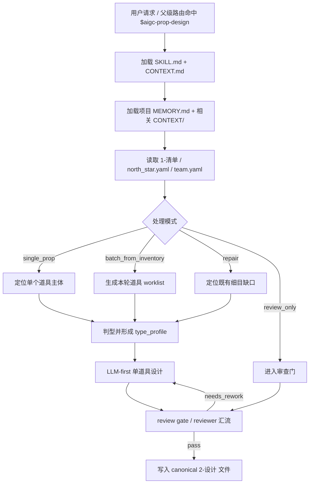
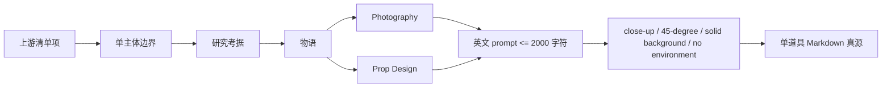
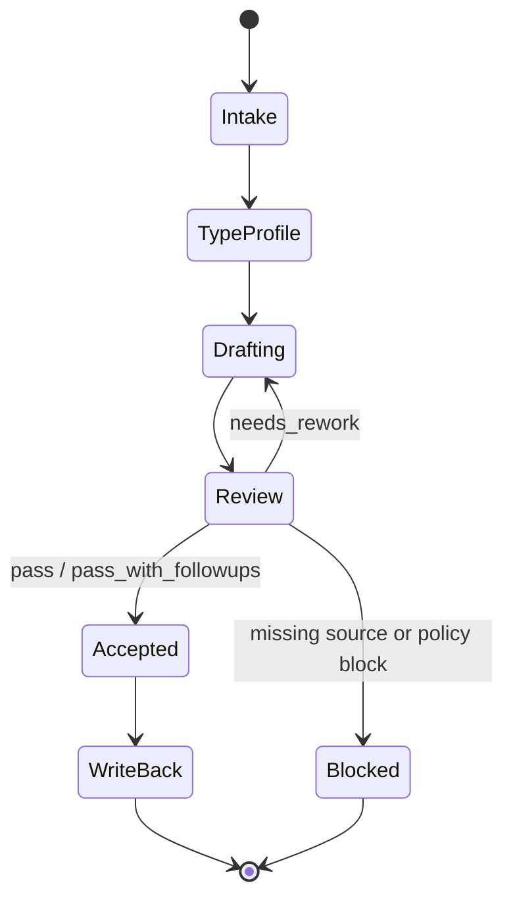

# aigc 道具 2-设计

`道具/2-设计` 负责消费上游 `道具/1-清单` 的汇总式道具清单，并结合项目 `north_star.yaml`、`team.yaml` 中的设计相关大师监制上下文，为每个需要进入生成锁定的单个道具主体输出细目设计 Markdown。它不重新抽取清单，不批量改写父级 registry，也不代替 `3-生成` 产出图像。

## Context Loading Contract

- 每次调用 `$aigc-prop-design` 时，必须同时加载同目录 `CONTEXT.md`。
- 若任务绑定 `projects/aigc/<项目名>/`，必须先加载项目根 `MEMORY.md`，再按需加载项目根 `CONTEXT/` 中与道具、世界观、视觉规则、风格提示词或制作约束相关的上下文文件。
- 必须读取上游 `projects/aigc/<项目名>/5-设计/道具/1-清单/道具清单.md`；缺失时不得凭空生成完整道具设计，应回到 `1-清单` 或请求用户提供替代清单。
- 必须读取 `projects/aigc/<项目名>/0-初始化/north_star.yaml` 与 `projects/aigc/<项目名>/team.yaml`，抽取全局风格、主题、媒介、禁区和设计相关大师监制上下文。
- 固定画面约束：道具设计默认是纯色背景上的单道具近景特写，采用 45 度视角，不得置身于剧情场景、桌面环境、室内陈设、街景或人物手持情境中；英文提示词必须显式包含 `close-up prop shot, 45-degree view, solid color background, no scene environment` 等等价约束。
- 冲突优先级：用户显式请求 > 根 `AGENTS.md` / meta 规则 > 本 `SKILL.md` > `references/` / `steps/` / `review/` / `types/` / `templates/` > `agents/openai.yaml` > 项目 `MEMORY.md` > 项目 `CONTEXT/` > 本 `CONTEXT.md`。
- 道具研究判断、物语提炼、造型解构、摄影/道具设计语言与提示词设计必须由 LLM 直接完成；`scripts/` 只能做读取、路径枚举、文件名归一、格式检查等机械辅助。

## Subagent Execution Contract

- 本技能默认启用真实 subagents 路径：主 agent 或调度层应将道具细目设计工作分发给 `Worker-Prop`，并在需要质量复核时使用独立 reviewer subagent 汇流 verdict。
- 用户显式点名 `$aigc-prop-design` 或本阶段路由命中时，视为仓库层已经许可该默认 subagent 路径；不得以“用户未额外授权并行”为理由回退。
- 若上层 system / developer / tool policy 或当前工具环境阻断真实 subagent dispatch，执行者必须显式报告阻断层级、原计划 subagent 路径、实际降级路径和未真实启动的 reviewer / worker。
- 子任务可按单个道具主体拆分；每个 subagent 只负责自己领取的道具文件 patch，最终由主 agent 聚合到 canonical 输出目录。

## Input Contract

Accepted input:

- 项目名、项目路径或明确的 `projects/aigc/<项目名>/`。
- 用户要求“道具设计”“道具细目设计”“从道具清单生成道具设定”“配置或执行 5-设计/道具/2-设计”等任务。
- 单个道具名称、多个道具名称、或默认处理 `道具清单.md` 中全部需要进入设计的主体。

Required input:

- 可定位的 `projects/aigc/<项目名>/5-设计/道具/1-清单/道具清单.md`。
- 清单中每项至少包含 `名称`、`首次登场`、`原文描述（关键词式）`。
- 可读取的 `projects/aigc/<项目名>/0-初始化/north_star.yaml` 与 `projects/aigc/<项目名>/team.yaml`；若缺失，必须在输出中标注缺口，不得伪造监制上下文。

Optional input:

- 项目 `MEMORY.md` 中关于长期视觉钩子、禁用物件、材质口味、提示词风格的偏好。
- 项目 `CONTEXT/` 中已有世界观、术语表、年代考据、道具参考、生成平台限制。
- 用户指定的道具优先级、文件命名方式、是否允许网络搜索冷门资料、是否只输出草案。

Reject or clarify when:

- 上游 `1-清单/道具清单.md` 不存在，且用户没有提供替代清单。
- 用户要求脚本自动生成研究、物语、解构或提示词正文；必须改为 LLM-first。
- 用户要求本技能写入 `1-清单`、`3-生成`、角色设计、场景设计、父级 registry 或其他技能目录。
- 用户要求无来源地补造首次登场或原文描述；必须回查上游清单或请求补充。

## Mode Selection

| mode | 触发信号 | 输出 |
| --- | --- | --- |
| `single_prop` | 指定一个道具主体 | 单个道具细目设计 Markdown |
| `batch_from_inventory` | 指定项目或默认处理全部清单 | 每个道具主体一个 Markdown 文件 |
| `repair` | 既有细目缺字段、提示词超长、上下游不一致或设计漂移 | 最小修复后的对应道具文件 |
| `review_only` | 用户只要求检查道具设计 | 审查报告或 findings；不改写文件，除非用户随后要求修复 |

## Reference Loading Guide

| 场景 | 必读文件 |
| --- | --- |
| 任意道具细目设计任务 | `references/prop-design-contract.md`、`steps/prop-design-workflow.md` |
| 类型分流、冷门考据、规则道具或状态版本 | `types/prop-design-type-map.md`、`knowledge-base/prop-design-heuristics.md` |
| 验收、修复和 reviewer 汇流 | `review/review-contract.md` |
| 输出道具细目样板 | `templates/output-template.md` |
| 脚本辅助边界与机械校验 | `scripts/README.md` |
| 产品入口元数据 | `agents/openai.yaml` |

## Visual Maps

## Execution Contract

1. 读取本 `SKILL.md + CONTEXT.md`，并在项目任务中加载项目 `MEMORY.md` 与相关 `CONTEXT/`。
2. 锁定上游 `1-清单/道具清单.md` 的道具主体；只对被指定或被调度的主体生成细目，不为空置主体补占位文件。
3. 读取 `north_star.yaml` 与 `team.yaml`，提取全局风格提示词、项目北极星、视觉禁区、设计相关大师监制上下文。
4. 按 `types/prop-design-type-map.md` 判型，形成 `type_profile`，再进入 `steps/prop-design-workflow.md` 的单道具设计节点。
5. 由 LLM 完成研究考据、物语、Photography + Prop Design 解构与英文提示词设计；冷门信息仅在确有必要时允许网络搜索，并在输出中标注来源或不确定性。
6. 写入 canonical 路径 `projects/aigc/<项目名>/5-设计/道具/2-设计/<安全文件名>.md`；不改写父级 registry、`1-清单` 或 `3-生成`。
7. 按 `review/review-contract.md` 执行验收；可使用 `scripts/` 中说明的机械检查，但脚本不得替代 LLM 的设计判断。

## Field Mapping

| field_id | 输出/证据 | 内容要求 | 失败码 |
| --- | --- | --- | --- |
| `FIELD-PROP-DESIGN-01` | 输入取证 | 上游清单、项目记忆、north_star、team 和处理范围明确 | `FAIL-PROP-DESIGN-01` |
| `FIELD-PROP-DESIGN-02` | 单主体边界 | 每个文件只设计一个道具主体，不混入角色、场景或其他道具总稿 | `FAIL-PROP-DESIGN-02` |
| `FIELD-PROP-DESIGN-03` | 必填章节 | 名称/首次登场/原文描述复述、研究考据、物语、解构、提示词设计齐全 | `FAIL-PROP-DESIGN-03` |
| `FIELD-PROP-DESIGN-04` | 监制上下文 | 设计相关大师、全局风格和项目北极星被实际消费而非只贴名 | `FAIL-PROP-DESIGN-04` |
| `FIELD-PROP-DESIGN-05` | 提示词约束 | 英文提示词引用全局风格提示词 + 物品风格，且 2000 字符内 | `FAIL-PROP-DESIGN-05` |
| `FIELD-PROP-DESIGN-06` | 输出落盘 | canonical 输出目录和安全文件名正确，未触碰非授权范围 | `FAIL-PROP-DESIGN-06` |
| `FIELD-PROP-DESIGN-07` | 产品特写约束 | 默认为纯色背景单道具近景特写、45 度视角，不置身场景或人物手持情境 | `FAIL-PROP-DESIGN-07` |

## Root-Cause Execution Contract (Mandatory)

出现以下问题时，必须沿链路上溯并修复源层合同：

- 脚本、模板或正则拼接替代 LLM 生成研究、物语、解构或提示词正文。
- 道具细目没有从 `1-清单` 取证，或擅自新增上游不存在的道具主体。
- 未读取 `north_star.yaml` / `team.yaml` 却声称已经使用全局风格和大师监制上下文。
- 提示词没有英文输出、没有引用全局风格提示词与物品风格，或超过 2000 字符。
- 道具 prompt 或摄影字段把道具放入剧情场景、桌面环境、室内陈设、街景或人物手持情境，而不是纯色背景 45 度近景特写。
- 输出写到父级、`1-清单`、`3-生成`、角色/场景目录或 registry。
- subagent 默认路径被工具阻断时没有报告降级原因与未启动角色。

必经链路：

`Symptom -> Direct Script/Prompt Overreach -> 道具/2-设计 Section Owner -> Prop Design Contract -> AGENTS.md LLM-first / Skill 2.0 / Subagent Rule`

## Output Contract

### Required output

1. 每个被调度道具主体输出一个 Markdown 细目设计文件。
2. 文件必须包含：`名称/首次登场/原文描述复述`、`研究考据`、`物语`、`解构`、`提示词设计`。
3. `解构` 必须同时包含 `Photography` 与 `Prop Design` 字段。
4. `提示词设计` 必须包含对全局风格提示词的引用、物品风格说明和英文 prompt；英文 prompt 控制在 2000 字符内。
5. 画面固定为纯色背景、单道具近景特写、45 度视角，不得置身具体场景或人物手持情境。

### Output format

| output_id | format |
| --- | --- |
| `OUTPUT-PROP-DESIGN` | Markdown 单道具细目设计 |
| `OUTPUT-PROP-DESIGN-REPORT` | Markdown 执行/审查报告，可选 |

### Output path

| output_id | canonical path |
| --- | --- |
| `OUTPUT-PROP-DESIGN` | `projects/aigc/<项目名>/5-设计/道具/2-设计/<安全文件名>.md` |
| `OUTPUT-PROP-DESIGN-REPORT` | `projects/aigc/<项目名>/5-设计/道具/2-设计/执行报告.md` |

### Naming convention

- `<安全文件名>` 优先使用清单中的 `名称`，去除路径分隔符、控制字符和不适合文件系统的符号。
- 同名或多状态道具使用 `<名称>-<首次登场ID>` 或 `<名称>-<状态>` 区分。
- 不创建 `props.md`、`prop-design.md`、`道具设计总稿.md` 作为平行主真源。

### Completion gate

- 已读取本 `SKILL.md + CONTEXT.md`，并在项目任务中加载项目 `MEMORY.md` 与相关 `CONTEXT/`。
- 每个输出文件都能回指 `1-清单/道具清单.md` 的具体道具项。
- `north_star.yaml` 与 `team.yaml` 的全局风格、项目主题和设计相关大师监制上下文已被实际消费；缺失项已显式标注。
- 必填章节齐全，`Photography` 与 `Prop Design` 解构字段存在。
- 英文 prompt 引用全局风格提示词 + 物品风格，且不超过 2000 字符。
- `Photography` 与英文 prompt 固定为 close-up、45-degree view、solid color background、no scene environment。
- 已执行 `review/review-contract.md` 的人工 review、真实 reviewer subagent 或等价降级 review，并记录 verdict。
