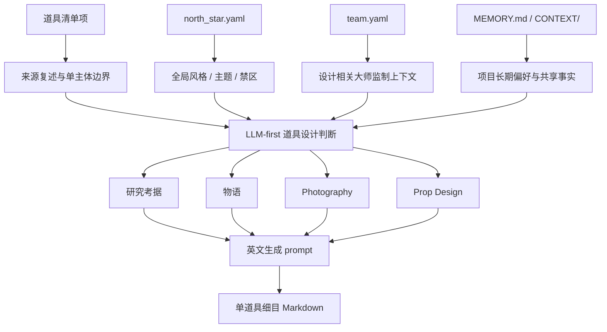
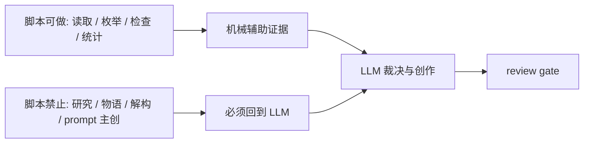

# Prop Design Contract

本文件定义 `道具/2-设计` 的业务细则。根 `SKILL.md` 拥有入口、路由和输出合同；本文件只展开单道具细目设计规则。

## Upstream Contract

必须消费：

- `projects/aigc/<项目名>/4-设计/道具/1-清单/道具清单.md`
- `projects/aigc/<项目名>/0-初始化/north_star.yaml`
- `projects/aigc/<项目名>/team.yaml`

可按需消费：

- `projects/aigc/<项目名>/MEMORY.md`
- `projects/aigc/<项目名>/CONTEXT/`
- 上游首次登场对应的分组稿或分镜稿，仅用于回查原文证据，不用于新增清单外道具。

## LLM-First Creative Authorship

- 研究考据、物语、解构、物品风格和英文 prompt 必须由 LLM 直接创作与裁决。
- 脚本不得通过模板拼接、启发式补句、字段扩写或规则生成来冒充道具设计正文。
- 脚本可以读取清单、枚举项目路径、检查 Markdown 标题、统计 prompt 字符数、生成空目录或报告缺字段。

## Required Design Sections

每个单道具 Markdown 文件必须包含以下章节：

| section | required content |
| --- | --- |
| `名称 / 首次登场 / 原文描述复述` | 清单项名称、首次登场、对上游原文描述的短复述；不得改写成新事实 |
| `研究考据` | 与道具形制、材质、工艺、年代、文化来源或功能逻辑有关的考据；冷门信息可网络搜索 |
| `物语` | 道具在故事中的压力、象征、拥有者痕迹、使用历史或情绪功能 |
| `解构` | 至少包含 `Photography` 和 `Prop Design` 两个字段 |
| `提示词设计` | 引用全局风格提示词、补充物品风格，并给出英文 prompt，2000 字符内 |

## Fixed Visual Constraint

- 道具设计稿默认是纯色背景上的单道具近景特写，用于锁定物件形制、材质和识别点。
- 默认摄影为 close-up prop shot、45-degree view、solid color background。
- 不得让道具置身于剧情场景、桌面环境、室内陈设、街景、人物手持情境或多物件场景中。
- 若道具的使用方式需要说明，只能在 `物语` 或 `Prop Design` 中解释，不得让最终画面出现手、角色或场景。

## Design Source Map

## Research Rules

- 研究必须服务可见设计，不写与造型和拍摄无关的百科段落。
- 冷门信息允许网络搜索的条件：用户明确要求考据、项目题材依赖真实历史/工艺/地域信息、或 LLM 对事实置信度不足。
- 使用网络搜索时应优先可靠来源，并在输出中用简短来源说明或“不确定性注记”标识，不长篇摘录。
- 若无法验证冷门信息，设计可使用“受某类工艺启发”的措辞，避免伪造具体史实。

## North Star And Team Consumption

`north_star.yaml` 应转译为：

- 全局风格提示词或视觉母题。
- 主题、时代、材质、色彩、镜头、禁区。
- 该道具在项目整体美术系统中的位置。

`team.yaml` 应转译为：

- 与设计、摄影、美术、服装、动作、导演或审美有关的大师监制视角。
- 至少一条可见的设计决策，例如材质克制、形制陌生化、手作痕迹、可拍摄反光、握持方式或留白。
- 不把大师名字当装饰性标签；必须说明它如何改变道具方案。

## Deconstruction Rules

`Photography` 字段应回答：

- 镜头距离、角度、焦段感、景深、光线、反光、阴影、运动或静置状态。
- 道具在画面中如何被识别，是否需要特写、边缘光、手部互动或环境对照。
- 默认固定为近景特写、45 度视角、纯色背景；不得使用手部互动或环境对照作为默认画面，只能在文字中说明用途。

`Prop Design` 字段应回答：

- 外形轮廓、材质、工艺、颜色、尺度、重量感、使用痕迹、损伤、可动部件、接口、包装或携带方式。
- 哪些元素是生成时必须锁定的识别点，哪些可以随机变化。

## Prompt Rules

- prompt 必须为英文，最多 2000 字符。
- prompt 必须同时包含全局风格提示词引用和物品风格。
- prompt 应聚焦单个道具，避免把角色、场景或完整剧情塞入主体。
- prompt 必须包含 `close-up prop shot, 45-degree view, solid color background, no scene environment` 或等价约束。
- prompt 可包含 negative constraints，但不得压过主体设计。
- 若全局风格提示词缺失，必须写明 `Global style prompt: missing upstream source`，并只输出物品风格 prompt 草案。

## Non-Goals

- 不重新生成 `道具清单.md`。
- 不创建图像、视频或生成任务。
- 不修改角色、场景、父级路由、registry 或其他 worker 的文件。
- 不把多个道具合成一个并列总稿。
