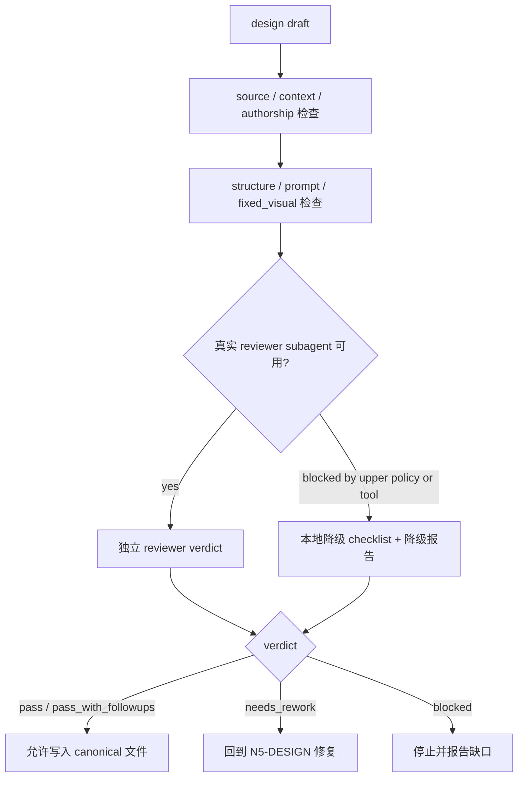

# Prop Design Review Contract

本文件定义 `道具/2-设计` 的质量门禁、reviewer subagent 接入和降级口径。

## Default Provider

- 默认 worker：`Worker-Prop`
- 默认 reviewer：独立 prop-design reviewer subagent；若无专名，则使用可用的 `code-reviewer` / design reviewer provider 执行结构与语义门禁。
- 上层策略若阻断真实 subagent 或外部 reviewer 调度，允许降级为本地 review checklist，但必须报告阻断层级、原计划 provider 路径、实际降级路径和未真实启动的 reviewer。

## Review Scope

| dimension | checks |
| --- | --- |
| source | 是否回指 `1-清单/道具清单.md` 的单个清单项 |
| context | 是否读取并消费 `north_star.yaml`、`team.yaml`、项目记忆和相关上下文 |
| authorship | 研究、物语、解构和 prompt 是否为 LLM-first，而非脚本拼接 |
| structure | 必填章节是否齐全，`Photography` 与 `Prop Design` 是否分离 |
| prompt | 英文 prompt 是否包含全局风格 + 物品风格，且 2000 字符内 |
| fixed_visual | 是否为纯色背景单道具近景特写、45 度视角、无场景环境 |
| type | `type_profile` 是否合理，冷门考据和多状态是否按类型处理 |
| scope | 是否只写入 `5-设计/道具/2-设计`，未触碰 registry、父级或其他技能 |

## Verdict Model

| verdict | meaning |
| --- | --- |
| `pass` | 可作为单道具细目设计交付 |
| `pass_with_followups` | 可交付，但有非阻断后续项 |
| `needs_rework` | 有阻断问题，必须返工后再交付 |
| `blocked` | 缺失关键输入、权限或上层策略阻断 |

## Review Flow Map



## Finding Shape

```yaml
finding:
  severity: critical | high | medium | low
  dimension: source | context | authorship | structure | prompt | fixed_visual | type | scope
  symptom: ""
  direct_cause: ""
  source_contract: ""
  rework_target: ""
```

## Checklist

- [ ] 文件名对应单个道具主体，未混入总稿。
- [ ] `名称 / 首次登场 / 原文描述复述` 与上游清单一致。
- [ ] 研究考据服务可见设计；冷门信息有来源说明或不确定性注记。
- [ ] 物语没有扩写成新剧情真源。
- [ ] `Photography` 描述拍摄可见语言，`Prop Design` 描述物件造型语言。
- [ ] `Photography` 固定为近景特写、45 度视角、纯色背景、无场景环境。
- [ ] 英文 prompt 不超过 2000 字符。
- [ ] prompt 引用全局风格提示词，并补充物品风格。
- [ ] prompt 明确包含 close-up prop shot、45-degree view、solid color background、no scene environment。
- [ ] 输出路径在 `projects/aigc/<项目名>/5-设计/道具/2-设计/`。

## Gate Rule

不得在以下情况宣布完成：

- 缺少上游清单来源。
- 缺少必填章节任一项。
- prompt 非英文、超长或没有全局风格 + 物品风格。
- 摄影字段或 prompt 把道具置入具体场景、桌面环境、室内陈设、街景或人物手持情境。
- 缺少 close-up、45-degree view、solid color background 或 no scene environment 约束。
- 脚本替代 LLM 生成核心创作正文。
- 输出越过本技能授权范围。
