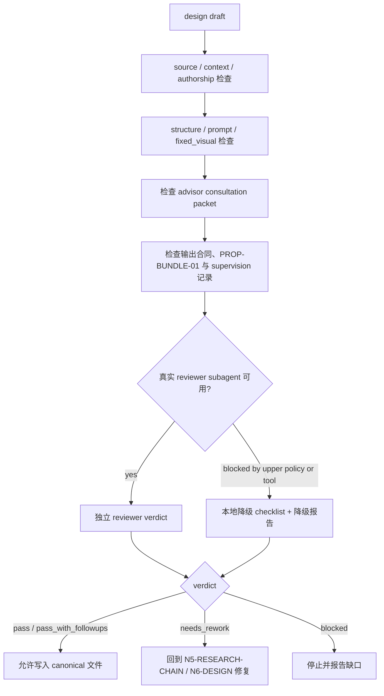

# Prop Design Review Contract

本文件定义 `道具/2-设计` 的质量门禁、reviewer subagent 接入和降级口径。

## Default Provider

- 默认 worker：`Worker-Prop`
- 默认顾问路径按 `../../../_shared/team-advisor-consultation-contract.md` 执行：先从项目 `team.yaml` 解析监制 roster，请教道具/美术/摄影/导演/工艺相关顾问，形成 `advisor_consultation_packet` 后再进入单道具设计汇流。
- 默认 reviewer：独立 prop-design reviewer subagent；若无专名，则使用可用的 `code-reviewer` / design reviewer provider 执行结构与语义门禁。
- 默认 review 必须同时读取 `references/design-output-contract.md`、`references/design-slot-review-contract.md` 与 `references/subagent-supervision-contract.md`；`PROP-BUNDLE-01` 必须被解析为非空 slot bundle 记录。
- 上层策略若阻断真实 subagent 或外部 reviewer 调度，允许降级为本地 review checklist，但必须报告阻断层级、原计划 provider 路径、实际降级路径和未真实启动的 reviewer。

## Review Scope

| dimension | checks |
| --- | --- |
| source | 是否回指 `1-清单/道具清单.md` 的单个清单项 |
| context | 是否读取并消费 `north_star.yaml`、`team.yaml`、项目记忆和相关上下文 |
| authorship | 研究、物语、解构和 prompt 是否为 LLM-first，而非脚本拼接 |
| research_chain | 研究是否转译为形制、材料、工艺、年代、使用痕迹、功能逻辑、风险/不确定性和 prompt evidence token |
| structure | 必填章节是否齐全，`## 4. 解构` 下方是否先写 `主体ID号：<主体ID>`，`Photography` 与 `Prop Design` 是否分离 |
| output_naming | 文件名是否为 `<主体ID>-<安全文件名>.md`，且文件名前缀与解构主体 ID、提示词设计主体 ID、英文 prompt 前缀一致 |
| prompt | 英文 prompt 是否以主体 ID 号开头，包含全局风格 + 物品风格，且 1300 characters 内；prompt 前缀是否与解构主体 ID、提示词设计主体 ID 完全一致；整合对象是否为 `## 4. 解构` 全部有效信息而不是前后缀拼接 |
| design_output_contract | 是否逐条检查 `references/design-output-contract.md` 的结构硬规则、prompt 整合硬规则、字符数、自然语言负向约束和 `--no` 禁用 |
| slot_bundle_review | 是否按 `references/design-slot-review-contract.md` 解析 `PROP-BUNDLE-01`，并对 `required_slots` 逐项给出证据位置或缺槽 finding |
| prompt_evidence | 核心 prompt token 是否能回指研究、物语或解构字段，并包含 `deconstruction_coverage` 说明解构槽位如何进入、合并或被剔除 |
| fixed_visual | 是否为纯色背景单道具近景特写、45 度视角、完整展示道具全貌、仅展示道具、无人物、无背景元素、无场景环境 |
| advisor_consultation | 是否按 `team.yaml` 请教项目监制顾问，问题是否具体，指导是否落入形制、材料、工艺、功能、特写拍法或 prompt token |
| subagent_supervision | 是否按 `references/subagent-supervision-contract.md` 记录真实 dispatch 或降级路径、未启动 reviewer 和汇流裁决 |
| type | `type_profile` 是否合理，冷门考据和多状态是否按类型处理 |
| scope | 是否只写入 `5-设计/道具/2-设计`，未触碰 registry、父级或其他技能 |

## Verdict Model

| verdict | meaning |
| --- | --- |
| `pass` | 可作为单道具细目设计交付 |
| `pass_with_followups` | 可交付，但有非阻断后续项 |
| `needs_rework` | 有阻断问题，必须返工后再交付 |
| `blocked` | 缺失关键输入、权限或上层策略阻断 |

## Review Flow Map



## Finding Shape

```yaml
finding:
  severity: critical | high | medium | low
  dimension: source | context | authorship | research_chain | structure | output_naming | prompt | design_output_contract | slot_bundle_review | prompt_evidence | fixed_visual | advisor_consultation | subagent_supervision | type | scope
  symptom: ""
  direct_cause: ""
  source_contract: ""
  rework_target: ""
```

## Checklist

- [ ] 文件名为 `<主体ID>-<安全文件名>.md`，对应单个道具主体，未混入总稿。
- [ ] `名称 / 首次登场 / 原文描述复述` 与上游清单一致。
- [ ] 研究考据服务可见设计；冷门信息有来源说明或不确定性注记。
- [ ] 研究证据链覆盖形制、材料、工艺、年代、使用痕迹、功能逻辑、风险/不确定性中的必要项。
- [ ] 研究结论区分确定事实、推断、灵感转译和未知项，没有把不确定信息写成确定史实。
- [ ] 物语没有扩写成新剧情真源。
- [ ] `Photography` 描述拍摄可见语言，`Prop Design` 描述物件造型语言。
- [ ] `## 4. 解构` 下方存在 `主体ID号：<主体ID>`，且与 `## 5. 提示词设计` 的主体 ID 号、英文 prompt 开头完全一致。
- [ ] 文件名前缀与 `## 4. 解构` 主体 ID、`## 5. 提示词设计` 主体 ID、英文 prompt 前缀完全一致。
- [ ] `Photography` 固定为近景特写、45 度视角、完整展示道具全貌、仅展示道具、纯色背景、无人物、无背景元素、无场景环境。
- [ ] 英文 prompt 不超过 1300 characters。
- [ ] 英文 prompt 以主体 ID 号开头，格式为 `<主体ID>: ...`。
- [ ] prompt 引用全局风格提示词，并补充物品风格。
- [ ] prompt evidence chain 覆盖核心 token：主体名、形制、材料、工艺/年代、使用痕迹、功能逻辑、`deconstruction_coverage` 和固定画面约束。
- [ ] 英文 prompt 整合 `## 4. 解构` 的全部有效 Photography + Prop Design 信息，而不是只拼接主体 ID、风格、物品、固定画面或负向词。
- [ ] 英文 prompt 使用自然语言负向约束，未使用 Midjourney `--no` 参数。
- [ ] prompt 明确包含 close-up prop shot、45-degree view、full prop in view、prop only、solid color background、no people、no background elements、no scene environment。
- [ ] 已逐条消费 `references/design-output-contract.md`。
- [ ] 已解析 `PROP-BUNDLE-01`，且 required slots 均有证据位置或 blocking finding。
- [ ] 已按 `references/subagent-supervision-contract.md` 记录 dispatch / downgrade / merge。
- [ ] 默认 subagents 路径启用时，`advisor_consultation_packet` 已从 `team.yaml` 顾问请教中提炼出可执行设计指导，或已记录上层阻断降级。
- [ ] 输出路径在 `projects/aigc/<项目名>/5-设计/道具/2-设计/`。

## Gate Rule

不得在以下情况宣布完成：

- 缺少上游清单来源。
- 缺少必填章节任一项。
- `## 4. 解构` 下方缺少 `主体ID号：<主体ID>`，或该 ID 与 `## 5. 提示词设计` 主体 ID / 英文 prompt 前缀不一致。
- 输出文件名缺少主体 ID 前缀，或文件名前缀与 `## 4. 解构` 主体 ID、`## 5. 提示词设计` 主体 ID、英文 prompt 前缀不一致。
- 研究没有转译为形制、材料、工艺、年代、使用痕迹、功能逻辑或不确定性处理。
- prompt 核心 token 与研究/物语/解构字段脱节，或缺少 `deconstruction_coverage`。
- prompt 非英文、未以主体 ID 号开头、超长、使用 `--no` 参数、没有全局风格 + 物品风格，或只拼接前后缀而未整合 `## 4. 解构` 全部有效信息。
- 未逐条消费 `references/design-output-contract.md`，或输出结构/prompt 整合硬规则只停留在旁路文档。
- 未解析 `PROP-BUNDLE-01`，或 required slot 缺少证据位置且未形成 blocking finding。
- `references/subagent-supervision-contract.md` 要求的 dispatch / downgrade / merge 记录为空。
- 摄影字段或 prompt 把道具置入具体场景、桌面环境、室内陈设、街景、人物手持情境或背景元素。
- 缺少 close-up、45-degree view、full prop in view、prop only、solid color background、no people、no background elements 或 no scene environment 约束。
- 默认 subagents 路径启用时，缺少 `advisor_consultation_packet`，或顾问问题没有落到形制、材料、工艺、功能、特写拍法、prompt evidence。
- 脚本替代 LLM 生成核心创作正文。
- 输出越过本技能授权范围。
