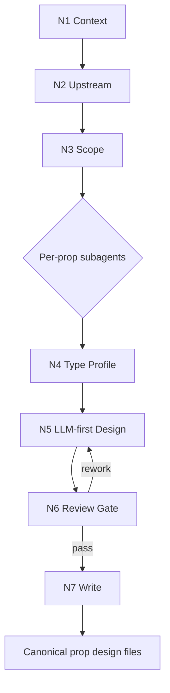

# Prop Design Thinking-Action Workflow

本文件定义 `道具/2-设计` 的思行一体节点。主拓扑为 `串行取证 -> 类型分流 -> 单道具设计 -> 并行审查 -> 汇流落盘`。

## Business Requirement Analysis

| slot | answer |
| --- | --- |
| `business_goal` | 将上游道具清单扩展为可生成、可审美复核、可回指来源的单道具细目设计 |
| `business_object` | `道具清单.md` 中的单个道具主体 |
| `constraint_profile` | 上游清单、north_star、team 监制上下文、LLM-first、prompt 2000 字符、输出路径边界 |
| `success_criteria` | 每个文件能指导后续图像生成和美术锁定，且不改写上游事实 |
| `non_goals` | 不生成图像，不改 registry，不重做清单，不写角色/场景设计 |
| `complexity_source` | 类型分流、监制上下文转译、冷门考据、subagent 汇流 |
| `topology_fit` | Hybrid：前段串行取证，中段可按道具并行，后段统一 review gate |

## Node Network

| node_id | objective | inputs | actions | evidence | route_out | gate |
| --- | --- | --- | --- | --- | --- | --- |
| `N1-CONTEXT` | 锁定技能与项目上下文 | `SKILL.md`、`CONTEXT.md`、项目 `MEMORY.md`、项目 `CONTEXT/` | 读取强制合同和项目长期偏好 | context manifest | `N2-UPSTREAM` | 必要上下文缺失已标注 |
| `N2-UPSTREAM` | 锁定上游清单与监制来源 | `1-清单/道具清单.md`、`north_star.yaml`、`team.yaml` | 读取清单项、全局风格、设计相关大师 | upstream manifest | `N3-SCOPE` | 清单存在且目标道具可定位 |
| `N3-SCOPE` | 选择本轮处理主体 | 用户指定项或清单全量 | 只调度命中道具，生成安全文件名 | prop worklist | `N4-TYPE` | 未调度项不补占位 |
| `N4-TYPE` | 形成 `type_profile` | 单道具清单项、上下文 | 按 `types/prop-design-type-map.md` 判型 | type profile | `N5-DESIGN` | 类型不确定时采用最保守通用路线 |
| `N5-DESIGN` | 完成单道具 LLM-first 设计 | 清单项、north_star、team、type profile | 写研究考据、物语、解构、提示词设计 | design draft | `N6-REVIEW` | 必填章节齐全，prompt 英文且 2000 字符内 |
| `N6-REVIEW` | 执行质量门禁和 subagent 汇流 | design draft、review contract | reviewer subagent 或降级 review 检查来源、字段、路径、prompt | review verdict | `N7-WRITE` 或 `N5-DESIGN` | verdict 非阻断 |
| `N7-WRITE` | canonical 落盘 | 通过审查的 design draft | 写入 `5-设计/道具/2-设计/<安全文件名>.md` | output file | done | 未触碰授权范围外文件 |

## Branch And Merge Rules

- `N1-CONTEXT -> N2-UPSTREAM -> N3-SCOPE` 必须串行，不能并行绕过。
- `N3-SCOPE` 之后可以按道具主体并行分发给多个 `Worker-Prop` subagents。
- 每个 `Worker-Prop` 只返回自己负责的单道具文件 patch。
- `N6-REVIEW` 汇流时只聚合已调度主体；未调度主体不得补空文件或默认占位。
- 任一 worker 需要新增输出字段时，必须先回改根 `SKILL.md` 和 `templates/output-template.md`，否则不得写入 canonical 文件。

## Mermaid Topology

## Failure Routes

| failure | rework target |
| --- | --- |
| 上游清单缺失 | 回到 `道具/1-清单` 或请求用户提供清单 |
| `north_star.yaml` / `team.yaml` 缺失 | 标注缺口，降级为基于清单与项目记忆的草案 |
| prompt 超长 | 回到 `N5-DESIGN` 压缩提示词 |
| 字段缺失 | 回到 `templates/output-template.md` 补齐对应章节 |
| 写入越界 | 停止并只保留目标目录内 patch |
