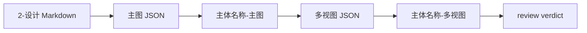

# 道具 3-生成

`$aigc-prop-generation` 是 AIGC 工作流中 `5-设计/道具/3-生成` 的 Skill 2.0 包。它消费上游 `2-设计` 的单道具设计文档，调用 `$imagegen` 生成单主体图与多视图主体设计图。

## 目录树

```text
3-生成/
├── references/
├── scripts/
├── templates/
├── review/
├── steps/
├── knowledge-base/
├── types/
├── agents/
│   └── openai.yaml
├── CHANGELOG.md
├── SKILL.md
├── CONTEXT.md
└── README.md
```

## 快速入口

- 调用名：`$aigc-prop-generation`
- 输入：`projects/aigc/<项目名>/5-设计/道具/2-设计/<主体名称>.md`
- 输出：`projects/aigc/<项目名>/5-设计/道具/3-生成/`
- 命名：`主体名称-主图`、`主体名称-多视图`，并为二者分别保存同名 JSON 提示词。

## 路由图



## 执行摘要

1. 读取 `SKILL.md + CONTEXT.md`，并加载项目记忆与 `$imagegen` 合同。
2. 从上游道具设计文档抽取“提示词设计”。
3. 生成单主体图与 JSON。
4. 以单主体图为参照，套用 `templates/prop-multiview-prompt.json` 生成多视图图与 JSON。
5. 执行 `review/review-contract.md` 门禁。

## 质量入口

- 结构校验：`python3 /Users/vincentlee/.codex/skills/meta/构建/技能/skill-工作车间/scripts/validate_skill_2_0.py .agents/skills/aigc/5-设计/道具/3-生成`
- 语义门禁：检查 `SKILL.md` 的 Visual Maps、`steps/` 的混合拓扑、`types/` 的 route map、`review/` 的 provider 降级记录、`templates/output-template.md` 的 Output Contract Alignment。
