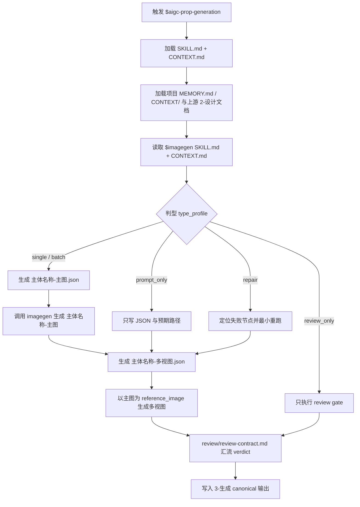
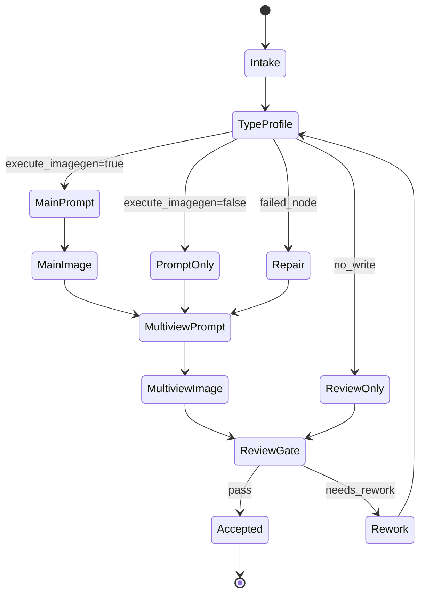

# aigc 道具 3-生成

`道具/3-生成` 负责消费上游 `道具/2-设计` 已经为目标道具细目式创建的设计文档，调用 `$imagegen` 生成图像资产：先为每份设计文档生成单主体图，再以单主体图为参照套用道具多视图模板生成多视图主体设计图。本技能不重新设计道具主体，不改写上游设计文档，不修改 registry、父级技能或其他设计线。除非用户显式要求其他 provider / API，本技能的唯一默认图像执行入口是 `.agents/skills/cli/imagegen`；不得直接路由到 `nano-banana`、Dreamina 或其他图像 API 技能。

## Context Loading Contract

- 每次调用 `$aigc-prop-generation` 时，必须同时加载同目录 `CONTEXT.md`。
- 每次调用本技能时，必须同时识别并加载同目录 `types/` 中选中的类型包（单选或多选）。
- 若任务绑定 `projects/aigc/<项目名>/`，必须先加载项目根 `MEMORY.md`，再按需加载项目根 `CONTEXT/` 中与道具、视觉风格、生成限制或资产命名相关的上下文文件。
- 必须读取对应上游设计文档：`projects/aigc/<项目名>/5-设计/道具/2-设计/<主体名称>.md`。
- 必须同时读取 `.agents/skills/cli/imagegen/SKILL.md + CONTEXT.md`；本阶段只负责把设计文档蒸馏为 imagegen 可执行输入并保存结果。
- 默认执行器边界：未获得用户显式 provider / API 指令时，只能通过 `.agents/skills/cli/imagegen` 进入图像生成；不得因为批量、参考图、多视图、质量、路径持久化或便利性而改走 `nano-banana`、Dreamina、AnyFast 子技能或其他外部执行器。
- 冲突优先级：用户显式请求 > 根 `AGENTS.md` / meta 规则 > 本 `SKILL.md` > `references/` / `steps/` / `review/` / `types/` / `templates/` > `agents/openai.yaml` > 项目 `MEMORY.md` > 项目 `CONTEXT/` > 本 `CONTEXT.md` > `$imagegen` 经验层。
- 生成提示词必须忠实引用相应道具/主体设计文档中的“提示词设计”。用户原始口径允许直接引用“相应角色设计文档中的提示词设计”，在本技能中收束为道具生成语境：相应道具或主体设计文档。

## Subagent Execution Contract

- 本技能默认启用真实 subagents 路径：主 agent 或调度层应将道具生成工作分发给 `Worker-道具生成`，并在需要质量复核时使用独立 reviewer subagent 汇流 verdict。
- 用户显式点名 `$aigc-prop-generation` 或本阶段路由命中时，视为仓库层已经许可该默认 subagent 路径；不得以“用户未额外授权并行”为理由回退。
- 若上层 system / developer / tool policy 或当前工具环境阻断真实 subagent dispatch，执行者必须显式报告阻断层级、原计划 subagent 路径、实际降级路径和未真实启动的 reviewer / worker。
- 子任务可按单个道具主体拆分；每个 worker 只处理自己领取的设计文档、图像与 JSON 提示词，最终由主 agent 聚合到 canonical 输出目录。

## Input Contract

Accepted input:

- 项目名、项目路径或明确的 `projects/aigc/<项目名>/`。
- 用户要求“道具生成”“道具生图”“从道具设计文档生成图像”“配置或执行 5-设计/道具/3-生成”等任务。
- 单个道具名称、多个道具名称，或默认处理 `道具/2-设计` 中全部目标设计文档。

Required input:

- 可定位的 `projects/aigc/<项目名>/5-设计/道具/2-设计/`。
- 每个被调度主体至少有一份上游 Markdown 设计文档，且包含“提示词设计”或等价英文生成提示词。
- 可用的 `.agents/skills/cli/imagegen` 路径；普通生成默认只以该 skill 作为图像执行入口，并遵循其内部路由。
- 若用户没有显式点名其他 provider / API / model，不得把本阶段任务交给 `nano-banana`、Dreamina、AnyFast 子技能或其他图像执行器。

Optional input:

- 用户指定的生成批次、道具子集、版本后缀、是否只生成 JSON 提示词不执行生图。
- 项目 `MEMORY.md` 与 `CONTEXT/` 中关于风格禁区、平台限制、资产归档和参考图策略的长期约束。

Reject or clarify when:

- 上游 `2-设计` 目录或指定设计文档不存在，且用户没有提供替代设计文档。
- 设计文档缺失可生成的“提示词设计”，且用户要求直接生图；应先回到 `2-设计` 修复。
- 用户要求本技能重新设计主体、补造道具设定、改写 `2-设计`、修改角色/场景目录、父级 registry 或其他 worker 的文件。
- 用户要求脚本代替 LLM 做审美判断、主体重设或提示词主创。

## Mode Selection

| mode | 触发信号 | 输出 |
| --- | --- | --- |
| `single_prop_generation` | 指定一个道具设计文档或主体名称 | 单主体图、单主体 JSON、多视图图、多视图 JSON |
| `batch_from_designs` | 指定项目或默认处理全部 `2-设计` 文档 | 每个设计文档一组生成资产 |
| `prompt_only` | 用户只要求配置提示词或 dry-run | JSON 提示词，不执行 imagegen |
| `incremental_fill` | `design-manifest.yaml` 或 `2-设计` 显示存在 `generation_gaps` | 只补缺主图、多视图或 JSON，不覆盖既有资产 |
| `repair` | 既有图像缺失、命名错误、JSON 与设计文档不一致 | 最小修复后的图像或 JSON |
| `review_only` | 用户只要求检查生成资产 | 审查报告或 findings；不改写文件，除非用户随后要求修复 |

## Reference Loading Guide

| 场景 | 必读文件 |
| --- | --- |
| 任意道具生成任务 | `references/prop-generation-contract.md`、`steps/prop-generation-workflow.md` |
| 设计稿增量后的生成缺口补齐 | `../../references/incremental-reconciliation-contract.md` |
| 主图、多视图、批量或提示词-only 分流 | `types/prop-generation-type-map.md` |
| 验收、修复和 reviewer 汇流 | `review/review-contract.md` |
| 单主体图 JSON 提示词 | `templates/single-subject-prompt.json` |
| 多视图主体设计图 JSON 提示词 | `templates/prop-multiview-prompt.json` |
| 脚本辅助边界与机械校验 | `scripts/README.md` |
| 可复用生成经验与漂移修复 | `knowledge-base/prop-generation-heuristics.md` |
| 产品入口元数据 | `agents/openai.yaml` |

## Visual Maps

## Execution Contract

1. 读取本 `SKILL.md + CONTEXT.md`，项目任务加载项目 `MEMORY.md` 与相关 `CONTEXT/`，再读取 `$imagegen SKILL.md + CONTEXT.md`。
2. 锁定被调度的上游 `2-设计` 文档，并读取可选 `projects/aigc/<项目名>/5-设计/道具/design-manifest.yaml`；只消费这些文档，不为未调度主体补空图、补占位 JSON 或重写设计正文。
3. 按 `types/prop-generation-type-map.md` 判型，形成 `type_profile`，决定 batch、prompt_only、incremental_fill 或 repair；已有主图、多视图和 JSON 默认跳过，覆盖必须有明确授权。
4. Step1：抽取每份设计文档中的“提示词设计”，生成单主体图与对应 JSON 提示词。
5. Step2：套用 `templates/prop-multiview-prompt.json`，以各个单主体图为参照图，生成多视图主体设计图与对应 JSON 提示词。
6. 写入 canonical 路径 `projects/aigc/<项目名>/5-设计/道具/3-生成/`，并可更新 `design-manifest.yaml` 的 `generation_assets` 与 `generation_gaps`；不得修改 `2-设计`、父级 registry、角色/场景生成目录或其他 worker 文件。
7. 按 `review/review-contract.md` 执行验收；可使用 `scripts/` 中说明的机械检查，但脚本不得替代 imagegen 执行或 LLM 的提示词裁决。

## Field Mapping

### Directory Ownership Table

| field_id | owner | requirement | fail_code |
| --- | --- | --- | --- |
| `FIELD-PROP-GEN-DIR-01` | `SKILL.md` | 入口、Input Contract、Reference Loading Guide、Visual Maps、Output Contract 与根因链路 | `FAIL-PROP-GEN-SKILL` |
| `FIELD-PROP-GEN-DIR-02` | `CONTEXT.md` | Type Map、Repair Playbook、Reusable Heuristics，且不写成流水日志 | `FAIL-PROP-GEN-CONTEXT` |
| `FIELD-PROP-GEN-DIR-03` | `references/` | 上游设计文档、prompt 源、imagegen 路由和非目标边界 | `FAIL-PROP-GEN-REFERENCE` |
| `FIELD-PROP-GEN-DIR-04` | `steps/` | 思行节点、Mermaid 拓扑、分支、汇流和失败回路 | `FAIL-PROP-GEN-STEPS` |
| `FIELD-PROP-GEN-DIR-05` | `types/` | 请求分型、`type_profile` schema、route 与 review focus | `FAIL-PROP-GEN-TYPES` |
| `FIELD-PROP-GEN-DIR-06` | `review/` | 可执行验收门禁、provider 规则和降级记录 | `FAIL-PROP-GEN-REVIEW` |
| `FIELD-PROP-GEN-DIR-07` | `templates/` | 主图 JSON、多视图 JSON、执行报告模板与 Output Contract Alignment | `FAIL-PROP-GEN-TEMPLATE` |
| `FIELD-PROP-GEN-DIR-08` | `scripts/` | 只做枚举、字段检查、dry-run 和机械校验 | `FAIL-PROP-GEN-SCRIPT` |

### Output Evidence Table

| field_id | 输出/证据 | 内容要求 | 失败码 |
| --- | --- | --- | --- |
| `FIELD-PROP-GEN-01` | 输入取证 | 上游设计文档、项目记忆、imagegen 合同和处理范围明确 | `FAIL-PROP-GEN-01` |
| `FIELD-PROP-GEN-02` | 主体边界 | 每组资产只对应一个道具主体，不混入角色、场景或其他道具重设计 | `FAIL-PROP-GEN-02` |
| `FIELD-PROP-GEN-03` | Step1 主图 | 单主体图来自设计文档提示词，命名为 `主体名称-主图` | `FAIL-PROP-GEN-03` |
| `FIELD-PROP-GEN-04` | Step2 多视图 | 多视图以主图为参照，套用道具多视图模板，命名为 `主体名称-多视图` | `FAIL-PROP-GEN-04` |
| `FIELD-PROP-GEN-05` | JSON 提示词 | 主图与多视图均有同名 JSON，能回指设计文档和参考图 | `FAIL-PROP-GEN-05` |
| `FIELD-PROP-GEN-06` | 输出落盘 | canonical 输出目录正确，未触碰非授权范围 | `FAIL-PROP-GEN-06` |

### Node Handoff Table

| node_id | input | action | output | next_gate |
| --- | --- | --- | --- | --- |
| `N1-INTAKE` | 用户请求、项目根、目标主体 | 锁定输入边界并加载本技能、项目上下文、上游设计文档和 `$imagegen` 合同 | `generation_scope` | `N2-TYPE` |
| `N2-TYPE` | `generation_scope` | 按 `types/prop-generation-type-map.md` 形成 `type_profile` | `type_profile` | `N3-MAIN-PROMPT` 或 `N7-REVIEW` |
| `N3-MAIN-PROMPT` | `type_profile` 与设计文档“提示词设计” | 写入单主体 JSON，不重设主体 | `<主体名称>-主图.json` | `N4-MAIN-IMAGE` 或 `N5-MULTIVIEW-PROMPT` |
| `N4-MAIN-IMAGE` | 单主体 JSON | 调用 `$imagegen` 并持久化主图 | `<主体名称>-主图.<ext>` | `N5-MULTIVIEW-PROMPT` |
| `N5-MULTIVIEW-PROMPT` | 主图路径与上游提示词 | 写入多视图 JSON，填入 `reference_image` | `<主体名称>-多视图.json` | `N6-MULTIVIEW-IMAGE` |
| `N6-MULTIVIEW-IMAGE` | 多视图 JSON 与主图参照 | 调用 `$imagegen` 并持久化多视图图 | `<主体名称>-多视图.<ext>` | `N7-REVIEW` |
| `N7-REVIEW` | 图像、JSON、路径、命名和来源证据 | 执行 review gate，记录 subagent 或降级状态 | `review_verdict` | done 或返工 |

### Failure Routing Table

| fail_code | symptom | rework_target |
| --- | --- | --- |
| `FAIL-PROP-GEN-SKILL` | 根入口缺少图表、输入输出合同或动态引用 | `SKILL.md` |
| `FAIL-PROP-GEN-STEPS` | steps 只有线性清单，缺少分支、汇流或失败回路 | `steps/prop-generation-workflow.md` |
| `FAIL-PROP-GEN-TYPES` | 批量、prompt-only、repair、review 的路由混在执行正文中 | `types/prop-generation-type-map.md` |
| `FAIL-PROP-GEN-REVIEW` | 无法说明 reviewer/subagent 是否真实启动或如何降级 | `review/review-contract.md` |
| `FAIL-PROP-GEN-TEMPLATE` | 输出报告没有对齐 Output Contract 五字段 | `templates/output-template.md` |
| `FAIL-PROP-GEN-01` | 无法回指上游设计文档或项目上下文 | `references/prop-generation-contract.md` |
| `FAIL-PROP-GEN-03` | 主图没有忠实消费“提示词设计” | `templates/single-subject-prompt.json` |
| `FAIL-PROP-GEN-04` | 多视图没有使用主图作为参照 | `templates/prop-multiview-prompt.json` |
| `FAIL-PROP-GEN-06` | 输出路径越界或触碰非授权文件 | `review/review-contract.md` 与 `$imagegen` persistence gate |

## Root-Cause Execution Contract (Mandatory)

出现以下问题时，必须沿链路上溯并修复源层合同：

- 生成阶段重写主体设计、补造叙事设定或覆盖 `2-设计`。
- 未引用相应道具/主体设计文档中的“提示词设计”就直接生图。
- Step2 多视图没有使用 Step1 单主体图作为参照。
- 新设计稿追加后没有识别生成缺口，或覆盖了已有主图、多视图或 JSON。
- JSON 提示词与实际图像命名、参考图或上游设计文档脱节。
- 输出写到 `2-设计`、父级、角色/场景目录、registry 或其他 worker 范围。
- subagent 默认路径被工具阻断时没有报告降级原因与未启动角色。

必经链路：

`Symptom -> Direct Script/Prompt Overreach -> 道具/3-生成 Section Owner -> Prop Generation Contract -> AGENTS.md LLM-first / Skill 2.0 / Subagent Rule`

## Output Contract

### Required output

1. 每个被调度道具主体输出一张单主体图、一个单主体 JSON 提示词、一张多视图主体设计图、一个多视图 JSON 提示词。
2. 单主体图必须直接消费相应设计文档中的“提示词设计”，不得重新设计主体。
3. 多视图主体设计图必须以对应单主体图为参照图，并套用当前 `templates/prop-multiview-prompt.json`。
4. 可选更新 `projects/aigc/<项目名>/5-设计/道具/design-manifest.yaml`，记录 `generation_assets` 和剩余 `generation_gaps`；manifest 不替代生成资产真源。

### Output format

| output_id | format |
| --- | --- |
| `OUTPUT-PROP-MAIN-IMAGE` | PNG/JPEG/WebP 图像资产 |
| `OUTPUT-PROP-MAIN-PROMPT` | JSON 提示词 |
| `OUTPUT-PROP-MULTIVIEW-IMAGE` | PNG/JPEG/WebP 图像资产 |
| `OUTPUT-PROP-MULTIVIEW-PROMPT` | JSON 提示词 |
| `OUTPUT-PROP-GEN-REPORT` | Markdown 执行/审查报告，可选 |

### Output path

| output_id | canonical path |
| --- | --- |
| `OUTPUT-PROP-MAIN-IMAGE` | `projects/aigc/<项目名>/5-设计/道具/3-生成/<主体名称>-主图.<ext>` |
| `OUTPUT-PROP-MAIN-PROMPT` | `projects/aigc/<项目名>/5-设计/道具/3-生成/<主体名称>-主图.json` |
| `OUTPUT-PROP-MULTIVIEW-IMAGE` | `projects/aigc/<项目名>/5-设计/道具/3-生成/<主体名称>-多视图.<ext>` |
| `OUTPUT-PROP-MULTIVIEW-PROMPT` | `projects/aigc/<项目名>/5-设计/道具/3-生成/<主体名称>-多视图.json` |
| `OUTPUT-PROP-GEN-REPORT` | `projects/aigc/<项目名>/5-设计/道具/3-生成/执行报告.md` |
| `OUTPUT-PROP-MANIFEST` | `projects/aigc/<项目名>/5-设计/道具/design-manifest.yaml` |

### Naming convention

- `<主体名称>` 优先使用上游 `2-设计` 文件标题或文件名的安全化结果。
- 单体图命名为 `主体名称-主图`；多视图命名为 `主体名称-多视图`。
- 同名或多状态道具可追加状态或首次登场 ID，但不得丢失 `-主图` / `-多视图` 后缀。
- 增量补缺默认跳过已有完整资产，只生成缺失的主图、多视图或 JSON。

### Completion gate

- 已读取本 `SKILL.md + CONTEXT.md`，项目任务已加载项目 `MEMORY.md` 与相关 `CONTEXT/`，并读取 `$imagegen SKILL.md + CONTEXT.md`。
- 每组资产都能回指一个上游 `2-设计` Markdown。
- 单主体 JSON 引用设计文档中的“提示词设计”；多视图 JSON 引用对应单主体图路径。
- 图像和 JSON 都落在 `projects/aigc/<项目名>/5-设计/道具/3-生成/`。
- 已识别并跳过既有完整资产；仅补齐缺主图、缺多视图、缺 JSON 或用户明确指定 repair 的主体。
- 已执行 `review/review-contract.md` 的人工 review、真实 reviewer subagent 或等价降级 review，并记录 verdict。
