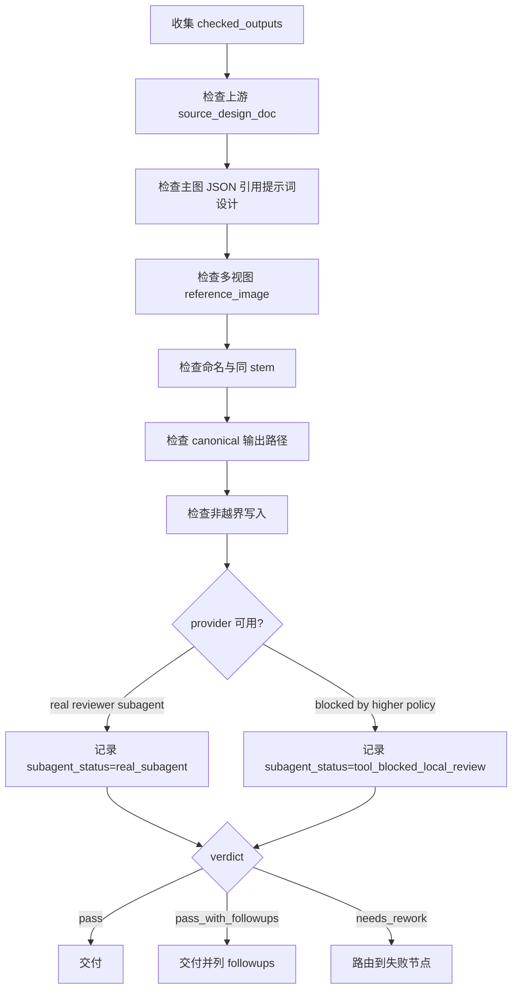

# Review Contract

本文件定义 `道具/3-生成` 的验收门禁。review 不拥有业务主真源改写权；修复建议必须回流到 `SKILL.md`、`references/`、`steps/` 或对应模板。

## Default Provider

- 默认辅助 provider：真实 reviewer subagent。
- 仓库层合同允许 `$aigc-prop-generation` 命中时启用 worker/reviewer subagent 路径。
- 若更高优先级 system / developer / tool policy 阻断真实 dispatch，降级为主 agent 本地 review checklist。
- 降级报告必须包含：阻断来源层级、原计划 provider 路径、实际路径、未真实启动的 reviewer / worker。

## Review Checklist

| check_id | gate | pass condition | fail route |
| --- | --- | --- | --- |
| `REV-PROP-GEN-01` | 上游取证 | 每组资产回指一个 `2-设计` Markdown | `references/prop-generation-contract.md` |
| `REV-PROP-GEN-02` | 主图忠实度 | 主图 JSON 直接引用设计文档“提示词设计”，未重新设计主体 | `templates/single-subject-prompt.json` |
| `REV-PROP-GEN-03` | 多视图参照 | 多视图 JSON 使用对应 `主体名称-主图` 作为 `reference_image` | `templates/prop-multiview-prompt.json` |
| `REV-PROP-GEN-04` | 命名 | 图像与 JSON 同 stem，包含 `-主图` 或 `-多视图` | `SKILL.md Output Contract` |
| `REV-PROP-GEN-05` | 路径 | 所有项目资产落入 `projects/aigc/<项目名>/4-设计/道具/3-生成/` | `$imagegen` persistence gate |
| `REV-PROP-GEN-06` | 非越界 | 未修改 `2-设计`、父级 registry、角色/场景生成目录或其他 worker 文件 | 根写入边界 |

## Review Flow



## Degradation Matrix

| blocker_layer | original_path | fallback_path | required_record |
| --- | --- | --- | --- |
| `system` | reviewer subagent | local checklist review | system policy blocked dispatch；未启动 reviewer |
| `developer` | reviewer subagent | local checklist review | developer policy blocked dispatch；未启动 reviewer |
| `tool` | reviewer subagent | local checklist review | tool unavailable or failed；未启动 reviewer |
| `user` | reviewer subagent | user-requested no-subagent review | user explicitly disabled subagents |

## Verdict Schema

```yaml
verdict: pass | pass_with_followups | needs_rework | blocked
reviewer: ""
subagent_status: real_subagent | tool_blocked_local_review | not_requested
degradation:
  blocker_layer: ""
  original_path: ""
  fallback_path: ""
  not_started: []
checked_outputs:
  - subject: ""
    main_image: ""
    main_prompt_json: ""
    multiview_image: ""
    multiview_prompt_json: ""
findings: []
next_action: ""
```

## Provider Rule

- 默认优先使用真实 reviewer subagent。
- 若工具层阻断真实 subagent dispatch，可降级为主 agent 本地 review，但必须记录 `subagent_status: tool_blocked_local_review` 并说明未真实启动的 reviewer。
- 若上层 developer policy 要求只有用户显式请求 subagents 时才能启动，则本技能执行记录应写 `blocker_layer: developer`，原路径为 `reviewer subagent`，实际路径为 `local checklist review`。
