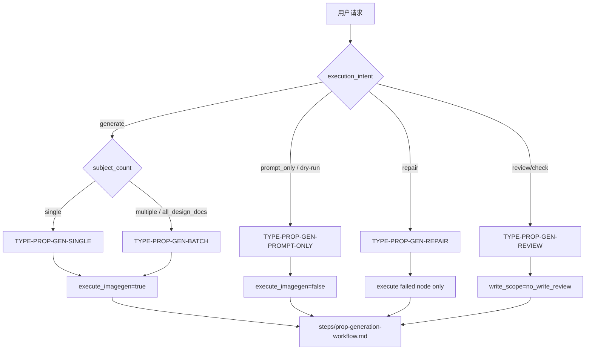

# Prop Generation Type Map

## 类型包加载边界

- 每次调用本技能时，必须依据本文件识别并加载同目录 `types/` 中选中的类型包（单选或多选）。
- `types/` 中命中的类型包作为固定上下文加载；`knowledge-base/` 只作为按需检索、切片或向量召回的知识库，不替代类型包。


本文件定义 `道具/3-生成` 的请求分型。执行前先形成 `type_profile`，再进入 `steps/prop-generation-workflow.md`。

## Type Variables

| variable | values | owner |
| --- | --- | --- |
| `subject_count` | `single` / `multiple` / `all_design_docs` | `N1-INTAKE` |
| `execution_intent` | `generate` / `prompt_only` / `repair` / `review_only` | 用户请求与 `N2-TYPE` |
| `execute_imagegen` | `true` / `false` | `type_profile` |
| `imagegen_mode` | `imagegen_skill_default` / `imagegen_skill_with_reference` / `imagegen_cli_explicit` / `external_provider_explicit` | `.agents/skills/cli/imagegen` 合同与用户显式 provider 选择 |
| `reference_context_status` | `pending_view_image` / `visible_in_conversation_context` / `no_reference_image` | 本地主图参照是否已通过 `view_image` 进入上下文 |
| `write_scope` | `3-生成-only` / `no_write_review` | `SKILL.md Output Contract` |
| `repair_scope` | `main_prompt` / `main_image` / `multiview_prompt` / `multiview_image` / `json_path` | `review/review-contract.md` findings |

## Type Matrix

| type_id | trigger | route | required templates | review focus |
| --- | --- | --- | --- | --- |
| `TYPE-PROP-GEN-SINGLE` | 用户指定单个道具或单份设计文档 | `single_prop_generation` | `single-subject-prompt.json`、`prop-multiview-prompt.json` | 单主体忠实度、主图参照链 |
| `TYPE-PROP-GEN-BATCH` | 用户指定项目或全部 `2-设计` 文档 | `batch_from_designs` | 同上，每个主体独立实例化 | 不合并主体、命名不冲突 |
| `TYPE-PROP-GEN-PROMPT-ONLY` | 用户要求只输出 JSON / dry-run | `prompt_only` | 同上 | JSON 可复跑，预期路径完整 |
| `TYPE-PROP-GEN-REPAIR` | 已有资产缺失、错名、错路径或 JSON 脱节 | `repair` | 按失败节点选择 | 最小修复、不触碰无关资产 |
| `TYPE-PROP-GEN-REVIEW` | 用户只要求检查 | `review_only` | 无新增模板，读取现有 JSON | findings 准确、无写入 |

## Routing Diagram



## Type Profile Schema

```yaml
type_profile:
  type_id: ""
  project_root: "projects/aigc/<项目名>"
  source_design_docs: []
  output_dir: "projects/aigc/<项目名>/5-设计/道具/3-生成"
  execute_imagegen: true
  imagegen_mode: imagegen_skill_default
  allow_cli_fallback: false
  allow_external_provider: false
  reference_context_status: pending_view_image
  subjects: []
```

## Route To Step Map

| route | node sequence | write behavior |
| --- | --- | --- |
| `single_prop_generation` | `N1 -> N2 -> N3 -> N4 -> N5 -> N6 -> N7` | 写入一个主体的两图两 JSON 与可选报告 |
| `batch_from_designs` | `N1 -> N2 -> per subject N3-N7 -> batch verdict` | 每个主体独立输出，不合并 prompt |
| `prompt_only` | `N1 -> N2 -> N3 -> N5 -> N7` | 只写 JSON 或按用户要求只返回 JSON 内容 |
| `repair` | `N1 -> N2 -> failed node -> downstream deps -> N7` | 最小重写失败节点及依赖产物 |
| `review_only` | `N1 -> N2 -> N7` | 默认无写入，只输出 findings / verdict |

## Routing Notes

- `execute_imagegen: false` 只允许在 `prompt_only` 或用户明确暂停生图时使用。
- `allow_cli_fallback: true` 只能来自用户显式选择，并且默认仍通过 `.agents/skills/cli/imagegen` 入口执行，不能由批量、质量或路径需求自动推导。
- `allow_external_provider: true` 只能来自用户显式点名其他 provider / API / model；否则不得调用 `nano-banana`、Dreamina、AnyFast 子技能或其他图像执行器。
- 批量任务必须拆成每个主体独立 prompt 和独立 imagegen 调用。
- 真实多视图生成必须先将对应主图 `view_image` 到对话上下文，不能只把本地路径写进 `reference_image`。
- `review_only` 的 `write_scope` 固定为 `no_write_review`；不得为了“修正结构完整性”补空 JSON 或占位图。
