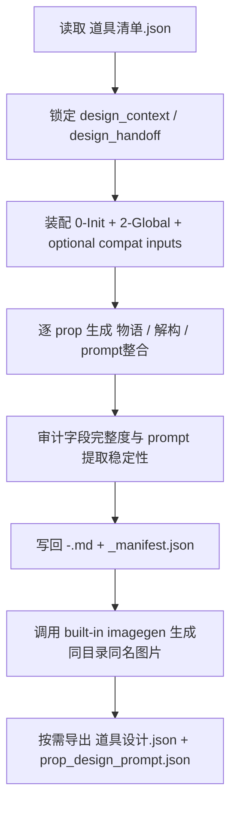
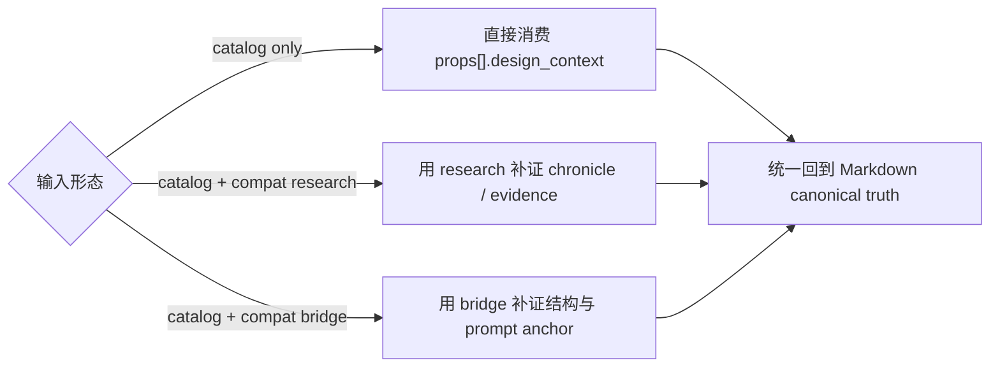
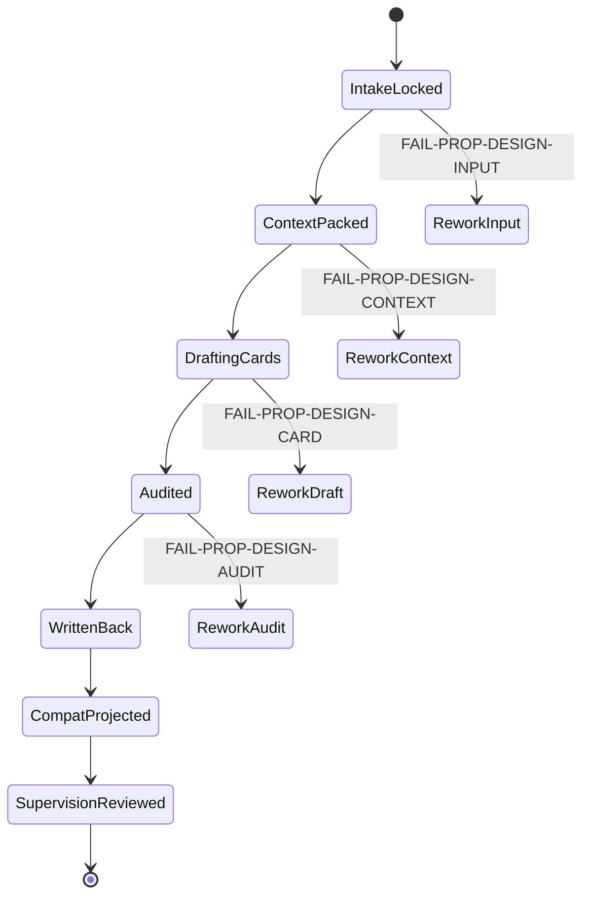

# aigc 5-设计 / 2-设计 / 道具

## Context Loading Contract

- 每次调用本技能时，必须同时加载同目录 `CONTEXT.md` 作为预加载上下文。
- 若同目录 `CONTEXT.md` 缺失，应先补齐最小知识库骨架，或向用户明确报告阻塞；不得在未检查该上下文的情况下执行技能。
- 冲突优先级：用户显式请求 > 仓库/全局 `AGENTS.md` > 本 `SKILL.md` > 同目录 `CONTEXT.md`。

## 概述

`2-设计/道具` 是 `5-设计` 阶段承接 `1-清单/道具`、连接 `3-面板 / 5-Image / 6-Video` 的设计叶子技能。

它的职责不是重新研究道具，也不是让兼容 JSON 抢走主稿，而是把上游 `道具清单.json.props[].design_context`、`0-Init` 约束与 `2-Global` 风格基线，收束为当前仓已验证的 canonical runtime：

1. `<prop_id>-<canonical_name>.md`
   逐道具 Markdown 设计卡，默认业务真源
2. `<prop_id>-<canonical_name>.<ext>`
   built-in imagegen 单主体图片，默认内置 imagegen 请求准备，与设计卡同目录同 stem
3. `_manifest.json`
   lineage、coverage、兼容导出状态与 handoff 审计侧车
4. `道具设计.json`（仅在显式兼容导出时）
5. `prop_design_prompt.json`（仅在显式兼容导出时）

本技能遵循知行合一的单文档编排方式：业务分析、输入装配、思行节点、门禁、输出治理与返工都写在本 `SKILL.md`；`_shared/IO_CONTRACT.md` 与脚本只承担辅助真源，不再反客为主。

## LLM-First Creative Authorship Contract (Mandatory)

- `道具设计` 属于内容创作型任务；逐道具设计卡、`prompt整合`、叙事器物描述与其他创作性设计正文，必须由 LLM 直接完成。
- `run_prop_design_pipeline.py / build_prop_design_packets.py` 不得再被视为默认主创入口；它们只允许用于受控兼容迁移、既有 LLM 真源的模板投影、批量落盘或结构校验前的机械辅助。
- 当前 skill 的默认执行路径必须是：`LLM 直出 canonical creative truth -> validator / projector / auto-image helper`。
- 若确需临时运行旧式脚本主创，只能以受控兼容模式显式传入 `--allow-legacy-script-authorship`，且不得把该路径重新升回默认流程。

## Business Requirement Analysis Contract

| 分析槽位 | 当前答案 |
| --- | --- |
| `business_goal` | 把 `1-清单` 已结构化的 `design_context` 升级为可复用的逐道具设计卡，并为 `3-面板 / 5-Image / 6-Video` 提供稳定 handoff |
| `business_object` | `道具清单.json.props[]`、其中的 `design_context / design_handoff / narrative_significance`、兼容 sidecars、`0-Init` 基线、`2-Global` 风格与类型约束 |
| `constraint_profile` | 不重新发明对象池；默认不要求 compat bridge/research 存在；逐道具 Markdown 才是 canonical truth；兼容 JSON 只能按显式开关导出；`**prompt整合**` 必须可被下游稳定提取 |
| `success_criteria` | 每个 prop 都产出 `物语 / 解构 / prompt整合` 三段式设计卡，且 `_manifest.json` 能说明输入来源、统计、兼容导出状态与下游入口 |
| `non_goals` | 不直接生成面板、多视图或视频；不回写 `3-Detail` 或 `1-清单` 真源；不把 prompt 反向升格为业务事实；不让 compat JSON 抢走 Markdown 主稿 |
| `complexity_source` | 旧仓配置以 bridge/json 为中心，而当前仓真实 runtime 已切到 `catalog + Markdown`；要同时保留字段密度、上游 traceability 与 compat projection，又不能制造第二真源 |
| `topology_fit` | 适合采用“输入锁定 -> context 装配 -> 逐 prop 设计卡 synthesis -> 审计/compat projection -> 写回”的串行主干，局部失败回到最近节点 |

## Total Input Contract

### 必需输入

- `projects/aigc/<项目名>/4-设计/道具/1-清单/第N集/道具清单.json`
- `projects/aigc/<项目名>/0-Init/north_star.yaml`
- `projects/aigc/<项目名>/0-Init/init_handoff.yaml`
- `projects/aigc/<项目名>/2-Global/全局风格.md`
- `projects/aigc/<项目名>/2-Global/全集类型元素.md`

### 补充输入

- `projects/aigc/<项目名>/4-设计/道具/1-清单/第N集/道具研究.json`（兼容）
- `projects/aigc/<项目名>/4-设计/道具/1-清单/第N集/prop_design_bridge.json`（兼容）
- `projects/aigc/<项目名>/3-Detail/第N集.json`（仅用于镜头事实回链或 traceability 补证，不得升为默认输入根）
- `projects/aigc/<项目名>/2-Global/导演意图.md`
- `.agents/skills/aigc/5-设计/2-设计/道具/_shared/IO_CONTRACT.md`
- `.agents/skills/aigc/5-设计/2-设计/道具/templates/prop_masterprompt.structured.v2.md`
- `.agents/skills/aigc/5-设计/2-设计/_shared/design-slot-review-contract.md`
- `.agents/skills/aigc/5-设计/1-清单/道具/SKILL.md`
- `.agents/skills/aigc/5-设计/1-清单/_shared/list-output-contract.md`
- `.agents/skills/aigc/_shared/council-runtime/module-spec.md`
- `.agents/skills/aigc/5-设计/2-设计/_shared/subagent-supervision-contract.md`
- `projects/aigc/<项目名>/team.yaml`（若存在）

### 固定输出落点

- `projects/aigc/<项目名>/4-设计/道具/2-设计/第N集/<prop_id>-<canonical_name>.md`
- `projects/aigc/<项目名>/4-设计/道具/2-设计/第N集/<prop_id>-<canonical_name>.<ext>`
- `projects/aigc/<项目名>/4-设计/道具/2-设计/第N集/_manifest.json`
- `projects/aigc/<项目名>/4-设计/道具/2-设计/第N集/道具设计.json`（仅在显式兼容导出时）
- `projects/aigc/<项目名>/4-设计/道具/2-设计/第N集/prop_design_prompt.json`（仅在显式兼容导出时）

### 输入硬门槛

1. 第一输入根固定为 `道具清单.json`，不得把 `prop_design_bridge.json` 重新升回默认主输入。
2. `道具清单.json.props[].design_context` 缺失时必须阻塞并回退到 `1-清单/道具`，而不是在 `2-设计` 自行补猜。
3. `0-Init` 与 `2-Global` 产物默认作为设计约束源；若缺失，必须在 `_manifest.json.notes` 中显式记录降级，而不是静默继续。
4. 下游 prompt 默认从 Markdown 的 `**prompt整合**` 区块读取；compat JSON 只在显式兼容模式下导出。
5. 生图 prompt 必须按 `_shared/design-output-contract.md` 自动加载统一全局风格前缀，形成 `full_generation_prompt` 后再按共享执行合同内置 imagegen 请求准备 built-in imagegen。

## Canonical Anchors

| 载体 | 位置 | 作用 |
| --- | --- | --- |
| 第一输入根 | `projects/aigc/<项目名>/4-设计/道具/1-清单/第N集/道具清单.json` | 本阶段唯一默认 design-source truth |
| 兼容研究 | `projects/aigc/<项目名>/4-设计/道具/1-清单/第N集/道具研究.json` | 仅在存在时补证，不反客为主 |
| 兼容 bridge | `projects/aigc/<项目名>/4-设计/道具/1-清单/第N集/prop_design_bridge.json` | 仅在存在时补证，不反客为主 |
| 初始化约束 | `projects/aigc/<项目名>/0-Init/north_star.yaml` / `init_handoff.yaml` | 世界观、题材与初始化边界 |
| 全局风格 | `projects/aigc/<项目名>/2-Global/全局风格.md` | 项目级视觉母体 |
| 类型元素 | `projects/aigc/<项目名>/2-Global/全集类型元素.md` | 类型打法与风格约束 |
| 设计元素 | `projects/aigc/<项目名>/2-Global/导演意图.md` | 设计语言补充证据 |
| episode 根文件 | `projects/aigc/<项目名>/3-Detail/第N集.json` | 仅用于回链镜头事实与状态；不得替代 `道具清单.json` 的 design-source 主权 |
| shared I/O | `.agents/skills/aigc/5-设计/2-设计/道具/_shared/IO_CONTRACT.md` | 输入输出、命名与 compat 投影合同 |
| shared output | `.agents/skills/aigc/5-设计/2-设计/_shared/design-output-contract.md` | 全局风格前缀、完整 prompt 与同目录同名图片快路径真源 |
| image execution | `.agents/skills/aigc/_shared/image-generation-execution-contract.md` | 默认内置 imagegen执行模式真源 |
| Markdown 模板 | `.agents/skills/aigc/5-设计/2-设计/道具/templates/prop_masterprompt.structured.v2.md` | 逐道具 Markdown projection 的固定结构真源 |
| slot review | `.agents/skills/aigc/5-设计/2-设计/_shared/design-slot-review-contract.md` | 当前轮 `<prop_id>-<canonical_name>.md + _manifest.json` 如何解析成 `PROP-BUNDLE-*` 的共享评审与返工真源 |
| shared supervision | `.agents/skills/aigc/5-设计/2-设计/_shared/subagent-supervision-contract.md` | 输出后 `team.yaml -> reviewer -> subagents council` 的阶段收尾真源 |
| team runtime | `projects/aigc/<项目名>/team.yaml` | 当前项目 `5-设计` closeout 的 refine / review-gate / subagents runtime 真源 |

## Visual Maps







## Route And Topology Contract (Mandatory)

### 默认模式

1. `full-build`
   - 从当前 episode 的 catalog 全量生成逐道具设计卡
2. `incremental-repair`
   - 只补指定 `prop_id / canonical_name`
3. `prompt-refresh`
   - 在保留既有设计卡事实的前提下只刷新 `**prompt整合**`
4. `compat-projection`
   - 在 canonical Markdown 已稳定时显式补写兼容 JSON

### 路由规则

1. 只要缺的是道具设计卡、prompt carrier 或下游 handoff，统一先进入本叶子技能。
2. 缺 `道具清单.json` 或 `design_context` 时，立即阻塞并回退到 `1-清单/道具`。
3. `compat-projection` 只能建立在 Markdown 主稿已经稳定的前提下。
4. 任一模式最终都必须先回到 Markdown canonical truth，再决定是否导出 compat JSON。

## Template Binding Contract (Mandatory)

1. 逐道具 Markdown projection 必须绑定 `templates/prop_masterprompt.structured.v2.md`。
2. 模板结构直接继承 AIGC-ZEN-VOID 原参照结构，当前仓只将载体格式改为 `.md`。
3. 模板顺序固定：
   - `物语`
   - `解构`
   - `Photography`
   - `Prop Design`
   - `prompt整合`
4. `prompt整合` 的语义是对同一模板文件中其上方全部内容做英文整合，必须覆盖 `解构`、`Photography` 与 `Prop Design` 中的功能骨架、材质、形状、纹理、文化元素、人体工学、状态痕迹和负面约束，并形成可直接生图的完整 brief。
5. `Integrated prompt:` 正文必须完全为英文 ASCII 文本，目标约 2000 UTF-8 bytes，硬门范围为 1800-2200 bytes；不得输出中文字段拼接、列表堆叠、过短主体提示词或超长资料压缩稿。
6. 道具设计图片必须固定为纯道具参照图；`Integrated prompt` 必须包含 `isolated pure prop view`、`no hands` 与 `no characters`，且不得要求角色、手持姿态、身体局部、使用者、表演动作或复杂场景入画，避免后续参照图人物/手部污染。
7. `prompt整合` 内必须显式包含 `Global style prefix: [global_style_prefix]`；该英文前缀只能从 `projects/aigc/<项目名>/2-Global/全局风格.md` 的 `- 全局风格：` 字段转写，不得混入其他章节。
8. 脚本只允许填充模板槽位，不得手工拼接第二套 Markdown 章节结构。

## Thinking-Action Node Network

### NODE-PROP-DESIGN-01 输入锁定与模式判型

- `objective`
  - 判断当前是全量生成、局部返工、prompt 刷新，还是 compat 投影。
- `inputs`
  - `道具清单.json`
  - 用户目标
  - 已存在的 `*.md / _manifest.json`
- `actions`
  1. 确认 `道具清单.json` 是否存在。
  2. 确认 `props[].design_context` 是否完整到足以进入设计阶段。
  3. 判定 `task_mode` 与本轮命中的 prop 范围。
  4. 缺输入时立即阻塞，不进入后续节点。
- `evidence`
  - `task_mode`
  - `selected_props[]`
  - `blocked_reason`（如有）
- `route_out`
  - 通过 -> `NODE-PROP-DESIGN-02`
  - 缺输入或 design_context -> `FAIL-PROP-DESIGN-INPUT`
- `gate`
  - 只有 `task_mode` 与 `selected_props[]` 明确后，才允许进入 context 装配。

#### 着手面

- 输入层：是否存在正确 episode 的 catalog。
- 结构层：`design_context` 是否已含 `design_handoff / narrative_significance`。
- 调度层：本轮是全量、局部还是 compat-only。

### NODE-PROP-DESIGN-02 设计上下文装配

- `objective`
  - 将 `0-Init / 2-Global / optional compat inputs` 与 `design_context` 收束成统一设计上下文。
- `inputs`
  - catalog props
  - optional research / bridge
  - `north_star.yaml`
  - `init_handoff.yaml`
  - `全局风格.md`
  - `类型元素.md`
  - `导演意图.md`（若存在）
- `actions`
  1. 为每个命中 prop 组装 `design_packet`，把 `design_handoff` 作为结构化第一骨架。
  2. 从 `narrative_significance` 明确是否属于特殊叙事道具。
  3. 把 `north_star / init_handoff / 全局风格 / 类型元素` 压缩为可被设计卡直接消费的约束。
  4. 若 compat bridge/research 存在，仅作为补证而非默认第一输入。
- `evidence`
  - `design_packet_<prop_id>`
  - `constraint_bundle`
  - `compat_sources_used`
- `route_out`
  - 装配完成 -> `NODE-PROP-DESIGN-03`
  - 全局约束缺失且无法降级 -> `FAIL-PROP-DESIGN-CONTEXT`
- `gate`
  - 每个 prop 都必须拿到统一的 `design_packet`，才能进入设计卡 synthesis。

#### 着手面

- 约束层：init/global 是否足够锁住世界观与风格母体。
- 叙事层：特殊叙事道具是否已显式标红。
- 证据层：compat sidecar 是否只是补证，而不是反向夺权。

### NODE-PROP-DESIGN-03 逐道具设计卡 synthesis

- `objective`
  - 为每个 prop 生成 `物语 / 解构 / prompt整合` 三段式 Markdown 设计卡，并把画面固定为纯道具参照资产。
- `inputs`
  - `design_packet_<prop_id>`
  - `constraint_bundle`
- `actions`
  1. `物语`：用 `chronicle + narrative_significance + display_profile` 写出器物物语，而不是百科摘要。
  2. `解构`：固定输出 `Reasoning Pivot`、`## Photography ##`、`## Prop Design ##`，把结构、材质、尺寸、镜头、文化与叙事焦点转成可读设计事实。
  3. 参照洁净转写：把上游的手持、使用、触碰、角色动作或身体局部，转写为器物表面、功能端、受力点、状态痕迹或离屏使用语境；不得把手、角色、持有者或复杂场景作为入画主体。
  4. `prompt整合`：从同一模板中上方所有已落位内容整合，显式包含英文 `Global style prefix`，并用约 2000 UTF-8 bytes 的英文 `Integrated prompt` 形成下游 `3-面板 / 5-Image` 可消费的完整 prompt，不新增业务事实；必须包含 `isolated pure prop view`、`no hands` 与 `no characters`。
  5. 文件名默认收束为 `<prop_id>-<canonical_name>.md`。
- `evidence`
  - `markdown_card_<prop_id>`
  - `prompt_block_<prop_id>`
  - `reference_cleanliness_note_<prop_id>`
- `route_out`
  - 设计卡完成 -> `NODE-PROP-DESIGN-04`
  - 缺段落、prompt 自创事实、文件名漂移 -> `FAIL-PROP-DESIGN-CARD`
  - 缺纯道具锚句或出现手、角色、持有者、身体局部、复杂场景正向要求 -> `FAIL-PROP-DESIGN-REFERENCE-CONTAMINATION`
- `gate`
  - 每个设计卡都必须同时拥有 `**物语**`、`**解构**`、`**prompt整合**` 三段；`Integrated prompt` 未通过纯道具参照门禁时不得进入写回。

#### 着手面

- 文稿层：三段是否完整、是否可直接给人审。
- 事实层：prompt 是否完全回链前文事实。
- 参照层：使用逻辑是否已转写为器物自身证据，而不是手持或角色入画。
- 命名层：文件名是否稳定、可由 `prop_id + canonical_name` 推断。

### NODE-PROP-DESIGN-04 审计、compat projection 与统一写回

- `objective`
  - 审计 Markdown 主稿，写回 manifest，并在显式需要时导出 compat JSON。
- `inputs`
  - `markdown_card_<prop_id>`
  - 已存在输出物
  - `task_mode`
- `actions`
  1. 复核每个 Markdown 是否可稳定提取 `**prompt整合**`。
  2. 写回 `_manifest.json`，记录 `inputs / outputs / statistics / notes / compat projection`。
  3. 若显式命中 compat 模式，再从 Markdown 与 design packets 投影 `道具设计.json + prop_design_prompt.json`。
  4. 写清下一入口默认是 `3-面板/道具`，图像阶段按需读取 `**prompt整合**` 或 compat JSON。
- `evidence`
  - `_manifest.json`
  - optional `道具设计.json`
  - optional `prop_design_prompt.json`
- `route_out`
  - 审计通过 -> `NODE-PROP-DESIGN-05`
  - 缺 prompt 标记、compat 抢权或 manifest 不完整 -> `FAIL-PROP-DESIGN-AUDIT`
- `gate`
  - 只有 Markdown 主稿与 `_manifest.json` 已稳定落盘，才允许进入自动生图；compat JSON 不再是默认硬门槛。

#### 着手面

- 审计层：prompt section、统计、compat 状态是否齐全。
- 真源层：compat JSON 是否仍被正确降级为 optional projection。
- 下游层：`3-面板` 是否能直接从当前输出提取 prompt。

### NODE-PROP-DESIGN-05 单主体自动生图

- `objective`
  - 为每个已落盘且通过纯道具参照门禁的逐道具 Markdown 设计卡生成同目录同名图片。
- `inputs`
  - `<prop_id>-<canonical_name>.md`
  - `projects/aigc/<项目名>/2-Global/全局风格.md`
  - `_manifest.json`
- `actions`
  1. 从 Markdown `**prompt整合**` 提取主体 prompt。
  2. 自动加载统一全局风格前缀，生成 `full_generation_prompt`。
  3. 生图前复验 `isolated pure prop view / no hands / no characters`，并复核 prompt 不正向要求手、身体局部、持有者、角色或复杂场景。
  4. 默认内置 imagegen 请求准备 `内置 $imagegen / image_gen`，目标输出 `<prop_id>-<canonical_name>.<ext>`。
  5. 在 `_manifest.json.auto_image` 记录 provider、prompt 字段、输出路径、状态与 `reference_cleanliness_note`。
- `evidence`
  - `full_generation_prompt`
  - `reference_cleanliness_note`
  - `auto_image_path`
  - `_manifest.json.auto_image`
- `route_out`
  - 生图完成 -> final output
  - prompt 缺前缀、API 失败、文件未同名同目录 -> `FAIL-PROP-DESIGN-AUTO-IMAGE`
  - 纯道具门禁失败 -> `FAIL-PROP-DESIGN-REFERENCE-CONTAMINATION`
- `gate`
  - 正式结案前必须有同目录同 stem 图片，除非用户显式要求 dry-run 或跳过图片；纯道具门禁失败时不得调用生图，必须回到 `NODE-PROP-DESIGN-03`。

### NODE-PROP-DESIGN-06 输出后审计占位

- `objective`
  - 在道具 canonical 输出写完后，依据项目根 `team.yaml` 明确 `roles.supervision` 不再承担当前轮 closeout；如需后置问题，只写 audit note。
- `inputs`
  - 当前轮 `<prop_id>-<canonical_name>.md`
  - 当前轮 `_manifest.json`
  - `projects/aigc/<项目名>/team.yaml`
  - `.agents/skills/aigc/5-设计/2-设计/_shared/subagent-supervision-contract.md`
  - `.agents/skills/aigc/5-设计/2-设计/_shared/design-slot-review-contract.md`
- `actions`
  1. 按共享占位合同确认当前轮 closeout 不再由 `监制` 执行。
  2. 若需后置问题记录，先把当前轮道具输出解析成 `PROP-BUNDLE-01~04`。
  3. 将问题写入 audit note / handoff，并按需补阶段 `validation-report.md`。
- `evidence`
  - `post_write_audit_note`
- `route_out`
  - 审计占位说明完成 -> final output
  - 仍误触发 `监制` closeout -> `FAIL-PROP-DESIGN-SUPERVISION-REVIEW`
- `gate`
  - 不得把 `source_skill_refs` 误当 runtime 授权或 post-write reviewer。

## Projection And Validation Helpers

legacy 兼容投影入口：

```bash
python3 .agents/skills/aigc/5-设计/2-设计/道具/scripts/run_prop_design_pipeline.py \
  --catalog "projects/aigc/<项目名>/4-设计/道具/1-清单/第N集/道具清单.json" \
  --allow-legacy-script-authorship
```

单主体图片快路径：

```bash
python3 .agents/skills/aigc/5-设计/2-设计/_shared/scripts/run_design_auto_image.py \
  --design-file "projects/aigc/<项目名>/4-设计/道具/2-设计/第N集/<prop_id>-<canonical_name>.md"
```

## Convergence Contract

本技能允许结案，必须同时满足：

1. 当前 episode 的 `道具清单.json` 已正确锁定。
2. 每个命中 prop 都有 `**物语** / **解构** / **prompt整合**` 三段式设计卡。
3. `**prompt整合**` 可从前两段事实稳定回链，而不是另起炉灶。
4. `_manifest.json` 已写明统计、兼容导出状态与下一入口。
5. `full_generation_prompt` 已包含统一全局风格前缀。
6. 同目录同 stem 的 `<prop_id>-<canonical_name>.<ext>` 已由 built-in imagegen 生成。
7. 逐道具 Markdown、图片与 `_manifest.json` 已同轮落到 `5-设计/道具/2-设计/第N集/`。

任一条件不满足，都必须回到最近失败节点返工。

## Canonical Output Governance (Mandatory)

### 唯一业务真源

- `<prop_id>-<canonical_name>.md`
  - 逐道具 Markdown 设计卡；当前仓默认 canonical design truth
- `_manifest.json`
  - 审计与批处理侧车；记录输入来源、输出文件、统计与 compat 状态

### 派生图片

- `<prop_id>-<canonical_name>.<ext>`
  - 由 `full_generation_prompt` 调用 built-in imagegen 生成；是单主体概念图派生产物，不是业务真源

### 兼容投影

- `道具设计.json`
  - 仅在显式 compat 模式下导出；为旧下游保留 machine-first 投影
- `prop_design_prompt.json`
  - 仅在显式 compat 模式下导出；为旧下游保留 prompt sidecar

### 不拥有的真源

- 不改写 `3-Detail/第N集.json`
- 不改写 `1-清单/道具` 的 `道具清单.json`
- 不把兼容 JSON 重新升格为默认 design master

## One-Shot Output Contract

### 最终结果

- `projects/aigc/<项目名>/4-设计/道具/2-设计/第N集/*.md`
- `projects/aigc/<项目名>/4-设计/道具/2-设计/第N集/*.<ext>`
- `projects/aigc/<项目名>/4-设计/道具/2-设计/第N集/_manifest.json`
- 命中 compat 模式时，额外写出 `道具设计.json + prop_design_prompt.json`

### 思考过程

- 第一输入根为何锁定为 `道具清单.json`
- `design_context` 如何映射到 `物语 / 解构 / prompt整合`
- 特殊叙事道具如何得到额外结构与 prompt 焦点
- `.agents/skills/aigc/5-设计/2-设计/道具/templates/prop_masterprompt.structured.v2.md` 如何作为唯一 Markdown 模板真源
- compat sidecar 为何只能由 canonical Markdown 投影，而不能反向夺权

### 核心证据

- `selected_props[]`
- `statistics.prop_count`
- `statistics.special_narrative_prop_count`
- `statistics.used_catalog_primary_input`
- `statistics.used_compat_bridge_fallback`
- `statistics.has_compat_design_projection`

### 风险 / 未完成支路

- evidence 稀薄的 prop
- 被 manifest 标记为降级处理的 init/global 缺口

### 下一步

- 默认进入 `.agents/skills/aigc/5-设计/3-面板/道具`

## Field Master

| field_id | 输出位置/字段 | 内容要求 | 默认责任 Step | 质量维度 | 失败码 |
| --- | --- | --- | --- | --- | --- |
| `FIELD-PROP-DESIGN-01` | `*.md` | 每个 prop 都有稳定文件名与标题 | `NODE-PROP-DESIGN-03` | 路径与 identity 稳定性 | `FAIL-PROP-DESIGN-CARD` |
| `FIELD-PROP-DESIGN-02` | `*.md / 物语` | 必须承接 chronicle、display、叙事权重 | `NODE-PROP-DESIGN-03` | 物语密度 | `FAIL-PROP-DESIGN-CARD` |
| `FIELD-PROP-DESIGN-03` | `*.md / 解构` | 必须按模板含 `Reasoning Pivot`、`## Photography ##`、`## Prop Design ##` | `NODE-PROP-DESIGN-03` | 结构可执行性 | `FAIL-PROP-DESIGN-CARD` |
| `FIELD-PROP-DESIGN-04` | `*.md / prompt整合` | 必须可被下游直接提取，显式包含全局风格前缀；`Integrated prompt` 完全英文且为 1800-2200 bytes，并且只回链已有事实 | `NODE-PROP-DESIGN-03` | prompt 可消费性 | `FAIL-PROP-DESIGN-CARD` |
| `FIELD-PROP-DESIGN-05` | `_manifest.json` | 记录 inputs / outputs / statistics / notes / compat 状态 | `NODE-PROP-DESIGN-04` | 审计完整性 | `FAIL-PROP-DESIGN-AUDIT` |
| `FIELD-PROP-DESIGN-06` | optional compat JSON | 只能由 Markdown 主稿投影 | `NODE-PROP-DESIGN-04` | compat 分层正确性 | `FAIL-PROP-DESIGN-AUDIT` |
| `FIELD-PROP-DESIGN-07` | `<prop_id>-<canonical_name>.<ext> / _manifest.json.auto_image` | 自动生图使用含全局风格前缀的完整 prompt，默认内置 imagegen 请求准备，图片与设计文件同目录同 stem | `NODE-PROP-DESIGN-05` | auto image completeness | `FAIL-PROP-DESIGN-AUTO-IMAGE` |
| `FIELD-PROP-DESIGN-08` | `*.md / prompt整合 / auto_image preflight` | 道具图必须是纯道具参照；使用、触碰、手持或角色动作只能转写为器物表面、功能端、受力点、状态痕迹或离屏使用语境 | `NODE-PROP-DESIGN-03` / `NODE-PROP-DESIGN-05` | reference cleanliness | `FAIL-PROP-DESIGN-REFERENCE-CONTAMINATION` |
| `FIELD-PROP-DESIGN-09` | current-round outputs / post-write audit boundary | 输出后必须读取项目根 `team.yaml`，明确 `roles.supervision` 不再承担当前轮 closeout；如需后置问题，只写道具输出的 audit note | `NODE-PROP-DESIGN-06` | audit boundary | `FAIL-PROP-DESIGN-SUPERVISION-REVIEW` |

## Thought Pass Map

| step_id | 聚焦字段 | 核心问题 | 生成动作 | 未达标信号 |
| --- | --- | --- | --- | --- |
| `S1` | `FIELD-PROP-DESIGN-01` | 当前是不是 catalog 下游的设计卡问题 | 锁 `task_mode` 与 `selected_props[]` | 缺 catalog 仍继续执行 |
| `S2` | `FIELD-PROP-DESIGN-02` / `03` | `design_context` 是否足以支撑完整设计卡 | 装配 `design_packet` 与约束 bundle | `design_context` 缺关键 handoff 字段 |
| `S3` | `FIELD-PROP-DESIGN-02` / `03` / `04` / `08` | 如何把事实上收束为三段式 Markdown，并把手持/使用逻辑转写为纯道具参照 | 写 `物语 / 解构 / prompt整合 / reference_cleanliness_note` | prompt 与前文事实断链；纯道具锚句缺失 |
| `S4` | `FIELD-PROP-DESIGN-05` / `06` | 如何审计并决定 compat projection | 写 manifest，并按需导出 compat JSON | compat JSON 被误当成默认主稿 |
| `S5` | `FIELD-PROP-DESIGN-07` / `08` | 如何用完整且通过纯道具门禁的 prompt 自动生成同名图片 | 复验 `isolated pure prop view / no hands / no characters`，默认内置 imagegen 请求准备 built-in imagegen 并更新 manifest | 内置 imagegen request_ready缺追踪、图片缺失、不同名、prompt 缺全局前缀或纯道具门禁失败 |
| `S6` | `FIELD-PROP-DESIGN-09` | 如何在道具输出完成后明确 post-write closeout 已从 `监制` 名下收回 | 读取 `team.yaml`、共享占位合同与 `design-slot-review-contract.md`，把当前轮道具输出解析成 `PROP-BUNDLE-01~04` 并写入 audit note / handoff | 仍误触发 `监制` closeout；`source_skill_refs` 被误当 post-write 授权字段 |

## Pass Table

| field_id | Pass Standard | Fail Code | Rework Entry |
| --- | --- | --- | --- |
| `FIELD-PROP-DESIGN-01` | 所有命中 prop 都有稳定 `*.md` 文件 | `FAIL-PROP-DESIGN-CARD` | `NODE-PROP-DESIGN-03` |
| `FIELD-PROP-DESIGN-02` | `物语` 能解释器物叙事功能与状态 | `FAIL-PROP-DESIGN-CARD` | `NODE-PROP-DESIGN-03` |
| `FIELD-PROP-DESIGN-03` | `解构` 含 `Reasoning Pivot`、`## Photography ##` 与 `## Prop Design ##` 两组参数 | `FAIL-PROP-DESIGN-CARD` | `NODE-PROP-DESIGN-03` |
| `FIELD-PROP-DESIGN-04` | `**prompt整合**` 可被稳定提取，含正确全局风格前缀，`Integrated prompt` 为完全英文 1800-2200 bytes，且不自创事实 | `FAIL-PROP-DESIGN-CARD` | `NODE-PROP-DESIGN-03` |
| `FIELD-PROP-DESIGN-05` | `_manifest.json` 记录统计、compat 状态与下一入口 | `FAIL-PROP-DESIGN-AUDIT` | `NODE-PROP-DESIGN-04` |
| `FIELD-PROP-DESIGN-06` | compat JSON 仅在显式模式下导出 | `FAIL-PROP-DESIGN-AUDIT` | `NODE-PROP-DESIGN-04` |
| `FIELD-PROP-DESIGN-07` | 默认提交态含 `request_ready/request_batch_path/default_model`；最终验收时 `<prop_id>-<canonical_name>.<ext>` 已由 `full_generation_prompt` 生成，且 stem 与 Markdown 一致 | `FAIL-PROP-DESIGN-AUTO-IMAGE` | `NODE-PROP-DESIGN-05` |
| `FIELD-PROP-DESIGN-08` | `Integrated prompt` 含 `isolated pure prop view / no hands / no characters`，且不正向要求手、身体局部、持有者、角色或复杂场景 | `FAIL-PROP-DESIGN-REFERENCE-CONTAMINATION` | `NODE-PROP-DESIGN-03` |
| `FIELD-PROP-DESIGN-09` | `team.yaml` 已读取，且已明确当前轮道具输出的 closeout 不再由 `监制` 执行；如需后置问题，仅写 audit note | `FAIL-PROP-DESIGN-SUPERVISION-REVIEW` | `NODE-PROP-DESIGN-06` |

## Root-Cause Execution Contract (Mandatory)

当出现以下症状时，必须先修本子技能合同或脚本：

- `道具清单.json` 存在，但脚本仍强绑 `prop_design_bridge.json`
- 设计阶段默认只写 compat JSON，不写 Markdown 主稿
- `**prompt整合**` 标记缺失，导致下游 `3-面板` 无法提取
- 逐道具 Markdown 已生成但没有同目录同名图片
- imagegen prompt 缺失 `global_style_prefix`
- 特殊叙事道具在设计卡里被压平为普通摆件
- compat JSON 与 Markdown 主稿内容漂移
- 道具输出已落盘后，仍继续触发 `监制` closeout
- 把 `roles.supervision.source_skill_refs` 误当 post-write reviewer 线索

必经链路：

`Symptom -> Direct Technical Cause -> Rule Source -> Meta Rule Source -> Fix Landing Points`

优先检查：

- `Rule Source`
  - `.agents/skills/aigc/5-设计/2-设计/道具/SKILL.md`
  - `.agents/skills/aigc/5-设计/2-设计/道具/CONTEXT.md`
  - `.agents/skills/aigc/5-设计/2-设计/道具/_shared/IO_CONTRACT.md`
  - `.agents/skills/aigc/5-设计/2-设计/道具/templates/prop_masterprompt.structured.v2.md`
  - `.agents/skills/aigc/5-设计/2-设计/_shared/design-output-contract.md`
  - `.agents/skills/aigc/_shared/council-runtime/module-spec.md`
  - `.agents/skills/aigc/5-设计/2-设计/_shared/subagent-supervision-contract.md`
  - `projects/aigc/<项目名>/team.yaml`
  - `.agents/skills/aigc/5-设计/2-设计/道具/scripts/run_prop_design_pipeline.py`
  - `.agents/skills/aigc/5-设计/2-设计/道具/scripts/build_prop_design_packets.py`
- `Meta Rule Source`
  - `AGENTS.md`
  - `.agents/skills/aigc/SKILL.md`
  - `.agents/skills/aigc/5-设计/SKILL.md`
  - `/Users/vincentlee/.codex/skills/meta/构建/技能/skill-知行合一/SKILL.md`

面向用户的闭环固定返回：

1. root cause location
2. immediate fix
3. systemic prevention fix

## 输出后审计占位（Mandatory）

1. `NODE-PROP-DESIGN-05` 完成后仍进入 `NODE-PROP-DESIGN-06`，但其职责已改为写审计边界说明，不再执行 `监制强化`。
2. `_shared/subagent-supervision-contract.md` 当前只作为停用占位真源；本 leaf 不再声明道具型 closeout 补选。
3. 当前轮 target 仍可按 `_shared/design-slot-review-contract.md` 解析到 `PROP-BUNDLE-*`，但这只服务 audit note，不再触发 `监制` patch。

## Completion Criteria

- 已建立 `2-设计/道具` 的单文档知行合一合同
- 已把第一输入根固定为 `道具清单.json`，兼容 research/bridge 退为补证
- 已把逐道具 Markdown 固定为 canonical design truth，compat JSON 退为可选 projection
- 已保证 `**prompt整合**` 可被 `3-面板` 与后续图像链稳定提取
- 已保证逐道具 Markdown 严格绑定 `templates/prop_masterprompt.structured.v2.md`，并在 `prompt整合` 中包含正确全局风格前缀
- 已使用含统一全局风格前缀的 `full_generation_prompt` 默认内置 imagegen 请求准备同目录同名图片请求；最终验收时图片同 stem 存在
- 已按 `_shared/design-slot-review-contract.md` 把当前轮道具输出收束为 `PROP-BUNDLE-*`
- 已按 `team.yaml + _shared/subagent-supervision-contract.md` 明确当前轮道具输出的 closeout 不再由 `监制` 执行
