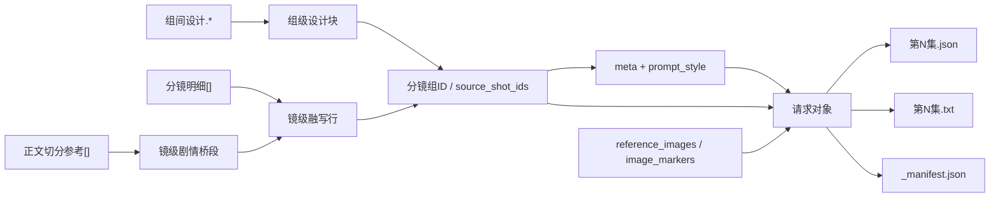
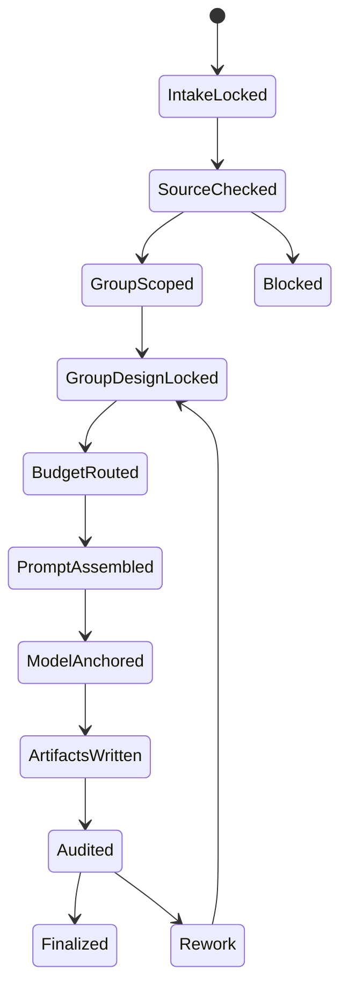
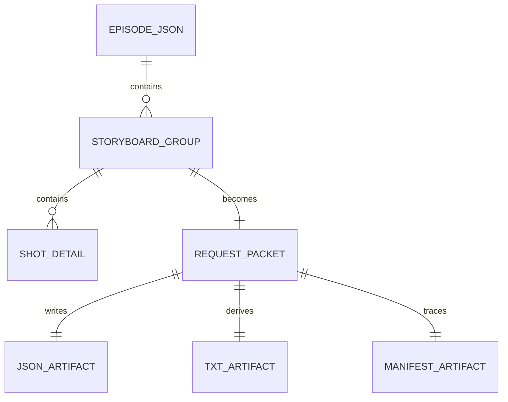

# 6-Video / 全能参照

## Context Loading Contract

- 每次调用本技能时，必须同时加载同目录 `CONTEXT.md` 作为预加载上下文。
- 若同目录 `CONTEXT.md` 缺失，应先补齐最小知识库骨架，或向用户明确报告阻塞；不得在未检查该上下文的情况下执行技能。
- 冲突优先级：用户显式请求 > 仓库/全局 `AGENTS.md` > 本 `SKILL.md` > 同目录 `CONTEXT.md`。

## 编排声明

- 本技能按 `$skill-知行合一` 的 `既有优化` 模式重构。
- 本技能采用 `SKILL.md + prompt-assembly-spec.md 双真源`：
  - `SKILL.md` 持有门禁、优先级、节点网、验收与返工入口。
  - `prompt-assembly-spec.md` 持有组级桥接句、镜级句式槽、压缩级别与可选字段挂句。
- 跨兄弟叶子共享的 `图生视频` 句法总原则回指 `.agents/skills/aigc/6-Video/_shared/image-to-video-prompt-principles.md`；本地 spec 只负责组级 specialization。
- `复杂链路的骨架 / 细则分层`：`false`
- 这意味着：本技能不再把执行句法散落在脚本函数体，也不再回退到 `references/` 分层；句法级真源固定为同目录 `prompt-assembly-spec.md`。

## Mode Selection

- 当前模式：`既有优化`
- 选择原因：
  - 目标技能已经拥有稳定业务语义、模板、字段与落盘约束
  - 需要重构的是组织方式与思行节点密度，而不是重新定义业务合同
  - 本轮不创建新子技能，不升级成多智能体体系
- 当前输出策略：
  - 保留现有三件套与 shared template 真源
  - 把线性流程重写为知行合一式思行网络
  - 明确关闭 `references/` 细则分层

## Purpose & Scope

`全能参照` 是 `6-Video` 阶段位于 `1-提示词蒸馏` tranche 的组级叶子子技能，当前 canonical 路径固定为：

`/Volumes/AIGC/AIGC-DREAM-MAKER/.agents/skills/aigc/6-Video/1-提示词蒸馏/全能参照/`

它负责把 `projects/aigc/<项目名>/3-Detail/第N集.json` 中 **单个分镜组的全部组级与镜级内容** 蒸馏为 **每组 1 条** 视频请求对象，并同步产出：

- `第N集.json`
- `第N集.txt`
- `_manifest.json`

当前重点不是提交视频任务，而是把分镜组稳定整理为可 handoff 的 canonical request packet。

## Business Requirement Analysis Contract

| 分析项 | 当前结论 |
| --- | --- |
| `business_goal` | 只消费 `metadata.document_phase=ready` 的 `3-Detail` shared root，把导演真源整理成“组级设计块 + 镜级融写行”的 `BC` 式视频请求对象，同时不损坏上游事实。 |
| `business_object` | 单个 `分镜组`，包括 `剧本正文`、`正文切分参考[]`、`组间设计.*`（含 `出场角色及穿搭`）与该组下全部 `分镜明细[]`；镜级蒸馏默认优先消费 `正文回指 -> beat_refs[]`、`角色表现 / 运动表现 / 氛围表现 / 视觉强化 / 分镜构图 / 摄影美学 / 运镜手法 / 转场特效`，并把对应剧本片段融入每一镜。 |
| `task_goal` | 生成一组一条的 `meta + prompt_style + model + prompt + prompt_char_count` 请求对象，并落盘三件套。 |
| `constraint_profile` | 只允许消费 `metadata.document_phase=ready`、且每组 `分镜切换 == len(分镜明细[])` 的 `3-Detail` shared root；最终 prompt 不再保留独立 A 段整组 `剧本正文`，而是必须先读 `正文切分参考[] -> 分镜明细[].正文回指`，再把原剧本信息融入对应镜级行；其余镜级字段默认先从 branch-owned canonical 八字段生成自然句，再在必要时回退 legacy compatibility projection；除镜级序号标签外移除字段标题，总字数控制在 `1900` 字内；每个分镜都不得漏掉当前分镜组内的 `xx秒-xx秒` 时间段标签，且时间标签必须写成 `xx秒-xx秒｜分镜<组内序号>：`；完整四段式 `分镜ID` 只保留在结构化回链字段中；不得虚构图片引用、引用类型、主体、动作或场景事实。 |
| `non_goals` | 不改写上游导演事实；不上传参照图；不执行 provider 提交、轮询与下载；不把 TXT 当主真源。 |
| `success_criteria` | 每个分镜组都能回链到来源镜头列表；prompt 覆盖整组信息；`BC` 结构稳定；无字段标题泄露；JSON/TXT/manifest 三件套可继续 handoff。 |
| `evidence_sources` | `projects/aigc/<项目名>/3-Detail/第N集.json`、`.agents/skills/aigc/_shared/director_episode_output.schema.json`、`6-Video/_shared` 双模板。 |
| `complexity_sources` | 输入完整性门禁、组级设计块与镜级融写行的并存、字数预算分支、标题隐藏约束、结构化输出与阅读视图的双重落盘。 |
| `topology_fit` | 采用“串行主干 + 条件分支 + 汇流门”的混合拓扑最合适：主干负责锁源、抽取、组装、落盘；分支负责输入缺口、预算压力与异常说明；最终统一进入唯一输出门。 |
| `step_strategy` | 不用假线性大段 prose，而用细粒度思行节点拆开“锁任务、验输入、抽整组、组装组级设计块、判预算、写镜级融写行、锚模型、写三件套、做汇流审计”。 |

## When to Use

- 需要把 `projects/aigc/<项目名>/3-Detail/第N集.json` 中 `metadata.document_phase=ready` 的 **分镜组** 蒸馏为视频工具入参 JSON。
- 需要输出 `第N集.json + 第N集.txt + _manifest.json` 三件套。
- 需要输出为“组级设计块 + 每镜一行融写结果”的 `BC` 结构，而不是先贴整段 `剧本正文`。
- 需要把组内镜头与正文片段的对应关系稳定建立在 `正文切分参考[] -> 分镜明细[].正文回指` 上，而不是靠平均切句猜边界。
- 需要把每个分镜的 `时间段` 转成 `xx秒-xx秒` 并显式保留在镜级条目前部。
- 需要按“高保留镜头控制项 > 情绪/氛围/道具/摄影 > 其余镜头补充项”的顺序压缩，并默认保持连贯自然语句表达；只有字数吃紧时才退化到短语。
- 需要为后续 `6-Video/2-参照引用` 或 `6-Video/3-视频生成` 提供组级 `multimodal2video` 风格输入对象。

## When Not to Use

- 当前任务是单一 `分镜ID` 的帧级蒸馏，应进入 `1-提示词蒸馏/首帧参照`。
- 当前任务是实际提交 provider、轮询结果或下载产物，应进入 `3-视频生成` 或命中的 provider 技能；若还需要从 `Assets/` 绑定参考图，则先进入 `2-参照引用`。
- 上游 `3-Detail/第N集.json` 尚未形成合法 `final_output.main_content.分镜组列表`。
- 上游 `metadata.document_phase` 仍为 `bootstrapped` 或 `detail_in_progress`。
- 任一目标分镜组的 `分镜切换` 与 `分镜明细[]` 数量未对齐，说明 `3-Detail` merge/handoff 仍未稳定。
- 任务要求上传、选择或补画参照图；本子技能只保留参照图骨架，不处理真实图片资产。

## Ownership Boundary

### `全能参照` 拥有

- 分镜组 -> 视频请求对象的一对一转换合同。
- 组级设计块、镜级融写行、标题隐藏规则与字数预算规则。
- `reference_images` / `image_markers` 的顺序承接骨架。
- `第N集.json + 第N集.txt + _manifest.json` 的三件套落盘与最小追溯台账。
- 面向执行闭环的 `思考过程` 输出格式。

### `全能参照` 不拥有

- 改写上游导演事实。
- 上传参照图、虚构图片引用或补造主体信息。
- 真实 provider 提交、轮询、下载。
- 父阶段路由裁决；路径选择由 `.agents/skills/aigc/6-Video/SKILL.md` 负责。

## Total Input Contract

### Canonical Inputs

- `projects/aigc/<项目名>/3-Detail/第N集.json`
- `projects/aigc/<项目名>/3-Detail/validation-report.md`（若存在，作为 handoff 辅助证据）
- `.agents/skills/aigc/_shared/director_episode_output.schema.json`
- `.agents/skills/aigc/6-Video/_shared/video-generation-input.template.json`
- `.agents/skills/aigc/6-Video/_shared/视频生成入参.template.txt`
- `.agents/skills/aigc/6-Video/_shared/image-to-video-prompt-principles.md`
- `.agents/skills/aigc/6-Video/1-提示词蒸馏/全能参照/prompt-assembly-spec.md`
- canonical rerun entry：`python3 .agents/skills/aigc/6-Video/1-提示词蒸馏/全能参照/scripts/generate_episode_packets.py --project <项目名> --episode <第N集>`

### Input Integrity Gates

最小输入前提：

- `metadata.document_phase = ready`
- `final_output.main_content.分镜组列表` 存在。
- 每个目标分镜组至少具备：
  - `分镜组ID`
  - `分镜切换`
  - `剧本正文`
  - `正文切分参考[]`
  - `组间设计.全局风格`
  - `组间设计.类型元素`
  - `组间设计.导演意图`
  - `组间设计.出场角色及穿搭`
  - `分镜明细[]`
  - `分镜明细[].正文回指.beat_refs`
  - `分镜明细[].时间段.开始秒`
  - `分镜明细[].时间段.结束秒`
  - `分镜明细[].角色表现`
  - `分镜明细[].运动表现`
  - `分镜明细[].氛围表现`
  - `分镜明细[].视觉强化`
  - `分镜明细[].分镜构图`
  - `分镜明细[].摄影美学`
  - `分镜明细[].运镜手法`
  - `分镜明细[].镜头视角`
- 对每个目标分镜组，还要求：
  - `组间设计.出场角色及穿搭` 非空
  - `分镜明细[]` 非空
  - `len(分镜明细[]) == 分镜切换`
  - `时间段.开始秒 / 结束秒` 允许是有限数值秒数（例如 `0.0 / 2.5 / 3.0`）；最终 prompt 一律规范化为去掉冗余 `.0` 的秒级区间标签，例如 `0秒-2.5秒`、`3秒-6秒`
- 若目标分镜存在以下字段，也应一并收齐并纳入压缩预算：
  - `分镜明细[].镜头速度`
  - `分镜明细[].道具及状态`
  - legacy `分镜明细[].角色背景面 / 角色站位走位 / 摄影美学 / 运镜手法 / 分镜表现`
  - `分镜明细[].镜头类型兼容 / 镜头框架 / 镜头类型`

## Prompt Compression Priority Contract

- G1 组级设计块：
  - `组间设计.全局风格`
  - `组间设计.类型元素`
  - `组间设计.导演意图`
  - `组间设计.出场角色及穿搭`
  - 固定音频约束行：`不生成字幕，不生成BGM，要生成物理互动音效与环境音。`
- P0 镜级剧情桥段：
  - `正文回指 -> 正文切分参考[] -> 原文片段`
- P1 高保留镜头控制项：
  - `时间段`
  - `运动表现`
  - `角色表现`
  - `分镜构图`
  - `景别`
  - `运镜手法`
  - `镜头速度（如存在）`
  - `镜头视角`
- P2 重要环境与摄影项：
  - `氛围表现`
  - `道具及状态`
  - `摄影美学`
- P3 补充镜头组织项：
  - `镜头类型兼容`
  - `镜头框架`
  - `镜头类型`
  - `视觉强化`

压缩规则：

1. 最终 prompt 固定采用 `BC` 结构：先写 1 段组级设计块，再逐镜输出 `xx秒-xx秒｜分镜<ID>：...`。
2. 不再保留独立 A 段整组 `剧本正文`；原剧本信息必须通过 `正文回指` 融写进对应镜级行。
3. 默认先按连贯自然语句串联 `P0 + P1 + P2 + P3`，尽量覆盖全部字段内容。
4. 当预计超出 `1900` 字时，只能先压缩 `P3`，再酌情收束 `P2`，不得先牺牲 `P0/P1`。
5. `P0/P1` 必须在最终 prompt 中保持高度可辨认，至少要让每个分镜都能读出对应剧情桥段、`xx秒-xx秒`、动作/表演、景别、运镜方式，以及存在时的镜头速度和镜头视角。
6. 默认优先采用“剧情桥段 -> 主体动作与表演 -> 镜头控制 -> 环境与摄影 -> 视觉重心”的语义顺序；若固定骨架让句子变拗口，应优先改写成更自然通顺的表达。
7. `时间段` 必须落成当前分镜组内的 `xx秒-xx秒｜分镜<组内序号>：`，不得写成 `分镜ID 的 xx秒-xx秒`，也不得误写成全集时间线。
8. 完整四段式 `分镜ID` 只允许留在 `meta.source_shot_ids / manifest` 等结构化追溯槽位；prompt 正文只显示组内序号。
9. 无论是否压缩，除镜级序号标签外都不得暴露字段标题，尤其不得写成 `字段标题：字段值`。

### 镜头类型兼容术语合同

- `镜头类型兼容` 指镜头在叙事或观看功能上的兼容专有命名，不是 `景别 / 运镜 / 视角` 的同义改写。
- 优先级：先沿用上游原词；仅当上游缺失且确有必要补足语义时，才可按事实选取最贴切的常见术语，不得为了凑列表虚构镜头功能。
- 落句时直接使用术语本体，例如 `定场镜头 / 反应镜头 / 规训镜头 / 权力落位镜头`；不要机械补成“`为定场镜头`”“`为规训镜头`”。
- 常见术语清单（非穷尽）：
  - `定场镜头`
  - `建立镜头`
  - `引入镜头`
  - `反应镜头`
  - `观察镜头`
  - `主观镜头`
  - `客观镜头`
  - `关系镜头`
  - `对峙镜头`
  - `落位镜头`
  - `权力落位镜头`
  - `叙事镜头`
  - `动作镜头`
  - `跟进镜头`
  - `追随镜头`
  - `情绪镜头`
  - `压迫镜头`
  - `释放镜头`
  - `揭示镜头`
  - `细节镜头`
  - `过桥镜头`
  - `转场镜头`
  - `收束镜头`
  - `空镜`

### Loading Order

1. `.agents/skills/aigc/SKILL.md + CONTEXT.md`
2. `.agents/skills/aigc/6-Video/SKILL.md + CONTEXT.md`
3. 本 `SKILL.md + CONTEXT.md`
4. `projects/aigc/<项目名>/3-Detail/validation-report.md`（若存在）
5. 按需读取 `6-Video/_shared` 双模板

优先级遵循：用户显式请求 > 根 `AGENTS.md` > `.agents/skills/aigc/SKILL.md` > `.agents/skills/aigc/6-Video/SKILL.md` > 本 `SKILL.md` > 各级 `CONTEXT.md`。

## Topology Contract

### 主干与分支总览

- 串行主干：`N0 -> N1 -> N2 -> N3 -> N4 -> N5 -> N6 -> N7 -> N8`
- 条件分支：
  - `N1` 负责输入完整性分支：`ready / incomplete`
  - `N4` 负责预算分支：`normal / tight / underflow`
  - `N8` 负责收束分支：`pass / rework / stop`
- 并行面：本技能不做真实并行执行，但在 `N2` 中需要同时覆盖组级字段与镜级字段两个信息面，然后在 `N5` 汇合。

## Mermaid Visual Contract

- 本技能把 Mermaid 视为真实治理真源，不是装饰图。
- 当前至少用 4 张图分别承载：
  - 主干与分支流
  - 字段汇合关系
  - 状态推进
  - 输入对象到产物对象的关系
- 若未来再增复杂度，必须继续补图，不得退回“只有 prose 没有结构图”的状态。

## Visual Maps (Mermaid)

## Thinking-Action Node Contract

### Node Register

| node_id | 节点名 | 主责任 | 失败回退 |
| --- | --- | --- | --- |
| `N0` | 锁定任务与最终输出 | 锁定当前必须是组级蒸馏任务，明确唯一输出面 | 停止并回父级路由 |
| `N1` | 输入完整性门 | 检查 director 真源与目标组字段是否齐全 | 停止并回上游补源 |
| `N2` | 抽取整组事实与来源镜头 | 收齐组级设计字段、正文桥接层、镜级字段与 `source_shot_ids` | 回 `N1` |
| `N3` | 组装组级设计块 | 把 `全局风格 / 类型元素 / 导演意图 / 出场角色及穿搭 / 音频约束` 收束为唯一组级块 | 回 `N2` |
| `N4` | 判定字数预算策略 | 根据剩余信息密度选择 `normal / tight / underflow` | 回 `N3` |
| `N5` | 组装 prompt 主体 | 融合组级设计块与镜级融写行，隐藏字段标题 | 回 `N3` 或 `N4` |
| `N6` | 锚定 model / marker 骨架 | 保持模板兼容，不虚构图片信息 | 回 `N5` |
| `N7` | 写出三件套 | 写 JSON/TXT/manifest 并记录统计与例外 | 回 `N5` 或 `N6` |
| `N8` | 汇流审计与最终输出门 | 做字段、字数、原文、追溯与闭环检查 | 回指定节点返工 |

### N0 锁定任务与最终输出

- `objective`
  - 在真正处理内容前，确认当前任务就是“组级视频请求蒸馏”，不是帧级蒸馏，也不是 provider 提交。
- `着手面`
  1. 判定任务粒度是不是 `分镜组 -> 1 条请求对象`
  2. 锁定本轮最终只允许产出 `第N集.json + 第N集.txt + _manifest.json`
  3. 锁定 canonical runtime 落点为 `projects/aigc/<项目名>/6-Video/全能参照/第N集/`
  4. 明确 `思考过程` 只进入执行闭环说明，不与 JSON 主体竞争真源
- `inputs`
  - 用户任务目标
  - 父级 `6-Video` 路由合同
  - 当前子技能输出合同
- `actions`
  1. 确认任务不是 `首帧参照`
  2. 确认任务不是 `2-参照引用` 或 `3-视频生成`
  3. 锁定三件套与唯一 handoff 主体为 `第N集.json`
- `evidence`
  - 命中 `全能参照`
  - 输出模式记为 `full_trace`
- `route_out`
  - 成功：进入 `N1`
  - 失败：停止并回父级 `6-Video` 重新路由
- `gate`
  - 只有当任务粒度与输出口径都锁定后，才允许进入源文件读取

### N1 输入完整性门

- `objective`
  - 在处理任何 prompt 文本前，先判定上游 director 真源是否足够支撑整组蒸馏。
- `着手面`
  1. 锁定 `metadata.document_phase`
  2. 锁定 `final_output.main_content.分镜组列表`
  3. 检查每组必需字段
  4. 判断缺口是“可继续压缩”还是“必须停机”
  5. 给出显式失败原因，而不是生成半成品
- `inputs`
  - `projects/aigc/<项目名>/3-Detail/第N集.json`
  - director schema
  - `projects/aigc/<项目名>/3-Detail/validation-report.md`（若存在）
- `actions`
  1. 读取单集 JSON
  2. 检查 `metadata.document_phase` 是否已经到 `ready`
  3. 定位 `分镜组列表`
  4. 检查 `分镜组ID / 分镜切换 / 剧本正文 / 组间设计 / 分镜明细`
  5. 若 `组间设计.出场角色及穿搭` 为空，视为上游 `3-Detail` 未完成 schema 闭环，不得继续蒸馏
  6. 若 `len(分镜明细[]) != 分镜切换`，视为上游 `3-Detail` merge/handoff 未稳定，不得继续蒸馏
  7. 对不完整输入记录缺口类型与 phase 状态
- `evidence`
  - `V-VID-SUBJ-01=ready|incomplete`
  - `document_phase`
  - 缺口字段列表
- `route_out`
  - `ready`：进入 `N2`
  - `incomplete`：停止并回上游补 `3-Detail/第N集.json`
- `gate`
  - 未通过时禁止进入任何 prompt 组装节点

### N2 抽取整组事实与来源镜头

- `objective`
  - 把整组处理所需的组级事实、镜级事实和来源镜头列表一次抽齐，避免后续只蒸馏局部内容。
- `着手面`
  1. 识别目标 `分镜组ID`
  2. 收齐全部 `分镜明细[]`
  3. 生成稳定的 `source_shot_ids`
  4. 分离组级设计块候选与镜级融写候选
- `inputs`
  - 已通过完整性门的分镜组对象
- `actions`
  1. 提取 `分镜组ID`
  2. 提取 `剧本正文`
  3. 提取 `组间设计.全局风格 / 类型元素 / 导演意图`
  4. 提取 `组间设计.出场角色及穿搭`
  5. 遍历全部 `分镜明细[]`，显式收齐 `时间段.开始秒 / 时间段.结束秒 / 角色表现 / 运动表现 / 氛围表现 / 视觉强化 / 分镜构图 / 摄影美学 / 运镜手法 / 镜头视角`
  6. 若存在，则继续收齐 `镜头速度 / 道具及状态 / 镜头类型兼容 / 镜头框架 / 镜头类型 / 转场特效`，并仅把 legacy `人物表演锚点 / 动作路径 / 空间氛围 / 视觉抓手 / 构图骨架 / 分镜表现 / 角色背景面 / 角色站位走位` 视作 fallback 投影；更老 `人物表演 / 动作调度 / 视觉焦点 / 构图策略 / 摄影策略 / 运镜策略 / 转场策略` 已退出 shared schema 主兼容层
  7. 生成 `meta.source_shot_ids`
- `evidence`
  - 组级字段清单
  - 镜级字段覆盖清单
  - `source_shot_ids`
- `route_out`
  - 成功：进入 `N3`
  - 失败：回 `N1` 重新确认输入完整性或分组合法性
- `gate`
  - 必须确认“整组全覆盖”成立，才允许进入组级设计块组装

### N3 组装组级设计块

- `objective`
  - 把 `组间设计` 与固定音频约束收束成唯一组级设计块，为后续镜级融写行提供统一全局前缀。
- `着手面`
  1. 锁定组级只保留一段设计块
  2. 明确 A 段整组 `剧本正文` 不再独立输出
  3. 建立组级块逐字可追溯点
- `inputs`
  - `N2` 的整组字段包
- `actions`
  1. 组织 `全局风格 / 类型元素 / 导演意图 / 出场角色及穿搭`
  2. 追加固定音频约束行
  3. 记录组级设计块字数
- `evidence`
  - `group_design_block`
  - `group_design_char_count`
- `route_out`
  - 成功：进入 `N4`
  - 失败：回 `N2`
- `gate`
  - 若输出中仍出现独立 A 段整组 `剧本正文`，必须停机返工

### N4 判定字数预算策略

- `objective`
  - 在不牺牲组级设计块与镜级 `P0/P1` 的前提下，为其余信息选择最稳的预算策略。
- `着手面`
  1. 估算组级设计块占用
  2. 估算压缩块信息量
  3. 判定 `normal / tight / underflow`
  4. 决定压缩粒度与 manifest 备注策略
- `inputs`
  - 组级设计块
  - 镜级融写候选
  - 目标字数上限 `<= 1900`
- `actions`
  1. 计算组级设计块字数
  2. 判断剩余预算
  3. 选择预算策略：
     - `normal`：保持连贯自然语句，默认覆盖 `P1 + P2 + P3`，并按推荐语义顺序组织信息；若标准骨架让句子变硬，应优先改写成更自然的表述
     - `tight`：仅在预计逼近上限或超限风险明显时，先压缩 `P3`，再酌情收束 `P2`；只有这一档才允许把部分句子压成更精炼的自然短语；`P0/P1` 必须继续高度保留，尤其不得丢失剧情桥段与 `xx秒-xx秒 / 景别 / 运镜 / 视角`
     - `underflow`：预算明显宽松时保持连贯自然语句与保守保真；允许显著低于上限，但不得为凑字数虚构扩写，也不得在阔绰余量下无故切成短语
  4. 预置异常说明模板
- `evidence`
  - `V-VID-SUBJ-02=normal|tight|underflow`
  - 预算判定理由
- `route_out`
  - 三种预算策略都进入 `N5`
  - 若组级设计块已超出合理承载范围，则回 `N3`
- `gate`
  - 预算策略必须显式可追溯，禁止“凭感觉压缩”

### N5 组装 prompt 主体

- `objective`
  - 产出同时满足“BC 结构、整组全覆盖、标题隐藏、字数受控”的 prompt。
- `着手面`
  1. 组级设计块先写
  2. 镜级按 `xx秒-xx秒｜分镜<组内序号>：` 一行一镜融写
  3. 只保留镜级序号标签
  4. 计算真实 `prompt_char_count`
  5. 默认用连贯自然句式融合信息；当且仅当 `tight` 触发时，才可切换为更精炼的自然短语，但仍不得把字段逐项硬裁切成带省略号的半截短语
- `inputs`
  - 组级设计块
  - 预算策略
  - 镜级融写候选
  - `source_shot_ids`
- `actions`
  1. 写入组级设计块
  2. 不再单独输出整组 `剧本正文`
  3. 按预算策略压缩组级设计块之外的信息
  4. 每个镜级条目先把 `时间段` 规范成 `xx秒-xx秒｜分镜<组内序号>：`
  5. 每个镜级条目必须先把 `正文回指` 对应的剧本片段融入句首，再依次融合动作/表演、镜头控制、环境/摄影和视觉重心
  6. 默认按“剧情桥段 -> 主体动作与表演 -> 景别/构图/运镜/速度/视角 -> 氛围/摄影/道具 -> 视觉强化/镜头类型兼容/镜头类型/转场”的语义顺序组织镜级内容；legacy `人物表演锚点 / 动作路径 / 空间氛围 / 视觉抓手 / 构图骨架 / 分镜表现 / 角色站位走位 / 角色背景面` 仅在 fallback 时补入
  7. `P0/P1` 必须高度保留：至少明确读出剧情桥段、`xx秒-xx秒`、动作/表演、景别、运镜方式、镜头视角，以及存在时的 `镜头速度`
  8. `P2` 默认应保留在最终连贯自然句中；只有 `tight` 生效且预算仍吃紧时，才允许先收束 `氛围表现 / 摄影美学 / 道具及状态` 的措辞密度
  9. `P3` 是第一顺位压缩层；预算不足时先把 `镜头类型兼容 / 镜头框架 / 镜头类型 / 视觉强化 / 转场特效` 收束成更短的自然短语，不得先牺牲 `P0/P1`
  10. 将镜级字段改写为连贯自然融合句；只有 `tight` 生效时，才允许把完整自然句收束为更精炼的自然短语。`>= 5` 镜长组只表示应更早做预算预估，不代表在预算宽松时放弃自然语句；仍不得靠字段值硬截断、堆省略号或保留半字段骨架来压字数
  12. 检查是否泄露字段标题
  13. 以最终会写入 `第N集.json` 的 `prompt` 字符串为准统计 `prompt_char_count`，不得按带临时换行或中间草稿计数
- `evidence`
  - 完整 `prompt`
  - `prompt_char_count`
  - 标题泄露检查结果
- `route_out`
  - 成功：进入 `N6`
  - 组级设计块被污染或仍残留独立 A 段：回 `N3`
  - 预算策略失衡：回 `N4`
- `gate`
  - 若任一镜级条目遗漏、字段标题泄露、出现机械省略号截断或字数统计不实，不得进入下游模板组装

### N6 锚定 model / marker 骨架

- `objective`
  - 维持共享模板兼容性，保留图片上传顺序位与 marker 骨架，同时严禁虚构图片信息。
- `着手面`
  1. 保留 `reference_images`
  2. 保持 `image_markers` 结构稳定
  3. 确认顺序一致
  4. 不因当前轮次无图而删字段
- `inputs`
  - 共享 JSON 模板
  - `N5` 的 prompt 主体
- `actions`
  1. 填写 `meta`
  2. 填写 `prompt_style`
  3. 保留 `model.reference_images`
  4. 组织 `model.image_markers`
  5. 挂接 `prompt` 与 `prompt_char_count`
- `evidence`
  - 请求对象草稿
  - marker 顺序校验结果
- `route_out`
  - 成功：进入 `N7`
  - 发现字段缺失或顺序错位：回 `N5`
- `gate`
  - 模型骨架必须兼容共享模板，且无任何虚构图片语义

### N7 写出三件套

- `objective`
  - 将请求对象一次写成可供工具与人工共同消费的三件套，并把例外写进 manifest。
- `着手面`
  1. JSON 作为 completeness carrier
  2. TXT 作为 derived display view
  3. manifest 作为追溯与异常载体
  4. 三件套之间保持路径与统计一致
- `inputs`
  - 完整请求对象
  - 共享 TXT 模板
  - 预算/异常信息
- `actions`
  1. 写 `第N集.json`
  2. 写 `第N集.txt`
  3. 写 `_manifest.json`
  4. 为每组记录 `group_id / prompt_char_count / within_target_limit / exception_note`
  5. 回读最终 JSON，确认 `len(prompt) == prompt_char_count`
- `evidence`
  - 三个文件路径
  - manifest group summary
- `route_out`
  - 成功：进入 `N8`
  - JSON/TXT/manifest 任一缺失：回 `N5` 或 `N6`
- `gate`
  - 若只产出 prompt 或只产出单文件，视为未完成

### N8 汇流审计与最终输出门

- `objective`
  - 在真正结案前，统一核对三件套、BC 结构、标题隐藏、字数与闭环说明。
- `着手面`
  1. 核对组级设计块与镜级融写行结构
  2. 核对整组覆盖与来源镜头可追溯
  3. 核对模型骨架与三件套一致性
  4. 生成最终 `思考过程 + 关键证据 + 风险/例外`
- `inputs`
  - 三件套
  - 所有节点证据
- `actions`
  1. 复核 `prompt_char_count`
  2. 复核是否已移除独立 A 段，且原剧本信息已融入镜级行
  3. 复核字段标题泄露
  4. 复核 `reference_images / image_markers`
  5. 生成执行闭环说明
- `evidence`
  - 审计结果
  - 返工入口
  - 执行闭环摘要
- `route_out`
  - `pass`：进入最终一次性输出
  - `rework`：回到 `N3 / N4 / N5 / N6 / N7`
  - `stop`：报告上游缺口或不可继续原因
- `gate`
  - 只有同时通过 `BC` 结构、覆盖度、模板兼容性与三件套完整性四重门，才允许结案

## Type Strategy & Fallback

### Variable Register

| var_id | 变量层级 | 观测信号 | 状态集合 | 检测方法 | 优先级 |
| --- | --- | --- | --- | --- | --- |
| V-VID-SUBJ-01 | 输入 | `3-Detail` handoff 是否已稳定可消费 | `ready/incomplete` | 检查 `metadata.document_phase=ready`，且 `分镜组ID/分镜切换/剧本正文/正文切分参考/组间设计（含出场角色及穿搭）/分镜明细（含正文回指、时间段开始秒/结束秒、角色表现/运动表现/氛围表现/视觉强化/分镜构图/摄影美学/运镜手法/镜头视角，以及存在时的镜头速度）` 成立，并验证 `分镜切换 == len(分镜明细[])` | P0 |
| V-VID-SUBJ-02 | 字数预算 | 非 `P0/P1` 字段的压缩压力 | `normal/tight/underflow` | 估算组级设计块与镜级 `P0/P1` 后剩余字数，并结合组内镜数判断是否存在逼近上限风险；除 `tight` 外均保持连贯自然语句 | P1 |
| V-VID-SUBJ-03 | 输出要求 | 本轮是否需要完整闭环 | `json_only/full_trace` | 结合用户目标与父级合同 | P1 |
| V-VID-SUBJ-04 | 文本结构 | 是否存在标题泄露风险 | `clean/leaking` | 搜索除镜级序号标签外的字段名暴露，并检查 prompt 未泄露完整四段式 `分镜ID` | P1 |

### Case To Strategy Map

| case_id | 触发谓词 | 主策略 | 通过标准 | fallback |
| --- | --- | --- | --- | --- |
| C-VID-SUBJ-01 | `V-VID-SUBJ-01=incomplete` | 停止并报告上游缺口 | 不伪造缺失字段 | 回上游补 `3-Detail/第N集.json` |
| C-VID-SUBJ-02 | `V-VID-SUBJ-02=normal` | 用连贯自然语句压缩非固定字段 | `prompt_char_count <= 1900` | 无 |
| C-VID-SUBJ-03 | `V-VID-SUBJ-02=tight` | 只在逼近上限时按 `P3 -> P2` 顺序压缩非 `P0/P1` 字段；且只有这一档允许局部短语化；`P0/P1` 继续高度保留；`>= 5` 镜长组优先触发预算预警，但不直接改写成短语版 | 组级设计块稳定，整体尽量压到 `<= 1900`，且剧情桥段、`P1` 与 `xx秒-xx秒` 仍清晰可辨 | 无 |
| C-VID-SUBJ-04 | `V-VID-SUBJ-02=underflow` | 保守保真并保持连贯自然语句，不虚构扩写 | 允许显著低于上限，但 manifest 备注 | 无 |
| C-VID-SUBJ-05 | `V-VID-SUBJ-03=full_trace` | 输出 JSON + TXT + manifest + 执行闭环说明 | 三件套可追溯，闭环可复核 | `json_only` |
| C-VID-SUBJ-06 | `V-VID-SUBJ-04=leaking` | 回到 prompt 组装层清理字段标题 | 除组ID/镜ID外无显式字段名 | 回 `N5` |

## Convergence Contract

### 汇流门定义

| gate_id | 门禁目标 | 通过条件 | 失败回退 |
| --- | --- | --- | --- |
| `GATE-VID-SUBJ-01` | 输入门 | `V-VID-SUBJ-01=ready` | `N1` 停机并报告 |
| `GATE-VID-SUBJ-02` | 文本门 | `BC` 结构成立；剧情桥段已融入镜级行；压缩块全覆盖；`V-VID-SUBJ-04=clean` | 回 `N3-N5` |
| `GATE-VID-SUBJ-03` | 模板门 | `reference_images` 存在；`image_markers` 结构稳定且无虚构内容 | 回 `N6` |
| `GATE-VID-SUBJ-04` | 产物门 | `第N集.json + 第N集.txt + _manifest.json` 齐备且统计一致 | 回 `N7` |
| `GATE-VID-SUBJ-05` | 结案门 | 最终结果、思考过程、关键证据、风险/例外四段闭环齐备 | 回 `N8` |

### 最小验收清单

- `prompt_char_count` 与实际 prompt 一致。
- `prompt_char_count` 必须按最终落盘到 `第N集.json` 的 `prompt` 字符串计数，不得把临时换行、草稿拼接态或 TXT 视图改写计入。
- `metadata.document_phase = ready`，不得误吃 `bootstrapped/detail_in_progress` 半成品。
- 每个命中分镜组都满足 `分镜切换 == len(分镜明细[])`。
- 独立 A 段整组 `剧本正文` 已移除，且剧本信息通过 `正文回指` 融入对应镜级行。
- 组级设计块中的 `全局风格 / 类型元素 / 导演意图 / 出场角色及穿搭` 与上游一致。
- `组间设计.出场角色及穿搭` 已进入压缩块，且未在蒸馏过程中丢失。
- 每个镜级条目前都保留 `xx秒-xx秒`，且来自上游 `时间段.开始秒 / 结束秒`，不得漏写或改成模糊时间语。
- 镜级 `运动表现 / 分镜构图 / 景别 / 运镜手法 / 镜头视角` 已被消费；若上游存在 `镜头速度`，也必须被消费；不得把这些高保留项压缩到不可辨认。
- `角色表现 / 氛围表现 / 道具及状态 / 摄影美学` 默认应保留在连贯自然语句中；若预算吃紧，只允许在不伤及高保留项的前提下收束措辞。
- `镜头类型兼容 / 镜头框架 / 镜头类型 / 视觉强化` 是第一顺位压缩层；可并入自然句，但不得伪装成已完整保留。
- 默认镜级表达应遵循推荐语义顺序，但不强制套固定句式；若固定骨架让句子发硬，应以自然流畅和信息覆盖优先。
- 不得把镜级句子写成 `时间段：...`、`镜头类型兼容：...`、`景别：...`、`运动表现：...` 这类 `字段标题：字段值` 结构。
- 不得写成 `分镜ID 的 xx秒-xx秒`；时间必须对应当前分镜组内的秒级范围。
- 当预算不吃紧时，不得主动把连贯自然语句改写成短语式清单。
- 除镜级序号标签外，无字段标题泄露，且 prompt 不出现完整四段式 `分镜ID`。
- 分镜压缩必须是自然融合文本，不得出现大量靠硬截断生成的 `…` 半截短语。
- 当预算明显宽松时，不得把自然语句无故压成短语式表达。
- `reference_images` 字段存在。
- `image_markers` 未伪造引用 / 类型 / 主体 / 图号。
- `_manifest.json` 在超出 1900、显著低于上限或输入不足时写出异常说明。
- `第N集.txt` 只承载提示词与字数统计，不承载结构化参数区块。
- 若 `第N集.txt` 已用 section header 单独显示 `分镜组ID`，则不得再重复显示 prompt 首行同组 `分镜组ID`。
- 执行闭环说明必须显式给出 `思考过程`。

## One-Shot Output Contract

### Canonical Artifact Landing

- canonical 主产物：`projects/aigc/<项目名>/6-Video/全能参照/第N集/第N集.json`
- canonical 文本视图：`projects/aigc/<项目名>/6-Video/全能参照/第N集/第N集.txt`
- canonical 追溯台账：`projects/aigc/<项目名>/6-Video/全能参照/第N集/_manifest.json`

说明：

- canonical 输出路径末端与技能包名 `全能参照` 对齐，符合知行合一的同名落点约定。
- `第N集.json` 是唯一 completeness carrier。
- `第N集.txt` 只是 derived display view。
- `_manifest.json` 是追溯与例外说明载体。
- 若本次属于 recovery rerun，且 `STATE.json` 已推进到 `2-参照引用`、`3-视频生成`、provider handoff 或更后续阶段，则本技能只修复缺失的 `全能参照` 三件套与 trace，不得把项目推荐入口、`current_stage` 或后续 ready 状态回退到本子技能之前。

### 执行闭环输出

每次执行本技能时，对用户的最终闭环固定收束为四段：

1. `最终结果`
   - 三件套落点
   - 组数量
   - 下游 handoff 主体
2. `思考过程`
   - 本轮命中的预算策略
   - 为什么采用当前压缩方式
   - 哪些节点触发了返工或保守退化
3. `关键证据`
  - `BC` 结构成立
  - `prompt_char_count`
  - `source_shot_ids`
  - `within_target_limit`
4. `风险 / 例外`
   - underflow
   - 输入缺口
   - 未上传参照图仅保留骨架

### Handoff Contract

- 正式进入视频生成时，优先先判定是否要进入 `2-参照引用` 绑定 `Assets` 参考图；若不需要，再把 `第N集.json` 交给父阶段 `3-视频生成`。
- `第N集.txt` 只供人工审阅，不作为自动化 handoff 主体。
- `_manifest.json` 只承载追溯、异常说明与最小验证结果，不替代 JSON 主体。
- 若 `STATE.json` 已经把下一入口锁到 `2-参照引用` 或 `3-视频生成`，而磁盘缺失 `全能参照` 三件套，应视为 video prompt 层 runtime drift：先补回三件套，再保持原 handoff 指向，不额外降级项目状态。

## Field System

### Field Master

| field_id | 输出位置/字段 | 内容要求 | 默认责任 Node | 质量维度 | 失败码 |
| --- | --- | --- | --- | --- | --- |
| FIELD-VID-SUBJ-01 | `prompt_style.type / prompt_style.language / prompt_style.char_limit / meta.shot_level / meta.group_id / meta.source_shot_ids` | 锁定组级来源、提示词类型与来源分镜列表，并确认上游 `document_phase=ready` 且 `分镜切换 == len(分镜明细[])` | `N0-N2` | 输入覆盖完整度 | FAIL-VID-SUBJ-01 |
| FIELD-VID-SUBJ-02 | `prompt / prompt_char_count` | prompt 覆盖整组内容，并采用“组级设计块 + 镜级融写行”的 `BC` 结构；镜级行显式融合 `正文回指` 对应剧情桥段与 `分镜明细[]` 细节，并按 `P0 剧情桥段 / P1 高保留 / P2 重要 / P3 补充` 顺序压缩；每镜保留当前分镜组内的 `xx秒-xx秒｜分镜<组内序号>：`，按推荐语义顺序组织信息，但不为固定句式牺牲自然度，且隐藏标题 | `N3-N5` | Prompt 蒸馏稳定性 | FAIL-VID-SUBJ-02 |
| FIELD-VID-SUBJ-03 | `model.reference_images / model.image_markers` | 保留上传顺序位，并维持 marker 顺序稳定 | `N6` | 模板兼容性 | FAIL-VID-SUBJ-03 |
| FIELD-VID-SUBJ-04 | `第N集.json / 第N集.txt / _manifest.json` | 三件套可追溯、可审阅、可继续 handoff | `N7` | 输出可消费性 | FAIL-VID-SUBJ-04 |
| FIELD-VID-SUBJ-05 | `执行闭环.思考过程 / 关键证据 / 风险例外` | 最终回复必须给出思考过程与关键门禁依据 | `N8` | 结案可复核性 | FAIL-VID-SUBJ-05 |

## Thought Pass Map

### Node To Field Map

| node_id | 聚焦字段 | 核心问题 | 生成动作 | 未达标信号 |
| --- | --- | --- | --- | --- |
| `N0` | FIELD-VID-SUBJ-01 | 本轮是否真的是组级蒸馏且只允许一个最终输出面 | 锁定输出模式与落点 | 误入帧级或 provider 路径 |
| `N1` | FIELD-VID-SUBJ-01 | 上游 director 真源是否足够支撑整组蒸馏 | 做完整性检查 | 缺字段仍想继续 |
| `N2` | FIELD-VID-SUBJ-01 | 是否已经收齐整组来源与全部 `source_shot_ids` | 抽取组级与镜级事实 | 只抓到局部镜头 |
| `N3` | FIELD-VID-SUBJ-02 | 组级块该怎样稳定成立 | 组装 `全局风格 / 类型元素 / 导演意图 / 出场角色及穿搭 / 音频约束` | 仍残留独立 A 段或组级块缺项 |
| `N4` | FIELD-VID-SUBJ-02 | 当前预算应如何压缩其余信息 | 选择预算策略 | 压缩策略不可解释 |
| `N5` | FIELD-VID-SUBJ-02 | prompt 如何同时做到全覆盖、隐藏标题、控制字数 | 组装最终 prompt | 漏镜头、泄露标题、字数失真 |
| `N6` | FIELD-VID-SUBJ-03 | 模型骨架如何保持兼容且不虚构图片 | 填 model 双字段 | 字段缺失、乱序或虚构图片 |
| `N7` | FIELD-VID-SUBJ-04 | 工具视图与人工视图如何同时落盘 | 写三件套 | 只产一件或统计不同步 |
| `N8` | FIELD-VID-SUBJ-05 | 现在是否真的允许结案 | 做审计并输出闭环 | 缺思考过程或无返工入口 |

### Pass Table

| field_id | Pass Standard | Fail Code | Rework Entry |
| --- | --- | --- | --- |
| FIELD-VID-SUBJ-01 | `prompt_style.type / meta.shot_level` 合法，`group_id` 与 `source_shot_ids` 成立，且上游 `document_phase=ready`、`分镜切换 == len(分镜明细[])` | FAIL-VID-SUBJ-01 | `N0-N2` |
| FIELD-VID-SUBJ-02 | prompt 满足 `BC` 结构、剧情桥段融写、压缩块、隐藏标题与字数窗，且 `P0/P1` 与 `xx秒-xx秒｜分镜<组内序号>：` 保持高度可辨认 | FAIL-VID-SUBJ-02 | `N3-N5` |
| FIELD-VID-SUBJ-03 | `reference_images` 存在，`image_markers` 四字段信息结构完整且顺序稳定 | FAIL-VID-SUBJ-03 | `N6` |
| FIELD-VID-SUBJ-04 | JSON、TXT 与 manifest 可追溯可 handoff | FAIL-VID-SUBJ-04 | `N7` |
| FIELD-VID-SUBJ-05 | 最终闭环包含思考过程、关键证据与风险/例外 | FAIL-VID-SUBJ-05 | `N8` |

## Root-Cause Execution Contract (Mandatory)

当出现以下症状时，必须先修本子技能合同，而不是只润色 prompt：

- prompt 只覆盖整组的局部字段，尤其漏掉 `出场角色及穿搭` 或新镜级字段。
- `3-Detail` 仍处于 `bootstrapped/detail_in_progress`，或组内 `分镜切换` 与 `分镜明细[]` 未对齐，却被误当成稳定视频输入。
- prompt 漏掉镜级 `景别` 或 `运镜手法`，导致视频请求只有动作和气氛，没有镜头组织依据。
- 输出仍残留独立 A 段整组 `剧本正文`，没有真正转成 `BC`。
- prompt 中仍残留字段标题。
- 压缩过猛只剩碎片，或显著超出预算。
- `reference_images` 被删除，或 `image_markers` 出现虚构引用/类型/主体/顺序错位。
- 有三件套产物，但没有思考过程与返工入口，导致结案不可复核。

必经链路：

`Symptom -> Direct Technical Cause -> Rule Source -> Meta Rule Source -> Fix Landing Points`

优先检查：

- `Rule Source`
  - `.agents/skills/aigc/6-Video/1-提示词蒸馏/全能参照/SKILL.md`
  - `.agents/skills/aigc/6-Video/1-提示词蒸馏/全能参照/CONTEXT.md`
- `Meta Rule Source`
  - `.agents/skills/aigc/6-Video/SKILL.md`
  - `.agents/skills/aigc/SKILL.md`
  - `/Users/vincentlee/.codex/skills/meta/构建/技能/skill-知行合一/SKILL.md`
  - 根 `AGENTS.md`

对用户的闭环输出固定包含：

1. 根因位置
2. 立即修复
3. 系统预防修复

## Deprecated Paths / Migration Note

- 旧写法 `.agents/skills/aigc/6-视频/subtypes/1-提示词蒸馏/全能参照/` 已废弃；当前 canonical 路径为 `.agents/skills/aigc/6-Video/1-提示词蒸馏/全能参照/`。
- 本技能当前不采用 `references/` 细则分层；若历史文件仍残留，只能视为迁移遗留，不得继续作为规范真源引用。
