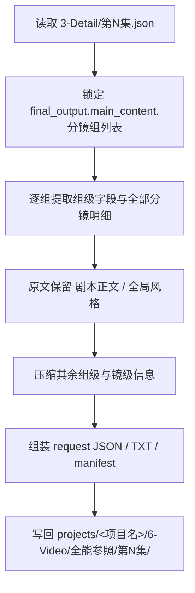
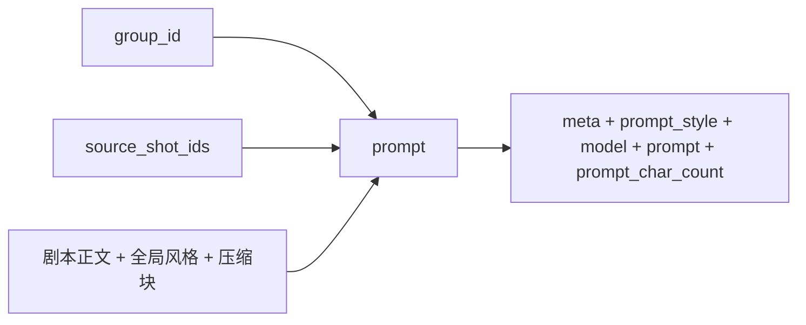

# 6-Video / 全能参照

## Purpose & Scope

`全能参照` 是 `6-Video` 阶段位于 `1-提示词蒸馏` tranche 的组级叶子子技能。

当前加载路径固定为 `.agents/skills/aigc/6-Video/1-提示词蒸馏/全能参照/`。

它负责把 `projects/<项目名>/3-Detail/第N集.json` 中 **单个分镜组的全部组级与镜级内容** 蒸馏为 **每组 1 条** 视频请求对象，并同步产出人工审阅文本视图与最小追溯台账。当前重点不是提交视频任务，而是把分镜组稳定整理为可 handoff 的 canonical request packet。

## Canonical Source & Loading Contract

- 本子技能的唯一规范真源是当前 `SKILL.md`。
- 本目录下的 `CONTEXT.md` 只承载经验层、案例与修复启发，不重新定义执行合同。
- `references/` 不再是本子技能的规范载体；若历史文件仍存在，只能视为待清理旧结构，不得继续作为读取入口。
- 共享模板真源固定为：
  - `.agents/skills/aigc/6-Video/_shared/video-generation-input.template.json`
  - `.agents/skills/aigc/6-Video/_shared/视频生成入参.template.txt`
- 上游 shared schema 固定为：
  - `.agents/skills/aigc/_shared/director_episode_output.schema.json`

## When to Use

- 需要把 `projects/<项目名>/3-Detail/第N集.json` 的 **分镜组** 蒸馏为视频工具入参 JSON。
- 需要输出 `第N集.json + 第N集.txt + _manifest.json` 三件套。
- 需要保留 `剧本正文` 与 `组间设计.全局风格` 原文不变，同时压缩其余组级与镜级字段。
- 需要为后续 `.agents/skills/cli/dreamina-cli/SKILL.md` 提供组级 `multimodal2video` 风格输入对象。

## When Not to Use

- 当前任务是单一 `分镜ID` 的帧级蒸馏，应进入 `1-提示词蒸馏/首帧参照`。
- 当前任务是实际提交 provider、轮询结果或下载产物，应进入 `2-视频生成` 或命中的 provider 技能。
- 上游 `3-Detail/第N集.json` 尚未形成合法 `final_output.main_content.分镜组列表`。
- 任务要求上传、选择或补画参照图；本子技能只保留参照图骨架，不处理真实图片资产。

## Ownership Boundary

### `全能参照` 拥有

- 分镜组 -> 视频请求对象的一对一转换合同。
- 组级 prompt 的覆盖规则、固定块保留规则、压缩规则与字数预算规则。
- `reference_images` / `image_markers` 的顺序承接骨架。
- `第N集.json + 第N集.txt + _manifest.json` 的双输出与 manifest 最低字段。

### `全能参照` 不拥有

- 改写上游导演事实。
- 上传参照图、虚构图片 URL 或补造主体信息。
- 真实 provider 提交、轮询、下载。
- 父阶段路由裁决；路径选择由 `.agents/skills/aigc/6-Video/SKILL.md` 负责。

## Visual Maps

## Canonical Inputs

- `projects/<项目名>/3-Detail/第N集.json`
- `.agents/skills/aigc/_shared/director_episode_output.schema.json`
- `.agents/skills/aigc/6-Video/_shared/video-generation-input.template.json`
- `.agents/skills/aigc/6-Video/_shared/视频生成入参.template.txt`

最小输入前提：

- `final_output.main_content.分镜组列表` 存在。
- 每个目标分镜组至少具备：
  - `分镜组ID`
  - `剧本正文`
  - `组间设计.全局风格`
  - `组间设计.类型元素`
  - `组间设计.导演意图`
  - `分镜明细[]`

## Canonical Outputs

- canonical 主产物：`projects/<项目名>/6-Video/全能参照/第N集/第N集.json`
- canonical 文本视图：`projects/<项目名>/6-Video/全能参照/第N集/第N集.txt`
- canonical 追溯台账：`projects/<项目名>/6-Video/全能参照/第N集/_manifest.json`

硬规则：

1. `第N集.json` 是 canonical completeness carrier。
2. `第N集.txt` 只是 derived display view，只展示提示词正文与字数统计。
3. `_manifest.json` 只承载追溯、异常说明与最小验证结果，不替代 JSON 主体。
4. 交给下游 provider 前，不允许把 `TXT` 当作主真源。

## Workflow

1. 读取 episode JSON，锁定 `final_output.main_content.分镜组列表`。
2. 对每个分镜组提取 `分镜组ID`、`剧本正文`、`组间设计.*` 与全部 `分镜明细[]`。
3. 原文保留 `剧本正文` 与 `组间设计.全局风格`。
4. 将 `组间设计.类型元素`、`组间设计.导演意图` 与全部镜级字段均匀压缩进剩余字数预算。
5. 按共享 JSON 模板组装 `meta + prompt_style + model + prompt + prompt_char_count`。
6. 按共享 TXT 模板输出 `提示词 + 字数统计` 阅读视图。
7. 写出 JSON、TXT 与 `_manifest.json`，并在 manifest 中记录所有低于目标窗或输入不足的保守例外。

## Prompt Assembly Contract

### 固定保留块

- `剧本正文`
- `组间设计.全局风格`

这两块必须原文直贴，不改写、不净化、不重命名。

### 压缩块

- `组间设计.类型元素`
- `组间设计.导演意图`
- 全部 `分镜明细[]` 的镜级信息

这些字段必须全部进入 prompt，但允许压缩为自然句、高密度短语或关键词串。

### 标题暴露规则

- 只允许显式出现 `分镜组ID` 与 `分镜ID` 两类标签。
- 除此之外，禁止输出 `场景及方位:`、`角色及站位和穿搭:` 之类字段标题。

### 字数规则

- 目标窗：`1800-2000` 中文字符。
- 源信息客观不足时，允许保守低于下限，但不得为凑字数虚构新事实。
- `prompt_char_count` 必须与实际 prompt 内容一致。

### 禁止事项

- 禁止遗漏整组中的任一镜级条目。
- 禁止改写 `剧本正文` 或 `全局风格`。
- 禁止虚构图片 URL、主体、服装、动作、场景事实。
- 禁止删除 `reference_images` 字段。

## Type Strategy & Fallback

### Variable Register

| var_id | 变量层级 | 观测信号 | 状态集合 | 检测方法 | 优先级 |
| --- | --- | --- | --- | --- | --- |
| V-VID-SUBJ-01 | 输入 | 分镜组结构是否完整 | `ready/incomplete` | 检查 `分镜组ID/剧本正文/组间设计/分镜明细` | P0 |
| V-VID-SUBJ-02 | 字数预算 | 非固定字段压缩压力 | `normal/tight/underflow` | 估算固定块后剩余字数 | P1 |
| V-VID-SUBJ-03 | 输出要求 | 本轮只要 JSON 还是完整 trace | `json_only/full_trace` | 结合用户目标 | P1 |

### Case To Strategy Map

| case_id | 触发谓词 | 主策略 | 通过标准 | fallback |
| --- | --- | --- | --- | --- |
| C-VID-SUBJ-01 | `V-VID-SUBJ-01=incomplete` | 停止并报告上游缺口 | 不伪造缺失字段 | 回上游补 `3-Detail/第N集.json` |
| C-VID-SUBJ-02 | `V-VID-SUBJ-02=normal` | 用自然语句压缩非固定字段 | `prompt_char_count` 落在目标窗 | 无 |
| C-VID-SUBJ-03 | `V-VID-SUBJ-02=tight` | 把非固定字段压成短语或关键词串 | 固定块不动，整体尽量靠近目标窗 | 无 |
| C-VID-SUBJ-04 | `V-VID-SUBJ-02=underflow` | 保守保真，不虚构扩写 | 允许低于下限，但 manifest 备注 | 无 |
| C-VID-SUBJ-05 | `V-VID-SUBJ-03=full_trace` | 输出 JSON + TXT + manifest | 三件套可相互追溯 | `json_only` |

## Handoff Contract

### JSON 负责填充的字段

1. `meta`
2. `prompt_style`
3. `model`
4. `prompt`
5. `prompt_char_count`

### `model` 骨架规则

- `reference_images` 必须保留为上传顺序位。
- `image_markers` 记录 URL / 主体 / 图号三元信息。
- `reference_images` 与 `image_markers` 的顺序必须一致。
- 当前轮次可以留空，但不能删除，也不能虚构内容。

### `_manifest.json` 最低要求

1. `episode_id`
2. `source_file`
3. `output_mode`
4. `json_file`
5. `txt_file`
6. `group_count`
7. `groups[].group_id`
8. `groups[].prompt_char_count`
9. `groups[].within_target_range`
10. `groups[].exception_note`

### 下一跳

- 正式进入视频生成时，优先把 `第N集.json` 交给 `.agents/skills/cli/dreamina-cli/SKILL.md` 或父阶段 `2-视频生成`。
- `第N集.txt` 只供人工审阅，不作为自动化 handoff 主体。

## Field System

### Field Master

| field_id | 输出位置/字段 | 内容要求 | 默认责任 Step | 质量维度 | 失败码 |
| --- | --- | --- | --- | --- | --- |
| FIELD-VID-SUBJ-01 | `prompt_style.type / prompt_style.language / prompt_style.char_limit / meta.shot_level / meta.group_id / meta.source_shot_ids` | 锁定组级来源、提示词类型与来源分镜列表 | S1 | 输入覆盖完整度 | FAIL-VID-SUBJ-01 |
| FIELD-VID-SUBJ-02 | `prompt / prompt_char_count` | prompt 覆盖整组内容，固定块原文保留，其余压缩且隐藏标题 | S2-S4 | Prompt 蒸馏稳定性 | FAIL-VID-SUBJ-02 |
| FIELD-VID-SUBJ-03 | `model.reference_images / model.image_markers` | 保留上传顺序位，并维持 marker 顺序稳定 | S5 | 模板兼容性 | FAIL-VID-SUBJ-03 |
| FIELD-VID-SUBJ-04 | `第N集.json / 第N集.txt / _manifest.json` | 三件套可追溯、可审阅、可继续 handoff | S6 | 输出可消费性 | FAIL-VID-SUBJ-04 |

### Thought Pass Map

| step_id | 聚焦字段 | 核心问题 | 生成动作 | 未达标信号 |
| --- | --- | --- | --- | --- |
| S1 | FIELD-VID-SUBJ-01 | 是否已锁定组级来源与来源镜头列表 | 写入 `prompt_style + meta` | 组级定位冲突或缺失 |
| S2 | FIELD-VID-SUBJ-02 | 哪些内容必须原文保留 | 直贴 `剧本正文` 与 `全局风格` | 固定块被改写 |
| S3 | FIELD-VID-SUBJ-02 | 哪些内容应均匀压缩 | 压缩其余组级与镜级字段 | 漏字段或压缩失衡 |
| S4 | FIELD-VID-SUBJ-02 | 如何隐藏标题仍保住结构 | 仅保留组ID/镜ID显式标签 | 出现字段标题残留 |
| S5 | FIELD-VID-SUBJ-03 | 参照图字段当前如何承接 | 保留 `reference_images: []`，组织 `image_markers` | 删除字段、乱序或虚构 URL |
| S6 | FIELD-VID-SUBJ-04 | 输出是否能被工具与人工双消费 | 写 JSON、TXT、manifest 与统计字段 | 只产出单文件或缺 manifest |

### Pass Table

| field_id | Pass Standard | Fail Code | Rework Entry |
| --- | --- | --- | --- |
| FIELD-VID-SUBJ-01 | `prompt_style.type / meta.shot_level` 合法，且 `group_id` 与 `source_shot_ids` 成立 | FAIL-VID-SUBJ-01 | S1 |
| FIELD-VID-SUBJ-02 | prompt 满足固定块、压缩块、隐藏标题与字数窗 | FAIL-VID-SUBJ-02 | S2-S4 |
| FIELD-VID-SUBJ-03 | `reference_images` 存在，`image_markers` 三元信息结构完整且顺序稳定 | FAIL-VID-SUBJ-03 | S5 |
| FIELD-VID-SUBJ-04 | JSON、TXT 与 manifest 可追溯可 handoff | FAIL-VID-SUBJ-04 | S6 |

## Audit & Verification

最小校验清单：

- `prompt_char_count` 与实际 prompt 一致。
- `剧本正文` 与 `组间设计.全局风格` 与上游逐字一致。
- 除 `分镜组ID / 分镜ID` 外，无字段标题泄露。
- `reference_images` 字段存在。
- `image_markers` 未伪造 URL / 主体 / 图号。
- `_manifest.json` 在低于目标窗或输入不足时写出异常说明。
- `第N集.txt` 只承载提示词与字数统计，不承载结构化参数区块。

## Root-Cause Execution Contract (Mandatory)

当出现以下症状时，必须先修本子技能合同：

- prompt 只覆盖整组的局部字段。
- `剧本正文` 或 `全局风格` 被改写。
- prompt 中仍残留字段标题。
- 压缩过猛只剩碎片，或显著超出预算。
- `reference_images` 被删除，或 `image_markers` 出现虚构 URL/主体/顺序错位。

必经链路：

`Symptom -> Direct Technical Cause -> Rule Source -> Meta Rule Source -> Fix Landing Points`

优先检查：

- `Rule Source`
  - `.agents/skills/aigc/6-Video/1-提示词蒸馏/全能参照/SKILL.md`
  - `.agents/skills/aigc/6-Video/1-提示词蒸馏/全能参照/CONTEXT.md`
- `Meta Rule Source`
  - `.agents/skills/aigc/6-Video/SKILL.md`
  - `.agents/skills/aigc/SKILL.md`
  - 根 `AGENTS.md`

对用户的闭环输出固定包含：

1. 根因位置
2. 立即修复
3. 系统预防修复

## Context Preload

- 执行前先加载 `.agents/skills/aigc/6-Video/SKILL.md + CONTEXT.md`。
- 再加载本 `SKILL.md + CONTEXT.md`。
- 建议按需读取 `.agents/skills/aigc/6-Video/_shared/video-generation-input.template.json` 与 `.agents/skills/aigc/6-Video/_shared/视频生成入参.template.txt`。
- 优先级遵循：用户显式请求 > 根 `AGENTS.md` > `.agents/skills/aigc/SKILL.md` > `.agents/skills/aigc/6-Video/SKILL.md` > 本 `SKILL.md` > 各级 `CONTEXT.md`。

## Deprecated Paths / Migration Note

- 旧写法 `.agents/skills/aigc/6-视频/subtypes/1-提示词蒸馏/全能参照/` 已废弃；当前 canonical 路径为 `.agents/skills/aigc/6-Video/1-提示词蒸馏/全能参照/`。
- 旧结构中的 `references/chain-of-thought.md`、`references/execution-flow.md`、`references/output-template.md`、`references/type-strategies.md` 已回收到本文件，不再作为规范真源引用。
