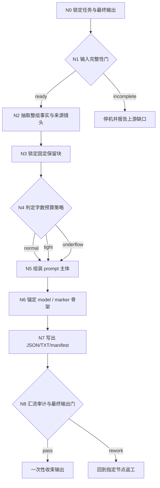
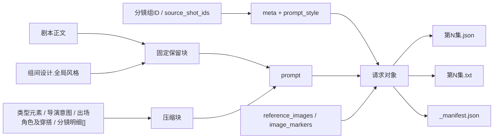
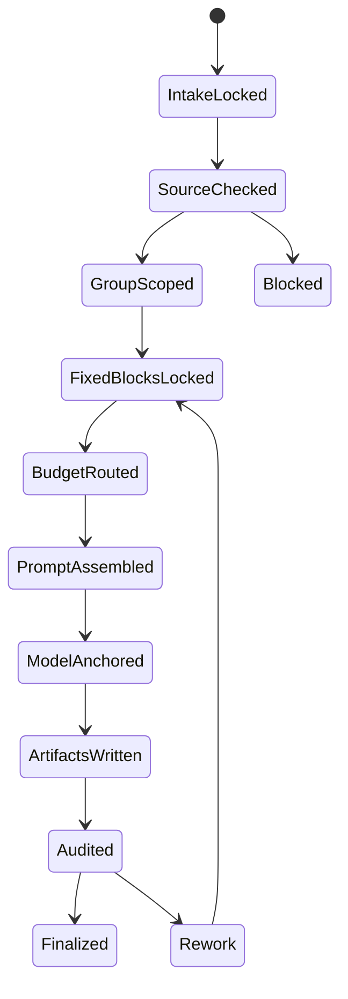
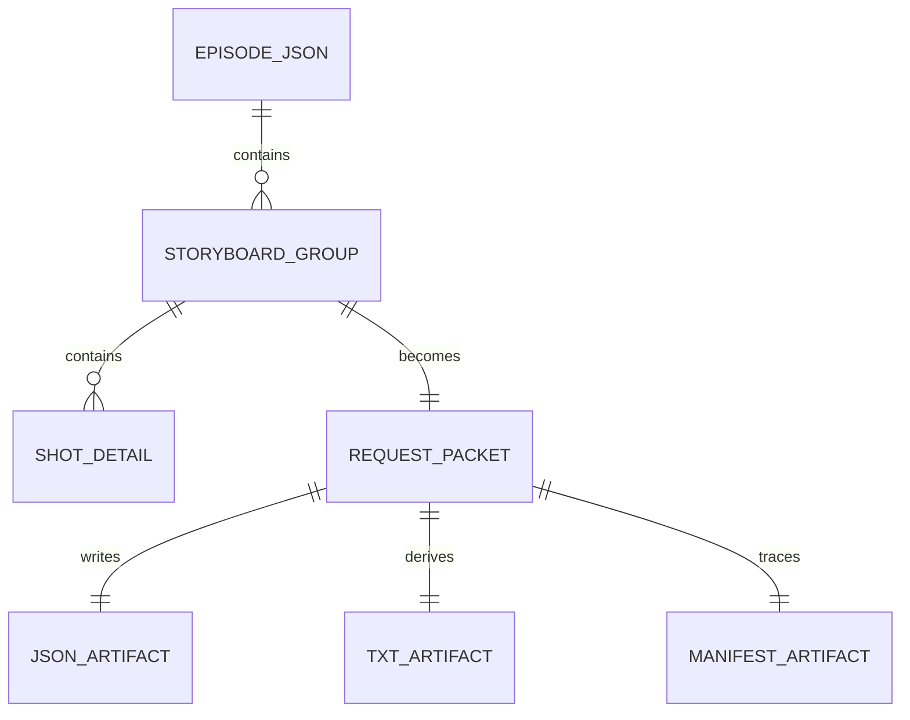

# 6-Video / 全能参照

## 编排声明

- 本技能按 `$skill-知行合一` 的 `既有优化` 模式重构。
- 本技能采用 `SKILL.md + prompt-assembly-spec.md 双真源`：
  - `SKILL.md` 持有门禁、优先级、节点网、验收与返工入口。
  - `prompt-assembly-spec.md` 持有组级桥接句、镜级句式槽、压缩级别与可选字段挂句。
- 跨兄弟叶子共享的 `图生视频` 句法总原则回指 `.agents/skills/aigc/6-Video/_shared/image-to-video-prompt-principles.md`；本地 spec 只负责组级 specialization。
- `复杂链路的骨架 / 细则分层`：`false`
- 这意味着：本技能不再把执行句法散落在脚本函数体，也不再回退到 `references/` 分层；句法级真源固定为同目录 `prompt-assembly-spec.md`。

## Mode Selection

- 当前模式：`既有优化`
- 选择原因：
  - 目标技能已经拥有稳定业务语义、模板、字段与落盘约束
  - 需要重构的是组织方式与思行节点密度，而不是重新定义业务合同
  - 本轮不创建新子技能，不升级成多智能体体系
- 当前输出策略：
  - 保留现有三件套与 shared template 真源
  - 把线性流程重写为知行合一式思行网络
  - 明确关闭 `references/` 细则分层

## Purpose & Scope

`全能参照` 是 `6-Video` 阶段位于 `1-提示词蒸馏` tranche 的组级叶子子技能，当前 canonical 路径固定为：

`/Volumes/AIGC/AIGC-DREAM- MAKER/.agents/skills/aigc/6-Video/1-提示词蒸馏/全能参照/`

它负责把 `projects/aigc/<项目名>/3-Detail/第N集.json` 中 **单个分镜组的全部组级与镜级内容** 蒸馏为 **每组 1 条** 视频请求对象，并同步产出：

- `第N集.json`
- `第N集.txt`
- `_manifest.json`

当前重点不是提交视频任务，而是把分镜组稳定整理为可 handoff 的 canonical request packet。

## Business Requirement Analysis Contract

| 分析项 | 当前结论 |
| --- | --- |
| `business_goal` | 只消费 `metadata.document_phase=ready` 的 `3-Detail` shared root，把导演真源中的整组信息压缩为后续视频工具可直接消费的组级请求对象，同时不损坏上游事实。 |
| `business_object` | 单个 `分镜组`，包括 `剧本正文`、`组间设计.*`（含 `出场角色及穿搭`）与该组下全部 `分镜明细[]`；镜级蒸馏默认尽量覆盖全部字段，并按保留优先级重点消费 `时间段 / 角色背景面 / 角色站位走位 / 景别 / 运镜手法 / 镜头速度（如存在）/ 镜头视角`。 |
| `task_goal` | 生成一组一条的 `meta + prompt_style + model + prompt + prompt_char_count` 请求对象，并落盘三件套。 |
| `constraint_profile` | 只允许消费 `metadata.document_phase=ready`、且每组 `分镜切换 == len(分镜明细[])` 的 `3-Detail` shared root；必须原文保留 `剧本正文` 与 `组间设计.全局风格`；其余字段默认必须以连贯自然语句串联并尽量全部进入 prompt，除 `分镜组ID / 分镜ID` 外移除字段标题，总字数控制在 `1900` 字内；每个分镜都不得漏掉当前分镜组内的 `xx秒-xx秒` 时间段标签，且 `分镜ID` 与时间之间不得写成“`分镜ID 的 xx秒-xx秒`”；镜级信息组织顺序可优先参考“`[镜头属性] -> [景别 / 运镜手法 / 镜头速度 / 镜头视角] -> [角色站位走位 / 角色背景面] -> [角色表现 / 场景氛围] -> [道具及状态 / 摄影美学 / 其他]`”，但表层表达不强制套固定句式，自然流畅与信息覆盖优先；只有当且仅当字数吃紧时，才允许把部分句子收束为短语式压缩；超限时只能按优先级压缩，优先保留镜级 `时间段 / 角色站位走位 / 角色背景面 / 景别 / 运镜手法 / 镜头速度（如存在）/ 镜头视角`，其次保留 `角色表现 / 场景氛围 / 道具及状态 / 摄影美学`，再次压缩 `镜头属性 / 镜头框架 / 镜头类型 / 分镜表现`；不得虚构图片、URL、主体、动作或场景事实。 |
| `non_goals` | 不改写上游导演事实；不上传参照图；不执行 provider 提交、轮询与下载；不把 TXT 当主真源。 |
| `success_criteria` | 每个分镜组都能回链到来源镜头列表；prompt 覆盖整组信息；固定块逐字一致；无字段标题泄露；JSON/TXT/manifest 三件套可继续 handoff。 |
| `evidence_sources` | `projects/aigc/<项目名>/3-Detail/第N集.json`、`.agents/skills/aigc/_shared/director_episode_output.schema.json`、`6-Video/_shared` 双模板。 |
| `complexity_sources` | 输入完整性门禁、固定块与压缩块的并存、字数预算分支、标题隐藏约束、结构化输出与阅读视图的双重落盘。 |
| `topology_fit` | 采用“串行主干 + 条件分支 + 汇流门”的混合拓扑最合适：主干负责锁源、抽取、组装、落盘；分支负责输入缺口、预算压力与异常说明；最终统一进入唯一输出门。 |
| `step_strategy` | 不用假线性大段 prose，而用细粒度思行节点拆开“锁任务、验输入、抽整组、锁固定块、判预算、组 prompt、锚模型、写三件套、做汇流审计”。 |

## When to Use

- 需要把 `projects/aigc/<项目名>/3-Detail/第N集.json` 中 `metadata.document_phase=ready` 的 **分镜组** 蒸馏为视频工具入参 JSON。
- 需要输出 `第N集.json + 第N集.txt + _manifest.json` 三件套。
- 需要保留 `剧本正文` 与 `组间设计.全局风格` 原文不变，同时压缩其余组级与镜级字段。
- 需要把每个分镜的 `时间段` 转成 `xx秒-xx秒` 并显式保留在镜级条目前部。
- 需要按“高保留镜头控制项 > 情绪/氛围/道具/摄影 > 其余镜头补充项”的顺序压缩，并默认保持连贯自然语句表达；只有字数吃紧时才退化到短语。
- 需要为后续 `.agents/skills/cli/dreamina-cli/SKILL.md` 或 `6-Video/2-视频生成` 提供组级 `multimodal2video` 风格输入对象。

## When Not to Use

- 当前任务是单一 `分镜ID` 的帧级蒸馏，应进入 `1-提示词蒸馏/首帧参照`。
- 当前任务是实际提交 provider、轮询结果或下载产物，应进入 `2-视频生成` 或命中的 provider 技能。
- 上游 `3-Detail/第N集.json` 尚未形成合法 `final_output.main_content.分镜组列表`。
- 上游 `metadata.document_phase` 仍为 `bootstrapped` 或 `detail_in_progress`。
- 任一目标分镜组的 `分镜切换` 与 `分镜明细[]` 数量未对齐，说明 `3-Detail` merge/handoff 仍未稳定。
- 任务要求上传、选择或补画参照图；本子技能只保留参照图骨架，不处理真实图片资产。

## Ownership Boundary

### `全能参照` 拥有

- 分镜组 -> 视频请求对象的一对一转换合同。
- 组级 prompt 的固定保留块、压缩块、标题隐藏规则与字数预算规则。
- `reference_images` / `image_markers` 的顺序承接骨架。
- `第N集.json + 第N集.txt + _manifest.json` 的三件套落盘与最小追溯台账。
- 面向执行闭环的 `思考过程` 输出格式。

### `全能参照` 不拥有

- 改写上游导演事实。
- 上传参照图、虚构图片 URL 或补造主体信息。
- 真实 provider 提交、轮询、下载。
- 父阶段路由裁决；路径选择由 `.agents/skills/aigc/6-Video/SKILL.md` 负责。

## Total Input Contract

### Canonical Inputs

- `projects/aigc/<项目名>/3-Detail/第N集.json`
- `projects/aigc/<项目名>/3-Detail/validation-report.md`（若存在，作为 handoff 辅助证据）
- `.agents/skills/aigc/_shared/director_episode_output.schema.json`
- `.agents/skills/aigc/6-Video/_shared/video-generation-input.template.json`
- `.agents/skills/aigc/6-Video/_shared/视频生成入参.template.txt`
- `.agents/skills/aigc/6-Video/_shared/image-to-video-prompt-principles.md`
- `.agents/skills/aigc/6-Video/1-提示词蒸馏/全能参照/prompt-assembly-spec.md`
- canonical rerun entry：`python3 .agents/skills/aigc/6-Video/1-提示词蒸馏/全能参照/scripts/generate_episode_packets.py --project <项目名> --episode <第N集>`

### Input Integrity Gates

最小输入前提：

- `metadata.document_phase = ready`
- `final_output.main_content.分镜组列表` 存在。
- 每个目标分镜组至少具备：
  - `分镜组ID`
  - `分镜切换`
  - `剧本正文`
  - `组间设计.全局风格`
  - `组间设计.类型元素`
  - `组间设计.导演意图`
  - `组间设计.出场角色及穿搭`
  - `分镜明细[]`
  - `分镜明细[].时间段.开始秒`
  - `分镜明细[].时间段.结束秒`
  - `分镜明细[].角色背景面`
  - `分镜明细[].角色站位走位`
  - `分镜明细[].景别`
  - `分镜明细[].运镜手法`
  - `分镜明细[].镜头视角`
- 对每个目标分镜组，还要求：
  - `组间设计.出场角色及穿搭` 非空
  - `分镜明细[]` 非空
  - `len(分镜明细[]) == 分镜切换`
- 若目标分镜存在以下字段，也应一并收齐并纳入压缩预算：
  - `分镜明细[].镜头速度`
  - `分镜明细[].角色表现`
  - `分镜明细[].场景氛围`
  - `分镜明细[].道具及状态`
  - `分镜明细[].摄影美学`
  - `分镜明细[].镜头属性`
  - `分镜明细[].镜头框架`
  - `分镜明细[].镜头类型`
  - `分镜明细[].分镜表现`

## Prompt Compression Priority Contract

- P0 固定原文块：
  - `剧本正文`
  - 固定音频约束行：`不生成字幕，不生成BGM，要生成物理互动音效与环境音。`
  - `组间设计.全局风格`
- P1 高保留镜头控制项：
  - `时间段`
  - `角色站位走位`
  - `角色背景面`
  - `景别`
  - `运镜手法`
  - `镜头速度（如存在）`
  - `镜头视角`
- P2 重要表现与氛围项：
  - `角色表现`
  - `场景氛围`
  - `道具及状态`
  - `摄影美学`
- P3 补充镜头组织项：
  - `镜头属性`
  - `镜头框架`
  - `镜头类型`
  - `分镜表现`

压缩规则：

1. 默认先按连贯自然语句串联 `P1 + P2 + P3`，尽量覆盖全部字段内容。
2. 每个分镜组 prompt 都必须在 `剧本正文` 下一行插入固定音频约束行：`不生成字幕，不生成BGM，要生成物理互动音效与环境音。`
3. 当预计超出 `1900` 字时，只能先压缩 `P3`，再酌情收束 `P2`，不得先牺牲 `P1`。
4. `P1` 必须在最终 prompt 中保持高度可辨认，至少要让每个分镜都能读出 `xx秒-xx秒`、空间朝向/人物走位、景别、运镜方式，以及存在时的镜头速度和镜头视角。
5. 默认优先采用“时间 -> 镜头控制 -> 人物与空间 -> 表现与氛围 -> 道具与摄影 -> 其他”的语义顺序，但表层表达不强制套固定句式；若固定骨架让句子变拗口，应优先改写成更自然通顺的表达。
6. `时间段` 必须落成当前分镜组内的 `xx秒-xx秒`，并直接接在 `分镜ID` 后，不得写成 `分镜ID 的 xx秒-xx秒`，也不得误写成全集时间线。
7. 无论是否压缩，除 `分镜组ID / 分镜ID` 外都不得暴露字段标题，尤其不得写成 `字段标题：字段值`。

### 镜头属性术语合同

- `镜头属性` 指镜头在叙事或观看功能上的专有命名，不是 `景别 / 运镜 / 视角` 的同义改写。
- 优先级：先沿用上游原词；仅当上游缺失且确有必要补足语义时，才可按事实选取最贴切的常见术语，不得为了凑列表虚构镜头功能。
- 落句时直接使用术语本体，例如 `定场镜头 / 反应镜头 / 规训镜头 / 权力落位镜头`；不要机械补成“`为定场镜头`”“`为规训镜头`”。
- 常见术语清单（非穷尽）：
  - `定场镜头`
  - `建立镜头`
  - `引入镜头`
  - `反应镜头`
  - `观察镜头`
  - `主观镜头`
  - `客观镜头`
  - `关系镜头`
  - `对峙镜头`
  - `落位镜头`
  - `权力落位镜头`
  - `叙事镜头`
  - `动作镜头`
  - `跟进镜头`
  - `追随镜头`
  - `情绪镜头`
  - `压迫镜头`
  - `释放镜头`
  - `揭示镜头`
  - `细节镜头`
  - `过桥镜头`
  - `转场镜头`
  - `收束镜头`
  - `空镜`

### Loading Order

1. `.agents/skills/aigc/SKILL.md + CONTEXT.md`
2. `.agents/skills/aigc/6-Video/SKILL.md + CONTEXT.md`
3. 本 `SKILL.md + CONTEXT.md`
4. `projects/aigc/<项目名>/3-Detail/validation-report.md`（若存在）
5. 按需读取 `6-Video/_shared` 双模板

优先级遵循：用户显式请求 > 根 `AGENTS.md` > `.agents/skills/aigc/SKILL.md` > `.agents/skills/aigc/6-Video/SKILL.md` > 本 `SKILL.md` > 各级 `CONTEXT.md`。

## Topology Contract

### 主干与分支总览

- 串行主干：`N0 -> N1 -> N2 -> N3 -> N4 -> N5 -> N6 -> N7 -> N8`
- 条件分支：
  - `N1` 负责输入完整性分支：`ready / incomplete`
  - `N4` 负责预算分支：`normal / tight / underflow`
  - `N8` 负责收束分支：`pass / rework / stop`
- 并行面：本技能不做真实并行执行，但在 `N2` 中需要同时覆盖组级字段与镜级字段两个信息面，然后在 `N5` 汇合。

## Mermaid Visual Contract

- 本技能把 Mermaid 视为真实治理真源，不是装饰图。
- 当前至少用 4 张图分别承载：
  - 主干与分支流
  - 字段汇合关系
  - 状态推进
  - 输入对象到产物对象的关系
- 若未来再增复杂度，必须继续补图，不得退回“只有 prose 没有结构图”的状态。

## Visual Maps (Mermaid)

## Thinking-Action Node Contract

### Node Register

| node_id | 节点名 | 主责任 | 失败回退 |
| --- | --- | --- | --- |
| `N0` | 锁定任务与最终输出 | 锁定当前必须是组级蒸馏任务，明确唯一输出面 | 停止并回父级路由 |
| `N1` | 输入完整性门 | 检查 director 真源与目标组字段是否齐全 | 停止并回上游补源 |
| `N2` | 抽取整组事实与来源镜头 | 收齐组级字段、镜级字段与 `source_shot_ids` | 回 `N1` |
| `N3` | 锁定固定保留块 | 把 `剧本正文 / 全局风格` 固化为不可改写块 | 回 `N2` |
| `N4` | 判定字数预算策略 | 根据剩余信息密度选择 `normal / tight / underflow` | 回 `N3` |
| `N5` | 组装 prompt 主体 | 融合固定块与压缩块，隐藏字段标题 | 回 `N3` 或 `N4` |
| `N6` | 锚定 model / marker 骨架 | 保持模板兼容，不虚构图片信息 | 回 `N5` |
| `N7` | 写出三件套 | 写 JSON/TXT/manifest 并记录统计与例外 | 回 `N5` 或 `N6` |
| `N8` | 汇流审计与最终输出门 | 做字段、字数、原文、追溯与闭环检查 | 回指定节点返工 |

### N0 锁定任务与最终输出

- `objective`
  - 在真正处理内容前，确认当前任务就是“组级视频请求蒸馏”，不是帧级蒸馏，也不是 provider 提交。
- `着手面`
  1. 判定任务粒度是不是 `分镜组 -> 1 条请求对象`
  2. 锁定本轮最终只允许产出 `第N集.json + 第N集.txt + _manifest.json`
  3. 锁定 canonical runtime 落点为 `projects/aigc/<项目名>/6-Video/全能参照/第N集/`
  4. 明确 `思考过程` 只进入执行闭环说明，不与 JSON 主体竞争真源
- `inputs`
  - 用户任务目标
  - 父级 `6-Video` 路由合同
  - 当前子技能输出合同
- `actions`
  1. 确认任务不是 `首帧参照`
  2. 确认任务不是 `2-视频生成`
  3. 锁定三件套与唯一 handoff 主体为 `第N集.json`
- `evidence`
  - 命中 `全能参照`
  - 输出模式记为 `full_trace`
- `route_out`
  - 成功：进入 `N1`
  - 失败：停止并回父级 `6-Video` 重新路由
- `gate`
  - 只有当任务粒度与输出口径都锁定后，才允许进入源文件读取

### N1 输入完整性门

- `objective`
  - 在处理任何 prompt 文本前，先判定上游 director 真源是否足够支撑整组蒸馏。
- `着手面`
  1. 锁定 `metadata.document_phase`
  2. 锁定 `final_output.main_content.分镜组列表`
  3. 检查每组必需字段
  4. 判断缺口是“可继续压缩”还是“必须停机”
  5. 给出显式失败原因，而不是生成半成品
- `inputs`
  - `projects/aigc/<项目名>/3-Detail/第N集.json`
  - director schema
  - `projects/aigc/<项目名>/3-Detail/validation-report.md`（若存在）
- `actions`
  1. 读取单集 JSON
  2. 检查 `metadata.document_phase` 是否已经到 `ready`
  3. 定位 `分镜组列表`
  4. 检查 `分镜组ID / 分镜切换 / 剧本正文 / 组间设计 / 分镜明细`
  5. 若 `组间设计.出场角色及穿搭` 为空，视为上游 `3-Detail` 未完成 schema 闭环，不得继续蒸馏
  6. 若 `len(分镜明细[]) != 分镜切换`，视为上游 `3-Detail` merge/handoff 未稳定，不得继续蒸馏
  7. 对不完整输入记录缺口类型与 phase 状态
- `evidence`
  - `V-VID-SUBJ-01=ready|incomplete`
  - `document_phase`
  - 缺口字段列表
- `route_out`
  - `ready`：进入 `N2`
  - `incomplete`：停止并回上游补 `3-Detail/第N集.json`
- `gate`
  - 未通过时禁止进入任何 prompt 组装节点

### N2 抽取整组事实与来源镜头

- `objective`
  - 把整组处理所需的组级事实、镜级事实和来源镜头列表一次抽齐，避免后续只蒸馏局部内容。
- `着手面`
  1. 识别目标 `分镜组ID`
  2. 收齐全部 `分镜明细[]`
  3. 生成稳定的 `source_shot_ids`
  4. 分离固定保留块候选与压缩块候选
- `inputs`
  - 已通过完整性门的分镜组对象
- `actions`
  1. 提取 `分镜组ID`
  2. 提取 `剧本正文`
  3. 提取 `组间设计.全局风格 / 类型元素 / 导演意图`
  4. 提取 `组间设计.出场角色及穿搭`
  5. 遍历全部 `分镜明细[]`，显式收齐 `时间段.开始秒 / 时间段.结束秒 / 角色背景面 / 角色站位走位 / 景别 / 运镜手法 / 镜头视角`
  6. 若存在，则继续收齐 `镜头速度 / 角色表现 / 场景氛围 / 道具及状态 / 摄影美学 / 镜头属性 / 镜头框架 / 镜头类型 / 分镜表现`
  7. 生成 `meta.source_shot_ids`
- `evidence`
  - 组级字段清单
  - 镜级字段覆盖清单
  - `source_shot_ids`
- `route_out`
  - 成功：进入 `N3`
  - 失败：回 `N1` 重新确认输入完整性或分组合法性
- `gate`
  - 必须确认“整组全覆盖”成立，才允许进入固定块锁定

### N3 锁定固定保留块

- `objective`
  - 将 `剧本正文` 与 `组间设计.全局风格` 固定为不可改写、不可净化、不可重命名的原文块。
- `着手面`
  1. 判定哪些内容是绝对 fixed block
  2. 从 prompt 组装责任中隔离 fixed block 与 compressed block
  3. 建立逐字一致校验点
- `inputs`
  - `N2` 的整组字段包
- `actions`
  1. 原样拷贝 `剧本正文`
  2. 原样拷贝 `组间设计.全局风格`
  3. 标记 `类型元素 / 导演意图 / 出场角色及穿搭 / 分镜明细[]` 为压缩块
  4. 记录 fixed block char count
- `evidence`
  - `fixed_blocks.script_verbatim`
  - `fixed_blocks.style_verbatim`
  - `fixed_char_count`
- `route_out`
  - 成功：进入 `N4`
  - 失败：回 `N2`
- `gate`
  - 若 fixed block 发生任何改写迹象，必须停机返工

### N4 判定字数预算策略

- `objective`
  - 在不牺牲 fixed block 的前提下，为压缩块选择最稳的预算策略。
- `着手面`
  1. 估算 fixed block 占用
  2. 估算压缩块信息量
  3. 判定 `normal / tight / underflow`
  4. 决定压缩粒度与 manifest 备注策略
- `inputs`
  - fixed block
  - 压缩块候选
  - 目标字数上限 `<= 1900`
- `actions`
  1. 计算 fixed block 字数
  2. 判断剩余预算
  3. 选择预算策略：
     - `normal`：保持连贯自然语句，默认覆盖 `P1 + P2 + P3`，并按推荐语义顺序组织信息；若标准骨架让句子变硬，应优先改写成更自然的表述
     - `tight`：仅在预计逼近上限或超限风险明显时，先压缩 `P3`，再酌情收束 `P2`；只有这一档才允许把部分句子压成更精炼的自然短语；`P1` 必须继续高度保留，尤其不得丢失 `xx秒-xx秒` 与景别/运镜/视角；`分镜明细 >= 5` 只是高风险信号，不是默认短语化开关
     - `underflow`：预算明显宽松时保持连贯自然语句与保守保真；允许显著低于上限，但不得为凑字数虚构扩写，也不得在阔绰余量下无故切成短语
  4. 预置异常说明模板
- `evidence`
  - `V-VID-SUBJ-02=normal|tight|underflow`
  - 预算判定理由
- `route_out`
  - 三种预算策略都进入 `N5`
  - 若 fixed block 已超出合理承载范围，则回 `N3`
- `gate`
  - 预算策略必须显式可追溯，禁止“凭感觉压缩”

### N5 组装 prompt 主体

- `objective`
  - 产出同时满足“整组全覆盖、固定块原文保留、标题隐藏、字数受控”的 prompt。
- `着手面`
  1. 固定块直接贴入
  2. 压缩块均匀覆盖全部组级与镜级内容
  3. 只保留 `分镜组ID / 分镜ID` 两类标签
  4. 计算真实 `prompt_char_count`
  5. 默认用连贯自然句式融合信息；当且仅当 `tight` 触发时，才可切换为更精炼的自然短语，但仍不得把字段逐项硬裁切成带省略号的半截短语
- `inputs`
  - fixed block
  - 预算策略
  - 压缩块候选
  - `source_shot_ids`
- `actions`
  1. 写入 `分镜组ID`
  2. 原文嵌入 `剧本正文`
  3. 原文嵌入 `全局风格`
  4. 按预算策略压缩 `类型元素 / 导演意图 / 出场角色及穿搭 / 分镜明细[]`
  5. 每个镜级条目先把 `时间段` 规范成当前分镜组内的 `xx秒-xx秒`，并紧接在 `分镜ID` 后方，不得写成 `分镜ID 的 xx秒-xx秒`
  6. 默认按“镜头属性 -> 景别/运镜/速度/视角 -> 角色站位走位/角色背景面 -> 角色表现/场景氛围 -> 道具及状态/摄影美学/其他”的语义顺序组织镜级内容，但表层表达不强制套固定句式；若固定骨架让句子发硬，应主动改写成更自然流畅的句子，且不得改写成 `镜头属性：...`、`景别：...`、`角色表现：...` 之类标签句
  7. 明确把组级穿搭摘要与镜级 `P1 + P2 + P3` 内容融进自然句，不得回退成旧字段标题拼贴
  8. 每个镜级条目都必须高度保留 `P1`：至少明确读出 `xx秒-xx秒 / 角色背景面 / 角色站位走位 / 景别 / 运镜手法 / 镜头视角`，以及存在时的 `镜头速度`
  9. `P2` 默认应保留在最终连贯自然句中；只有 `tight` 生效且预算仍吃紧时，才允许先收束措辞密度，但仍应留下核心结果而非整段消失
  10. `P3` 是第一顺位压缩层；预算不足时先把 `镜头属性 / 镜头框架 / 镜头类型 / 分镜表现` 收束成更短的自然短语、并入其他句子，或压到句尾 `其他` 槽位，不得先牺牲 `P1`
  11. 将镜级字段改写为连贯自然融合句；只有 `tight` 生效时，才允许把完整自然句收束为更精炼的自然短语。`>= 5` 镜长组只表示应更早做预算预估，不代表在预算宽松时放弃自然语句；仍不得靠字段值硬截断、堆省略号或保留半字段骨架来压字数
  12. 检查是否泄露字段标题
  13. 以最终会写入 `第N集.json` 的 `prompt` 字符串为准统计 `prompt_char_count`，不得按带临时换行或中间草稿计数
- `evidence`
  - 完整 `prompt`
  - `prompt_char_count`
  - 标题泄露检查结果
- `route_out`
  - 成功：进入 `N6`
  - fixed block 被污染：回 `N3`
  - 预算策略失衡：回 `N4`
- `gate`
  - 若任一镜级条目遗漏、字段标题泄露、出现机械省略号截断或字数统计不实，不得进入下游模板组装

### N6 锚定 model / marker 骨架

- `objective`
  - 维持共享模板兼容性，保留图片上传顺序位与 marker 骨架，同时严禁虚构图片信息。
- `着手面`
  1. 保留 `reference_images`
  2. 保持 `image_markers` 结构稳定
  3. 确认顺序一致
  4. 不因当前轮次无图而删字段
- `inputs`
  - 共享 JSON 模板
  - `N5` 的 prompt 主体
- `actions`
  1. 填写 `meta`
  2. 填写 `prompt_style`
  3. 保留 `model.reference_images`
  4. 组织 `model.image_markers`
  5. 挂接 `prompt` 与 `prompt_char_count`
- `evidence`
  - 请求对象草稿
  - marker 顺序校验结果
- `route_out`
  - 成功：进入 `N7`
  - 发现字段缺失或顺序错位：回 `N5`
- `gate`
  - 模型骨架必须兼容共享模板，且无任何虚构图片语义

### N7 写出三件套

- `objective`
  - 将请求对象一次写成可供工具与人工共同消费的三件套，并把例外写进 manifest。
- `着手面`
  1. JSON 作为 completeness carrier
  2. TXT 作为 derived display view
  3. manifest 作为追溯与异常载体
  4. 三件套之间保持路径与统计一致
- `inputs`
  - 完整请求对象
  - 共享 TXT 模板
  - 预算/异常信息
- `actions`
  1. 写 `第N集.json`
  2. 写 `第N集.txt`
  3. 写 `_manifest.json`
  4. 为每组记录 `group_id / prompt_char_count / within_target_limit / exception_note`
  5. 回读最终 JSON，确认 `len(prompt) == prompt_char_count`
- `evidence`
  - 三个文件路径
  - manifest group summary
- `route_out`
  - 成功：进入 `N8`
  - JSON/TXT/manifest 任一缺失：回 `N5` 或 `N6`
- `gate`
  - 若只产出 prompt 或只产出单文件，视为未完成

### N8 汇流审计与最终输出门

- `objective`
  - 在真正结案前，统一核对三件套、fixed block、标题隐藏、字数与闭环说明。
- `着手面`
  1. 核对 fixed block 逐字一致
  2. 核对整组覆盖与来源镜头可追溯
  3. 核对模型骨架与三件套一致性
  4. 生成最终 `思考过程 + 关键证据 + 风险/例外`
- `inputs`
  - 三件套
  - 所有节点证据
- `actions`
  1. 复核 `prompt_char_count`
  2. 复核 `剧本正文 / 全局风格`
  3. 复核字段标题泄露
  4. 复核 `reference_images / image_markers`
  5. 生成执行闭环说明
- `evidence`
  - 审计结果
  - 返工入口
  - 执行闭环摘要
- `route_out`
  - `pass`：进入最终一次性输出
  - `rework`：回到 `N3 / N4 / N5 / N6 / N7`
  - `stop`：报告上游缺口或不可继续原因
- `gate`
  - 只有同时通过固定块、覆盖度、模板兼容性与三件套完整性四重门，才允许结案

## Type Strategy & Fallback

### Variable Register

| var_id | 变量层级 | 观测信号 | 状态集合 | 检测方法 | 优先级 |
| --- | --- | --- | --- | --- | --- |
| V-VID-SUBJ-01 | 输入 | `3-Detail` handoff 是否已稳定可消费 | `ready/incomplete` | 检查 `metadata.document_phase=ready`，且 `分镜组ID/分镜切换/剧本正文/组间设计（含出场角色及穿搭）/分镜明细（含时间段开始秒/结束秒、角色背景面/角色站位走位/景别/运镜手法/镜头视角，以及存在时的镜头速度）` 成立，并验证 `分镜切换 == len(分镜明细[])` | P0 |
| V-VID-SUBJ-02 | 字数预算 | 非固定字段压缩压力 | `normal/tight/underflow` | 估算 fixed block 后剩余字数，并结合组内镜数判断是否存在逼近上限风险；除 `tight` 外均保持连贯自然语句 | P1 |
| V-VID-SUBJ-03 | 输出要求 | 本轮是否需要完整闭环 | `json_only/full_trace` | 结合用户目标与父级合同 | P1 |
| V-VID-SUBJ-04 | 文本结构 | 是否存在标题泄露风险 | `clean/leaking` | 搜索除 `分镜组ID / 分镜ID` 外的字段名暴露 | P1 |

### Case To Strategy Map

| case_id | 触发谓词 | 主策略 | 通过标准 | fallback |
| --- | --- | --- | --- | --- |
| C-VID-SUBJ-01 | `V-VID-SUBJ-01=incomplete` | 停止并报告上游缺口 | 不伪造缺失字段 | 回上游补 `3-Detail/第N集.json` |
| C-VID-SUBJ-02 | `V-VID-SUBJ-02=normal` | 用连贯自然语句压缩非固定字段 | `prompt_char_count <= 1900` | 无 |
| C-VID-SUBJ-03 | `V-VID-SUBJ-02=tight` | 只在逼近上限时按 `P3 -> P2` 顺序压缩非固定字段；且只有这一档允许局部短语化；`P1` 继续高度保留；`>= 5` 镜长组优先触发预算预警，但不直接改写成短语版 | fixed block 不动，整体尽量压到 `<= 1900`，且 `P1` 与 `xx秒-xx秒` 仍清晰可辨 | 无 |
| C-VID-SUBJ-04 | `V-VID-SUBJ-02=underflow` | 保守保真并保持连贯自然语句，不虚构扩写 | 允许显著低于上限，但 manifest 备注 | 无 |
| C-VID-SUBJ-05 | `V-VID-SUBJ-03=full_trace` | 输出 JSON + TXT + manifest + 执行闭环说明 | 三件套可追溯，闭环可复核 | `json_only` |
| C-VID-SUBJ-06 | `V-VID-SUBJ-04=leaking` | 回到 prompt 组装层清理字段标题 | 除组ID/镜ID外无显式字段名 | 回 `N5` |

## Convergence Contract

### 汇流门定义

| gate_id | 门禁目标 | 通过条件 | 失败回退 |
| --- | --- | --- | --- |
| `GATE-VID-SUBJ-01` | 输入门 | `V-VID-SUBJ-01=ready` | `N1` 停机并报告 |
| `GATE-VID-SUBJ-02` | 文本门 | fixed block 原文保留；压缩块全覆盖；`V-VID-SUBJ-04=clean` | 回 `N3-N5` |
| `GATE-VID-SUBJ-03` | 模板门 | `reference_images` 存在；`image_markers` 结构稳定且无虚构内容 | 回 `N6` |
| `GATE-VID-SUBJ-04` | 产物门 | `第N集.json + 第N集.txt + _manifest.json` 齐备且统计一致 | 回 `N7` |
| `GATE-VID-SUBJ-05` | 结案门 | 最终结果、思考过程、关键证据、风险/例外四段闭环齐备 | 回 `N8` |

### 最小验收清单

- `prompt_char_count` 与实际 prompt 一致。
- `prompt_char_count` 必须按最终落盘到 `第N集.json` 的 `prompt` 字符串计数，不得把临时换行、草稿拼接态或 TXT 视图改写计入。
- `metadata.document_phase = ready`，不得误吃 `bootstrapped/detail_in_progress` 半成品。
- 每个命中分镜组都满足 `分镜切换 == len(分镜明细[])`。
- `剧本正文` 与 `组间设计.全局风格` 与上游逐字一致。
- `组间设计.出场角色及穿搭` 已进入压缩块，且未在蒸馏过程中丢失。
- 每个镜级条目前都保留 `xx秒-xx秒`，且来自上游 `时间段.开始秒 / 结束秒`，不得漏写或改成模糊时间语。
- 镜级 `角色背景面 / 角色站位走位 / 景别 / 运镜手法 / 镜头视角` 已被消费；若上游存在 `镜头速度`，也必须被消费；不得把这些高保留项压缩到不可辨认。
- `角色表现 / 场景氛围 / 道具及状态 / 摄影美学` 默认应保留在连贯自然语句中；若预算吃紧，只允许在不伤及高保留项的前提下收束措辞。
- `镜头属性 / 镜头框架 / 镜头类型 / 分镜表现` 是第一顺位压缩层；可并入自然句，但不得伪装成已完整保留。
- 默认镜级表达应遵循推荐语义顺序，但不强制套固定句式；若固定骨架让句子发硬，应以自然流畅和信息覆盖优先。
- 不得把镜级句子写成 `时间段：...`、`镜头属性：...`、`景别：...`、`角色站位走位：...` 这类 `字段标题：字段值` 结构。
- 不得写成 `分镜ID 的 xx秒-xx秒`；时间必须对应当前分镜组内的秒级范围。
- 当预算不吃紧时，不得主动把连贯自然语句改写成短语式清单。
- 除 `分镜组ID / 分镜ID` 外，无字段标题泄露。
- 分镜压缩必须是自然融合文本，不得出现大量靠硬截断生成的 `…` 半截短语。
- 当预算明显宽松时，不得把自然语句无故压成短语式表达。
- `reference_images` 字段存在。
- `image_markers` 未伪造 URL / 主体 / 图号。
- `_manifest.json` 在超出 1900、显著低于上限或输入不足时写出异常说明。
- `第N集.txt` 只承载提示词与字数统计，不承载结构化参数区块。
- 若 `第N集.txt` 已用 section header 单独显示 `分镜组ID`，则不得再重复显示 prompt 首行同组 `分镜组ID`。
- 执行闭环说明必须显式给出 `思考过程`。

## One-Shot Output Contract

### Canonical Artifact Landing

- canonical 主产物：`projects/aigc/<项目名>/6-Video/全能参照/第N集/第N集.json`
- canonical 文本视图：`projects/aigc/<项目名>/6-Video/全能参照/第N集/第N集.txt`
- canonical 追溯台账：`projects/aigc/<项目名>/6-Video/全能参照/第N集/_manifest.json`

说明：

- canonical 输出路径末端与技能包名 `全能参照` 对齐，符合知行合一的同名落点约定。
- `第N集.json` 是唯一 completeness carrier。
- `第N集.txt` 只是 derived display view。
- `_manifest.json` 是追溯与例外说明载体。
- 若本次属于 recovery rerun，且 `project_state.yaml` 已推进到 `2-视频生成`、provider handoff 或更后续阶段，则本技能只修复缺失的 `全能参照` 三件套与 trace，不得把项目推荐入口、`current_stage` 或后续 ready 状态回退到本子技能之前。

### 执行闭环输出

每次执行本技能时，对用户的最终闭环固定收束为四段：

1. `最终结果`
   - 三件套落点
   - 组数量
   - 下游 handoff 主体
2. `思考过程`
   - 本轮命中的预算策略
   - 为什么采用当前压缩方式
   - 哪些节点触发了返工或保守退化
3. `关键证据`
   - fixed block 逐字一致
  - `prompt_char_count`
  - `source_shot_ids`
  - `within_target_limit`
4. `风险 / 例外`
   - underflow
   - 输入缺口
   - 未上传参照图仅保留骨架

### Handoff Contract

- 正式进入视频生成时，优先把 `第N集.json` 交给 `.agents/skills/cli/dreamina-cli/SKILL.md` 或父阶段 `2-视频生成`。
- `第N集.txt` 只供人工审阅，不作为自动化 handoff 主体。
- `_manifest.json` 只承载追溯、异常说明与最小验证结果，不替代 JSON 主体。
- 若 `project_state.yaml` 已经把下一入口锁到 `2-视频生成`，而磁盘缺失 `全能参照` 三件套，应视为 video prompt 层 runtime drift：先补回三件套，再保持原 handoff 指向，不额外降级项目状态。

## Field System

### Field Master

| field_id | 输出位置/字段 | 内容要求 | 默认责任 Node | 质量维度 | 失败码 |
| --- | --- | --- | --- | --- | --- |
| FIELD-VID-SUBJ-01 | `prompt_style.type / prompt_style.language / prompt_style.char_limit / meta.shot_level / meta.group_id / meta.source_shot_ids` | 锁定组级来源、提示词类型与来源分镜列表，并确认上游 `document_phase=ready` 且 `分镜切换 == len(分镜明细[])` | `N0-N2` | 输入覆盖完整度 | FAIL-VID-SUBJ-01 |
| FIELD-VID-SUBJ-02 | `prompt / prompt_char_count` | prompt 覆盖整组内容，固定块原文保留；压缩块显式覆盖 `类型元素 / 导演意图 / 出场角色及穿搭 / 分镜明细[]`，并按 `P1 高保留 / P2 重要 / P3 补充` 顺序压缩；每镜保留当前分镜组内的 `xx秒-xx秒`，按推荐语义顺序组织信息，但不为固定句式牺牲自然度，且隐藏标题 | `N3-N5` | Prompt 蒸馏稳定性 | FAIL-VID-SUBJ-02 |
| FIELD-VID-SUBJ-03 | `model.reference_images / model.image_markers` | 保留上传顺序位，并维持 marker 顺序稳定 | `N6` | 模板兼容性 | FAIL-VID-SUBJ-03 |
| FIELD-VID-SUBJ-04 | `第N集.json / 第N集.txt / _manifest.json` | 三件套可追溯、可审阅、可继续 handoff | `N7` | 输出可消费性 | FAIL-VID-SUBJ-04 |
| FIELD-VID-SUBJ-05 | `执行闭环.思考过程 / 关键证据 / 风险例外` | 最终回复必须给出思考过程与关键门禁依据 | `N8` | 结案可复核性 | FAIL-VID-SUBJ-05 |

## Thought Pass Map

### Node To Field Map

| node_id | 聚焦字段 | 核心问题 | 生成动作 | 未达标信号 |
| --- | --- | --- | --- | --- |
| `N0` | FIELD-VID-SUBJ-01 | 本轮是否真的是组级蒸馏且只允许一个最终输出面 | 锁定输出模式与落点 | 误入帧级或 provider 路径 |
| `N1` | FIELD-VID-SUBJ-01 | 上游 director 真源是否足够支撑整组蒸馏 | 做完整性检查 | 缺字段仍想继续 |
| `N2` | FIELD-VID-SUBJ-01 | 是否已经收齐整组来源与全部 `source_shot_ids` | 抽取组级与镜级事实 | 只抓到局部镜头 |
| `N3` | FIELD-VID-SUBJ-02 | 哪些块必须逐字保留 | 固定 `剧本正文 / 全局风格` | fixed block 被改写 |
| `N4` | FIELD-VID-SUBJ-02 | 当前预算应如何压缩其余信息 | 选择预算策略 | 压缩策略不可解释 |
| `N5` | FIELD-VID-SUBJ-02 | prompt 如何同时做到全覆盖、隐藏标题、控制字数 | 组装最终 prompt | 漏镜头、泄露标题、字数失真 |
| `N6` | FIELD-VID-SUBJ-03 | 模型骨架如何保持兼容且不虚构图片 | 填 model 双字段 | 字段缺失、乱序或虚构图片 |
| `N7` | FIELD-VID-SUBJ-04 | 工具视图与人工视图如何同时落盘 | 写三件套 | 只产一件或统计不同步 |
| `N8` | FIELD-VID-SUBJ-05 | 现在是否真的允许结案 | 做审计并输出闭环 | 缺思考过程或无返工入口 |

### Pass Table

| field_id | Pass Standard | Fail Code | Rework Entry |
| --- | --- | --- | --- |
| FIELD-VID-SUBJ-01 | `prompt_style.type / meta.shot_level` 合法，`group_id` 与 `source_shot_ids` 成立，且上游 `document_phase=ready`、`分镜切换 == len(分镜明细[])` | FAIL-VID-SUBJ-01 | `N0-N2` |
| FIELD-VID-SUBJ-02 | prompt 满足固定块、压缩块、隐藏标题与字数窗，且 `P1` 镜头控制项与 `xx秒-xx秒` 保持高度可辨认 | FAIL-VID-SUBJ-02 | `N3-N5` |
| FIELD-VID-SUBJ-03 | `reference_images` 存在，`image_markers` 三元信息结构完整且顺序稳定 | FAIL-VID-SUBJ-03 | `N6` |
| FIELD-VID-SUBJ-04 | JSON、TXT 与 manifest 可追溯可 handoff | FAIL-VID-SUBJ-04 | `N7` |
| FIELD-VID-SUBJ-05 | 最终闭环包含思考过程、关键证据与风险/例外 | FAIL-VID-SUBJ-05 | `N8` |

## Root-Cause Execution Contract (Mandatory)

当出现以下症状时，必须先修本子技能合同，而不是只润色 prompt：

- prompt 只覆盖整组的局部字段，尤其漏掉 `出场角色及穿搭` 或新镜级字段。
- `3-Detail` 仍处于 `bootstrapped/detail_in_progress`，或组内 `分镜切换` 与 `分镜明细[]` 未对齐，却被误当成稳定视频输入。
- prompt 漏掉镜级 `景别` 或 `运镜手法`，导致视频请求只有动作和气氛，没有镜头组织依据。
- `剧本正文` 或 `全局风格` 被改写。
- prompt 中仍残留字段标题。
- 压缩过猛只剩碎片，或显著超出预算。
- `reference_images` 被删除，或 `image_markers` 出现虚构 URL/主体/顺序错位。
- 有三件套产物，但没有思考过程与返工入口，导致结案不可复核。

必经链路：

`Symptom -> Direct Technical Cause -> Rule Source -> Meta Rule Source -> Fix Landing Points`

优先检查：

- `Rule Source`
  - `.agents/skills/aigc/6-Video/1-提示词蒸馏/全能参照/SKILL.md`
  - `.agents/skills/aigc/6-Video/1-提示词蒸馏/全能参照/CONTEXT.md`
- `Meta Rule Source`
  - `.agents/skills/aigc/6-Video/SKILL.md`
  - `.agents/skills/aigc/SKILL.md`
  - `/Users/vincentlee/.codex/skills/meta/构建/技能/skill-知行合一/SKILL.md`
  - 根 `AGENTS.md`

对用户的闭环输出固定包含：

1. 根因位置
2. 立即修复
3. 系统预防修复

## Deprecated Paths / Migration Note

- 旧写法 `.agents/skills/aigc/6-视频/subtypes/1-提示词蒸馏/全能参照/` 已废弃；当前 canonical 路径为 `.agents/skills/aigc/6-Video/1-提示词蒸馏/全能参照/`。
- 本技能当前不采用 `references/` 细则分层；若历史文件仍残留，只能视为迁移遗留，不得继续作为规范真源引用。
