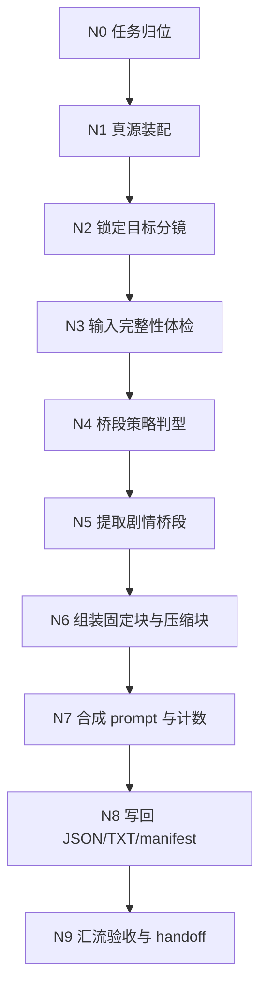
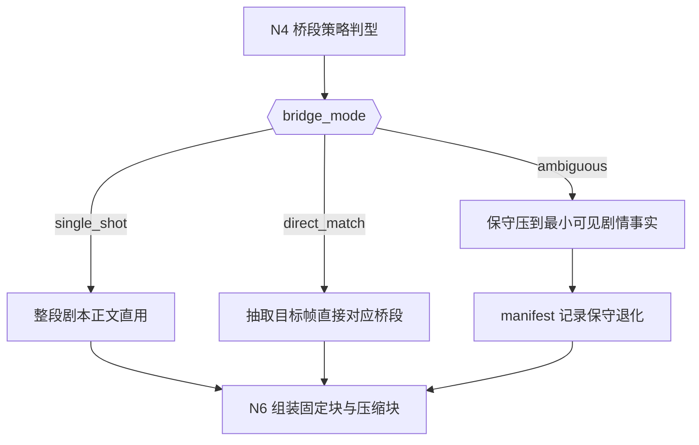
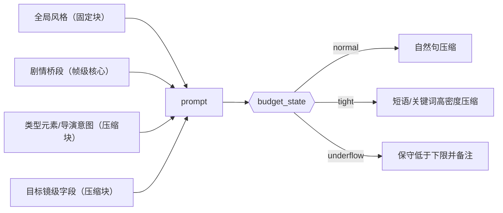
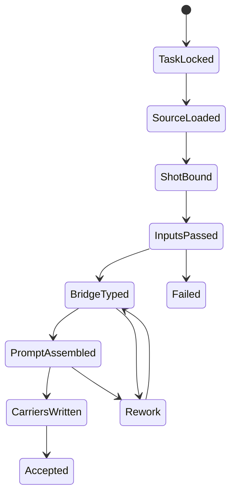

# 6-Video / 首帧参照

## 概述

`首帧参照` 是 `6-Video/1-提示词蒸馏` 下的帧级叶子技能，负责把 `projects/<项目名>/3-Detail/第N集.json` 中 **单一 `分镜ID`** 收束为 **1 条首帧锚点视频请求对象**，并写出可供视频工具消费的 `JSON + TXT + _manifest.json` 三件套。

本次重构采用 `$skill-知行合一` 的单技能真源口径，并显式关闭“复杂链路的骨架 / 细则分层”：

- `复杂链路的骨架 / 细则分层`：`false`
- canonical source：仅本 `SKILL.md`
- 保留现有业务机制、模板依赖、字段主表、三件套落点与 fallback 规则
- 不再把思维链、执行流、类型策略与输出契约拆散到平行载体

交付类型：`内容输出型`

## When To Use

- 需要从 `projects/<项目名>/3-Detail/第N集.json` 中锁定单一 `分镜ID`，生成帧级视频请求对象。
- 需要把目标分镜所属组的 `剧本正文` 裁切为对应分镜帧的剧情桥段，而不是直接照搬整组剧情。
- 需要原文保留 `组间设计.全局风格`，同时压缩 `组间设计.类型元素`、`组间设计.导演意图` 与目标镜级字段。
- 需要输出 `第N集.json + 第N集.txt + _manifest.json` 三件套。
- 需要让下游 `.agents/skills/cli/dreamina-cli/SKILL.md` 或 `6-Video/2-视频生成` 继续消费帧级 JSON。

## When Not To Use

- 当前任务是按整个分镜组覆盖生成视频请求对象，应进入 `6-Video/1-提示词蒸馏/全能参照`。
- 当前任务是正式提交 provider、轮询结果或下载视频，应进入 `6-Video/2-视频生成` 或命中的 provider 技能。
- 上游 `3-Detail/第N集.json` 尚未形成合法 `分镜组列表[]`，或目标 `分镜ID` 不存在。
- 任务要求把多个 `分镜ID` 混成一条请求；本技能只处理“一镜一条”。
- 当前任务要求上传、选择或伪造真实参照图；本技能只保留图片字段骨架，不处理真实图片资产。

## 单一真源边界

### `首帧参照` 拥有

- `单一分镜ID -> 1 条帧级视频请求对象` 的转换合同。
- `剧本正文 -> 对应分镜帧剧情桥段` 的提取、保守压缩与例外说明规则。
- `全局风格` 原文直贴、非固定块压缩、字段标题隐藏与字数窗控制。
- 对 `6-Video/_shared` 共享 JSON/TXT 模板的局部填充规则。
- `第N集.json / 第N集.txt / _manifest.json` 三件套的最小落盘合同。

### `首帧参照` 不拥有

- 改写上游导演事实、虚构镜头内容或补造剧情过渡。
- 上传真实图片、编造 `reference_images` / `image_markers` / URL。
- 把多个分镜拼接成一条请求，或把整组任务伪装成首帧任务。
- 真实 provider 提交、轮询与下载。

## Business Requirement Analysis Contract

### 业务目标

- 把单一 `分镜ID` 收束成稳定、可追溯、可 handoff 的帧级视频请求对象。
- 保留目标分镜所属组的空气层与风格层，但把剧情主叙述精准收缩到该帧可见的剧情桥段。
- 让下游视频工具消费的是结构化 JSON，而不是人工摘要文案。

### 业务对象

- 上游对象：`projects/<项目名>/3-Detail/第N集.json`
- 关键结构：`final_output.main_content.分镜组列表[]`
- 关键组级字段：`分镜组ID`、`剧本正文`、`组间设计.全局风格`、`组间设计.类型元素`、`组间设计.导演意图`
- 关键镜级字段：目标 `分镜明细` 下的 `分镜ID`、`时间段`、`角色表现`、`分镜表现` 及其他镜级事实
- 输出对象：`meta + prompt_style + model + prompt + prompt_char_count`

### 复杂度来源

- 同一 `剧本正文` 可能覆盖多个分镜，必须从组级叙述中切出目标帧的最小剧情事实。
- 帧级 prompt 既不能失去组级空气层，又不能退回整组 prompt。
- `全局风格` 必须原文保留，剩余空间只能压缩非固定块。
- 输入不完整、桥段边界模糊或字数预算吃紧时，必须保守退化，而不是“写得像”。

### 非目标

- 不改写 `3-Detail/第N集.json`
- 不进入图片上传或真实视频生成
- 不补写不存在的角色、动作、镜头、空间或情绪事实
- 不把推理过程单独落成第二份 reasoning 真源

### 成功标准

- 每个命中的 `分镜ID` 都能稳定回链到唯一 `分镜组ID`。
- `剧情桥段` 只对应目标分镜帧，除非组内只有 1 个分镜，否则不得整段照搬组级 `剧本正文`。
- `全局风格` 与上游逐字一致。
- prompt 中除 `分镜组 <ID>` 与 `分镜 <ID>` 外，不残留显式字段标题。
- `第N集.json / 第N集.txt / _manifest.json` 三件套可继续 handoff，并对例外情况给出可追溯备注。

### 拓扑判断

- 本技能的复杂度主要来自：任务归位、来源锁定、输入体检、桥段判型、预算压缩、结构化写回与最终汇流。
- 最优拓扑是：`串行主干 + 条件分支 + 最终汇流`。
- 由于用户明确要求 `复杂链路的骨架 / 细则分层 = false`，所以采用 `inline-full-spec` 模式：所有关键规则、节点细则、字段表、回退门和输出合同都直接内嵌于本 `SKILL.md`。

## Total Input Contract

### Canonical Inputs

- `projects/<项目名>/3-Detail/第N集.json`
- `.agents/skills/aigc/_shared/director_episode_output.schema.json`
- `.agents/skills/aigc/SKILL.md`
- `.agents/skills/aigc/CONTEXT.md`
- `.agents/skills/aigc/6-Video/SKILL.md`
- `.agents/skills/aigc/6-Video/CONTEXT.md`
- 本目录 `CONTEXT.md`

### Shared Sources

- `.agents/skills/aigc/6-Video/_shared/video-generation-input.template.json`
- `.agents/skills/aigc/6-Video/_shared/视频生成入参.template.txt`

### 必需字段

- `final_output.main_content.分镜组列表[]`
- 目标 `分镜ID`
- 目标分镜所属 `分镜组ID`
- 所属组的 `剧本正文`
- 所属组的 `组间设计.全局风格`
- 所属组的 `组间设计.类型元素`
- 所属组的 `组间设计.导演意图`
- 目标 `分镜明细`

### 推荐字段

- `metadata.episode_id`
- 目标分镜 `时间段`
- 目标分镜 `角色表现`
- 目标分镜 `分镜表现`
- 目标分镜的角色 / 空间 / 运镜补充字段

### 输入处理原则

1. 一切剧情与镜头事实以上游 `3-Detail/第N集.json` 为准。
2. `全局风格` 只允许原文直贴，不做净化、重命名或压缩。
3. `剧情桥段` 只负责把组级剧本切成目标帧可见事实，不负责重写剧情。
4. 图片字段只保留共享模板骨架，不准编造真实图片信息。

### 输入完整性门禁

以下任一缺失都必须停机并回报上游缺口：

- `分镜组列表[]` 缺失
- 目标 `分镜ID` 不存在
- 无法锁定所属 `分镜组ID`
- 目标组缺 `剧本正文`
- 目标组缺 `组间设计.全局风格`
- 目标组缺 `组间设计.类型元素` 或 `组间设计.导演意图`
- 目标 `分镜明细` 不完整

## Visual Maps

## Topology Contract

### 主干

- `任务归位 -> 真源装配 -> 锁定目标分镜 -> 输入完整性体检 -> 桥段策略判型 -> 剧情桥段提取 -> 固定块/压缩块装配 -> prompt 合成 -> 三件套写回 -> 汇流验收`

### 条件分支

- `bridge_mode=single_shot`
  - 组内只有 1 个分镜，直接使用整段 `剧本正文`
- `bridge_mode=direct_match`
  - 可稳定提取目标分镜对应桥段，正常裁切
- `bridge_mode=ambiguous`
  - 桥段边界模糊，保守压缩到“目标帧可见的最小剧情事实”，并写 manifest 说明
- `budget_state=normal`
  - 非固定块用自然句压缩
- `budget_state=tight`
  - 非固定块压成短语或关键词串
- `budget_state=underflow`
  - 保守保真，允许低于目标下限，但必须在 manifest 中说明原因

### 回退门

- 输入缺壳：回到 `N1` 或 `N3`
- 分镜定位冲突：回到 `N2`
- 桥段提取漂移：回到 `N4` 或 `N5`
- 固定块被改写或预算失衡：回到 `N6`
- prompt 结构或计数不一致：回到 `N7`
- 写回不完整：回到 `N8`

### 汇流门

只有同时满足以下条件，才允许继续到 `N9` 并结案：

1. `group_id`、`shot_id`、`source_shot_ids` 能同时回链目标分镜。
2. `剧情桥段`、`全局风格`、压缩块与镜级事实已全部进入 `prompt`。
3. 除 `分镜组 <ID>` 与 `分镜 <ID>` 外，没有字段标题泄露。
4. `prompt_char_count` 与实际 prompt 一致。
5. `第N集.json / 第N集.txt / _manifest.json` 三件套齐全，且例外说明同步。

## Thinking-Action Node Network

### N0. 任务归位

- `node_id`: `N0-task-positioning`
- `objective`: 确认本轮就是“单一分镜的首帧参照蒸馏”，不是组级蒸馏、图片处理或视频生成。
- `inputs`: 用户诉求、父级 `6-Video` 路由合同、本技能 `CONTEXT.md`
- `着手方面`:
  1. 判断当前任务颗粒度是组级还是帧级
  2. 判断输出停点是请求 JSON 还是 provider 执行
  3. 锁定本技能不拥有的事项，避免越权
- `actions`:
  1. 明确当前只处理 1 个目标 `分镜ID`
  2. 锁定本轮 canonical output 为 `JSON + TXT + manifest`
  3. 明确下游入口是 `dreamina-cli` 或 `6-Video/2-视频生成`
- `evidence`: 阶段定位说明、输出停点说明、边界确认结果
- `route_out`: 归位成功进入 `N1`；若归位失败，回退父级路由并停止
- `gate`: 若任务主语不是“单镜首帧参照”，不得继续

### N1. 真源装配

- `node_id`: `N1-source-assembly`
- `objective`: 装配本轮需要读取的 episode 真源、shared schema 与共享模板
- `inputs`: `3-Detail/第N集.json` 路径、shared schema、JSON/TXT 模板路径
- `着手方面`:
  1. episode root 是否存在
  2. shared schema 是否明确
  3. JSON/TXT 共享模板是否齐备
  4. 上下文加载顺序是否正确
- `actions`:
  1. 读取 episode root
  2. 读取 `.agents/skills/aigc/_shared/director_episode_output.schema.json`
  3. 读取共享 JSON/TXT 模板
  4. 记录可用输入清单与路径合法性
- `evidence`: 输入清单、模板路径、schema/模板就绪结论
- `route_out`: 真源齐备进入 `N2`；缺任一关键真源则失败退出
- `gate`: 缺 root file、shared schema 或共享模板时，不得假继续

### N2. 锁定目标分镜

- `node_id`: `N2-shot-binding`
- `objective`: 从 `分镜组列表[]` 中准确锁定目标 `分镜ID` 及其唯一所属组
- `inputs`: `分镜组列表[]`、目标 `分镜ID`
- `着手方面`:
  1. 目标 `分镜ID` 是否唯一命中
  2. 所属 `分镜组ID` 是否可回链
  3. 是否把多镜信息误混到一镜任务中
- `actions`:
  1. 遍历 `分镜组列表[] -> 分镜明细[]`
  2. 锁定 `group_id`、目标 `shot`、组级上下文字段
  3. 建立 `meta.source_shot_ids=[目标分镜ID]`
  4. 记录组级总镜头数，供后续桥段判型
- `evidence`: 唯一命中结果、`group_id`、目标镜头上下文、组内镜头统计
- `route_out`: 唯一命中进入 `N3`；缺失或多命中则触发 `FAIL-VID-FFR-01`
- `gate`: 不允许在分镜定位冲突时继续裁桥段

### N3. 输入完整性体检

- `node_id`: `N3-input-healthcheck`
- `objective`: 检查目标组与目标分镜是否具备最小可执行字段
- `inputs`: 目标组、目标分镜、shared schema
- `着手方面`:
  1. 组级字段是否完整
  2. 目标镜级字段是否完整
  3. 哪些缺口会直接阻断，哪些只会进入风险备注
- `actions`:
  1. 校验 `剧本正文 / 全局风格 / 类型元素 / 导演意图`
  2. 校验目标分镜是否有 `分镜ID`、必要镜级描述与时间线索
  3. 统计缺口并区分 `hard block` 与 `soft risk`
  4. 对 hard block 直接停止，不做“尽量像”
- `evidence`: 输入体检结论、缺口清单、阻断/风险分类
- `route_out`: 通过进入 `N4`；失败触发 `FAIL-VID-FFR-01`
- `gate`: 缺失硬字段时不得继续

### N4. 桥段策略判型

- `node_id`: `N4-bridge-typing`
- `objective`: 判断本轮应该使用哪种剧情桥段提取策略
- `inputs`: `剧本正文`、组内镜头数、目标镜头 `时间段 / 角色表现 / 分镜表现`
- `着手方面`:
  1. 组内是否只有 1 个分镜
  2. 目标分镜是否能从组级剧情中直接定位
  3. 边界模糊时如何保守退化
- `actions`:
  1. 判定 `bridge_mode=single_shot/direct_match/ambiguous`
  2. 记录判型依据，如时间段、动作节点、状态变化、空间切换
  3. 为后续 manifest 预留 `bridge_strategy`
- `evidence`: `bridge_mode`、判型理由、风险备注
- `route_out`: 判型成功进入 `N5`；若判型信息不足则返回 `N3`
- `gate`: 不允许在桥段策略未锁定时直接写 prompt

### N5. 提取剧情桥段

- `node_id`: `N5-frame-bridge-distill`
- `objective`: 把组级 `剧本正文` 切成只对应目标分镜帧的剧情桥段
- `inputs`: `剧本正文`、`bridge_mode`、目标镜级事实
- `着手方面`:
  1. 组内只有 1 镜时是否整段直用
  2. 直配模式下哪些句子或事实真正属于目标镜头
  3. 模糊模式下最小可见剧情事实是什么
- `actions`:
  1. `single_shot` 时直接采用整段 `剧本正文`
  2. `direct_match` 时抽出目标分镜直接对应的事件阶段、动作节点或状态变化
  3. `ambiguous` 时压缩到目标帧可见的最小剧情事实，不虚构过渡
  4. 写出 `bridge_strategy` 与 `exception_note` 候选内容
- `evidence`: 最终 `剧情桥段`、`bridge_strategy`、保守退化说明
- `route_out`: 提取成功进入 `N6`；若提取结果漂移则回到 `N4`
- `gate`: 除 `single_shot` 外，禁止整段照搬组级 `剧本正文`

### N6. 组装固定块与压缩块

- `node_id`: `N6-block-assembly`
- `objective`: 保住固定块，同时把其余组级与镜级字段压进剩余字数预算
- `inputs`: `剧情桥段`、`全局风格`、`类型元素`、`导演意图`、目标镜级字段
- `着手方面`:
  1. 哪些内容必须原文保留
  2. 哪些内容只能压缩、不能删除
  3. 当前预算压力是 `normal`、`tight` 还是 `underflow`
- `actions`:
  1. 原文直贴 `全局风格`
  2. 估算 `剧情桥段 + 全局风格` 后的剩余空间
  3. 将 `类型元素 / 导演意图 / 目标镜级字段` 压成自然句、短语或关键词串
  4. 明确 `budget_state` 并登记例外说明
- `evidence`: 固定块、压缩块、预算判定、例外备注
- `route_out`: 预算合适进入 `N7`；若固定块被改写或预算失衡则回退本节点
- `gate`: 固定块不得被改写；非固定块不得被静默遗漏

### N7. 合成 prompt 与计数

- `node_id`: `N7-prompt-synthesis`
- `objective`: 合成最终 prompt，隐藏字段标题，并同步生成 `prompt_char_count`
- `inputs`: 固定块、压缩块、共享 JSON/TXT 模板
- `着手方面`:
  1. 组 ID / 镜 ID 标签是否显式且足够
  2. 除允许标签外是否仍有字段标题泄露
  3. `prompt_char_count` 是否与实际 prompt 一致
- `actions`:
  1. 仅保留 `分镜组 <ID>` 与 `分镜 <ID>` 标签
  2. 将固定块与压缩块融合成无字段标题 prompt
  3. 填充 `prompt_style + model + prompt + prompt_char_count`
  4. 对 `reference_images / image_markers` 保留共享模板骨架，不增添虚构内容
- `evidence`: 最终 prompt、字数统计、标题清理结果、模板兼容性检查
- `route_out`: 合成成功进入 `N8`；若标题残留或计数错误则回退本节点或 `N6`
- `gate`: 除允许标签外出现字段标题，或计数不一致时不得继续

### N8. 写回 JSON/TXT/manifest

- `node_id`: `N8-carrier-writeback`
- `objective`: 将结构化结果写成三件套 carrier，保持可追溯与可 handoff
- `inputs`: `meta`、`prompt_style`、`model`、`prompt`、`prompt_char_count`、`bridge_strategy`
- `着手方面`:
  1. JSON 是否是 canonical completeness carrier
  2. TXT 是否只承载 prompt 与字数统计
  3. manifest 是否完整记录策略与例外
- `actions`:
  1. 写出 `projects/<项目名>/6-Video/首帧参照/第N集/第N集.json`
  2. 按共享 TXT 模板写出 `第N集.txt`
  3. 写出 `_manifest.json`，登记 `bridge_strategy / within_target_range / exception_note`
  4. 确保 `source_shot_ids` 仅包含 1 个目标 `分镜ID`
- `evidence`: 三件套路径、写回结果、结构完整性结论
- `route_out`: 写回成功进入 `N9`；若任一 carrier 缺失则回退本节点
- `gate`: 不允许只产出其中 1 个文件冒充完成

### N9. 汇流验收与 handoff

- `node_id`: `N9-convergence-audit`
- `objective`: 验证三件套可追溯、可 handoff、无越权虚构，并给出唯一收束结论
- `inputs`: 三件套文件、计数结果、判型信息、上游目标镜头信息
- `着手方面`:
  1. 回链是否完整
  2. 事实保真是否完整
  3. 例外是否被如实记录
  4. 下一入口是否唯一
- `actions`:
  1. 复查 `group_id + shot_id + source_shot_ids` 的回链一致性
  2. 复查 `全局风格` 是否逐字一致
  3. 复查 `bridge_strategy / within_target_range / exception_note`
  4. 给出唯一 handoff 入口：`dreamina-cli` 或 `6-Video/2-视频生成`
- `evidence`: 验收结论、风险摘要、下一入口 verdict
- `route_out`: 通过则任务完成；不通过则回到对应失败节点
- `gate`: 未通过结构、保真、例外同步三重检查前不得结案

## Type Strategy & Fallback

### Variable Register

| var_id | 变量层级 | 观测信号 | 状态集合 | 检测方法 | 优先级 |
| --- | --- | --- | --- | --- | --- |
| V-VID-FFR-01 | 输入 | 目标分镜结构是否完整 | `ready/incomplete` | 检查 `分镜组ID / 剧本正文 / 组间设计 / 目标分镜明细` | P0 |
| V-VID-FFR-02 | 桥段判定 | `剧本正文` 与目标分镜的对应清晰度 | `single_shot/direct_match/ambiguous` | 结合组内分镜数、时间段与动作状态 | P0 |
| V-VID-FFR-03 | 字数预算 | 非固定字段压缩压力 | `normal/tight/underflow` | 估算剧情桥段 + 全局风格后的剩余字数 | P1 |

### Case To Strategy Map

| case_id | 触发谓词 | 主策略 | 通过标准 | fallback |
| --- | --- | --- | --- | --- |
| C-VID-FFR-01 | `V-VID-FFR-01=incomplete` | 停止并报告上游缺口 | 不伪造缺失字段 | 回上游导演真源补齐 |
| C-VID-FFR-02 | `V-VID-FFR-02=single_shot` | 直接使用整段 `剧本正文` 作为剧情桥段 | 桥段与目标分镜天然一一对应 | 无 |
| C-VID-FFR-03 | `V-VID-FFR-02=direct_match` | 提取与目标分镜直接对应的剧情桥段 | 不引入无关分镜事实 | 无 |
| C-VID-FFR-04 | `V-VID-FFR-02=ambiguous` | 保守压缩到目标分镜可见的最小剧情事实 | 不虚构过渡；manifest 备注原因 | 无 |
| C-VID-FFR-05 | `V-VID-FFR-03=normal` | 用自然语句压缩非固定字段 | `prompt_char_count` 落在目标窗附近 | 无 |
| C-VID-FFR-06 | `V-VID-FFR-03=tight` | 把非固定字段压成短语或关键词串 | 固定块不动，整体仍尽量靠近目标窗 | 无 |
| C-VID-FFR-07 | `V-VID-FFR-03=underflow` | 保守保真，不虚构扩写 | 允许低于下限，但 manifest 备注原因 | 无 |

## Convergence Contract

- 汇流点固定在 `N9`，前面任一节点失败都不得绕过。
- `FAIL-VID-FFR-01`：来源定位或输入完整性失败，回到 `N2` 或 `N3`。
- `FAIL-VID-FFR-02`：桥段提取漂移、固定块改写、字段标题残留或预算失衡，回到 `N4-N7`。
- `FAIL-VID-FFR-03`：模板骨架被破坏或图片字段被伪造，回到 `N7`。
- `FAIL-VID-FFR-04`：carrier 写回不完整或 manifest 不可追溯，回到 `N8`。
- 所有回退都优先修规则口径、判型口径和写回口径，不靠手工润色局部 prompt 掩盖问题。

## One-Shot Output Contract

本技能最终只允许一个 canonical final output 口径：

1. `最终产物`
   - `projects/<项目名>/6-Video/首帧参照/第N集/第N集.json`
   - `projects/<项目名>/6-Video/首帧参照/第N集/第N集.txt`
   - `projects/<项目名>/6-Video/首帧参照/第N集/_manifest.json`
2. `思考过程`
   - 简明说明本轮 `bridge_mode`、`budget_state`、固定块/压缩块处理与汇流判断
   - 该思考过程只作为用户 closure 说明或 manifest 摘要，不得另起第二真源文件
3. `关键依据`
   - 目标 `分镜ID` 的来源锁定结果
   - `剧情桥段` 提取依据
   - 共享模板与计数校验结果
4. `风险 / 例外`
   - `ambiguous` 判型、`underflow`、输入缺口或保守退化说明
5. `下一步`
   - 继续进入 `dreamina-cli` 或 `6-Video/2-视频生成`

禁止输出多个互不收束的半成品 verdict。

### Canonical Outputs

- `projects/<项目名>/6-Video/首帧参照/第N集/第N集.json`
- `projects/<项目名>/6-Video/首帧参照/第N集/第N集.txt`
- `projects/<项目名>/6-Video/首帧参照/第N集/_manifest.json`

### JSON Fill Scope

本技能负责填充：

1. `meta`
2. `prompt_style`
3. `model`
4. `prompt`
5. `prompt_char_count`

### Hard Rules

1. `第N集.json` 是 canonical completeness carrier。
2. `第N集.txt` 只是 derived display view，只展示 `prompt` 与 `prompt_char_count`。
3. `_manifest.json` 是异常、桥段策略与追溯载体，不替代 JSON 主体。
4. 每个目标 `分镜ID` 只生成 1 条请求对象。
5. `prompt` 必须覆盖目标分镜所属组的上下文与该目标分镜的镜级内容。
6. `全局风格` 必须原文保留，不得改写。
7. `剧情桥段` 必须转换为对应分镜帧的剧情桥段；仅在组内只有 1 个分镜时允许整段直贴。
8. 默认目标字数为 `800-1200` 中文字符；若用户或父级显式给出其他范围，以显式约束覆盖。
9. `prompt_char_count` 必须与实际 `prompt` 内容一致，且 `第N集.txt` 中的字数统计必须与 JSON 同步。
10. `reference_images` 与 `image_markers` 仅保留共享模板骨架，不得擅自补入虚构图片信息。

### `_manifest.json` Minimum Fields

1. `episode_id`
2. `source_file`
3. `output_mode`
4. `json_file`
5. `txt_file`
6. `shot_count`
7. `shots[].group_id`
8. `shots[].shot_id`
9. `shots[].prompt_char_count`
10. `shots[].bridge_strategy`
11. `shots[].within_target_range`
12. `shots[].exception_note`

## Field Master

| field_id | 输出位置/字段 | 内容要求 | 证据来源 | 默认责任 Step | 质量维度 | 失败码 |
| --- | --- | --- | --- | --- | --- | --- |
| FIELD-VID-FFR-01 | `prompt_style.type / prompt_style.language / prompt_style.char_limit / meta.shot_level / meta.group_id / meta.source_shot_ids` | 以独立 `prompt_style` 声明帧级提示词约束，并锁定组级归属与单一目标 `分镜ID` | episode root、目标 shot 绑定结果 | N2-N3 | 输入覆盖完整度 | FAIL-VID-FFR-01 |
| FIELD-VID-FFR-02 | `prompt / prompt_char_count` | prompt 必须覆盖目标分镜的剧情桥段、全局风格和压缩后的上下文，且隐藏字段标题 | `剧本正文`、`组间设计.*`、目标镜级字段 | N4-N7 | Prompt 蒸馏稳定性 | FAIL-VID-FFR-02 |
| FIELD-VID-FFR-03 | `model.reference_images / model.image_markers` | 当前按共享模板骨架保留，不擅自填入虚构图片信息 | 共享模板、模板兼容性检查 | N7 | 模板兼容性 | FAIL-VID-FFR-03 |
| FIELD-VID-FFR-04 | `第N集.json / 第N集.txt / _manifest.json` | 三件套可追溯、可继续 handoff，且例外说明完整 | carrier 写回结果、manifest 验收项 | N8-N9 | 输出可消费性 | FAIL-VID-FFR-04 |

## Thought Pass Map

| step_id | 聚焦字段(field_id) | 核心问题 | 生成动作 | 未达标信号 |
| --- | --- | --- | --- | --- |
| N2-N3 | FIELD-VID-FFR-01 | 当前目标 `分镜ID` 是谁，属于哪个 `分镜组`，输入壳是否完整 | 锁定 `prompt_style + shot_level + group_id + source_shot_ids`，并完成体检 | 分镜定位冲突、缺失或多镜混入 |
| N4-N5 | FIELD-VID-FFR-02 | `剧本正文` 中哪一段才对应目标分镜 | 选择 `bridge_mode` 并提取对应剧情桥段 | 直接整段照搬组级剧本正文 |
| N6 | FIELD-VID-FFR-02 | 哪些内容必须原文保留，哪些内容应压缩 | 直贴 `全局风格`，压缩其余组级与目标镜级字段 | 固定块被改写或压缩失衡 |
| N7 | FIELD-VID-FFR-02 / FIELD-VID-FFR-03 | 如何隐藏字段标题且保持模板骨架 | 合成 prompt、校准计数，并保留图片字段骨架 | 字段标题残留、模板字段被删除或伪造 |
| N8-N9 | FIELD-VID-FFR-04 | 输出是否能同时被视频工具与人工审阅消费 | 写三件套、校验回链、给出 handoff verdict | 只产出单文件、例外缺台账或不可追溯 |

## Pass Table

| field_id | 质量维度 | Pass Standard | Fail Code | Rework Entry |
| --- | --- | --- | --- | --- |
| FIELD-VID-FFR-01 | 输入覆盖完整度 | `prompt_style.type / meta.shot_level` 合法，且 `group_id` 与长度为 1 的 `source_shot_ids` 同时成立 | FAIL-VID-FFR-01 | N2 |
| FIELD-VID-FFR-02 | Prompt 蒸馏稳定性 | prompt 满足桥段提取、固定块保留、隐藏标题与字数窗 | FAIL-VID-FFR-02 | N4 |
| FIELD-VID-FFR-03 | 模板兼容性 | 图片字段保留共享模板骨架且无虚构内容 | FAIL-VID-FFR-03 | N7 |
| FIELD-VID-FFR-04 | 输出可消费性 | JSON、TXT 与 manifest 可追溯、可 handoff，且例外信息完整 | FAIL-VID-FFR-04 | N8 |

## Quality And Audit Contract

最小校验清单：

- `group_id`、`shot_id`、`source_shot_ids` 是否能同时回链到目标分镜
- `剧情桥段` 是否只包含目标分镜可见事实
- `全局风格` 是否与上游逐字一致
- 除 `分镜组 / 分镜` 标签外，是否仍有字段标题泄露
- `prompt_char_count` 是否与实际 prompt 一致
- `bridge_strategy` 是否与桥段提取策略一致
- `within_target_range` 是否如实反映字数窗命中情况
- `exception_note` 是否记录了 `underflow`、保守桥段或输入缺口
- `第N集.json / 第N集.txt / _manifest.json` 是否三件套齐全

## Handoff Contract

- 正式进入视频生成时，优先把 `第N集.json` 交给 `.agents/skills/cli/dreamina-cli/SKILL.md` 或 `6-Video/2-视频生成`。
- `TXT` 仅作为人工审阅副产物，不作为 canonical handoff 载体。
- `_manifest.json` 负责承载异常说明、桥段策略与验收证据。

## Root-Cause Execution Contract (Mandatory)

当出现以下症状时，必须先修本子技能合同，而不是只润色 prompt：

- prompt 明明是帧级任务，却直接复用了整组 `剧本正文`
- prompt 对应错了 `分镜ID`，或没能回链到所属 `分镜组ID`
- `全局风格` 被改写，或 `剧情桥段` 中新增了上游没有的事实
- prompt 里仍然残留 `角色及站位和穿搭:` 这类字段标题
- 参照图字段被擅自填入虚构 URL、主体或图片说明
- 只把标题换成知行合一口径，但实际没有形成“任务归位 -> 判型 -> 提取 -> 压缩 -> 写回 -> 汇流”的思行网络

必经链路：

`Symptom -> Direct Technical Cause -> Rule Source -> Meta Rule Source -> Fix Landing Points`

优先检查：

- `Rule Source`
  - `.agents/skills/aigc/6-Video/1-提示词蒸馏/首帧参照/SKILL.md`
  - `.agents/skills/aigc/6-Video/1-提示词蒸馏/首帧参照/CONTEXT.md`
- `Meta Rule Source`
  - `.agents/skills/aigc/6-Video/SKILL.md`
  - `.agents/skills/aigc/SKILL.md`
  - 根 `AGENTS.md`
  - `/Users/vincentlee/.codex/skills/meta/构建/技能/skill-知行合一/SKILL.md`

用户闭环固定返回：

1. `root cause location`
2. `immediate fix`
3. `systemic prevention fix`
4. `layered trace`

## Context Preload (Mandatory)

1. `.agents/skills/aigc/SKILL.md + CONTEXT.md`
2. `.agents/skills/aigc/6-Video/SKILL.md + CONTEXT.md`
3. 本 `SKILL.md + CONTEXT.md`
4. 按需读取：
   - `.agents/skills/aigc/6-Video/_shared/video-generation-input.template.json`
   - `.agents/skills/aigc/6-Video/_shared/视频生成入参.template.txt`
   - `projects/<项目名>/3-Detail/第N集.json`

优先级：

`用户显式请求 > 根 AGENTS.md > aigc 根技能 > 6-Video 父级 > 本 SKILL.md > 各级 CONTEXT.md`

## Completion Criteria

- 已将 `首帧参照` 重排为知行合一单技能网络，并显式关闭“骨架 / 细则分层”。
- 未改变现有业务机制：输入真源、共享模板、桥段判型、字数窗、三件套落点与 handoff 边界保持原合同。
- 已提供细粒度思行节点网络，且每个关键节点都包含 `objective / inputs / 着手方面 / actions / evidence / route_out / gate`。
- 已把桥段判型、预算压缩、模板骨架、carrier 写回与最终汇流全部纳入同一真源。
- 已明确最终交付、思考过程、关键依据、风险/例外与下一入口的唯一口径。
