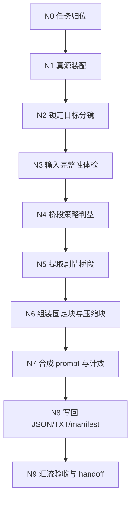
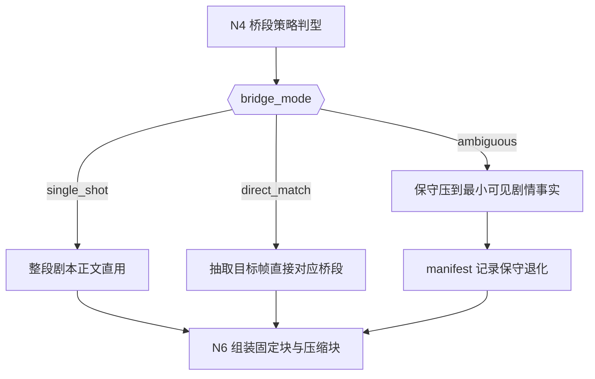
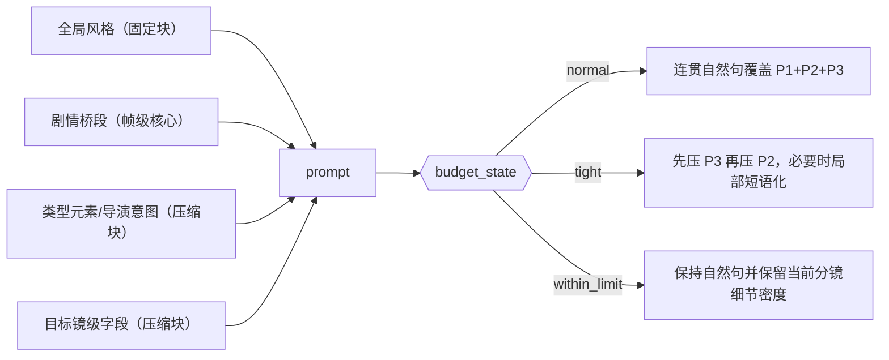
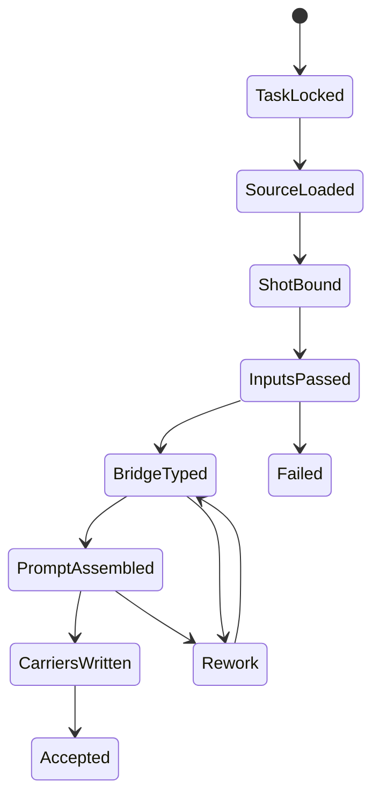

# 6-Video / 首帧参照

## 概述

`首帧参照` 是 `6-Video/1-提示词蒸馏` 下的帧级叶子技能，负责把 `projects/aigc/<项目名>/3-Detail/第N集.json` 中 **单一 `分镜ID`** 收束为 **1 条首帧锚点视频请求对象**，并写出可供视频工具消费的 `JSON + TXT + _manifest.json` 三件套。

本次重构采用 `$skill-知行合一` 的单技能真源口径，并显式关闭“复杂链路的骨架 / 细则分层”：

- `复杂链路的骨架 / 细则分层`：`false`
- canonical source：`SKILL.md + prompt-assembly-spec.md`
- `SKILL.md` 持有门禁、桥段提取、节点网、验收与返工入口
- `prompt-assembly-spec.md` 持有组级桥接句、镜级 `P1/P2/P3` 槽位、`tight/ultra` 压缩与 `转场特效` 可选挂句
- 跨兄弟叶子共享的 `图生视频` 句法总原则回指 `.agents/skills/aigc/6-Video/_shared/image-to-video-prompt-principles.md`；本地 spec 只负责单镜 specialization
- 保留现有业务机制、模板依赖、字段主表、三件套落点与 fallback 规则
- 不再把思维链、执行流、类型策略与输出契约拆散到平行载体，也不再把句法硬编码散落在脚本函数体

交付类型：`内容输出型`

## When To Use

- 需要从 `projects/aigc/<项目名>/3-Detail/第N集.json` 中锁定单一 `分镜ID`，且该 episode root 已满足 `metadata.document_phase=ready`，生成帧级视频请求对象。
- 需要把目标分镜所属组的 `剧本正文` 裁切为对应分镜帧的剧情桥段，而不是直接照搬整组剧情。
- 需要原文保留 `组间设计.全局风格`，同时压缩 `组间设计.类型元素`、`组间设计.导演意图`、`组间设计.出场角色及穿搭` 与目标镜级字段。
- 需要把目标分镜 `时间段.开始秒 / 结束秒` 落成当前分镜组内的 `xx秒-xx秒` 时间锚点，并直接接在 `分镜 <ID>` 后，不写成 `分镜 <ID> 的 xx秒-xx秒`。
- 需要遵循共享文本模板的新合同：默认以连贯自然语句组织镜级信息，只有预算进入 `tight` 时才允许局部短语化。
- 需要输出 `第N集.json + 第N集.txt + _manifest.json` 三件套。
- 需要让下游 `.agents/skills/cli/dreamina-cli/SKILL.md` 或 `6-Video/2-视频生成` 继续消费帧级 JSON。

## When Not To Use

- 当前任务是按整个分镜组覆盖生成视频请求对象，应进入 `6-Video/1-提示词蒸馏/全能参照`。
- 当前任务是正式提交 provider、轮询结果或下载视频，应进入 `6-Video/2-视频生成` 或命中的 provider 技能。
- 上游 `3-Detail/第N集.json` 尚未形成合法 `分镜组列表[]`，或目标 `分镜ID` 不存在。
- 上游 `3-Detail/第N集.json` 仍处于 `bootstrapped` 或 `detail_in_progress`。
- 目标分镜所属组的 `分镜切换` 与 `分镜明细[]` 数量未对齐，说明 `3-Detail` merge/handoff 仍未稳定。
- 任务要求把多个 `分镜ID` 混成一条请求；本技能只处理“一镜一条”。
- 当前任务要求上传、选择或伪造真实参照图；本技能只保留图片字段骨架，不处理真实图片资产。

## 单一真源边界

### `首帧参照` 拥有

- `单一分镜ID -> 1 条帧级视频请求对象` 的转换合同。
- `剧本正文 -> 对应分镜帧剧情桥段` 的提取、保守压缩与例外说明规则。
- `全局风格` 原文直贴、非固定块压缩、字段标题隐藏与字数窗控制。
- 对 `6-Video/_shared` 共享 JSON/TXT 模板的局部填充规则。
- `第N集.json / 第N集.txt / _manifest.json` 三件套的最小落盘合同。

### `首帧参照` 不拥有

- 改写上游导演事实、虚构镜头内容或补造剧情过渡。
- 上传真实图片、编造 `reference_images` / `image_markers` / URL。
- 把多个分镜拼接成一条请求，或把整组任务伪装成首帧任务。
- 真实 provider 提交、轮询与下载。

## Business Requirement Analysis Contract

### 业务目标

- 把单一 `分镜ID` 收束成稳定、可追溯、可 handoff 的帧级视频请求对象。
- 保留目标分镜所属组的空气层与风格层，但把剧情主叙述精准收缩到该帧可见的剧情桥段。
- 在与组级 `全能参照` 相同的总字数约束下，把预算优势转化为当前目标分镜的细节密度优势，而不是写成一条缩小版组级 prompt。
- 让下游视频工具消费的是结构化 JSON，而不是人工摘要文案。

### 业务对象

- 上游对象：`projects/aigc/<项目名>/3-Detail/第N集.json`
- 关键结构：`final_output.main_content.分镜组列表[]`
- handoff gate：`metadata.document_phase=ready`，且目标分镜所属组满足 `分镜切换 == len(分镜明细[])`
- 关键组级字段：`分镜组ID`、`剧本正文`、`组间设计.全局风格`、`组间设计.类型元素`、`组间设计.导演意图`、`组间设计.出场角色及穿搭`
- 关键镜级字段：目标 `分镜明细` 下的 `分镜ID`、`时间段.开始秒 / 结束秒`、`角色背景面`、`角色站位走位`、`景别`、`运镜手法`、`镜头视角`，以及存在时的 `镜头速度 / 角色表现 / 场景氛围 / 道具及状态 / 摄影美学 / 镜头属性 / 镜头框架 / 镜头类型 / 分镜表现`
- 输出对象：`meta + prompt_style + model + prompt + prompt_char_count`

### 复杂度来源

- 同一 `剧本正文` 可能覆盖多个分镜，必须从组级叙述中切出目标帧的最小剧情事实。
- 帧级 prompt 既不能失去组级空气层，又不能退回整组 prompt。
- `全局风格` 必须原文保留，剩余空间只能压缩非固定块。
- 输入不完整、桥段边界模糊或字数预算吃紧时，必须保守退化，而不是“写得像”。

### 非目标

- 不改写 `3-Detail/第N集.json`
- 不进入图片上传或真实视频生成
- 不补写不存在的角色、动作、镜头、空间或情绪事实
- 不把推理过程单独落成第二份 reasoning 真源

### 成功标准

- 每个命中的 `分镜ID` 都能稳定回链到唯一 `分镜组ID`。
- `剧情桥段` 只对应目标分镜帧，除非组内只有 1 个分镜，否则不得整段照搬组级 `剧本正文`。
- `全局风格` 与上游逐字一致。
- `分镜 <ID>` 后都能读出当前分镜组内的 `xx秒-xx秒`，且不写成 `分镜 <ID> 的 xx秒-xx秒`。
- `角色背景面 / 角色站位走位 / 景别 / 运镜手法 / 镜头视角` 在最终 prompt 中保持清晰可辨；若上游存在 `镜头速度`，也不得被静默压没。
- 在相同总字数与字段集合下，当前目标分镜的动作、空间、镜头控制与氛围细节应比组级模式更丰满，而不是沿用组级多镜分摊后的稀薄表达。
- prompt 中除 `分镜组 <ID>` 与 `分镜 <ID>` 外，不残留显式字段标题。
- `第N集.json / 第N集.txt / _manifest.json` 三件套可继续 handoff，并对例外情况给出可追溯备注。

### 拓扑判断

- 本技能的复杂度主要来自：任务归位、来源锁定、输入体检、桥段判型、预算压缩、结构化写回与最终汇流。
- 最优拓扑是：`串行主干 + 条件分支 + 最终汇流`。
- 由于用户明确要求 `复杂链路的骨架 / 细则分层 = false`，所以采用 `inline-full-spec` 模式：所有关键规则、节点细则、字段表、回退门和输出合同都直接内嵌于本 `SKILL.md`。

## Total Input Contract

### Canonical Inputs

- `projects/aigc/<项目名>/3-Detail/第N集.json`
- `projects/aigc/<项目名>/3-Detail/validation-report.md`（若存在，作为 handoff 辅助证据）
- `.agents/skills/aigc/_shared/director_episode_output.schema.json`
- 按需：`.agents/skills/aigc/3-Detail/SKILL.md`
- `.agents/skills/aigc/SKILL.md`
- `.agents/skills/aigc/CONTEXT.md`
- `.agents/skills/aigc/6-Video/SKILL.md`
- `.agents/skills/aigc/6-Video/CONTEXT.md`
- 本目录 `CONTEXT.md`

### Shared Sources

- `.agents/skills/aigc/6-Video/_shared/video-generation-input.template.json`
- `.agents/skills/aigc/6-Video/_shared/视频生成入参.template.txt`
- `.agents/skills/aigc/6-Video/_shared/image-to-video-prompt-principles.md`
- `.agents/skills/aigc/6-Video/1-提示词蒸馏/首帧参照/prompt-assembly-spec.md`

### 必需字段

- `final_output.main_content.分镜组列表[]`
- `metadata.document_phase = ready`
- 目标 `分镜ID`
- 目标分镜所属 `分镜组ID`
- 目标分镜所属组的 `分镜切换`
- 所属组的 `剧本正文`
- 所属组的 `组间设计.全局风格`
- 所属组的 `组间设计.类型元素`
- 所属组的 `组间设计.导演意图`
- 所属组的 `组间设计.出场角色及穿搭`
- 目标 `分镜明细.分镜ID`
- 目标 `分镜明细.时间段.开始秒`
- 目标 `分镜明细.时间段.结束秒`
- 目标 `分镜明细.角色背景面`
- 目标 `分镜明细.角色站位走位`
- 目标 `分镜明细.景别`
- 目标 `分镜明细.运镜手法`
- 目标 `分镜明细.镜头视角`

### 推荐字段

- `metadata.episode_id`
- 目标分镜 `镜头速度`
- 目标分镜 `角色表现`
- 目标分镜 `场景氛围`
- 目标分镜 `道具及状态`
- 目标分镜 `摄影美学`
- 目标分镜 `镜头属性`
- 目标分镜 `镜头框架`
- 目标分镜 `镜头类型`
- 目标分镜 `分镜表现`

### 输入处理原则

1. 一切剧情与镜头事实以上游 `3-Detail/第N集.json` 为准。
2. 只有 `metadata.document_phase=ready` 且目标分镜所属组 `分镜切换 == len(分镜明细[])` 时，才允许首帧蒸馏继续。
3. `全局风格` 只允许原文直贴，不做净化、重命名或压缩。
4. `剧情桥段` 只负责把组级剧本切成目标帧可见事实，不负责重写剧情。
5. `时间段` 只允许使用目标分镜所在组内的相对秒位，不得回退成全集累积时间线，也不得改写成模糊时间语。
6. 图片字段只保留共享模板骨架，不准编造真实图片信息。

### 输入完整性门禁

以下任一缺失都必须停机并回报上游缺口：

- `分镜组列表[]` 缺失
- `metadata.document_phase` 不是 `ready`
- 目标 `分镜ID` 不存在
- 无法锁定所属 `分镜组ID`
- 目标分镜所属组 `分镜切换` 与 `分镜明细[]` 数量不一致
- 目标组缺 `剧本正文`
- 目标组缺 `组间设计.全局风格`
- 目标组缺 `组间设计.类型元素`、`组间设计.导演意图` 或 `组间设计.出场角色及穿搭`
- 目标 `分镜明细` 缺 `分镜ID / 时间段.开始秒 / 时间段.结束秒 / 角色背景面 / 角色站位走位 / 景别 / 运镜手法 / 镜头视角`

## Prompt Compression Priority Contract

- P0 固定/核心块：
  - `剧情桥段`
  - `组间设计.全局风格`
- P1 高保留镜头控制项：
  - `时间段`
  - `角色站位走位`
  - `角色背景面`
  - `景别`
  - `运镜手法`
  - `镜头速度（如存在）`
  - `镜头视角`
- P2 重要表现与氛围项：
  - `角色表现`
  - `场景氛围`
  - `道具及状态`
  - `摄影美学`
- P3 补充镜头组织项：
  - `镜头属性`
  - `镜头框架`
  - `镜头类型`
  - `分镜表现`

压缩规则：

1. 默认先以连贯自然语句串联 `P1 + P2 + P3`，尽量覆盖全部可用字段。
2. 由于本技能只服务单一目标分镜，在 `P0` 固定块落定后，剩余预算应优先转化为当前分镜的细节丰满度，优先把 `P1/P2/P3` 写得更完整、更具体，而不是机械继承组级多镜分摊后的稀疏压缩心智。
3. 当预算吃紧时，只能按 `P3 -> P2 -> P1` 的顺序压缩，不得先牺牲 `P1`。
4. 目标分镜的时间锚点必须写成当前分镜组内的 `xx秒-xx秒`，并直接接在 `分镜 <ID>` 后，不得写成 `分镜 <ID> 的 xx秒-xx秒`。
5. 镜级信息可优先按“`镜头属性 -> 景别/运镜手法/镜头速度/镜头视角 -> 角色站位走位/角色背景面 -> 角色表现/场景氛围 -> 道具及状态/摄影美学/其他`”的语义顺序组织，但表层表达不强制套固定句式；若固定骨架让句子发硬，应优先改写成更自然流畅的句子。
6. 除 `分镜组 <ID>` 与 `分镜 <ID>` 外，不得暴露字段标题，尤其不得写成 `字段标题：字段值`。

### 镜头属性术语合同

- `镜头属性` 是叙事/观看功能上的专有命名，不是 `景别 / 运镜 / 视角` 的同义改写。
- 优先沿用上游 `镜头属性` 原词；若上游缺失，不得为了凑模板硬造术语。
- 若需要落句，优先直接使用术语本体，例如 `定场镜头 / 反应镜头 / 关系镜头 / 情绪镜头`，不要机械补成“`为定场镜头`”。

## Visual Maps

## Topology Contract

### 主干

- `任务归位 -> 真源装配 -> 锁定目标分镜 -> 输入完整性体检 -> 桥段策略判型 -> 剧情桥段提取 -> 固定块/压缩块装配 -> prompt 合成 -> 三件套写回 -> 汇流验收`

### 条件分支

- `bridge_mode=single_shot`
  - 组内只有 1 个分镜，直接使用整段 `剧本正文`
- `bridge_mode=direct_match`
  - 可稳定提取目标分镜对应桥段，正常裁切
- `bridge_mode=ambiguous`
  - 桥段边界模糊，保守压缩到“目标帧可见的最小剧情事实”，并写 manifest 说明
- `budget_state=normal`
  - 非固定块保持连贯自然句，并尽量覆盖 `P1 + P2 + P3`，把单分镜剩余预算优先转化为当前镜头的细节密度
- `budget_state=tight`
  - 先压 `P3` 再压 `P2`；仅这一档允许局部短语化，`P1` 继续保持清晰可辨
- `budget_state=within_limit`
  - 在不超过上限的前提下保持自然句表达，并优先把余量转成当前分镜的动作、空间、镜头控制与氛围细节

### 回退门

- 输入缺壳：回到 `N1` 或 `N3`
- 分镜定位冲突：回到 `N2`
- 桥段提取漂移：回到 `N4` 或 `N5`
- 固定块被改写或预算失衡：回到 `N6`
- prompt 结构或计数不一致：回到 `N7`
- 写回不完整：回到 `N8`

### 汇流门

只有同时满足以下条件，才允许继续到 `N9` 并结案：

1. `group_id`、`shot_id`、`source_shot_ids` 能同时回链目标分镜。
2. `剧情桥段`、`全局风格`、`P1` 高保留项与可用的 `P2/P3` 内容已进入 `prompt`。
3. `分镜 <ID>` 后保留当前分镜组内的 `xx秒-xx秒`，且不写成 `分镜 <ID> 的 xx秒-xx秒`。
4. 除 `分镜组 <ID>` 与 `分镜 <ID>` 外，没有字段标题泄露。
5. 在同等预算下，当前目标分镜的镜头控制、动作布局与氛围细节没有退化成组级多镜模式的缩小版稀疏表达。
6. `prompt_char_count` 与实际 prompt 一致。
7. `第N集.json / 第N集.txt / _manifest.json` 三件套齐全，且例外说明同步。

## Thinking-Action Node Network

### N0. 任务归位

- `node_id`: `N0-task-positioning`
- `objective`: 确认本轮就是“单一分镜的首帧参照蒸馏”，不是组级蒸馏、图片处理或视频生成。
- `inputs`: 用户诉求、父级 `6-Video` 路由合同、本技能 `CONTEXT.md`
- `着手方面`:
  1. 判断当前任务颗粒度是组级还是帧级
  2. 判断输出停点是请求 JSON 还是 provider 执行
  3. 锁定本技能不拥有的事项，避免越权
- `actions`:
  1. 明确当前只处理 1 个目标 `分镜ID`
  2. 锁定本轮 canonical output 为 `JSON + TXT + manifest`
  3. 锁定 `output_mode=full_trace`
  4. 明确下游入口是 `dreamina-cli` 或 `6-Video/2-视频生成`
- `evidence`: 阶段定位说明、输出停点说明、边界确认结果、`output_mode=full_trace`
- `route_out`: 归位成功进入 `N1`；若归位失败，回退父级路由并停止
- `gate`: 若任务主语不是“单镜首帧参照”，不得继续

### N1. 真源装配

- `node_id`: `N1-source-assembly`
- `objective`: 装配本轮需要读取的 episode 真源、shared schema 与共享模板
- `inputs`: `3-Detail/第N集.json` 路径、shared schema、JSON/TXT 模板路径
- `着手方面`:
  1. episode root 是否存在
  2. shared schema 是否明确
  3. JSON/TXT 共享模板是否齐备
  4. 上游 `3-Detail` 是否已经到 `document_phase=ready`
  5. 上游 `3-Detail` 是否已把 `时间段` 固定为组内相对秒位，并允许 `镜头速度` 作为可选镜级槽
  6. 上下文加载顺序是否正确
- `actions`:
  1. 读取 episode root
  2. 读取 `.agents/skills/aigc/_shared/director_episode_output.schema.json`
  3. 对照 `.agents/skills/aigc/3-Detail/SKILL.md`，确认 `document_phase=ready` 与 `分镜切换 -> 分镜明细[]` 的 handoff gate 已满足
  4. 若存在，读取 `projects/aigc/<项目名>/3-Detail/validation-report.md` 作为阶段辅助证据
  5. 读取共享 JSON/TXT 模板，并锁定其中“自然句优先、`tight` 才局部短语化、禁用 `分镜 <ID> 的 xx秒-xx秒`”的模板语义
  6. 记录可用输入清单与路径合法性
- `evidence`: 输入清单、模板路径、schema/模板就绪结论、上游 phase/handoff/时间口径确认
- `route_out`: 真源齐备进入 `N2`；缺任一关键真源则失败退出
- `gate`: 缺 root file、shared schema 或共享模板时，不得假继续

### N2. 锁定目标分镜

- `node_id`: `N2-shot-binding`
- `objective`: 从 `分镜组列表[]` 中准确锁定目标 `分镜ID` 及其唯一所属组
- `inputs`: `分镜组列表[]`、目标 `分镜ID`
- `着手方面`:
  1. 目标 `分镜ID` 是否唯一命中
  2. 所属 `分镜组ID` 是否可回链
  3. 目标分镜的 `时间段.开始秒 / 结束秒` 是否可回链到当前分镜组内相对秒位
  4. 是否把多镜信息误混到一镜任务中
- `actions`:
  1. 遍历 `分镜组列表[] -> 分镜明细[]`
  2. 锁定 `group_id`、目标 `shot`、组级上下文字段
  3. 建立 `meta.source_shot_ids=[目标分镜ID]`
  4. 记录目标分镜 `时间段.开始秒 / 结束秒`，作为后续 `xx秒-xx秒` 时间锚点
  5. 记录组级总镜头数，并校验 `分镜切换 == len(分镜明细[])`
- `evidence`: 唯一命中结果、`group_id`、目标镜头上下文、组内镜头统计、目标时间锚点、组级镜数对齐结论
- `route_out`: 唯一命中进入 `N3`；缺失或多命中则触发 `FAIL-VID-FFR-01`
- `gate`: 不允许在分镜定位冲突时继续裁桥段

### N3. 输入完整性体检

- `node_id`: `N3-input-healthcheck`
- `objective`: 检查目标组与目标分镜是否具备最小可执行字段
- `inputs`: 目标组、目标分镜、shared schema
- `着手方面`:
  1. 组级字段是否完整
  2. 目标镜级字段是否完整
  3. 哪些缺口会直接阻断，哪些只会进入风险备注
- `actions`:
  1. 校验 `剧本正文 / 全局风格 / 类型元素 / 导演意图 / 出场角色及穿搭`
  2. 校验上游 `metadata.document_phase = ready`
  3. 校验目标分镜所属组 `分镜切换 == len(分镜明细[])`
  4. 校验目标分镜是否具备 `分镜ID / 时间段.开始秒 / 时间段.结束秒 / 角色背景面 / 角色站位走位 / 景别 / 运镜手法 / 镜头视角`
  5. 若 `镜头速度 / 角色表现 / 场景氛围 / 道具及状态 / 摄影美学 / 镜头属性 / 镜头框架 / 镜头类型 / 分镜表现` 缺失，则登记为 `soft risk`
  6. 确认 `时间段` 使用的是当前分镜组内相对秒位，而不是全集累积时间线
  7. 统计缺口并区分 `hard block` 与 `soft risk`
  8. 对 hard block 直接停止，不做“尽量像”
- `evidence`: 输入体检结论、缺口清单、阻断/风险分类
- `route_out`: 通过进入 `N4`；失败触发 `FAIL-VID-FFR-01`
- `gate`: 缺失硬字段时不得继续

### N4. 桥段策略判型

- `node_id`: `N4-bridge-typing`
- `objective`: 判断本轮应该使用哪种剧情桥段提取策略
- `inputs`: `剧本正文`、组内镜头数、目标镜头 `时间段.开始秒 / 结束秒 / 角色表现 / 分镜表现`
- `着手方面`:
  1. 组内是否只有 1 个分镜
  2. 目标分镜是否能从组级剧情中直接定位
  3. 边界模糊时如何保守退化
- `actions`:
  1. 判定 `bridge_mode=single_shot/direct_match/ambiguous`
  2. 记录判型依据，如时间段、动作节点、状态变化、空间切换
  3. 为后续 manifest 预留 `bridge_strategy`
- `evidence`: `bridge_mode`、判型理由、风险备注
- `route_out`: 判型成功进入 `N5`；若判型信息不足则返回 `N3`
- `gate`: 不允许在桥段策略未锁定时直接写 prompt

### N5. 提取剧情桥段

- `node_id`: `N5-frame-bridge-distill`
- `objective`: 把组级 `剧本正文` 切成只对应目标分镜帧的剧情桥段
- `inputs`: `剧本正文`、`bridge_mode`、目标镜级事实
- `着手方面`:
  1. 组内只有 1 镜时是否整段直用
  2. 直配模式下哪些句子或事实真正属于目标镜头
  3. 模糊模式下最小可见剧情事实是什么
- `actions`:
  1. `single_shot` 时直接采用整段 `剧本正文`
  2. `direct_match` 时抽出目标分镜直接对应的事件阶段、动作节点或状态变化
  3. `ambiguous` 时压缩到目标帧可见的最小剧情事实，不虚构过渡
  4. 写出 `bridge_strategy` 与 `exception_note` 候选内容
- `evidence`: 最终 `剧情桥段`、`bridge_strategy`、保守退化说明
- `route_out`: 提取成功进入 `N6`；若提取结果漂移则回到 `N4`
- `gate`: 除 `single_shot` 外，禁止整段照搬组级 `剧本正文`

### N6. 组装固定块与压缩块

- `node_id`: `N6-block-assembly`
- `objective`: 保住固定块，同时把其余组级与镜级字段压进剩余字数预算
- `inputs`: `剧情桥段`、`全局风格`、`类型元素`、`导演意图`、`出场角色及穿搭`、目标镜级字段
- `着手方面`:
  1. 哪些内容属于 `P0` 固定/核心块
  2. 哪些内容属于 `P1/P2/P3`，以及压缩优先级如何执行
  3. 当前预算压力是 `normal` 还是 `tight`
- `actions`:
  1. 冻结 `剧情桥段 + 全局风格` 作为 `P0`
  2. 估算 `P0` 后的剩余空间
  3. 先按连贯自然语句组织 `P1 + P2 + P3`
  4. 将目标分镜 `时间段.开始秒 / 结束秒` 规范成 `xx秒-xx秒`，并直接绑定到 `分镜 <ID>` 标签后
  5. 显式消费 `P1`：`角色背景面 / 角色站位走位 / 景别 / 运镜手法 / 镜头视角`；若存在 `镜头速度` 也应一并消费，不得回退成旧字段心智
  6. 在非 `tight` 条件下，把剩余预算优先用于补足当前分镜的动作、空间、镜头控制和氛围细节，不把首帧 prompt 写成组级模式的稀疏缩小版
  7. 若预算吃紧，按 `P3 -> P2 -> P1` 的顺序压缩，不得先牺牲 `P1`
  8. 明确 `budget_state` 并登记例外说明
- `evidence`: `P0/P1/P2/P3` 组装结果、预算判定、例外备注、时间锚点写法、当前分镜细节密度判断
- `route_out`: 预算合适进入 `N7`；若固定块被改写或预算失衡则回退本节点
- `gate`: 固定块不得被改写；非固定块不得被静默遗漏

### N7. 合成 prompt 与计数

- `node_id`: `N7-prompt-synthesis`
- `objective`: 合成最终 prompt，隐藏字段标题，并同步生成 `prompt_char_count`
- `inputs`: 固定块、压缩块、共享 JSON/TXT 模板
- `着手方面`:
  1. 组 ID / 镜 ID 标签是否显式且足够
  2. 除允许标签外是否仍有字段标题泄露
  3. 模板建议的语义顺序是否被遵守，但未被误用成表层硬模板
  4. `prompt_char_count` 是否与实际 prompt 一致
- `actions`:
  1. 仅保留 `分镜组 <ID>` 与 `分镜 <ID>` 标签
  2. 确保目标分镜写成 `分镜 <ID> xx秒-xx秒`，不得写成 `分镜 <ID> 的 xx秒-xx秒`
  3. 按模板建议语义顺序融合固定块与压缩块；若固定骨架让句子发硬，优先改写成更自然流畅的表达
  4. 若存在 `镜头属性`，优先沿用上游原词并直接落术语本体，不机械补“为”
  5. 填充 `prompt_style + model + prompt + prompt_char_count`
  6. 对 `reference_images / image_markers` 保留共享模板骨架，不增添虚构内容
  7. 除 `tight` 外不得把整段表达退化成短语/关键词清单，也不得靠大量省略号硬截断压字数
  8. 复查同样预算下当前分镜是否已比组级模式获得更丰满的动作、空间、镜头和氛围表达；若仍像缩小版组级 prompt，则回退 `N6`
- `evidence`: 最终 prompt、字数统计、标题清理结果、模板兼容性检查、时间锚点语法检查、自然句体裁检查、单分镜细节丰满度检查
- `route_out`: 合成成功进入 `N8`；若标题残留或计数错误则回退本节点或 `N6`
- `gate`: 除允许标签外出现字段标题，或计数不一致时不得继续

### N8. 写回 JSON/TXT/manifest

- `node_id`: `N8-carrier-writeback`
- `objective`: 将结构化结果写成三件套 carrier，保持可追溯与可 handoff
- `inputs`: `meta`、`prompt_style`、`model`、`prompt`、`prompt_char_count`、`bridge_strategy`、`output_mode=full_trace`
- `着手方面`:
  1. JSON 是否是 canonical completeness carrier
  2. TXT 是否只承载 prompt 与字数统计
  3. manifest 是否完整记录策略与例外
- `actions`:
  1. 写出 `projects/aigc/<项目名>/6-Video/首帧参照/第N集/第N集.json`
  2. 按共享 TXT 模板写出 `第N集.txt`
  3. 写出 `_manifest.json`，登记 `output_mode / bridge_strategy / within_target_range / exception_note`
  4. 确保 `source_shot_ids` 仅包含 1 个目标 `分镜ID`
  5. 回读最终 JSON，确认 `len(prompt) == prompt_char_count`
  6. 确保 `第N集.txt` 只承载 prompt 与字数统计，不承载结构化参数区块
- `evidence`: 三件套路径、写回结果、结构完整性结论、JSON 回读计数结果
- `route_out`: 写回成功进入 `N9`；若任一 carrier 缺失则回退本节点
- `gate`: 不允许只产出其中 1 个文件冒充完成

### N9. 汇流验收与 handoff

- `node_id`: `N9-convergence-audit`
- `objective`: 验证三件套可追溯、可 handoff、无越权虚构，并给出唯一收束结论
- `inputs`: 三件套文件、计数结果、判型信息、上游目标镜头信息
- `着手方面`:
  1. 回链是否完整
  2. 事实保真是否完整
  3. 例外是否被如实记录
  4. 下一入口是否唯一
- `actions`:
  1. 复查 `group_id + shot_id + source_shot_ids` 的回链一致性
  2. 复查 `全局风格` 是否逐字一致
  3. 复查 `reference_images` 是否保留、`image_markers` 是否维持共享模板骨架与顺序稳定
  4. 复查 `bridge_strategy / within_target_range / exception_note`
  5. 给出唯一 handoff 入口：`dreamina-cli` 或 `6-Video/2-视频生成`
- `evidence`: 验收结论、风险摘要、下一入口 verdict、模板骨架审计结果
- `route_out`: 通过则任务完成；不通过则回到对应失败节点
- `gate`: 未通过结构、保真、例外同步三重检查前不得结案

## Type Strategy & Fallback

### Variable Register

| var_id | 变量层级 | 观测信号 | 状态集合 | 检测方法 | 优先级 |
| --- | --- | --- | --- | --- | --- |
| V-VID-FFR-01 | 输入 | 目标分镜 handoff 是否已稳定可消费 | `ready/incomplete` | 检查 `metadata.document_phase=ready`，目标分镜所属组 `分镜切换 == len(分镜明细[])`，且 `分镜组ID / 剧本正文 / 组间设计（含出场角色及穿搭） / 目标分镜明细（含时间段开始秒/结束秒、角色背景面/角色站位走位/景别/运镜手法/镜头视角，若存在则含镜头速度）` 成立 | P0 |
| V-VID-FFR-02 | 桥段判定 | `剧本正文` 与目标分镜的对应清晰度 | `single_shot/direct_match/ambiguous` | 结合组内分镜数、时间段与动作状态 | P0 |
| V-VID-FFR-03 | 字数预算 | 非固定字段压缩压力 | `normal/tight` | 估算 `剧情桥段 + 全局风格` 后的剩余字数；只要不超过 1900 字就保持连贯自然语句，仅在超限风险下进入 `tight` | P1 |

### Case To Strategy Map

| case_id | 触发谓词 | 主策略 | 通过标准 | fallback |
| --- | --- | --- | --- | --- |
| C-VID-FFR-01 | `V-VID-FFR-01=incomplete` | 停止并报告上游缺口 | 不伪造缺失字段 | 回上游导演真源补齐 |
| C-VID-FFR-02 | `V-VID-FFR-02=single_shot` | 直接使用整段 `剧本正文` 作为剧情桥段 | 桥段与目标分镜天然一一对应 | 无 |
| C-VID-FFR-03 | `V-VID-FFR-02=direct_match` | 提取与目标分镜直接对应的剧情桥段 | 不引入无关分镜事实 | 无 |
| C-VID-FFR-04 | `V-VID-FFR-02=ambiguous` | 保守压缩到目标分镜可见的最小剧情事实 | 不虚构过渡；manifest 备注原因 | 无 |
| C-VID-FFR-05 | `V-VID-FFR-03=normal` | 用连贯自然语句压缩非固定字段，并把剩余预算优先转成当前分镜的细节密度 | `prompt_char_count <= 1900`，且 `P1` 可清晰读出，当前分镜细节不呈现稀疏缩写感 | 无 |
| C-VID-FFR-06 | `V-VID-FFR-03=tight` | 只在超 1900 风险下按 `P3 -> P2` 顺序压缩；必要时局部短语化，但继续高保留 `P1` | 固定块不动，整体被压回 `1900` 以内，且 `分镜 <ID> xx秒-xx秒` 与 `P1` 仍清晰可辨 | 无 |

## Convergence Contract

- 汇流点固定在 `N9`，前面任一节点失败都不得绕过。
- `FAIL-VID-FFR-01`：来源定位或输入完整性失败，回到 `N2` 或 `N3`。
- `FAIL-VID-FFR-02`：桥段提取漂移、固定块改写、字段标题残留或预算失衡，回到 `N4-N7`。
- `FAIL-VID-FFR-03`：模板骨架被破坏或图片字段被伪造，回到 `N7`。
- `FAIL-VID-FFR-04`：carrier 写回不完整或 manifest 不可追溯，回到 `N8`。
- 所有回退都优先修规则口径、判型口径和写回口径，不靠手工润色局部 prompt 掩盖问题。

## One-Shot Output Contract

本技能最终只允许一个 canonical final output 口径：

1. `最终产物`
   - `projects/aigc/<项目名>/6-Video/首帧参照/第N集/第N集.json`
   - `projects/aigc/<项目名>/6-Video/首帧参照/第N集/第N集.txt`
   - `projects/aigc/<项目名>/6-Video/首帧参照/第N集/_manifest.json`
2. `思考过程`
   - 简明说明本轮 `bridge_mode`、`budget_state`、固定块/压缩块处理与汇流判断
   - 该思考过程只作为用户 closure 说明或 manifest 摘要，不得另起第二真源文件
3. `关键依据`
   - 目标 `分镜ID` 的来源锁定结果
   - `剧情桥段` 提取依据
   - 共享模板与计数校验结果
4. `风险 / 例外`
   - `ambiguous` 判型、`tight` 压缩、输入缺口或保守退化说明
5. `下一步`
   - 继续进入 `dreamina-cli` 或 `6-Video/2-视频生成`

禁止输出多个互不收束的半成品 verdict。

### Canonical Outputs

- `projects/aigc/<项目名>/6-Video/首帧参照/第N集/第N集.json`
- `projects/aigc/<项目名>/6-Video/首帧参照/第N集/第N集.txt`
- `projects/aigc/<项目名>/6-Video/首帧参照/第N集/_manifest.json`

### Script Entrypoint

- canonical runner：`.agents/skills/aigc/6-Video/1-提示词蒸馏/首帧参照/scripts/generate_episode_packets.py`
- 默认以 episode 为 carrier 批量遍历命中的 `分镜ID`，把“单镜一条请求对象”聚合写回同一集的三件套。
- 若只需单一 `分镜ID`，可使用 `--shot-id <分镜ID>` 将本叶子收束为单镜执行。
- 标准执行命令：
  - `python3 .agents/skills/aigc/6-Video/1-提示词蒸馏/首帧参照/scripts/generate_episode_packets.py --project <项目名> --episode 第N集`
  - `python3 .agents/skills/aigc/6-Video/1-提示词蒸馏/首帧参照/scripts/generate_episode_packets.py --project <项目名> --episode 第N集 --shot-id <分镜ID>`

### JSON Fill Scope

本技能负责填充：

1. `meta`
2. `prompt_style`
3. `model`
4. `prompt`
5. `prompt_char_count`

### Hard Rules

1. `第N集.json` 是 canonical completeness carrier。
2. `第N集.txt` 只是 derived display view，只展示 `prompt` 与 `prompt_char_count`。
3. `_manifest.json` 是异常、桥段策略与追溯载体，不替代 JSON 主体。
4. 每个目标 `分镜ID` 只生成 1 条请求对象。
5. `prompt` 必须覆盖目标分镜所属组的上下文与该目标分镜的镜级内容，且不得漏掉组级 `出场角色及穿搭` 与镜级 `P1` 高保留项；若上游已提供 `镜头速度`，也不得静默吞掉。
6. `全局风格` 必须原文保留，不得改写。
7. `剧情桥段` 必须转换为对应分镜帧的剧情桥段；仅在组内只有 1 个分镜时允许整段直贴。
8. `时间段` 必须使用当前分镜组内的 `开始秒 / 结束秒`，并写成 `分镜 <ID> xx秒-xx秒`，不得写成 `分镜 <ID> 的 xx秒-xx秒`，也不得误写成全集时间线。
9. 默认目标字数上限为 `1900` 中文字符；若用户或父级显式给出其他范围，以显式约束覆盖。
10. 除 `分镜组 <ID>` 与 `分镜 <ID>` 外，不得出现 `字段标题：字段值` 结构。
11. 单分镜模式下，同样总字数应优先体现为当前分镜的细节丰满度；不得机械沿用组级多镜 prompt 的稀疏表达心智。
12. 只有当预算进入 `tight` 时，才允许把部分镜级内容收束为更精炼的自然短语；其余情况下应保持连贯自然语句。
13. `prompt_char_count` 必须与实际 `prompt` 内容一致，且 `第N集.txt` 中的字数统计必须与 JSON 同步。
14. `reference_images` 与 `image_markers` 仅保留共享模板骨架，不得擅自补入虚构图片信息。
15. `reference_images` 字段本身不得缺失；`image_markers` 至少保持共享模板要求的 URL/主体/图号三元结构与顺序槽位。
16. `第N集.txt` 只承载提示词与字数统计，不承载结构化参数区块。

### `_manifest.json` Minimum Fields

1. `episode_id`
2. `source_file`
3. `output_mode`
4. `json_file`
5. `txt_file`
6. `shot_count`
7. `shots[].group_id`
8. `shots[].shot_id`
9. `shots[].prompt_char_count`
10. `shots[].bridge_strategy`
11. `shots[].within_target_range`
12. `shots[].exception_note`

## Field Master

| field_id | 输出位置/字段 | 内容要求 | 证据来源 | 默认责任 Step | 质量维度 | 失败码 |
| --- | --- | --- | --- | --- | --- | --- |
| FIELD-VID-FFR-01 | `prompt_style.type / prompt_style.language / prompt_style.char_limit / meta.shot_level / meta.group_id / meta.source_shot_ids` | 以独立 `prompt_style` 声明帧级提示词约束，锁定组级归属与单一目标 `分镜ID`，并确认上游 `document_phase=ready` 且所属组 `分镜切换 == len(分镜明细[])` | episode root、目标 shot 绑定结果 | N2-N3 | 输入覆盖完整度 | FAIL-VID-FFR-01 |
| FIELD-VID-FFR-02 | `prompt / prompt_char_count` | prompt 必须覆盖目标分镜的剧情桥段、全局风格和压缩后的上下文；压缩块需显式覆盖 `类型元素 / 导演意图 / 出场角色及穿搭 / 目标镜级字段`，并按 `P1 高保留 / P2 重要 / P3 补充` 顺序压缩；目标镜级条目需保留当前分镜组内的 `xx秒-xx秒`，且隐藏字段标题；在单分镜模式下，同等预算应优先体现为当前分镜细节更丰满 | `剧本正文`、`组间设计.*`、目标镜级字段 | N4-N7 | Prompt 蒸馏稳定性 | FAIL-VID-FFR-02 |
| FIELD-VID-FFR-03 | `model.reference_images / model.image_markers` | 保留共享模板中的双字段骨架；`reference_images` 不得缺失，`image_markers` 需维持 URL/主体/图号结构与顺序稳定，且不擅自填入虚构图片信息 | 共享模板、模板兼容性检查 | N7-N9 | 模板兼容性 | FAIL-VID-FFR-03 |
| FIELD-VID-FFR-04 | `第N集.json / 第N集.txt / _manifest.json` | 三件套可追溯、可继续 handoff，且例外说明完整 | carrier 写回结果、manifest 验收项 | N8-N9 | 输出可消费性 | FAIL-VID-FFR-04 |

## Thought Pass Map

| step_id | 聚焦字段(field_id) | 核心问题 | 生成动作 | 未达标信号 |
| --- | --- | --- | --- | --- |
| N2-N3 | FIELD-VID-FFR-01 | 当前目标 `分镜ID` 是谁，属于哪个 `分镜组`，输入壳是否完整 | 锁定 `prompt_style + shot_level + group_id + source_shot_ids`，并完成体检 | 分镜定位冲突、缺失或多镜混入 |
| N4-N5 | FIELD-VID-FFR-02 | `剧本正文` 中哪一段才对应目标分镜 | 选择 `bridge_mode` 并提取对应剧情桥段 | 直接整段照搬组级剧本正文 |
| N6 | FIELD-VID-FFR-02 | 哪些内容属于 `P0/P1/P2/P3`，以及压缩优先级如何执行 | 冻结 `P0`，按顺序压缩其余组级与目标镜级字段，并补齐 `分镜 <ID> xx秒-xx秒` 时间锚点；非 `tight` 时优先补足当前分镜细节 | 固定块被改写、`P1` 被先吞掉、时间锚点缺失或当前分镜细节仍过薄 |
| N7 | FIELD-VID-FFR-02 / FIELD-VID-FFR-03 | 如何按模板语义顺序生成自然句，同时隐藏字段标题并保持模板骨架 | 合成 prompt、校准计数，并保留图片字段骨架 | 字段标题残留、时间写成 `分镜 <ID> 的 xx秒-xx秒`、自然句退化成碎短语、当前分镜像组级缩小版、模板字段被删除或伪造 |
| N8-N9 | FIELD-VID-FFR-03 / FIELD-VID-FFR-04 | 输出是否能同时被视频工具与人工审阅消费 | 写三件套、回读 JSON、校验回链与模板骨架、给出 handoff verdict | 只产出单文件、例外缺台账、计数失真或模板骨架漂移 |

## Pass Table

| field_id | 质量维度 | Pass Standard | Fail Code | Rework Entry |
| --- | --- | --- | --- | --- |
| FIELD-VID-FFR-01 | 输入覆盖完整度 | `prompt_style.type / meta.shot_level` 合法，`group_id` 与长度为 1 的 `source_shot_ids` 同时成立，且上游 `document_phase=ready`、所属组 `分镜切换 == len(分镜明细[])` | FAIL-VID-FFR-01 | N2 |
| FIELD-VID-FFR-02 | Prompt 蒸馏稳定性 | prompt 满足桥段提取、固定块保留、隐藏标题与字数窗，且 `P1` 高保留项与 `分镜 <ID> xx秒-xx秒` 保持清晰可辨；非 `tight` 档不退化成碎短语清单，且当前分镜细节在同等预算下明显比组级模式更丰满 | FAIL-VID-FFR-02 | N4 |
| FIELD-VID-FFR-03 | 模板兼容性 | 图片字段保留共享模板双字段骨架，`reference_images` 存在，`image_markers` 结构与顺序稳定且无虚构内容 | FAIL-VID-FFR-03 | N7 |
| FIELD-VID-FFR-04 | 输出可消费性 | JSON、TXT 与 manifest 可追溯、可 handoff，且例外信息完整 | FAIL-VID-FFR-04 | N8 |

## Quality And Audit Contract

最小校验清单：

- `group_id`、`shot_id`、`source_shot_ids` 是否能同时回链到目标分镜
- `metadata.document_phase` 是否已经到 `ready`
- 目标分镜所属组是否满足 `分镜切换 == len(分镜明细[])`
- `剧情桥段` 是否只包含目标分镜可见事实
- `全局风格` 是否与上游逐字一致
- `出场角色及穿搭` 是否已进入帧级 prompt 的压缩块
- `分镜 <ID>` 后是否保留当前分镜组内的 `xx秒-xx秒`，且未写成 `分镜 <ID> 的 xx秒-xx秒`
- `角色背景面 / 角色站位走位 / 景别 / 运镜手法 / 镜头视角` 是否已被消费，而非继续按旧字段名理解
- 若上游存在 `镜头速度`，是否也已进入 `P1` 高保留项
- `P2/P3` 是否按压缩优先级处理，而不是先吞 `P1`
- 非 `tight` 档是否仍保持连贯自然语句，而不是退化成碎短语/关键词串
- 是否出现大量靠 `…` 或半字段残片硬截断的压缩痕迹
- 单分镜剩余预算是否被优先用于补足当前镜头的动作、空间、镜头控制与氛围细节，而不是继续保持组级多镜分摊式稀薄表达
- 除 `分镜组 / 分镜` 标签外，是否仍有字段标题泄露
- `prompt_char_count` 是否与实际 prompt 一致
- `reference_images` 是否存在，`image_markers` 是否保持共享模板骨架和顺序稳定
- `bridge_strategy` 是否与桥段提取策略一致
- `within_target_range` 是否如实反映 `<= 1900` 的字数窗命中情况
- `exception_note` 是否记录了 `tight` 压缩、保守桥段或输入缺口
- `第N集.json / 第N集.txt / _manifest.json` 是否三件套齐全

## Handoff Contract

- 正式进入视频生成时，优先把 `第N集.json` 交给 `.agents/skills/cli/dreamina-cli/SKILL.md` 或 `6-Video/2-视频生成`。
- `TXT` 仅作为人工审阅副产物，不作为 canonical handoff 载体。
- `_manifest.json` 负责承载异常说明、桥段策略与验收证据。

## Root-Cause Execution Contract (Mandatory)

当出现以下症状时，必须先修本子技能合同，而不是只润色 prompt：

- prompt 明明是帧级任务，却直接复用了整组 `剧本正文`
- `3-Detail` 仍处于 `bootstrapped/detail_in_progress`，或目标分镜所属组 `分镜切换` 与 `分镜明细[]` 未对齐，却被误当成稳定帧级输入
- prompt 对应错了 `分镜ID`，或没能回链到所属 `分镜组ID`
- `全局风格` 被改写，或 `剧情桥段` 中新增了上游没有的事实
- prompt 没写出目标分镜所属组内的 `xx秒-xx秒`，写成了 `分镜 <ID> 的 xx秒-xx秒`，或把时间误当成全集时间线
- prompt 里仍然残留旧字段标题，或因 schema / 模板升级后漏掉 `出场角色及穿搭 / 角色背景面 / 角色站位走位 / 景别 / 运镜手法 / 镜头视角`
- 共享模板已经切到“自然句优先、`tight` 才局部短语化”，但本技能仍默认输出短语/关键词串
- 单分镜模式明明拥有更充裕的镜头级字数预算，但 prompt 仍写成组级多镜模式的缩小版，导致当前分镜细节发薄
- `reference_images` 被删空字段，或 `image_markers` 的 URL/主体/图号结构与顺序漂移
- `第N集.txt` 开始承载结构化参数区块，和 JSON 主体争夺真源角色
- 参照图字段被擅自填入虚构 URL、主体或图片说明
- 只把标题换成知行合一口径，但实际没有形成“任务归位 -> 判型 -> 提取 -> 压缩 -> 写回 -> 汇流”的思行网络

必经链路：

`Symptom -> Direct Technical Cause -> Rule Source -> Meta Rule Source -> Fix Landing Points`

优先检查：

- `Rule Source`
  - `.agents/skills/aigc/6-Video/1-提示词蒸馏/首帧参照/SKILL.md`
  - `.agents/skills/aigc/6-Video/1-提示词蒸馏/首帧参照/CONTEXT.md`
- `Meta Rule Source`
  - `.agents/skills/aigc/6-Video/SKILL.md`
  - `.agents/skills/aigc/SKILL.md`
  - 根 `AGENTS.md`
  - `/Users/vincentlee/.codex/skills/meta/构建/技能/skill-知行合一/SKILL.md`

用户闭环固定返回：

1. `root cause location`
2. `immediate fix`
3. `systemic prevention fix`
4. `layered trace`

## Context Preload (Mandatory)

1. `.agents/skills/aigc/SKILL.md + CONTEXT.md`
2. `.agents/skills/aigc/6-Video/SKILL.md + CONTEXT.md`
3. 本 `SKILL.md + CONTEXT.md`
4. 按需读取：
   - `.agents/skills/aigc/6-Video/_shared/video-generation-input.template.json`
   - `.agents/skills/aigc/6-Video/_shared/视频生成入参.template.txt`
   - `.agents/skills/aigc/3-Detail/SKILL.md`
   - `projects/aigc/<项目名>/3-Detail/validation-report.md`
   - `projects/aigc/<项目名>/3-Detail/第N集.json`

优先级：

`用户显式请求 > 根 AGENTS.md > aigc 根技能 > 6-Video 父级 > 本 SKILL.md > 各级 CONTEXT.md`

## Completion Criteria

- 已将 `首帧参照` 重排为知行合一单技能网络，并显式关闭“骨架 / 细则分层”。
- 未改变现有业务机制：输入真源、共享模板、桥段判型、字数窗、三件套落点与 handoff 边界保持原合同。
- 已提供细粒度思行节点网络，且每个关键节点都包含 `objective / inputs / 着手方面 / actions / evidence / route_out / gate`。
- 已把桥段判型、预算压缩、模板骨架、carrier 写回与最终汇流全部纳入同一真源。
- 已明确最终交付、思考过程、关键依据、风险/例外与下一入口的唯一口径。
