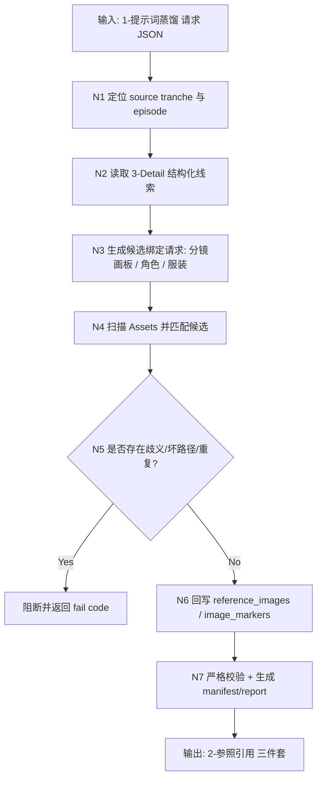
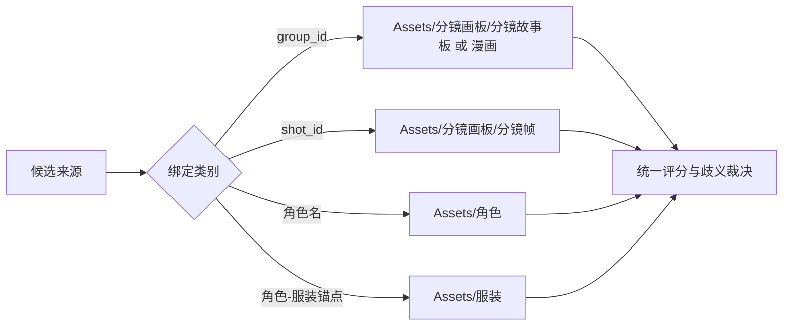
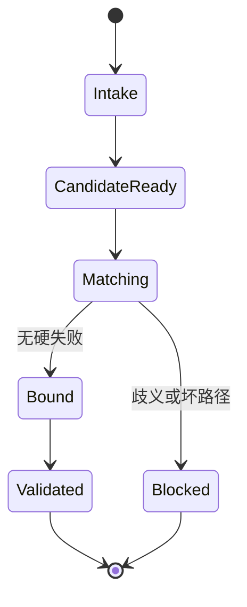

# aigc 6-Video / 2-参照引用

## Context Loading Contract

- 每次调用本技能时，必须同时加载同目录 `CONTEXT.md` 作为预加载上下文。
- 若同目录 `CONTEXT.md` 缺失，应先补齐最小知识库骨架，或向用户明确报告阻塞；不得在未检查该上下文的情况下执行技能。
- 冲突优先级：用户显式请求 > 仓库/全局 `AGENTS.md` > 本 `SKILL.md` > 同目录 `CONTEXT.md`。

## 概述

`2-参照引用` 是 `6-Video` 阶段里承接“稳定请求对象 -> Assets 资产匹配 -> 参照图字段绑定 -> 严格校验”的叶子技能。

它不生成新 prompt，也不直接提交 provider。它只做一件事：把已经被人工选定并沉淀在 `projects/aigc/<项目名>/Assets/` 的图像资产，按请求对象的组/镜语义和主体线索，写入 `reference_images / image_markers`，并在落盘前执行严格检查，确保后续 `3-视频生成` 消费的是可验证的引用对象，而不是占位骨架。

本技能优先回答四件事：

1. 当前请求对象到底来自 `全能参照` 还是 `首帧参照`
2. 应该去 `Assets` 的哪些子目录寻找哪一类参照图
3. 哪些候选可以自动匹配，哪些必须保守跳过，哪些因为歧义必须阻断
4. 绑定后的请求对象是否已经达到“可交给 `3-视频生成`”的严格标准

## When to Use

- 已有来自 `1-提示词蒸馏/全能参照` 或 `1-提示词蒸馏/首帧参照` 的稳定请求 JSON，但 `reference_images / image_markers` 仍为空或仍是占位骨架。
- 项目级 `Assets/` 中已经人工沉淀了可复用的角色、服装、场景、道具、分镜画板图片，需要把它们写回视频请求对象。
- 需要把“参照图是否存在、绑定到哪个主体、顺序如何排列”收束成可复核的真源，而不是在 provider 命令层临时拼接。
- 需要在正式进入 `3-视频生成` 前，先完成一次严格的参照引用检查。

## When Not to Use

- 当前还没有合法的 `6-Video` 请求 JSON；应先回到 `1-提示词蒸馏/*`。
- 任务是新增或挑选图片资产本身；本技能只绑定已存在于 `Assets/` 的资产，不负责生成或挑图。
- 任务已经进入 provider 提交、轮询或下载；应进入 `3-视频生成` 或具体 provider skill。
- 用户明确要求“本次完全不使用任何参照图”，且后续 provider 也允许纯 prompt 路径；此时可以直接跳到 `3-视频生成`。

## 单一真源边界

### `2-参照引用` 拥有

- `Assets/` 到 `reference_images / image_markers` 的绑定规则
- 自动匹配、保守跳过、歧义阻断的判定合同
- 绑定后三件套写回与严格校验
- 参照图顺序位与 `图N` marker 编号稳定性

### `2-参照引用` 不拥有

- 重新改写 `1-提示词蒸馏/*` 的 prompt 或镜头事实
- 在 `Assets/` 中生成、下载、移动或重命名图片
- 直接把绑定结果转换成 provider 命令
- 将歧义候选“猜一个最像的”强行写入请求对象

## Business Requirement Analysis

| 分析项 | 结论 |
| --- | --- |
| `business_goal` | 将项目级 `Assets/` 中已人工选定的图像资产绑定进视频请求对象，使后续视频生成有稳定参照输入 |
| `business_object` | `1-提示词蒸馏/*` 产出的 `第N集.json`、项目级 `Assets/` 目录、上游 `3-Detail/第N集.json` 中的主体/分镜线索 |
| `constraint_profile` | 只允许绑定 `Assets/` 中真实存在的文件；不存在的可跳过；歧义候选必须阻断；不得伪造远程 URL 或不存在路径；绑定后字段必须通过严格检查 |
| `success_criteria` | 输出请求对象中的 `reference_images / image_markers` 可回链到真实 `Assets/` 文件，顺序稳定，无占位残留，无歧义误绑，并可继续交给 `3-视频生成` |
| `topology_fit` | 一条主干串联“输入定位 -> 候选推导 -> 资产匹配 -> 严格校验 -> 写回汇流”，其中资产匹配节点内部允许多类候选并行收敛 |
| `step_strategy` | 优先依赖结构化线索：`group_id / source_shot_ids / 出场角色及穿搭`；弱线索命中不足时宁可跳过，也不补猜测性绑定 |

## Visual Maps







## Canonical Inputs

- `projects/aigc/<项目名>/6-Video/全能参照/<第N集>/<第N集>.json`
- `projects/aigc/<项目名>/6-Video/首帧参照/<第N集>/<第N集>.json`
- `projects/aigc/<项目名>/3-Detail/<第N集>.json`
- `projects/aigc/<项目名>/Assets/`
- `.agents/skills/aigc/6-Video/_shared/video-generation-input.template.json`

## Canonical Landing

- tranche 根目录：`projects/aigc/<项目名>/6-Video/2-参照引用/`
- 组级绑定目录：`projects/aigc/<项目名>/6-Video/2-参照引用/全能参照/<第N集>/`
- 帧级绑定目录：`projects/aigc/<项目名>/6-Video/2-参照引用/首帧参照/<第N集>/`
- canonical 主文件：`projects/aigc/<项目名>/6-Video/2-参照引用/<模式>/<第N集>/<第N集>.json`
- canonical manifest：`projects/aigc/<项目名>/6-Video/2-参照引用/<模式>/<第N集>/_manifest.json`
- canonical 报告：`projects/aigc/<项目名>/6-Video/2-参照引用/<模式>/<第N集>/match-report.md`

## Input Normalization Contract

- 输入请求对象可以来自旧模板或新模板。
- 若输入中的 `image_markers` 仍是旧 `image_url` 结构，本技能不得原样透传；应在本轮绑定时统一重建为 `image_ref + ref_kind + related_subject + image_no` 结构。
- 若输入中的 `reference_images / image_markers` 已存在真实内容，本技能只允许在严格校验通过后覆写为新的本地资产绑定结果，不得与占位骨架混写。

## Matching Policy

### 可自动匹配的线索

1. `meta.group_id`
2. `meta.source_shot_ids[]`
3. 上游 `组间设计.出场角色及穿搭`

### 默认匹配目录

| 线索类型 | 目标目录 | 说明 |
| --- | --- | --- |
| `group_id` | `Assets/分镜画板/分镜故事板/`、`Assets/分镜画板/漫画/` | 主要给组级请求对象绑定故事板/漫画参考 |
| `shot_id` | `Assets/分镜画板/分镜帧/` | 主要给帧级请求对象绑定单帧参考 |
| `角色名` | `Assets/角色/` | 角色身份锚点 |
| `角色-服装锚点` | `Assets/服装/` | 服装视觉锚点 |

### 保守原则

- `Assets/` 中没有命中的文件，不视为失败；说明“没选上/本轮不需要”，直接跳过。
- 同一候选出现多个同分候选，不做猜测性选取，直接视为歧义失败。
- 路径必须指向 `Assets/` 内真实文件；任何外部路径、软占位或虚构路径都失败。
- 绑定顺序保持稳定：优先画板资产，再角色资产，再服装资产。

## Thinking-Action Nodes

| node_id | 目标字段/对象 | 核心问题 | 必做动作 | route_out | fail_code |
| --- | --- | --- | --- | --- | --- |
| N1-INTAKE | `source_request` | 输入请求 JSON 来自哪条上游链 | 读取输入文件，锁定 `全能参照/首帧参照` 与 episode | `N2` | `FAIL-VIDREF-INTAKE` |
| N2-EVIDENCE | `group_id/source_shot_ids/subjects` | 上游有哪些可用于匹配的结构化线索 | 读取 `3-Detail`，提取 group/shot/角色/服装锚点 | `N3` | `FAIL-VIDREF-EVIDENCE` |
| N3-CANDIDATE | `candidate_requests[]` | 应生成哪些绑定请求 | 按类别形成候选请求序列与优先级 | `N4` | `FAIL-VIDREF-CANDIDATE` |
| N4-MATCH | `match_results[]` | 哪些 Assets 文件可安全命中 | 扫描 `Assets/` 并计算唯一最佳匹配 | `N5` | `FAIL-VIDREF-MATCH` |
| N5-GATE | `hard_issues[]` | 是否存在歧义、坏路径、重复绑定 | 对硬失败立即阻断；对“无图可跳过”保守放行 | `N6` 或 `Blocked` | `FAIL-VIDREF-GATE` |
| N6-BIND | `reference_images/image_markers` | 最终如何回写请求对象 | 重建两个字段并稳定排序 `图1..图N` | `N7` | `FAIL-VIDREF-BIND` |
| N7-AUDIT | `json/manifest/report` | 绑定结果是否达到 handoff 标准 | 严格校验、生成报告、写回三件套 | `Done` | `FAIL-VIDREF-AUDIT` |

## Workflow

1. 读取现有 `全能参照` 或 `首帧参照` 请求 JSON。
2. 读取对应 `3-Detail/<第N集>.json`，提取 `group_id / shot_id / 出场角色及穿搭`。
3. 生成候选绑定请求：
   - 组级请求优先找 `分镜故事板/漫画`
   - 帧级请求优先找 `分镜帧`
   - 角色与服装锚点分别找 `角色/服装`
4. 递归扫描 `Assets/` 中的图片文件。
5. 按“唯一最佳候选”规则绑定；未命中可跳过，歧义候选必须阻断。
6. 重建 `reference_images / image_markers`，其中每个 marker 固定为：
   - `image_ref`: `projects/aigc/<项目名>/Assets/...` 相对仓库路径
   - `ref_kind`: `local_path`
   - `related_subject`: 绑定依据对应的主体/分镜标签
   - `image_no`: `图1..图N`
7. 严格校验并写回 `2-参照引用` 三件套。

## Script Entry

执行入口：

```bash
python3 .agents/skills/aigc/6-Video/2-参照引用/scripts/bind_reference_assets.py --help
python3 .agents/skills/aigc/6-Video/2-参照引用/scripts/bind_reference_assets.py --project "2049退休老头的快乐生活" --episode 第1集 --source-tranche 首帧参照 --dry-run
python3 .agents/skills/aigc/6-Video/2-参照引用/scripts/bind_reference_assets.py --project "2049退休老头的快乐生活" --episode 第1集 --source-tranche 全能参照
```

脚本职责：

- 接受现有请求对象作为输入
- 解析 `Assets/` 目录图片
- 回写 `2-参照引用` 输出
- 在 `--dry-run` 下只打印匹配与校验摘要，不落盘

## Output Contract

最低交付：

1. 绑定后的 `第N集.json`
2. `_manifest.json`
3. `match-report.md`
4. 明确的 `validation_status`

最低要求：

1. `reference_images` 与 `image_markers` 长度相同。
2. 若存在绑定内容，`image_markers[].image_no` 必须严格递增为 `图1..图N`。
3. 若存在绑定内容，`image_markers[].ref_kind` 必须为 `local_path`。
4. 若 `Assets/` 无匹配，两个字段都保持空数组，不得保留旧占位骨架。
5. 报告中必须写清“已绑定 / 未命中可跳过 / 歧义失败”。

## Field Master

| field_id | 输出位置/字段 | 内容要求 | 默认责任 Node | 质量维度 | 失败码 |
| --- | --- | --- | --- | --- | --- |
| FIELD-VIDREF-ROOT-01 | `第N集.json / tranche` | 明确当前输出来自 `2-参照引用/<模式>` | N1 | 路径可追溯性 | `FAIL-VIDREF-ROOT-01` |
| FIELD-VIDREF-SLOT-02 | `request_packets[].model.reference_images` | 只保留真实 `Assets/` 本地路径，顺序稳定 | N6 | 引用真值完整性 | `FAIL-VIDREF-SLOT-02` |
| FIELD-VIDREF-MARK-03 | `request_packets[].model.image_markers` | 每项保持 `image_ref / ref_kind / related_subject / image_no` 四字段结构 | N6 | 模板兼容性 | `FAIL-VIDREF-MARK-03` |
| FIELD-VIDREF-AUDIT-04 | `_manifest.json / validation` | 记录匹配数量、跳过数量、歧义数量与最终 verdict | N7 | 审计可读性 | `FAIL-VIDREF-AUDIT-04` |
| FIELD-VIDREF-REPORT-05 | `match-report.md` | 写清每个 packet 的绑定依据与跳过理由 | N7 | 人工复核性 | `FAIL-VIDREF-REPORT-05` |

## Pass Table

| field_id | Pass Standard | Fail Code | Rework Entry |
| --- | --- | --- | --- |
| FIELD-VIDREF-ROOT-01 | 输出位于 `6-Video/2-参照引用/<模式>/<第N集>/` | `FAIL-VIDREF-ROOT-01` | `N1` |
| FIELD-VIDREF-SLOT-02 | 所有 `reference_images` 都是真实 `Assets/` 文件路径，且无重复 | `FAIL-VIDREF-SLOT-02` | `N4-N6` |
| FIELD-VIDREF-MARK-03 | 所有 marker 结构完整，`ref_kind=local_path`，`图N` 顺序稳定 | `FAIL-VIDREF-MARK-03` | `N6` |
| FIELD-VIDREF-AUDIT-04 | manifest 清楚区分通过、跳过与失败 | `FAIL-VIDREF-AUDIT-04` | `N7` |
| FIELD-VIDREF-REPORT-05 | 报告可让人工复核每条绑定依据 | `FAIL-VIDREF-REPORT-05` | `N7` |

## Audit Contract

严格校验至少覆盖：

- `source_request_integrity`: 输入请求对象结构完整
- `asset_path_integrity`: 所有已绑定路径都存在且位于 `Assets/`
- `marker_integrity`: marker 四字段结构、顺序位与 `reference_images` 一一对应
- `ambiguity_control`: 歧义候选不会被默选
- `skip_policy`: 未命中资产时只保留空数组，不残留旧占位

硬门槛：

- 歧义候选是失败，不是 warning。
- 非 `Assets/` 路径是失败。
- 绑定后仍保留 placeholder 文案是失败。
- 若本轮无任何匹配，且数组为空且报告注明跳过，可视为成功完成“无参照图绑定”的保守路径。

## Root-Cause Execution Contract (Mandatory)

当出现以下症状时，必须先修 `2-参照引用` 的源层合同：

- `Assets/` 中明明有图，但请求对象仍保持空骨架
- 同一主体命中多个候选，却被脚本默选了一个
- 绑定结果写进了虚构路径、外部路径或非 `Assets/` 路径
- 绑定后 `reference_images / image_markers` 长度、顺序或字段结构漂移
- `3-视频生成` 收到的请求对象仍混有占位骨架和真实引用

必经链路：

`Symptom -> Direct Technical Cause -> Rule Source -> Meta Rule Source -> Fix Landing Points`

优先检查：

- `Rule Source`
  - `.agents/skills/aigc/6-Video/2-参照引用/SKILL.md`
  - `.agents/skills/aigc/6-Video/2-参照引用/CONTEXT.md`
  - `.agents/skills/aigc/6-Video/2-参照引用/scripts/bind_reference_assets.py`
- `Meta Rule Source`
  - `.agents/skills/aigc/6-Video/SKILL.md`
  - `.agents/skills/aigc/SKILL.md`
  - 根 `AGENTS.md`

## Context Preload (Mandatory)

- 执行前先加载 `.agents/skills/aigc/SKILL.md + CONTEXT.md`
- 再加载 `.agents/skills/aigc/6-Video/SKILL.md + CONTEXT.md`
- 再加载本 `SKILL.md + CONTEXT.md`
- 优先级遵循：用户显式请求 > 根 `AGENTS.md` > `.agents/skills/aigc/SKILL.md` > `.agents/skills/aigc/6-Video/SKILL.md` > 本 `SKILL.md` > 各级 `CONTEXT.md`
