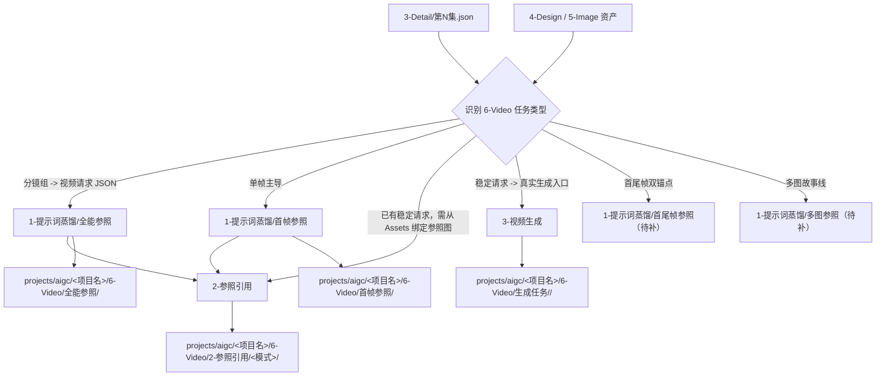
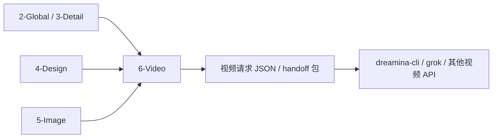

# aigc 6-Video

## 概述

`6-Video` 是 `aigc` 主链里承接 `3-Detail/第N集.json`、`4-Design` 与 `5-Image` 的视频执行前置阶段真源。

它不直接替代视频模型调用本身，而是先把上游已经稳定的导演事实、主体参照和既有画面资产，整理成 **视频工具可直接消费的请求 JSON / 参照包 / 执行入口**。

当前阶段优先回答四件事：

1. 视频阶段本轮到底该消费哪一类上游真源
2. 当前任务应进入哪一个唯一视频子路径
3. 视频请求对象应如何对齐具体工具的入参格式
4. 产物应落到 `projects/aigc/<项目名>/6-Video/` 的哪里

当前已建可执行子路径位于 `1-提示词蒸馏`、`2-参照引用` 与 `3-视频生成`：

1. `全能参照`
2. `首帧参照`
3. `2-参照引用`
4. `3-视频生成`

其余目录 `首尾帧参照`、`多图参照` 目前仍保留为后续扩展槽位。

## When to Use

- 需要把 `projects/aigc/<项目名>/3-Detail/第N集.json` 中 `metadata.document_phase=ready` 的分镜组内容蒸馏为视频工具入参 JSON。
- 需要在正式调用 `dreamina` 或其他视频 API 前，先整理主体参照、prompt、画幅与质量参数。
- 需要说明 `6-Video` 与 `5-Image`、`dreamina-cli` 的边界。
- 用户只说“做视频参照 / 做视频请求 JSON / 从 `3-Detail` 转视频入参”，但还没进入实际提交命令。

## When Not to Use

- 任务仍在补 `3-Detail/第N集.json` 的组级或镜级事实，应回到 `2-Global` 或 `3-Detail`。
- 上游 `3-Detail/第N集.json` 仍处于 `bootstrapped` 或 `detail_in_progress`，或组内 `分镜切换` 与 `分镜明细[]` 尚未对齐，应回到 `3-Detail` 完成 handoff gate。
- 任务仍在生成参考图、故事板或单帧图，应回到 `5-Image`。
- 任务已经明确处于具体 provider 技能内部，只是在排查 `dreamina-cli` / `grok` 的提交、轮询、队列或下载问题，应直接进入对应 provider 技能。

## 阶段职责边界

### `6-Video` 拥有

- 视频阶段父级路由合同
- 视频请求 JSON 与参照包的统一入口
- provider 执行入口与 handoff 包的阶段级约定
- 工具配置与上游真源之间的对位规则
- `projects/aigc/<项目名>/6-Video/` 阶段落点

### `6-Video` 不拥有

- 重新改写 `3-Detail/第N集.json` 的剧情或镜头事实
- 替代 `5-Image` 生成图片资产
- 替代 `dreamina-cli` 执行真正的提交、轮询和下载

## Visual Maps

## Canonical Module References

| 模块 | 作用 | 真源文件 |
| --- | --- | --- |
| 思维链 | 承载阶段级字段、判断链与返工入口 | `references/chain-of-thought.md` |
| 执行流程 | 承载输入合同、落点与 handoff | `references/execution-flow.md` |
| 类型策略 | 承载子路径路由与回退规则 | `references/type-strategies.md` |
| 输出契约 | 承载阶段级交付结构与最低要求 | `references/output-template.md` |

## Provider Slot Semantics

- `6-Video/3-视频生成/providers/` 只承载 provider 槽位与命名保留，不默认等同于受治理可执行子技能。
- 当前 provider 槽位包括：`grok`、`kling`、`seedance`、`sora`、`veo`、`vidu`。
- 若某个 provider 未来需要独立执行合同，应升级为明确的 `SKILL.md + CONTEXT.md`，而不是继续靠空目录冒充能力存在。

## Route Summary

- 若任务是“按分镜组把导演 JSON 蒸馏成视频工具入参”，默认进入 `1-提示词蒸馏/全能参照`。
- 命中任何 `1-提示词蒸馏/*` 叶子前，默认先确认 `3-Detail/第N集.json` 已进入 `metadata.document_phase=ready`，且各组 `分镜切换 == len(分镜明细[])`。
- 若任务已经明确以单一 `分镜ID` 作为首帧锚点，进入 `1-提示词蒸馏/首帧参照`。
- 若任务已经有稳定请求 JSON，且目标是从 `Assets/` 补齐参照图字段，进入 `2-参照引用`。
- 若任务已经有稳定请求 JSON，且当前目标是选择 provider、写提交计划并进入真实生成入口，进入 `3-视频生成`。
- 若任务已经有首尾帧或多图强约束，但对应子路径合同未补齐，必须报告缺口，不得伪造执行链。
- 若任务已经明确卡在 provider 运行时故障排查，则直接进入命中的 provider 技能，不再重复经过父级路由。

## Execution Summary

- 当前阶段的第一事实源是 `projects/aigc/<项目名>/3-Detail/第N集.json`。
- 只有 `metadata.document_phase=ready` 且组内 `分镜切换` 与 `分镜明细[]` 已对齐的 episode root，才可被 `6-Video` 视作稳定 handoff 输入。
- shared schema 固定为 `.agents/skills/aigc/_shared/director_episode_output.schema.json`。
- 阶段级产物统一写回 `projects/aigc/<项目名>/6-Video/`，由命中的子路径承载请求对象或 handoff 包。
- 详细输入合同、canonical landing 与 handoff 见 `references/execution-flow.md`。

## Output Summary

- 当前阶段默认交付不是视频文件，而是“请求 JSON + manifest/说明 + 下一步执行入口”。
- 首个 canonical 主产物为 `projects/aigc/<项目名>/6-Video/全能参照/第N集/第N集.json`。
- 首个 canonical 文本副产物为 `projects/aigc/<项目名>/6-Video/全能参照/第N集/第N集.txt`。
- 帧级 canonical 主产物为 `projects/aigc/<项目名>/6-Video/首帧参照/第N集/第N集.json`。
- 帧级 canonical 文本副产物为 `projects/aigc/<项目名>/6-Video/首帧参照/第N集/第N集.txt`。
- 参照绑定 canonical 主产物为 `projects/aigc/<项目名>/6-Video/2-参照引用/<模式>/第N集/第N集.json`。
- 参照绑定 canonical 审计产物为 `projects/aigc/<项目名>/6-Video/2-参照引用/<模式>/第N集/_manifest.json + match-report.md`。
- 组级与帧级叶子的共享 `图生视频` 句法总原则统一收敛到 `.agents/skills/aigc/6-Video/_shared/image-to-video-prompt-principles.md`，子路径 `prompt-assembly-spec.md` 只负责各自 specialization。
- 生成入口 canonical 计划文件为 `projects/aigc/<项目名>/6-Video/生成任务/<provider>/第N集/submit-plan.json`。
- 生成入口 canonical 简报为 `projects/aigc/<项目名>/6-Video/生成任务/<provider>/第N集/submit-brief.md`。
- 当前共享入参模板真源为 `.agents/skills/aigc/6-Video/_shared/video-generation-input.template.json`，供多个视频子技能包共用。
- 共享模板中的 `model.image_markers[]` 使用 provider-neutral 的 `image_ref + ref_kind + related_subject + image_no` 骨架；是否需要落成本地路径、URL 或其他 provider 专用格式，由 `3-视频生成` 或命中的 provider 技能在 handoff 时解析。
- 当前共享文本模板真源为 `.agents/skills/aigc/6-Video/_shared/视频生成入参.template.txt`，供多个视频子技能包共用。
- 详细顶层结构与必要文件见 `references/output-template.md`。

## Field System Summary

- 字段体系保持 `FIELD-VIDEO-ROOT-01` 到 `FIELD-VIDEO-ROOT-04`。
- 详细字段表、thought pass 与 pass table 见 `references/chain-of-thought.md`。

## Root-Cause Execution Contract (Mandatory)

当出现以下症状时，必须先修 `6-Video` 父级合同：

- 执行者直接跳到视频模型命令，绕过请求 JSON 整理层
- 上游还没锁定 `3-Detail/第N集.json`，却提前生成视频入参
- `3-Detail` 仍是 `bootstrapped/detail_in_progress` 半成品，或 `分镜切换` 与 `分镜明细[]` 数量未对齐，却被误当成稳定视频输入
- 任务明明是分镜组级蒸馏，却被误判成首帧或多图路径
- 请求 JSON 里继续混用旧仓 `output/影片/...` 路径
- 只剩 prompt，没有请求字段、台账或下游 handoff

必经链路：

`Symptom -> Direct Technical Cause -> Rule Source -> Meta Rule Source -> Fix Landing Points`

优先检查：

- `Rule Source`
  - `.agents/skills/aigc/6-Video/SKILL.md`
  - `.agents/skills/aigc/6-Video/CONTEXT.md`
  - `.agents/skills/aigc/6-Video/1-提示词蒸馏/*/SKILL.md`
  - `.agents/skills/aigc/6-Video/2-参照引用/SKILL.md`
  - `.agents/skills/aigc/6-Video/3-视频生成/SKILL.md`
- `Meta Rule Source`
  - `.agents/skills/aigc/SKILL.md`
  - 根 `AGENTS.md`

## Context Preload (Mandatory)

- 执行前先加载 `.agents/skills/aigc/SKILL.md + CONTEXT.md`。
- 再加载本 `SKILL.md + CONTEXT.md`。
- 建议按需读取 `references/*.md`。
- 进入叶子子路径时，再加载对应真实子路径的 `SKILL.md + CONTEXT.md`。
- 优先级遵循：用户显式请求 > 根 `AGENTS.md` > `.agents/skills/aigc/SKILL.md` > 本 `SKILL.md` > 各级 `CONTEXT.md`。

## Subtype Partition (Mandatory)

- 当前 `6-Video/` 已建且可执行的子路径位于 `1-提示词蒸馏/全能参照`、`1-提示词蒸馏/首帧参照`、`2-参照引用` 与 `3-视频生成`。
- `3-视频生成/providers/` 当前只保留 provider 槽位，不自动视为本地 governed leaf。
- `首尾帧参照`、`多图参照` 与未来一致性处理路径仍为后续扩展槽位，目录存在与否都不等于合同已建。
- `首尾帧参照`、`多图参照` 目前仍作为后续叶子槽位保留在 `1-提示词蒸馏/` 下，不因目录存在而自动视为可执行。
