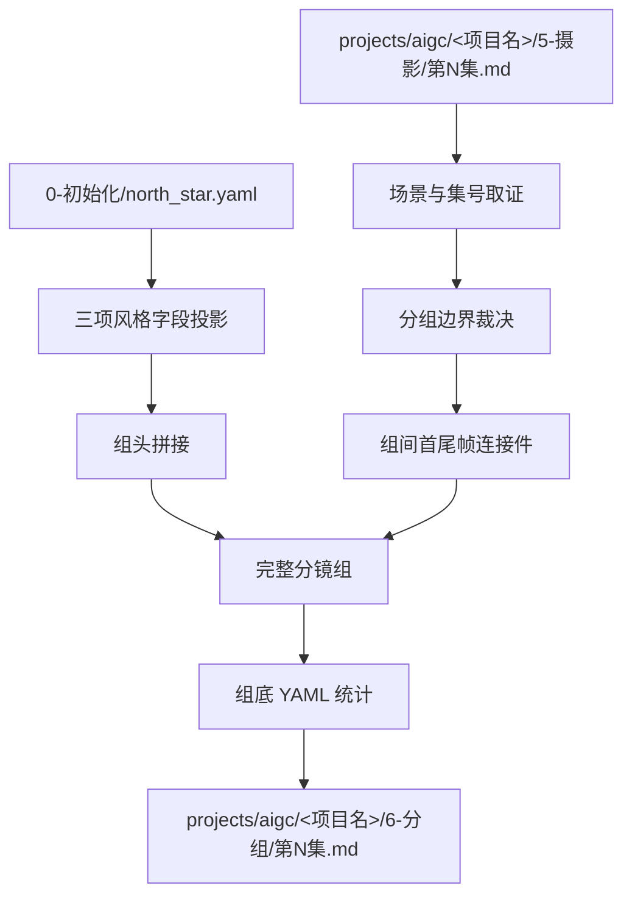
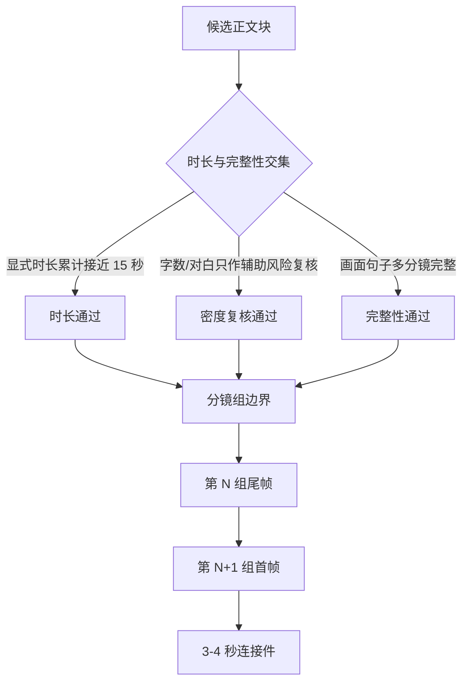
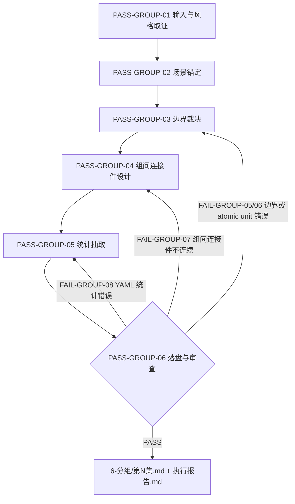
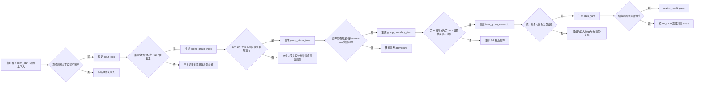

# aigc 6-分组

`6-分组` 负责把 `5-摄影` 的逐集摄影稿切分为可供后续设计、图像和视频阶段消费的完整分镜组。它不改写上游剧本正文和原有分镜明细，只裁决组边界、生成组间首尾帧连接件、拼接项目 `north_star.yaml` 的风格字段，最后在组底部附加统计 YAML。旧版 `入场画面：` / `出场画面：` 尾钩机制已移除；连接件以独立 3-4 秒缝纫补丁承接相邻分镜组。

## Context Loading Contract

- 每次调用 `$aigc-grouping` 时，必须同时加载同目录 `CONTEXT.md`。
- 每次调用本技能时，必须同时识别并加载同目录 `types/` 中选中的类型包（单选或多选）。
- 若任务绑定 `projects/aigc/<项目名>/`，必须先加载项目根 `MEMORY.md`、`projects/aigc/<项目名>/0-初始化/north_star.yaml`，再按需加载项目根 `CONTEXT/` 或 `CONTEXT/` 中与角色、场景、道具、风格和制作约束相关的上下文文件。
- 上游正文真源固定为 `projects/aigc/<项目名>/5-摄影/第N集.md`，除非用户显式指定其他摄影稿文件。
- 冲突优先级：用户显式请求 > 根 `AGENTS.md` / meta 规则 > 本 `SKILL.md` > `references/` / `steps/` / `types/` / `review/` / `templates/` > `agents/openai.yaml` > 项目 `MEMORY.md` > 项目 `CONTEXT/` / `CONTEXT/` > 本 `CONTEXT.md`。
- 分组边界、组间连接件、角色/场景/道具提取和组内完整性判断必须由 LLM 直接完成；`scripts/` 只能做读取、显式时长累计、字数统计、ID/标题/YAML/连接件结构检查和机械校验。

## Multi-Subskill Continuous Workflow

当本主技能包被整体调用时，视为用户已授权按本级声明的同级子技能包、阶段分区或内部连续节点自动完成整个技能组任务；在满足本技能必要输入、显式选择和安全门后，不再为“是否继续下一步”额外确认。

- 无序号同级子技能包默认全选并发执行，由本主技能包汇总、裁决和写回唯一 canonical 输出。
- 数字序号子技能包或节点（如 `1-`、`2-`、`3-`）默认按数字升序串行执行，前一节点产物自动作为后一节点输入。
- 英文序号子技能包或路线（如 `A-`、`B-`、`C-`）默认按用户意图、父级路由或输入类型单选分流；只有用户明确要求对比、并跑或批量多路线时才多选。
- 连续调度不得绕过本技能的阻断门：缺少必需输入、上游摄影稿或 `north_star.yaml` 不可读、破坏性覆盖未授权、子技能缺失或路线歧义会造成错误 canonical 写回时，必须先停下并给出最小澄清或阻断报告。
- 每个被调度的子技能包仍必须加载自身 `SKILL.md + CONTEXT.md`；脚本只能承担机械辅助，不得替代 LLM 分组判断或父级最终裁决。

## Input Contract

Accepted input:

- 项目名、项目路径、单个 `projects/aigc/<项目名>/5-摄影/第N集.md` 文件，或多个集号范围。
- 用户要求“分组”“分镜组”“从 5-摄影 到 6-分组”“给摄影稿按分镜组切分”“添加组间首尾帧连接件”“缝纫补丁”“修复 15 秒分组之间断裂”等任务。
- 已完成或部分完成的 `5-摄影` 逐集稿；默认以集为单位处理 `第N集.md`。

Required input:

- 可定位、可读取的 `projects/aigc/<项目名>/5-摄影/第N集.md`。
- 可定位、可读取的 `projects/aigc/<项目名>/0-初始化/north_star.yaml`。
- 至少一个目标集号，或允许默认处理 `5-摄影/` 中全部 `第N集.md`。
- 输入正文中存在可识别的场景标题、剧本字段、对白字段、画面字段或分镜明细字段。

Optional input:

- 项目 `MEMORY.md` 中的长期偏好、禁区、衔接节奏或视觉惯性要求。
- 项目 `CONTEXT/` 或 `CONTEXT/` 中的角色表、场景表、道具表、世界观、风格和制作约束。
- 用户额外指定的目标组时长、最大组长、对白密度、特殊组间连接偏好、首尾帧参照图生视频约束或下游视频生成限制。

Reject or clarify when:

- 上游 `5-摄影/第N集.md` 或 `0-初始化/north_star.yaml` 不存在、不可读，且用户没有提供替代真源。
- 用户要求脚本自动生成分组正文、连接件过程描述、避免元素或统计提取结论；必须改为 LLM 主创、脚本只校验。
- 用户要求改变剧情事实、改对白、删减分镜明细、重排场景顺序或把多集混写成一个分镜组。
- 当前项目只存在 legacy `5-分组/` 而用户未明确允许写入 legacy 路径时，应报告路径漂移；本技能 canonical 输出为 `6-分组/`。

## Mode Selection

| mode | 触发信号 | 输出 |
| --- | --- | --- |
| `single_episode` | 指定单个 `第N集.md` 或单个集号 | `projects/aigc/<项目名>/6-分组/第N集.md` |
| `episode_range` | 指定多个集号或集号范围 | 多个逐集分镜组稿与更新后的执行报告 |
| `all_ready_episodes` | 未指定集号但 `5-摄影/` 下有 `第N集.md` | 全部可读逐集分镜组稿 |
| `repair` | 已有分组稿 ID 错误、组过长、组间连接件断裂、north_star 拼接缺失或 YAML 统计不完整 | 最小修复后的逐集分组稿与问题报告 |
| `review_only` | 用户只要求检查 `6-分组` 输出 | 审查报告，不改写正文，除非用户随后要求修复 |

## Reference Loading Guide

| 场景 | 必读文件 |
| --- | --- |
| 任意分组任务 | `steps/grouping-workflow.md`、`references/group-boundary-contract.md`、`references/north-star-projection-contract.md`、`references/group-visual-tone-contract.md` |
| 画面属性落盘知识库 | `../5-摄影/knowledge-base/摄影构图/` |
| 组间首尾帧、缝纫补丁、同场景/跨场景连接件 | `references/bridge-shot-contract.md` |
| 组底 YAML 统计、角色/场景/道具抽取 | `references/statistics-yaml-contract.md` |
| 判断输入稿、边界风险和修复策略 | `types/grouping-type-map.md` |
| 验收、修复和 review gate | `review/review-contract.md` |
| 输出样板 | `templates/output-template.md`、`templates/episode-groups.template.md` |
| 脚本辅助边界与机械校验 | `scripts/README.md` |
| 可复用经验 | `knowledge-base/grouping-heuristics.md` |
| 产品入口元数据 | `agents/openai.yaml` |

## Visual Maps

## Execution Contract

1. 读取本 `SKILL.md + CONTEXT.md`，并在项目任务中加载项目 `MEMORY.md`、`0-初始化/north_star.yaml` 与相关 `CONTEXT/` 或 `CONTEXT/`。
2. 锁定上游 `5-摄影/第N集.md`，提取集号、场景标题、正文块、对白字段、画面字段、分镜明细块和场景顺序；不得改写原正文。
3. 按 `references/north-star-projection-contract.md` 从 `north_star.yaml` 投影 `全局风格.全局风格提示词`、`类型元素.类型元素提示词`、`细分风格.画面风格`；每个分镜组标题 `## x-y-z` 后必须先写当前上游场景标题行，例如 `场景1：外景 扶桑战船外舷与黑礁 - 夜`，即便连续多个分镜组仍在同一场景内，也必须重复同一个场景标题；随后再以隐藏标题字段的三行纯内容写入 north_star 组头，第 1 行必须以固定前置词 `视频生成的画面风格，光影和氛围与场景参照图保持一致。需要生成现场物理互动音效、氛围感音效、环境声、自然现象声、动作声，不要生成任何字幕，不要生成背景音乐。` 开头，再接全局风格原词。
3.5. 按 `references/group-visual-tone-contract.md` 从上游摄影稿的镜头设计中提炼每组的组级画面属性：构图布局核心选择、构图方式关键子维度（从形状感/线条感/影调感/虚实感/节奏感/纹理质感/气势中选取 2-3 个）、光源效果、色彩基调和关键摄影技术参数（只写影响画面最大的 1-2 项）。画面属性以自然中文语句呈现，从组内镜头设计中提炼而非从 north_star 投影或 5-摄影 内部约束直接搬运；同一场景内视觉特征不变时相邻组可使用相似语句，视觉特征变化时必须更新。画面属性语句位于每组场景标题行之后、north_star 风格行之前。
4. 按 `references/group-boundary-contract.md` 执行边界裁决：以 `5-摄影` 中 `分镜N（约X秒）:` 的显式时长累计为主，每组优先接近约 15 秒，通常允许约 12-18 秒弹性，不要求精确卡点；单组显式时长累计硬上限为 18 秒，不得用同画面完整、对白承托、动作完成或场景完整性作为超过 18 秒的放行理由；若单个 atomic unit 自身已超过 18 秒，必须阻断本阶段并回到 `5-摄影` 拆分、压缩或重裁时值，而不是在 `6-分组` 中产出超时组；字数和对白句数只作为异常密度、旧稿缺秒数或时长边界相近时的辅助复核；不得仅因情绪、话题或危险信息转折切出低密度短组。
5. 按 `references/bridge-shot-contract.md` 在相邻两组正文都完成后设计 3-4 秒组间首尾帧连接件：回看第 N 组最后原尾帧与第 N+1 组第一个原首帧，判断 `同场景连接` 或 `跨场景连接`，内部可按依赖型、流动型、变形型、复合型或特殊无连接方法论选择画面缝合策略，但落盘的 `连接方法` 必须写成简要具体画面办法，不得只写抽象分类名；连接件标题后、三项 north_star 风格行前必须先写场景标题行：同场景连接重复同一个场景标题，跨场景连接写成 `场景标题A ➡️ 场景标题B`；随后在 `连接类型` 前写三项 north_star 风格行：第 1 行以固定前置词 `视频生成的画面风格，光影和氛围与场景参照图保持一致。需要生成现场物理互动音效、氛围感音效、环境声、自然现象声、动作声，不要生成任何字幕，不要生成背景音乐。` 开头，后接 `north_star.yaml` 的 `全局风格.全局风格提示词` 原文，第 2、3 行分别直引 `类型元素.类型元素提示词` 与 `细分风格.画面风格`；不得输出 `起点尾帧：` / `目标首帧：` 字段，避免与实际首尾参照图偏移；必须写清 `变化过程`、`主体运动`、`运镜设计` 和 `透视适应`，其中主体运动和运镜设计应接近 `8-图像/A-分镜画面` 的空间与镜头细节密度；末尾只保留 `避免元素` 负面约束，不输出 `连接件提示` 复述正向内容；连接件必须物理夹放在上一个分镜组与下一个分镜组之间，连接件标题 ID 固定为 `<上一个分镜组ID>~<下一个分镜组ID>`，块内不得重复输出 `分镜ID：`；连接件不写入分镜组正文，不计入组内 `时长估算`、1680/1980 或 YAML `字数统计`，不得继续输出旧版 `入场画面：` / `出场画面：`。
6. 给每个分镜组标注 `x-y-z` 格式 `分镜组ID`：`x` 为真实集号，`y` 为真实场景号，`z` 为该场景内分镜组序号；跨场景时组序号重新从 1 开始。
7. 按 `references/statistics-yaml-contract.md` 在每组底部附加 YAML 统计；每组标题后的场景标题行和画面属性语句计入 YAML `字数统计`，但不计入组内 `时长估算`；统计 YAML、组头 north_star、组标题和组间连接件均不计入组内 `时长估算`、1680 目标上限、1980 硬上限或 `字数统计`；`道具` 抽取必须先识别同一物品并归一合并，去除普通环境背景物、重复项、同物异名、状态拆分和部件滥列，只保留重要叙事道具、规则道具、视觉钩子或后续生成必须锁定的 canonical 道具名。
8. 写入 `projects/aigc/<项目名>/6-分组/第N集.md`，并生成或更新 `projects/aigc/<项目名>/6-分组/执行报告.md`。
9. 按 `review/review-contract.md` 执行验收；可运行 `scripts/validate_storyboard_groups.py` 做机械检查，但脚本不得替代 LLM 分组、组间连接件和统计判断。

## Script And Metadata Contract

| path | role |
| --- | --- |
| `scripts/README.md` | 说明脚本只能承担机械辅助，不替代 LLM 分组判断 |
| `scripts/validate_storyboard_groups.py` | 必跑机械校验：检查分镜组标题、场景标题行、风格字段、YAML 统计、计入场景标题行后的正文字数、显式时长累计、编号连续性和组间连接件结构；不能替代分组边界、连接件创意、原文保真和统计证据判断 |
| `agents/openai.yaml` | 提供产品侧入口元数据，默认提示必须显式提到 `$aigc-grouping` |

## Field Mapping

| field_id | 输出/证据 | 内容要求 | 失败码 |
| --- | --- | --- | --- |
| `FIELD-GROUP-01` | 输入取证 | source cinematography episode、north_star、项目记忆、相关上下文、目标集号明确 | `FAIL-GROUP-01` |
| `FIELD-GROUP-02` | 场景标题与 north_star 拼接 | 每组 `## x-y-z` 后先重复当前场景标题行，再投影 `全局风格.全局风格提示词`、`类型元素.类型元素提示词`、`细分风格.画面风格` 三项；第 1 行风格行以固定前置词 `视频生成的画面风格，光影和氛围与场景参照图保持一致。需要生成现场物理互动音效、氛围感音效、环境声、自然现象声、动作声，不要生成任何字幕，不要生成背景音乐。` 开头，后接全局风格原词，组头不显示标题字段、中文括号或装饰性连接符 | `FAIL-GROUP-02` |
| `FIELD-GROUP-03` | 边界裁决 | 以显式 `分镜N（约X秒）` 累计接近 15 秒为主，通常约 12-18 秒可接受；单组显式时长累计必须 `<=18` 秒；同一画面句子及多分镜、对应对白/画面承托完整但不得突破 18 秒硬上限，单个 atomic unit 超 18 秒时回退 `5-摄影` 修复；低于约 10 秒已回填复核；字数/对白只作辅助风险复核，不以情绪/话题/危险信息转折作为切组原则 | `FAIL-GROUP-05` |
| `FIELD-GROUP-04` | 分镜组 ID | `x-y-z` 与真实集、场、组匹配，场内组号连续 | `FAIL-GROUP-04` |
| `FIELD-GROUP-06` | 组间首尾帧连接件 | 每对相邻组中间都有 `## <上一个分镜组ID>~<下一个分镜组ID>`，含标题后场景标题行、三项 north_star 风格行、连接类型、连接方法、3-4 秒时长、变化过程、主体运动、运镜设计、透视适应和避免元素；同场景连接重复同一个场景标题，跨场景连接用 `场景标题A ➡️ 场景标题B`；连接方法必须是可供 AIGC 生成工具理解的简要具体方法描述，不得只填依赖型、流动型、变形型、复合型或无连接这类抽象分类名；`避免元素` 只写负面约束，不复述正向提示；不得输出 `起点尾帧：` / `目标首帧：` / `分镜ID：` / `连接件提示：`；不输出旧版入场/出场尾钩 | `FAIL-GROUP-07` |
| `FIELD-GROUP-07` | 原文保真 | `5-摄影` 划定正文同步原换行，不删改字段、对白、原有分镜明细或场景顺序 | `FAIL-GROUP-09` |
| `FIELD-GROUP-08` | YAML 统计 | 每组底部含 `字数统计`、`时长估算`、`角色`、`场景`、`道具`；分镜组标题后的场景标题行计入 `字数统计` 但不计入组内时长，统计块不计入字数或组内时长；`道具` 先做同物识别与归一合并，同一物品只列一次，不把状态、持有人、镜头景别或普通部件拆成重复道具 | `FAIL-GROUP-08` |
| `FIELD-GROUP-09` | 输出落盘 | `6-分组/第N集.md` 与 `执行报告.md` 可复查 | `FAIL-GROUP-09` |
| `FIELD-GROUP-10` | 组级画面属性 | 每组在场景标题行之后、north_star 风格行之前有画面属性自然语句，覆盖构图布局核心选择、构图方式关键子维度、光源效果、色彩基调和关键摄影技术参数；画面属性从组内镜头设计中提炼，与镜头设计一致；同一场景内视觉特征不变时相邻组可使用相似语句 | `FAIL-GROUP-10` |

## Thought Pass Map

| step_id | pass_name | input | judgment | output |
| --- | --- | --- | --- | --- |
| `PASS-GROUP-01` | 输入与风格取证 | 摄影稿、north_star、项目上下文 | 是否具备可分组真源与三项风格字段 | `input_lock` |
| `PASS-GROUP-02` | 场景锚定 | 场景标题与正文顺序 | 真实集号、真实场景号和场内组序 | `scene_group_index` |
| `PASS-GROUP-03V` | 画面属性裁决 | 每组镜头设计、`references/group-visual-tone-contract.md` | 是否从组内镜头设计中提炼画面属性自然语句，覆盖构图布局核心选择、构图方式关键子维度、光源效果、色彩基调和关键摄影技术参数；画面属性是否与镜头设计一致 | `group_visual_tone` |
| `PASS-GROUP-03` | 边界裁决 | 候选正文块、显式分镜时长累计、对白数、字数、分镜明细块 | 是否以时长累计接近 15 秒并保持 atomic unit 完整，字数/对白风险是否已复核 | `group_boundary_plan` |
| `PASS-GROUP-04` | 组间连接件设计 | 当前组原尾帧、下一组原首帧、场景关系、视觉/声音惯性、可用锚定物/能量/变形背景、north_star 三项风格原词 | 是否可用 3-4 秒同场景连接或跨场景转场连接从 A 连续抵达 B，是否把内部方法论选择转换成具体画面连接办法，是否先写三项风格行且第 1 行含固定前置词，是否以主体运动和运镜设计描述过程而非复述端点 | `inter_group_connector` |
| `PASS-GROUP-05` | 统计抽取 | 完整分镜组正文 | 角色、场景、重要叙事道具是否准确；道具是否已完成同物识别、归一合并和去重 | `stats_yaml` |
| `PASS-GROUP-06` | 落盘与审查 | 分组稿 | ID、时长估算、计入场景标题行后的正文字数、组间连接件、north_star、YAML 是否通过 | `review_result` |

## Pass Table

| pass_id | must_do | evidence | Rework Entry |
| --- | --- | --- | --- |
| `PASS-GROUP-01` | 读取上游摄影稿与 north_star 三项字段 | input manifest、字段摘录 | `references/north-star-projection-contract.md` |
| `PASS-GROUP-02` | 建立 `x-y-z` ID 映射 | 集号、场景号、场内组号表 | `references/group-boundary-contract.md` |
| `PASS-GROUP-03V` | 从组内镜头设计提炼画面属性自然语句 | 每组画面属性语句、组内镜头设计一致性 | `references/group-visual-tone-contract.md` |
| `PASS-GROUP-03` | 按显式时长累计和完整性确定边界 | `分镜N（约X秒）` 累计、对白数、字数估算、完整镜头块证据、短组回填理由、超 18 秒回退上游证据 | `references/group-boundary-contract.md` |
| `PASS-GROUP-04` | 设计组间首尾帧连接件 | 三项风格行、首尾参照图关系、连接类型、具体连接方法、变化过程、主体运动、运镜设计、透视适应与避免元素 | `references/bridge-shot-contract.md` |
| `PASS-GROUP-05` | 抽取角色、场景、道具统计 | 组底 YAML | `references/statistics-yaml-contract.md` |
| `PASS-GROUP-06` | 验证输出结构与语义质量 | validator 输出、语义 review 结论、短组例外说明 | `review/review-contract.md` |

## Root-Cause Execution Contract (Mandatory)

出现以下问题时，必须沿链路上溯并修复源层合同：

- 分镜组 ID 与真实集号、场景号或场内组序不匹配。
- 只按字数硬切，或只为了精确卡 15 秒切断同一画面句子、对应对白/画面承托或其 `分镜明细` 多分镜。
- 场景标题行加纯分镜剧本正文超过 1680 字却未做拆分复核，或超过 1980 字硬上限，或把 YAML 统计、组头或组间连接件误计入正文统计。
- 仅因情绪、话题或危险信息转折切出低密度短组，且没有执行回填复核。
- 对白数失控，长对话超过 4 句仍强塞一组，或短对白超过 6 句仍不拆。
- 相邻组缺少 `## <上一个分镜组ID>~<下一个分镜组ID>`，连接件未物理夹在上下两个分镜组中间，缺少场景标题行、三项风格行、连接方法、变化过程、主体运动、运镜设计或透视适应，同场景未重复场景标题、跨场景未用 `场景标题A ➡️ 场景标题B`，复述起点/目标端点，或连接件无法从上一组原尾帧抵达下一组原首帧。
- 连接件继续使用旧版 `入场画面：` / `出场画面：`，或输出 `连接件提示：` 复述正向内容，或写成尾钩、新剧情、新对白、剧本解释、下一剧情预告。
- 未按 `north_star.yaml` 投影三项风格字段，或用摘要替代原文，或全局风格固定前置词缺失/未置于最前，或把字段标题、中文括号和多余连接符暴露到组头。
- YAML 统计缺 `时长估算`、角色、场景、道具，把统计块、组头、连接件计入组内时长、1680 目标上限 / 1980 硬上限，或 `道具` 未做同物识别、归一合并和去重，导致普通环境物、同物异名、状态差异、持有人差异、镜头差异或部件重复铺开。
- 脚本、模板拼接或规则补句替代 LLM 的分组边界、组间连接件和统计判断。

必经链路：

`Symptom -> Direct Script/Prompt Overreach -> 6-分组 Section Owner -> AGENTS.md LLM-first / Skill 2.0 Rule`

## Output Contract

### Required output

1. 逐集分组稿固定写入 `projects/aigc/<项目名>/6-分组/第N集.md`。
2. 阶段执行报告写入或更新 `projects/aigc/<项目名>/6-分组/执行报告.md`。
3. 每个分镜组必须以 `## x-y-z` 作为分镜组标题，并在标题后先写当前场景标题行，例如 `场景1：外景 扶桑战船外舷与黑礁 - 夜`；即便新的分镜组没有切换场景，也必须重复同一个场景标题；随后写画面属性自然语句（从组内镜头设计提炼，覆盖构图布局核心选择、构图方式关键子维度、光源效果、色彩基调和关键摄影技术参数），再写组头三项 north_star 风格纯内容、从 `5-摄影` 划定的分镜剧本正文和组底 YAML 统计。
4. 每对相邻分镜组之间必须包含独立 `## <上一个分镜组ID>~<下一个分镜组ID>` 块，连接件标题本身就是该独立板块的唯一分镜 ID；连接件标题后必须先写场景标题行，同场景连接重复同一个场景标题，跨场景连接使用 `场景标题A ➡️ 场景标题B`，然后在 `连接类型` 前写三项 north_star 风格行，并包含 `连接类型`、`连接方法`、`变化过程`、`主体运动`、`运镜设计`、`透视适应` 与 `避免元素`，不得包含 `起点尾帧：` / `目标首帧：` / `分镜ID：` / `连接件提示：`，并落盘在上下两个分镜组中间；每集首组之前和末组之后不输出尾钩。
5. 分镜剧本正文必须同步原换行，不改写 `5-摄影` 的字段、对白、原有分镜明细或场景顺序。
6. 每组边界以 `分镜N（约X秒）` 显式时长累计为主，优先接近约 15 秒，通常约 12-18 秒可接受；单组显式时长累计不得超过 18 秒，超过 18 秒即为阻断错误，必须通过移动完整 atomic unit、重组边界或回退 `5-摄影` 修复单个超长 atomic unit 后再落盘。低于约 10 秒必须在执行报告说明回填复核结果。字数和对白句数是辅助风险指标；每组标题后的场景标题行和画面属性语句计入 YAML `字数统计`，但组标题、north_star、组间连接件和统计 YAML 均不计入组内时长累计，也不计入 `字数统计`。

### Output format

| output_id | format |
| --- | --- |
| `OUTPUT-GROUP-EPISODE` | Markdown 逐集分镜组稿 |
| `OUTPUT-GROUP-REPORT` | Markdown 执行报告 |

### Output path

| output_id | canonical path |
| --- | --- |
| `OUTPUT-GROUP-EPISODE` | `projects/aigc/<项目名>/6-分组/第N集.md` |
| `OUTPUT-GROUP-REPORT` | `projects/aigc/<项目名>/6-分组/执行报告.md` |

### Naming convention

- 逐集分组稿命名为 `第N集.md`。
- 阶段报告命名为 `执行报告.md`。
- 分镜组 ID 使用 `x-y-z`：`集-场-组`，例如 `1-1-1`。
- 不创建 `第N集-分组.md`、`groups.md`、`storyboard_groups.md`、legacy `5-分组/` 等平行真源，除非用户显式指定兼容写入。

### Completion gate

- 已读取本 `SKILL.md + CONTEXT.md`，并在项目任务中加载项目 `MEMORY.md`、`0-初始化/north_star.yaml` 与相关 `CONTEXT/` 或 `CONTEXT/`。
- 上游 `5-摄影/第N集.md` 可回指，输出 frontmatter 记录 `source_cinematography_path` 与 `north_star_path`。
- 每组标题后先写当前场景标题行，未切换场景的新分镜组也重复同一场景标题；随后投影 `全局风格.全局风格提示词`、`类型元素.类型元素提示词`、`细分风格.画面风格`，第 1 行风格行以固定前置词 `视频生成的画面风格，光影和氛围与场景参照图保持一致。需要生成现场物理互动音效、氛围感音效、环境声、自然现象声、动作声，不要生成任何字幕，不要生成背景音乐。` 开头，后接全局风格原词，且组头不显示标题字段、中文括号或装饰性连接符。画面属性语句位于场景标题行之后、north_star 风格行之前，覆盖构图布局核心选择、构图方式关键子维度、光源效果、色彩基调和关键摄影技术参数。
- 每组 ID 与真实集、场、组匹配；场内组序连续。
- 每组以显式时长累计接近约 15 秒为主，通常约 12-18 秒可接受；单组显式时长累计必须 `<=18` 秒，超过 18 秒不得声明同画面完整/对白承托/动作完成例外，只能拆分、重组或回退 `5-摄影` 修复。低于约 10 秒已回填复核；画面句子及其多分镜、对应对白/画面承托不截断。字数和对白句数仅作为辅助风险复核。
- 每对相邻组都有 3-4 秒组间首尾帧连接件，连接件标题后先写场景标题行，同场景连接重复同一场景标题，跨场景连接写成 `场景标题A ➡️ 场景标题B`；随后在 `连接类型` 前写三项 north_star 风格行，连接类型为 `同场景连接` 或 `跨场景连接`，连接方法写成具体画面连接办法，且含变化过程、主体运动、运镜设计、透视适应和避免元素；不复述起点/目标端点，不再输出 `分镜ID：`、`连接件提示：` 或旧版 `入场画面：` / `出场画面：`。
- 每组底部 YAML 统计含 `字数统计`、`时长估算`、`角色`、`场景`、`道具`；每组标题后的场景标题行和画面属性语句计入 `字数统计`，但不计入 `时长估算`；分镜组标题、YAML 统计块、组头 north_star 和连接件未被计入字数或组内时长累计；`道具` 已先归一合并，同一物品不重复列名，不因颜色、位置、持有人、状态、镜头或普通部件差异拆成多个道具。
- 已运行 `scripts/validate_storyboard_groups.py`，且执行报告记录 `mechanical_check` 结果；validator warning 必须进入语义复核，不得被直接视为 PASS。
- 执行报告必须记录 `boundary_review`、`bridge_review`、`faithfulness_review` 与 `statistics_evidence_review` 的 LLM 或人工语义结论；只有机械错误为 0 且语义 review 全部为 `pass` 或带理由的 `pass_with_declared_exception` 时，才允许阶段 PASS；`>18s` 单组超时不允许作为 `pass_with_declared_exception`。
