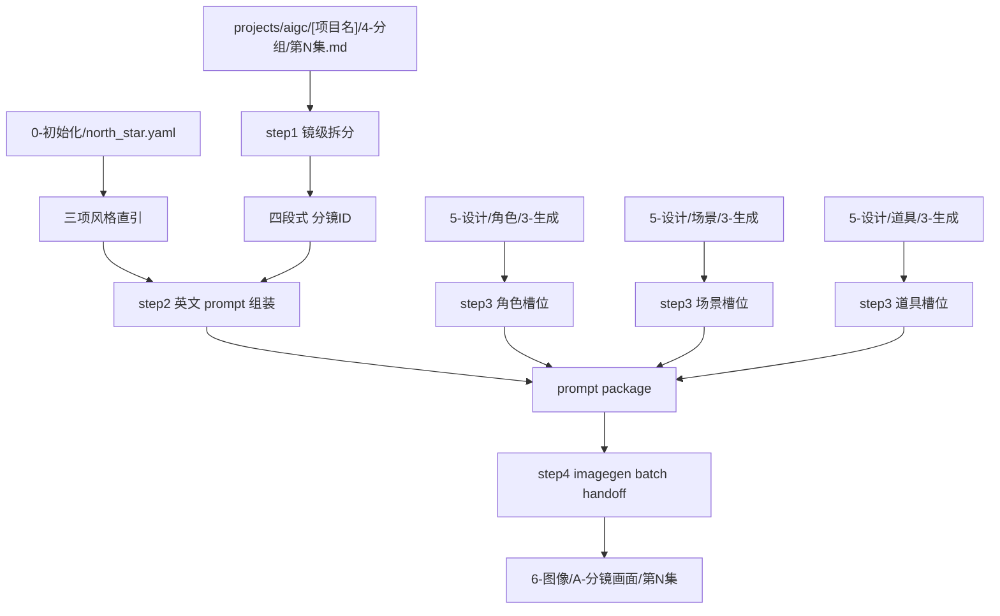
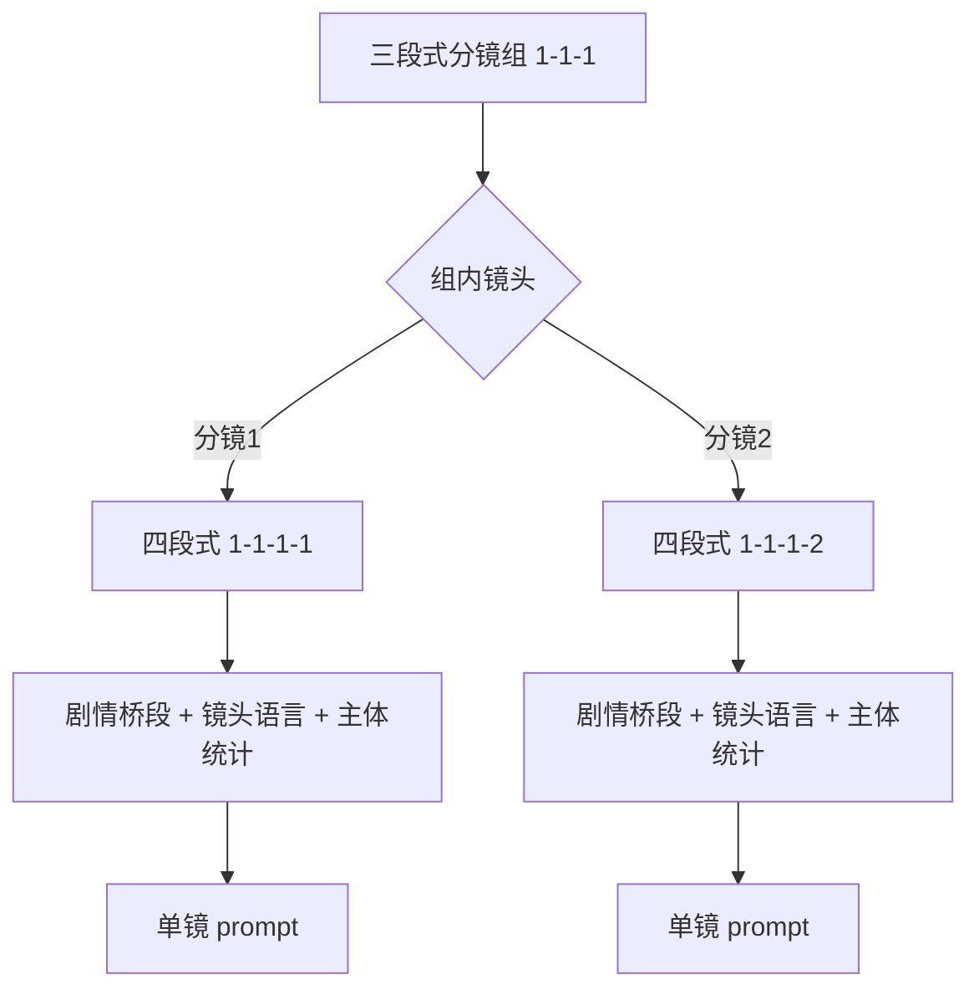
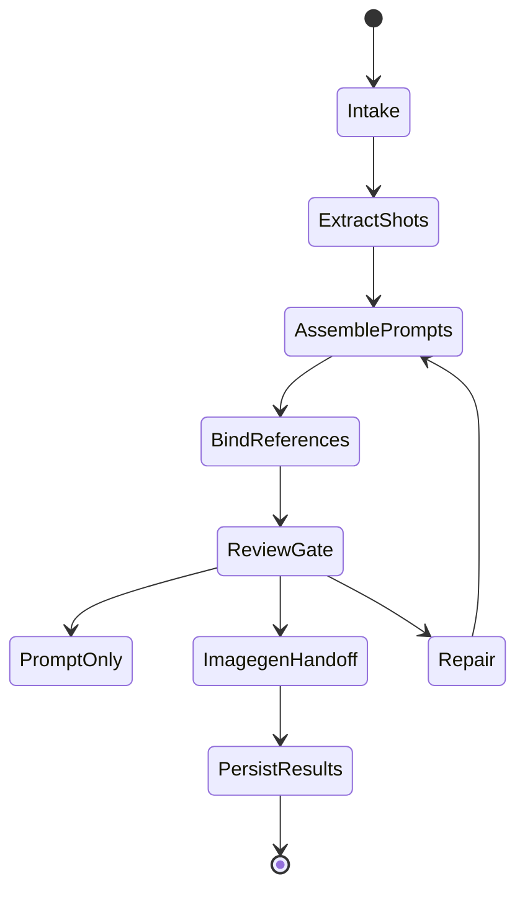

# aigc 6-图像 / A-分镜画面

`A-分镜画面` 负责把 `projects/aigc/<项目名>/4-分组/` 中的分镜组稿拆解到四段式镜级 `分镜ID`，为每个分镜生成英文 AIGC 生图提示词，保守绑定角色、场景、道具参照图，并把通过审查的分镜批量交给 `.agents/skills/cli/imagegen` 执行图像生成。

## Context Loading Contract

- 每次调用 `$aigc-image-storyboard-frame` 时，必须同时加载同目录 `CONTEXT.md`。
- 若任务绑定 `projects/aigc/[项目名]/`，必须先加载项目根 `MEMORY.md`，再加载 `projects/aigc/[项目名]/0-初始化/north_star.yaml` 与项目根 `CONTEXT/` 中和图像阶段相关的上下文。
- `4-分组` 是本技能的主要剧情与镜头真源；不得回到 `3-摄影` 重新改写分组边界，除非用户显式要求修复上游。
- prompt 正文、镜级内容整合、画面表现增量与主体选择必须由 LLM 直接完成；脚本只允许读取、拆分、统计、校验、路径索引和批量执行辅助。
- 冲突优先级：用户显式请求 > 根 `AGENTS.md` / meta 规则 > `.agents/skills/aigc/SKILL.md` > `.agents/skills/aigc/6-图像/SKILL.md` > 本 `SKILL.md` > `references/` / `steps/` / `types/` / `review/` / `templates/` > `.agents/skills/cli/imagegen/SKILL.md` > `agents/openai.yaml` > 项目 `MEMORY.md` > 项目 `CONTEXT/` > 本 `CONTEXT.md`。

## Input Contract

Accepted input:

- 项目名、项目路径、单集或多集范围，要求从 `4-分组` 生成分镜画面提示词或直接生成分镜图。
- 用户指定一个或多个四段式 `分镜ID`，例如 `1-1-1-1`。
- 已有 `6-图像/A-分镜画面/` prompt 稿、参照绑定稿、生成计划或生成结果需要 repair / review / rerun。

Required input:

- 可定位的 `projects/aigc/[项目名]/4-分组/第N集.md`。
- 可定位的 `projects/aigc/[项目名]/0-初始化/north_star.yaml`，且包含 `全局风格.全局风格提示词`、`类型元素.类型元素提示词`、`细分风格.画面风格`。
- 可定位的设计生成目录：`5-设计/角色/3-生成`、`5-设计/场景/3-生成`、`5-设计/道具/3-生成`；目录缺失时允许继续 prompt-only，但必须在报告中说明参照缺口。
- 每个目标分镜必须能从 `4-分组` 中追溯到三段式分镜组 ID 与组内 `分镜N`。

Optional input:

- `prompt_only`：只生成提示词与参照绑定，不执行 imagegen。
- `episode_batch`：一次处理一集。
- `shot_batch`：一次处理多个分镜 ID。
- `imagegen_mode`：默认遵循 `.agents/skills/cli/imagegen` 的内置 `image_gen` 路由；CLI/API fallback 只有用户显式要求时允许。
- 用户指定的 aspect ratio、尺寸、额外禁止项、执行节奏或输出目录。

Reject or clarify when:

- `4-分组` 缺失或目标 `分镜ID` 无法唯一追溯。
- 用户要求改变 `4-分组` 的剧情核心、角色事实、动作结果或镜头顺序。
- 用户要求脚本主创 prompt 正文、自动扩写剧情或用模板拼接替代 LLM 画面判断。
- 任务目标是多格故事板、漫画分镜页或视频首帧连续性，应转入相应故事板、漫画或视频技能。

## Positioning

本技能是 `6-图像` 阶段的镜级单帧入口，向上承接 `4-分组`，向下调用 `.agents/skills/cli/imagegen`。它不拥有 `4-分组` 的剧情改写权，也不拥有 `5-设计` 主体资产的重设计权；它拥有镜级 prompt、参照槽位绑定、批量生图计划和结果回写的裁决权。

## Mode Selection

| mode | 触发信号 | 主要动作 |
| --- | --- | --- |
| `prompt_only` | 只要求提示词、模板或 prompt 包 | 执行 step1-step3，写入 prompt 与 reference manifest |
| `single_shot_generate` | 指定一个四段式 `分镜ID` 且要求出图 | 执行 step1-step4，单镜调用 imagegen |
| `episode_batch_generate` | 指定一集或默认整集批量 | 对该集全部镜级分镜执行 step1-step4，按 imagegen 当前能力顺序或受控批量执行 |
| `shot_batch_generate` | 指定多个 `分镜ID` | 只处理目标分镜集合，保持独立 prompt 与输出 |
| `repair` | prompt 超字数、槽位错绑、图片缺失、生成计划漂移 | 按 `review/review-contract.md` 定位返工节点 |
| `review_only` | 只检查现有输出 | 审查 prompt、参照、imagegen 计划与落盘结果，不生成新图 |

## Reference Loading Guide

| 场景 | 必读文件 |
| --- | --- |
| 从 `4-分组` 提取镜级剧情与桥段 | `references/group-source-extraction.md` |
| 组装英文 prompt、north_star 直引与 2000 字符限制 | `references/prompt-assembly-contract.md` |
| 查找并绑定角色、场景、道具参照图 | `references/reference-slot-binding.md` |
| 调用 `.agents/skills/cli/imagegen` 与批量生成交接 | `references/imagegen-handoff.md` |
| 执行 step1-step4 主流程 | `steps/frame-image-workflow.md` |
| 判定单镜、整集、多镜、修复模式 | `types/type-map.md` |
| 输出审查与返工 | `review/review-contract.md` |
| 输出模板 | `templates/output-template.md`、`templates/frame-prompt-template.md` |
| 脚本辅助边界 | `scripts/README.md` |
| 可复用经验 | `knowledge-base/frame-image-heuristics.md` |
| 产品侧入口元数据 | `agents/openai.yaml` |

## Visual Maps

## Execution Contract

1. 加载本 `SKILL.md + CONTEXT.md`；项目任务中加载 `MEMORY.md`、`north_star.yaml` 与相关项目上下文。
2. 按 `types/type-map.md` 锁定 mode、集号范围、目标 `分镜ID` 集合、是否执行 imagegen。
3. 执行 step1：以 `projects/aigc/<项目名>/4-分组` 为主要信息来源，解析每个 `## x-y-z` 分镜组，把组内 `分镜N` 映射为四段式 `x-y-z-N`，并保留其关联剧情桥段、入场/出场画面、场景、角色、道具和镜头语言。
4. 执行 step2：以每个四段式分镜为单位，LLM 直接生成英文 AIGC 生图提示词。提示词可以补充构图、光影、镜头、材质和画面表现，但不得改变核心内容。每条 prompt 必须在 2000 字符以内，并按模板预留 `Characters:`、`Scene:`、`Props:` 槽位。
5. step2 模板必须包含：`## <分镜ID>`、直引的 `全局风格.全局风格提示词`、直引的 `类型元素.类型元素提示词`、直引的 `细分风格.画面风格`、整合后的英文 prompt。
6. 执行 step3：检查 `5-设计/角色/3-生成`、`5-设计/场景/3-生成`、`5-设计/道具/3-生成` 中是否存在对应主体名称图片；多视图图片优先，缺多视图时用主图，都没有真实图片时该主体槽位保持空或移除，不得猜测引用。
7. 执行 step4：按 `.agents/skills/cli/imagegen` 规范调用图像生成。默认使用内置 `image_gen` 路由，执行节奏按当前工具能力顺序或受控批量处理，不设置后台并行要求；CLI/API fallback 只有用户显式要求时允许。
8. built-in `image_gen` 默认可用 `text_prompt_only` 方式生成并复制到项目 `images/`；本地 reference path 记录在 prompt / manifest / plan 中，但不得宣称已作为视觉输入传给工具。该状态不阻断生成，必须在 results/report 中写 `reference_input_status: not_passed_to_generation_tool` 或等价说明。
9. canonical 输出根路径固定为 `projects/aigc/[项目名]/6-图像/A-分镜画面`；每集可在该根下创建 `第N集/` 子目录组织 prompt、manifest、plan、results、images 与执行报告。
10. 交付前执行 `review/review-contract.md`；prompt 长度、ID 追溯、north_star 直引、参照路径存在性、imagegen 输出持久化必须通过。

## Field Mapping

| field_id | 输出/证据 | 内容要求 | 失败码 |
| --- | --- | --- | --- |
| `FIELD-FRAME-01` | input manifest | 项目根、集号、`4-分组`、north_star、设计生成目录可追溯 | `FAIL-FRAME-INPUT` |
| `FIELD-FRAME-02` | shot index | `x-y-z-N` 四段式 ID 可回指 `## x-y-z` 与组内 `分镜N` | `FAIL-FRAME-ID` |
| `FIELD-FRAME-03` | prompt package | north_star 三项直引、英文整合 prompt、2000 字符内、核心内容未改写 | `FAIL-FRAME-PROMPT` |
| `FIELD-FRAME-04` | reference manifest | Characters / Scene / Props 槽位只含真实存在图片，多视图优先 | `FAIL-FRAME-REF` |
| `FIELD-FRAME-05` | imagegen plan/result | 调用 `.agents/skills/cli/imagegen`，批量计划可复查，输出持久化到项目内 | `FAIL-FRAME-IMAGEGEN` |
| `FIELD-FRAME-06` | execution report | 说明已处理分镜、跳过原因、失败原因、重试入口 | `FAIL-FRAME-REPORT` |

## Field Master

| field_id | owner | canonical file | must contain | fail code |
| --- | --- | --- | --- | --- |
| `FIELD-FRAME-01` | input lock | `第N集-shot-index.json` / report | 项目根、集号、`4-分组`、north_star、设计生成目录 | `FAIL-FRAME-INPUT` |
| `FIELD-FRAME-02` | shot extraction | `第N集-shot-index.json` | 四段式 `x-y-z-N`、源组、源 `分镜N`、桥段摘要 | `FAIL-FRAME-ID` |
| `FIELD-FRAME-03` | prompt authorship | `第N集-分镜画面-prompts.md` | 三项 north_star 直引、英文 prompt、2000 字符内 | `FAIL-FRAME-PROMPT` |
| `FIELD-FRAME-04` | reference binding | `第N集-reference-manifest.json` | 角色/场景/道具真实图片路径，多视图优先 | `FAIL-FRAME-REF` |
| `FIELD-FRAME-05` | imagegen handoff | `第N集-imagegen-plan.json` / `第N集-imagegen-results.json` | 一镜一任务、合法 mode、项目内输出路径 | `FAIL-FRAME-IMAGEGEN` |
| `FIELD-FRAME-06` | convergence | `执行报告.md` | generated / skipped / failed、review verdict、返工入口 | `FAIL-FRAME-REPORT` |

## Thought Pass Map

| pass_id | focus field | core question | action | evidence |
| --- | --- | --- | --- | --- |
| `PASS-FRAME-01` | `FIELD-FRAME-01` | 本轮处理哪个项目、集号和分镜范围 | 锁定 mode、读取项目上下文和 north_star | input manifest |
| `PASS-FRAME-02` | `FIELD-FRAME-02` | 三段式组稿如何拆到四段式镜级 ID | 解析 `## x-y-z` 与组内 `分镜N` | shot index |
| `PASS-FRAME-03` | `FIELD-FRAME-03` | 单镜如何变成可生图英文 prompt | LLM 直出 prompt，填模板并压到 2000 字符内 | prompt markdown |
| `PASS-FRAME-04` | `FIELD-FRAME-04` | 哪些主体有真实本地图片可绑定 | 多视图优先、主图次之、缺图留空 | reference manifest |
| `PASS-FRAME-05` | `FIELD-FRAME-05` | 生成任务如何安全批量执行 | 生成一镜一任务的 imagegen plan 并按需调用 | plan / results |
| `PASS-FRAME-06` | `FIELD-FRAME-06` | 输出如何闭环并可返工 | 汇总审查、失败和跳过原因 | execution report |

## Pass Table

| pass_id | pass standard | fail code | rework entry |
| --- | --- | --- | --- |
| `PASS-FRAME-01` | 必需输入可读，`north_star.yaml` 三项字段存在 | `FAIL-FRAME-INPUT` | `types/type-map.md` |
| `PASS-FRAME-02` | 每个 `shot_id` 唯一且可回指源组和源 `分镜N` | `FAIL-FRAME-ID` | `references/group-source-extraction.md` |
| `PASS-FRAME-03` | prompt 为英文单镜，核心内容未改写，整合 prompt <= 2000 字符 | `FAIL-FRAME-PROMPT` | `references/prompt-assembly-contract.md` |
| `PASS-FRAME-04` | 所有绑定路径存在，且图片选择遵守多视图优先 | `FAIL-FRAME-REF` | `references/reference-slot-binding.md` |
| `PASS-FRAME-05` | imagegen plan 一镜一任务，默认内置路由，输出路径在项目内 | `FAIL-FRAME-IMAGEGEN` | `references/imagegen-handoff.md` |
| `PASS-FRAME-06` | 执行报告记录 verdict、处理范围、失败/跳过与返工入口 | `FAIL-FRAME-REPORT` | `review/review-contract.md` |

## Root-Cause Execution Contract (Mandatory)

出现失败时必须沿链路上溯：

`Symptom -> Direct Cause -> Section Owner -> Source Contract -> AGENTS.md / skill-工作车间`

优先修复：

1. ID 无法追溯：回到 `references/group-source-extraction.md` 与 `steps/frame-image-workflow.md`。
2. prompt 改写剧情或超字数：回到 `references/prompt-assembly-contract.md`。
3. 槽位错绑、路径不存在或猜测引用：回到 `references/reference-slot-binding.md`。
4. imagegen 误用 CLI/API 或输出未持久化：回到 `.agents/skills/cli/imagegen/SKILL.md` 与 `references/imagegen-handoff.md`。
5. 输出格式不一致：回到 `templates/output-template.md`。
6. 同类失败可复用：沉淀到同目录 `CONTEXT.md`，稳定后晋升到本文件或分区规范。

## Output Contract

- Required output: 镜级 prompt 包、参照绑定 manifest、imagegen 执行计划或生成结果、逐集执行报告。
- Output format: Markdown prompt 文档 + JSON manifest / plan / result；生成图片为 PNG/JPEG/WebP 等 bitmap 文件，默认按 imagegen 2K 目标执行。
- Output path: `projects/aigc/[项目名]/6-图像/A-分镜画面`。逐集产物可放在该根路径下的 `第N集/` 子目录；不得写入 `5-Image`、`6-分组`、`7-图像` 或其他平行真源。
- Naming convention: prompt 文档命名 `第N集-分镜画面-prompts.md`；索引命名 `第N集-shot-index.json`；参照清单命名 `第N集-reference-manifest.json`；生成计划命名 `第N集-imagegen-plan.json`；执行报告命名 `执行报告.md`；图片命名 `<分镜ID>.png`，例如 `1-1-1-1.png`。
- Completion gate: 目标分镜均可从 `4-分组` 回指；每条 prompt 含模板要求的三项 north_star 直引和英文整合 prompt；每条英文 prompt 不超过 2000 字符；参照槽位只绑定存在的本地图片且多视图优先；执行 imagegen 时遵循 `.agents/skills/cli/imagegen` 的默认路由与项目持久化门禁；审查结果为 `pass` 或 `pass_with_todo`。
