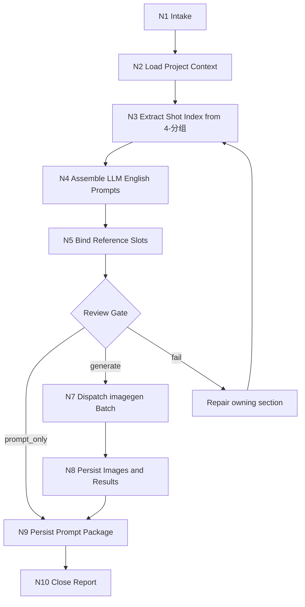

# Frame Image Workflow

本文件承载 `A-分镜画面` 的思行一体化节点。业务拓扑是先串行锁源与组装，再按 imagegen 当前能力逐镜或受控批量生成，最后统一汇流审查。

## Mermaid Workflow

## Thinking-Action Nodes

| node_id | objective | inputs | actions | evidence | route_out | gate |
| --- | --- | --- | --- | --- | --- | --- |
| `N1-INTAKE` | 锁定任务目标、mode、集号和分镜范围 | 用户请求、目标项目 | 判定 `prompt_only` / `single_shot_generate` / `episode_batch_generate` / `shot_batch_generate` / `repair` / `review_only` | mode note | `N2` | 目标范围明确 |
| `N2-CONTEXT` | 加载项目与技能上下文 | `SKILL.md`、`CONTEXT.md`、`MEMORY.md`、`north_star.yaml` | 读取三项 north_star 字段和相关项目上下文 | input manifest | `N3` | 必需文件可读 |
| `N3-SHOT-INDEX` | 从 `4-分组` 建立四段式镜级索引 | `第N集.md` | 解析 `## x-y-z` 与组内 `分镜N`，提取桥段、角色、场景、道具 | `shot-index.json` | `N4` | 每个 ID 唯一可回指 |
| `N4-PROMPT` | 生成英文单镜 prompt | shot index、north_star | LLM 直接生成 prompt，并填充模板 | prompt markdown | `N5` | prompt <= 2000 chars |
| `N5-REF-BIND` | 保守绑定主体参照 | prompt package、5-设计生成目录 | 多视图优先、主图次之、缺图留空 | reference manifest | `N6` | 无猜测路径 |
| `N6-REVIEW` | 执行生成前审查 | prompt、manifest | 检查 ID、直引、字数、路径、mode | review note | `N7` / `N9` / repair | 必需项通过 |
| `N7-IMAGEGEN` | 批量调用 imagegen | imagegen plan | 每镜独立任务，默认顺序或受控批量执行；更高吞吐执行方式必须由工具能力和用户显式要求共同支持 | plan/result json | `N8` | 不覆盖、不越权 |
| `N8-PERSIST` | 持久化生成图像 | generated assets | 保存到项目目录，记录源路径 | images + results | `N9` | 项目内路径存在 |
| `N9-WRITE` | 写业务工件 | prompt、manifest、result | 写 prompt 文档、manifest、plan、report | file list | `N10` | 文件命名正确 |
| `N10-CLOSE` | 汇流交付 | 所有证据 | 总结 generated / skipped / failed 与返工入口 | 执行报告 | done | review verdict `pass` 或 `pass_with_todo` |

## Parallel Boundary

- `N1-N6` 是串行门禁，不应并发绕过。
- `N7` 默认按 `shot_id` 顺序或受控批量执行；每个任务只能写自己的图片和结果记录。
- `N9-N10` 必须统一汇流，避免多个任务同时改写同一个报告文件。
