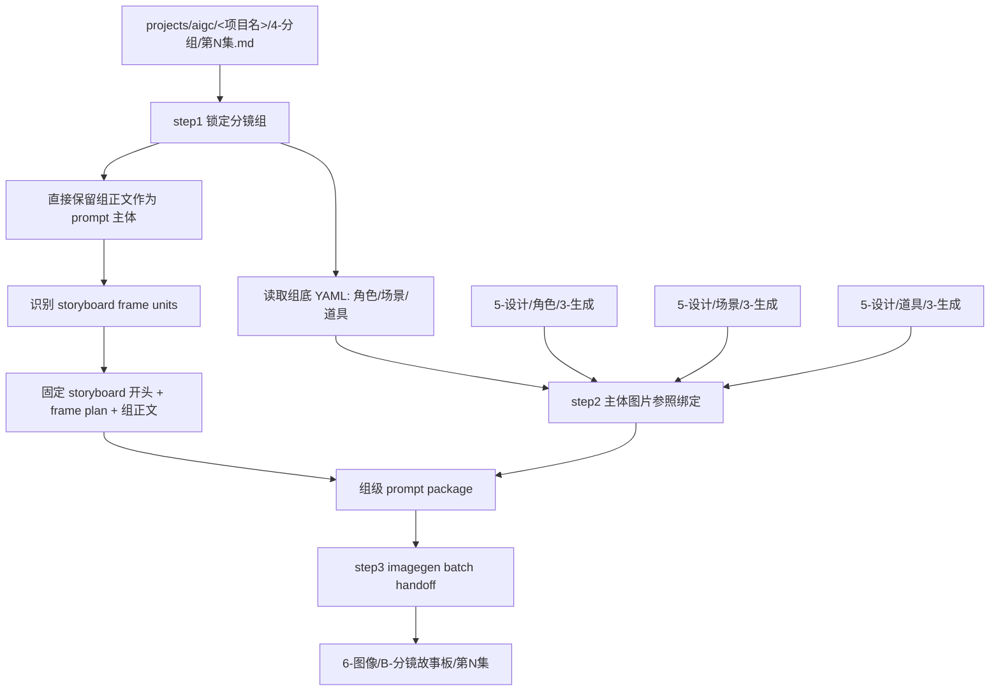
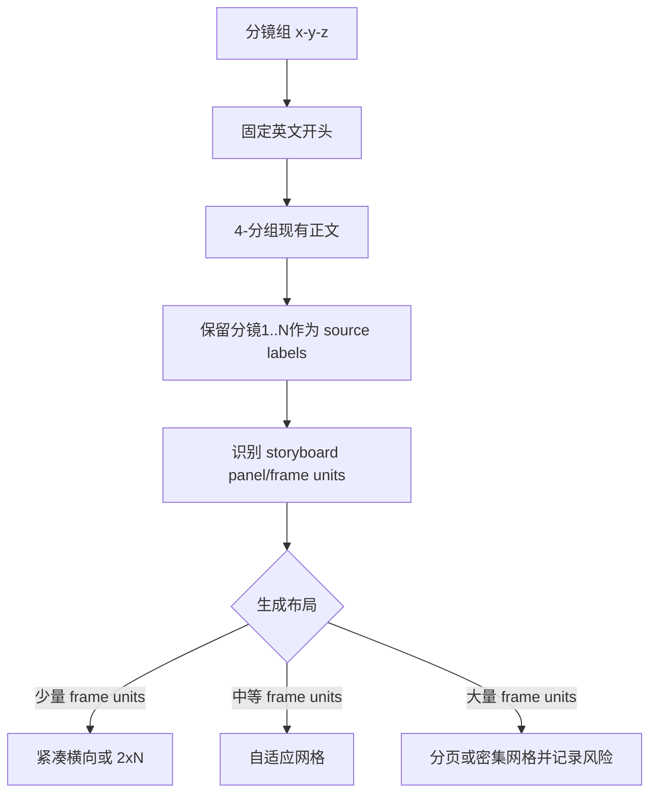
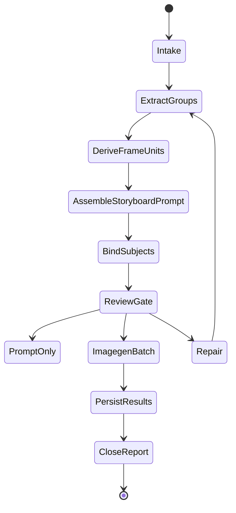

# aigc 6-图像 / B-分镜故事板

`B-分镜故事板` 负责把 `projects/aigc/<项目名>/4-分组/` 中的每个分镜组转为一张组级多格 storyboard：直接使用现有分镜组内容作为生图提示词主体，先根据组正文识别 storyboard panel / frame unit，再按组底 YAML 绑定角色、场景、道具图片参照，并调用 `.agents/skills/cli/imagegen` 以分镜组为单位批量生成图像。

## Context Loading Contract

- 每次调用 `$aigc-image-storyboard-sheet` 时，必须同时加载同目录 `CONTEXT.md`。
- 每次调用本技能时，必须同时识别并加载同目录 `types/` 中选中的类型包（单选或多选）。
- 若任务绑定 `projects/aigc/<项目名>/`，必须先加载项目根 `MEMORY.md`，再加载 `projects/aigc/<项目名>/0-初始化/north_star.yaml` 与项目根 `CONTEXT/` 中和图像阶段相关的上下文。
- `4-分组` 是本技能的主要信息来源；不得回到 `3-摄影` 或更早阶段重写分镜组内容，除非用户显式要求修复上游。
- 分镜故事板 prompt 主体直接采用 `4-分组` 的现有分镜组正文；LLM 只负责裁决提取范围、保真组织、缺口说明和审查，不得扩写或改写剧情事实。
- storyboard panel / frame unit 的落点必须基于当前 `4-分组` 资料来源做识别判断；原文中的 `分镜1`、`分镜2` 仅作为运镜/镜头处理标签和追溯证据，不得默认等同于 storyboard 的第 1 格、第 2 格。
- 主体参照以分镜组底部 YAML 的 `角色 / 场景 / 道具` 为基准；不得用正文泛词、子串或猜测名自动扩展主体列表。
- 场景参照图不仅用于空间/物件位置参照；只要绑定了场景图，生成画面的风格、光影和氛围必须同时向场景参照图对齐，并与项目全局风格共同约束。
- 分镜故事板因为单个 panel 面积较小，生成规格必须固定为 4K；不得沿用 `.agents/skills/cli/imagegen` 或其他通用图像链路的 2K 默认。
- 冲突优先级：用户显式请求 > 根 `AGENTS.md` / meta 规则 > `.agents/skills/aigc/SKILL.md` > `.agents/skills/aigc/6-图像/SKILL.md` > 本 `SKILL.md` > `references/` / `steps/` / `types/` / `review/` / `templates/` > `.agents/skills/cli/imagegen/SKILL.md` > `agents/openai.yaml` > 项目 `MEMORY.md` > 项目 `CONTEXT/` > 本 `CONTEXT.md`。

## Input Contract

Accepted input:

- 项目名、项目路径、单集或多集范围，要求从 `4-分组` 批量生成组级分镜故事板。
- 用户指定一个或多个三段式分镜组 ID，例如 `1-1-1`。
- 已有 `6-图像/B-分镜故事板/` prompt、参照绑定、imagegen 计划或生成结果需要 repair / review / rerun。

Required input:

- 可定位的 `projects/aigc/<项目名>/4-分组/第N集.md`。
- 每个目标分镜组必须有可解析的 `## x-y-z` 标题、组正文和底部 fenced YAML。
- 可定位的设计生成目录：`5-设计/角色/3-生成`、`5-设计/场景/3-生成`、`5-设计/道具/3-生成`；目录缺失时允许 prompt-only 或缺图继续，但必须写入报告；执行 built-in `image_gen` 前，所有已绑定的本地参照图必须先通过 `view_image` 检视进入对话上下文。
- 调用 imagegen 前必须能确定项目内输出目录，默认 `projects/aigc/<项目名>/6-图像/B-分镜故事板/第N集/`。

Optional input:

- `prompt_only`：只生成故事板 prompt 与参照 manifest，不执行 imagegen。
- `episode_batch`：一次处理一集全部分镜组。
- `group_batch`：一次处理多个指定分镜组。
- `imagegen_mode`：默认遵循 `.agents/skills/cli/imagegen` 的内置 `image_gen` 路由；CLI/API fallback 只有用户显式要求时允许。
- 用户指定 aspect ratio、尺寸、额外禁止项、执行节奏、输出目录或 rerun / replace 策略。

Reject or clarify when:

- `4-分组` 缺失、目标分镜组 ID 无法唯一追溯，或组底 YAML 缺失到无法确定主体槽位。
- 用户要求改变 `4-分组` 的剧情核心、镜头顺序、角色事实、动作结果或组边界。
- 用户要求脚本主创 storyboard prompt 正文、自动扩写剧情或用模板补写未知画面。
- 任务目标是单一四段式 `分镜ID` 的单帧图，应转入 `A-分镜画面`。

## Positioning

本技能是 `6-图像` 阶段的组级多格 storyboard 入口，向上承接 `4-分组`，向下调用 `.agents/skills/cli/imagegen`。它拥有组级 prompt 包、主体参照绑定、批量生图计划、生成结果持久化和执行报告的裁决权；它不拥有上游分组改写权，也不拥有主体资产重设计权。

## Mode Selection

| mode | 触发信号 | 主要动作 |
| --- | --- | --- |
| `prompt_only` | 只要求提示词、配置或 prompt 包 | 执行 step1-step2，写 prompt 与 reference manifest |
| `single_group_generate` | 指定一个三段式分镜组 ID 且要求出图 | 执行 step1-step3，单组调用 imagegen |
| `episode_batch_generate` | 指定一集或默认整集批量 | 对该集全部分镜组执行 step1-step3，按 imagegen 当前能力顺序或受控批量执行 |
| `group_batch_generate` | 指定多个分镜组 ID | 只处理目标分镜组集合，保持独立 prompt 与输出 |
| `repair` | prompt 缺组、槽位错绑、图片缺失、生成计划漂移 | 按 `review/review-contract.md` 定位返工节点 |
| `review_only` | 只检查现有输出 | 审查 prompt、参照、imagegen 计划与落盘结果，不生成新图 |

## Reference Loading Guide

| 场景 | 必读文件 |
| --- | --- |
| 从 `4-分组` 提取组级正文与底部 YAML | `references/group-source-extraction.md` |
| 组装多格 storyboard prompt 固定开头与主体正文 | `references/prompt-assembly-contract.md` |
| 查找并绑定角色、场景、道具参照图 | `references/reference-slot-binding.md` |
| 调用 `.agents/skills/cli/imagegen` 与批量生成交接 | `references/imagegen-handoff.md` |
| 执行 step1-step3 主流程 | `steps/storyboard-sheet-workflow.md` |
| 判定单组、整集、多组、修复模式 | `types/type-map.md` |
| 输出审查与返工 | `review/review-contract.md` |
| 输出模板 | `templates/output-template.md`、`templates/storyboard-sheet-prompt-template.md` |
| 脚本辅助边界 | `scripts/README.md` |
| 可复用经验 | `knowledge-base/storyboard-sheet-heuristics.md` |
| 产品侧入口元数据 | `agents/openai.yaml` |

## Visual Maps

## Execution Contract

1. 加载本 `SKILL.md + CONTEXT.md`；项目任务中加载 `MEMORY.md`、`north_star.yaml` 与相关项目上下文。
2. 按 `types/type-map.md` 锁定 mode、集号范围、目标分镜组集合、是否执行 imagegen。
3. 执行 step1：以 `projects/aigc/<项目名>/4-分组` 为主要信息来源，解析每个 `## x-y-z` 分镜组，完整提取组正文和底部 YAML；`## x-y-z~x-y-z` 组间连接件默认忽略，不进入 storyboard prompt、YAML 主体基准、shot_count 或生图任务；prompt 主体直接使用现有组内容，不进行剧情改写。
4. 执行 frame-unit 识别：从 `group_body` 的风格句、动作画面、分镜明细、运镜/构图信息和关键视觉变化中判断 storyboard panel / frame unit；`source_shot_labels` 仅作为追溯字段，允许一个 `分镜N` 拆成多个 frame unit，也允许多个 `分镜N` 合并为一个 frame unit，但每个 frame unit 必须能回指源正文片段，不能补写上游没有的剧情动作。
5. step1 组装 prompt 时必须添加固定开头：`Create a multi-panel storyboard based on the following grouped shot source. Derive storyboard panels from the visual beats in the group source; do not force a one-to-one mapping from original shot labels to panels. Render the final storyboard at 4K resolution so each panel remains clear and readable. Add the storyboard panel sequence number in the bottom-left corner of each panel (no other text). Auto-adapt the panel layout grid based on the total number of storyboard panels. Match the generated image style, lighting, and atmosphere to the bound scene reference image whenever a scene reference is provided.`
6. 执行 step2：读取每个分镜组底部 YAML 的 `角色 / 场景 / 道具`，检查 `projects/aigc/<项目名>/5-设计/角色/3-生成`、`5-设计/场景/3-生成`、`5-设计/道具/3-生成` 中是否存在对应主体名称图片；多视图优先，没有多视图就主图，都没有就空着并从参照槽位移除。若绑定场景图，manifest 必须记录 `scene_visual_anchor: style_lighting_atmosphere`。
7. 执行 step3 前，若 reference manifest 中存在本地参照图路径，必须逐张调用 `view_image` 检视，并按 `character reference / scene reference / prop reference` 标注角色；场景图必须额外标注为 `style_lighting_atmosphere_reference`，使图片进入对话上下文后再继续 imagegen handoff；未完成检视的本地参照不得宣称已作为视觉参照使用。
8. 执行 step3：按 `.agents/skills/cli/imagegen` 规范调用图像生成。每个分镜组是一个独立任务，prompt 必须包含完整分镜故事板信息、storyboard frame-unit plan、`resolution_target: 4K` 和已绑定的角色、场景、道具参照；默认使用内置 `image_gen` 路由，执行节奏按当前工具能力顺序或受控批量处理，不设置后台并行要求。生成计划与结果必须记录 `reference_input_status: visible_in_conversation_context`；确无可绑定图片时记录 `no_reference_images_bound`，而不是伪造参照。
9. 生成时可根据每个分镜组的 `storyboard_frame_units` 数量灵活布局，但必须确保组内关键视觉节拍都进入 storyboard；若 frame unit 数量过多导致单图完整性风险，应在计划中标记分页或人工确认策略。
10. 每个分镜组的 canonical 输出写入 `projects/aigc/<项目名>/6-图像/B-分镜故事板/第N集/`，并生成执行报告。
11. 交付前执行 `review/review-contract.md`；组 ID 追溯、固定开头、组正文完整性、frame-unit 可追溯性、YAML 主体基准、场景参照风格/光影/氛围对齐、参照路径存在性、imagegen 输出持久化必须通过。

## Field Mapping

| field_id | 输出/证据 | 内容要求 | 失败码 |
| --- | --- | --- | --- |
| `FIELD-SHEET-01` | input manifest | 项目根、集号、`4-分组`、设计生成目录可追溯 | `FAIL-SHEET-INPUT` |
| `FIELD-SHEET-02` | group index | 三段式 `x-y-z` 可回指 `## x-y-z`，组正文、YAML、source shot labels 和 storyboard frame units 被完整提取/识别 | `FAIL-SHEET-GROUP` |
| `FIELD-SHEET-03` | prompt package | 固定英文开头 + frame-unit plan + 现有组内容主体，保留源分镜顺序和 frame-unit 可追溯性 | `FAIL-SHEET-PROMPT` |
| `FIELD-SHEET-04` | reference manifest | Characters / Scene / Props 只来自组底 YAML，且只绑定真实图片，多视图优先；场景图记录风格/光影/氛围锚定；记录本地参照图 `view_image` 检视状态 | `FAIL-SHEET-REF` |
| `FIELD-SHEET-05` | imagegen plan/result | 一组一任务，调用 `.agents/skills/cli/imagegen`，`resolution_target: 4K`，参照图已进入对话上下文，场景参照图承担风格/光影/氛围约束，按当前工具能力执行，输出持久化到项目内 | `FAIL-SHEET-IMAGEGEN` |
| `FIELD-SHEET-06` | execution report | 说明 generated / skipped / failed、缺图、分页或完整性风险 | `FAIL-SHEET-REPORT` |

## Field Master

| field_id | owner | canonical file | must contain | fail code |
| --- | --- | --- | --- | --- |
| `FIELD-SHEET-01` | input lock | `第N集-group-index.json` / report | 项目根、集号、`4-分组`、设计生成目录 | `FAIL-SHEET-INPUT` |
| `FIELD-SHEET-02` | group extraction + frame-unit derivation | `第N集-group-index.json` | `group_id`、source heading、shot count、source shot labels、storyboard frame units、YAML subjects | `FAIL-SHEET-GROUP` |
| `FIELD-SHEET-03` | prompt assembly | `第N集-分镜故事板-prompts.md` | 固定开头、frame-unit plan、组正文主体、完整源分镜顺序 | `FAIL-SHEET-PROMPT` |
| `FIELD-SHEET-04` | reference binding | `第N集-reference-manifest.json` | 角色/场景/道具真实图片路径，多视图优先，场景视觉锚定，`view_image` 检视状态 | `FAIL-SHEET-REF` |
| `FIELD-SHEET-05` | imagegen handoff | `第N集-imagegen-plan.json` / `第N集-imagegen-results.json` | 一组一任务、合法 mode、4K 分辨率目标、参照上下文状态、场景风格/光影/氛围约束、项目内输出路径 | `FAIL-SHEET-IMAGEGEN` |
| `FIELD-SHEET-06` | convergence | `执行报告.md` | generated / skipped / failed、review verdict、返工入口 | `FAIL-SHEET-REPORT` |

## Thought Pass Map

| pass_id | focus field | core question | action | evidence |
| --- | --- | --- | --- | --- |
| `PASS-SHEET-01` | `FIELD-SHEET-01` | 本轮处理哪个项目、集号和分镜组范围 | 锁定 mode、读取项目上下文 | input manifest |
| `PASS-SHEET-02` | `FIELD-SHEET-02` | 如何从 `4-分组` 保真提取组正文、YAML，并识别 storyboard frame units | 解析 `## x-y-z`、fenced YAML、source shot labels 与 frame-unit plan | group index |
| `PASS-SHEET-03` | `FIELD-SHEET-03` | 如何保证 prompt 是多格 storyboard 且 panel 不被误当成原分镜编号 | 添加固定开头，插入 frame-unit plan，直接接组正文主体 | prompt markdown |
| `PASS-SHEET-04` | `FIELD-SHEET-04` | 哪些 YAML 主体有真实本地图片可绑定并进入上下文；场景参照是否承担视觉风格锚定 | 多视图优先、主图次之、缺图移除槽位；场景图记录 style/lighting/atmosphere；已绑定本地图先 `view_image` | reference manifest |
| `PASS-SHEET-05` | `FIELD-SHEET-05` | 生成任务如何按组安全执行、保持场景参照风格一致，并确保 panel 清晰度 | 生成一组一任务 4K imagegen plan，确认参照图上下文状态与场景视觉约束并按需调用 | plan / results |
| `PASS-SHEET-06` | `FIELD-SHEET-06` | 输出如何闭环并可返工 | 汇总审查、失败和跳过原因 | execution report |

## Pass Table

| pass_id | pass standard | fail code | rework entry |
| --- | --- | --- | --- |
| `PASS-SHEET-01` | 必需输入可读，设计生成目录状态已记录 | `FAIL-SHEET-INPUT` | `types/type-map.md` |
| `PASS-SHEET-02` | 每个 `group_id` 唯一且可回指源标题、组正文、YAML；storyboard frame units 可回指源正文且不默认等同 `分镜N` | `FAIL-SHEET-GROUP` | `references/group-source-extraction.md` |
| `PASS-SHEET-03` | prompt 以固定开头起笔，包含 frame-unit plan，现有组内容作为主体，源镜头未缺失乱序 | `FAIL-SHEET-PROMPT` | `references/prompt-assembly-contract.md` |
| `PASS-SHEET-04` | 所有绑定路径存在，图片选择遵守 YAML 基准和多视图优先；场景图记录风格/光影/氛围锚定；已绑定本地图片在生成前完成 `view_image` 检视 | `FAIL-SHEET-REF` | `references/reference-slot-binding.md` |
| `PASS-SHEET-05` | imagegen plan 一组一任务，默认内置路由，`resolution_target` 固定为 `4K`，记录参照图上下文状态与场景视觉约束，输出路径在项目内 | `FAIL-SHEET-IMAGEGEN` | `references/imagegen-handoff.md` |
| `PASS-SHEET-06` | 执行报告记录 verdict、处理范围、失败/跳过与返工入口 | `FAIL-SHEET-REPORT` | `review/review-contract.md` |

## Root-Cause Execution Contract (Mandatory)

出现失败时必须沿链路上溯：

`Symptom -> Direct Cause -> Section Owner -> Source Contract -> AGENTS.md / skill-工作车间`

优先修复：

1. 组无法追溯或 YAML 解析失败：回到 `references/group-source-extraction.md` 与 `steps/storyboard-sheet-workflow.md`。
2. prompt 固定开头漂移、frame-unit plan 缺失、缺镜头或改写组正文：回到 `references/prompt-assembly-contract.md`。
3. 槽位错绑、路径不存在、猜测引用或没有多视图优先：回到 `references/reference-slot-binding.md`。
4. storyboard panel 被硬性等同为原文 `分镜1..N`，或场景参照图没有承担风格/光影/氛围锚定：回到 `references/group-source-extraction.md`、`references/prompt-assembly-contract.md` 与 `references/reference-slot-binding.md`。
5. imagegen 误用 CLI/API、本地参照图未先 `view_image` 入上下文、未按 4K 出图、执行节奏越权、写位冲突或输出未持久化：回到 `.agents/skills/cli/imagegen/SKILL.md` 与 `references/imagegen-handoff.md`。
6. 输出格式不一致：回到 `templates/output-template.md`。
7. 同类失败可复用：沉淀到同目录 `CONTEXT.md`，稳定后晋升到本文件或分区规范。

## Output Contract

- Required output: 组级 storyboard prompt 包、参照绑定 manifest、imagegen 执行计划或生成结果、逐集执行报告。
- Output format: Markdown prompt 文档 + JSON manifest / plan / result；生成图片为 PNG/JPEG/WebP 等 bitmap 文件，默认且强制按 4K 目标执行。
- Output path: `projects/aigc/<项目名>/6-图像/B-分镜故事板/第N集/`，其中 prompt 文档、manifest、plan、结果报告与生成图片均在该集目录或其 `images/` 子目录下。
- Naming convention: prompt 文档命名 `第N集-分镜故事板-prompts.md`；索引命名 `第N集-group-index.json`；参照清单命名 `第N集-reference-manifest.json`；生成计划命名 `第N集-imagegen-plan.json`；执行报告命名 `执行报告.md`；图片命名 `<分镜组ID>.png`，例如 `1-1-1.png`。
- Completion gate: 目标分镜组均可从 `4-分组` 回指；每条 prompt 以固定英文开头起笔，包含可追溯的 storyboard frame-unit plan，并完整保留组正文主体；参照槽位只绑定存在的本地图片且多视图优先；绑定场景图时，生成风格、光影和氛围必须与场景参照图一致；执行 built-in `image_gen` 前已绑定本地参照图必须先 `view_image` 进入对话上下文；执行 imagegen 时遵循 `.agents/skills/cli/imagegen` 的默认路由与项目持久化门禁，且 `resolution_target` 必须为 `4K`；审查结果为 `pass` 或 `pass_with_todo`。
