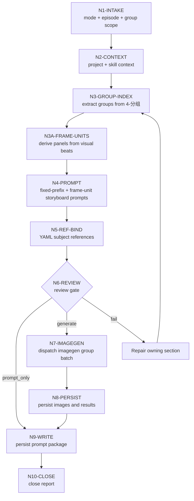

# Storyboard Sheet Workflow

本文件承载 `B-分镜故事板` 的思行一体化节点。业务拓扑是先串行锁源、识别 storyboard frame units、组装 prompt 和绑定主体，再按 imagegen 当前能力逐组或受控批量生成，最后统一汇流审查。

## Mermaid Workflow

## Thinking-Action Nodes

| node_id | objective | inputs | actions | evidence | route_out | gate |
| --- | --- | --- | --- | --- | --- | --- |
| `N1-INTAKE` | 锁定任务目标、mode、集号和分镜组范围 | 用户请求、目标项目 | 判定 `prompt_only` / `single_group_generate` / `episode_batch_generate` / `group_batch_generate` / `repair` / `review_only` | mode note | `N2` | 目标范围明确 |
| `N2-CONTEXT` | 加载项目与技能上下文 | `SKILL.md`、`CONTEXT.md`、`MEMORY.md`、`north_star.yaml` | 读取项目偏好与图像阶段上下文 | input manifest | `N3` | 必需文件可读 |
| `N3-GROUP-INDEX` | 从 `4-分组` 建立组级索引 | `第N集.md` | 解析 `## x-y-z`、组正文、底部 YAML、source shot labels 和分镜数量 | `group-index.json` | `N3A` | 每个 ID 唯一可回指 |
| `N3A-FRAME-UNITS` | 从当前分组资料识别 storyboard panel 落点 | group index | 基于视觉节拍识别 frame units；记录 `panel_no`、`source_shot_labels`、`source_span`、`mapping_type`；不默认等同 `分镜N` | `group-index.json` | `N4` | 每个 frame unit 可回指源正文 |
| `N4-PROMPT` | 生成组级 storyboard prompt | group index + frame units | 添加固定英文开头，写入 frame-unit plan，直接接入现有组正文主体 | prompt markdown | `N5` | 固定开头、frame-unit 与完整性通过 |
| `N5-REF-BIND` | 保守绑定 YAML 主体参照 | prompt package、5-设计生成目录 | 多视图优先、主图次之、缺图移除槽位；为每个已绑定本地图记录 `context_role`；场景图额外记录风格/光影/氛围锚定 | reference manifest | `N6` | 无猜测路径，场景视觉锚定已记录 |
| `N6-REVIEW` | 执行生成前审查 | prompt、manifest | 检查 ID、固定开头、frame units、组正文、路径、mode、场景视觉锚定；生成模式下逐张 `view_image` 已绑定本地参照图并记录上下文状态 | review note | `N7` / `N9` / repair | 必需项通过，参照图已可见 |
| `N7-IMAGEGEN` | 批量调用 imagegen | imagegen plan | 每组独立任务，使用已进入上下文的参照图；场景图作为风格/光影/氛围参照；默认顺序或受控批量执行 | plan/result json | `N8` | 不覆盖、不越权 |
| `N8-PERSIST` | 持久化生成图像 | generated assets | 保存到项目目录，记录源路径 | images + results | `N9` | 项目内路径存在 |
| `N9-WRITE` | 写业务工件 | prompt、manifest、result | 写 prompt 文档、manifest、plan、report | file list | `N10` | 文件命名正确 |
| `N10-CLOSE` | 汇流交付 | 所有证据 | 总结 generated / skipped / failed 与返工入口 | 执行报告 | done | review verdict `pass` 或 `pass_with_todo` |

## Parallel Boundary

- `N1-N6` 是串行门禁，不应并发绕过；其中 `N3A` 必须由 LLM 判断 frame units，脚本只能辅助投影、校验和落盘。
- `N7` 默认按 `group_id` 顺序或受控批量执行；每个任务只能写自己的图片和结果记录。
- `N9-N10` 必须统一汇流，避免多个任务同时改写同一个报告文件。
