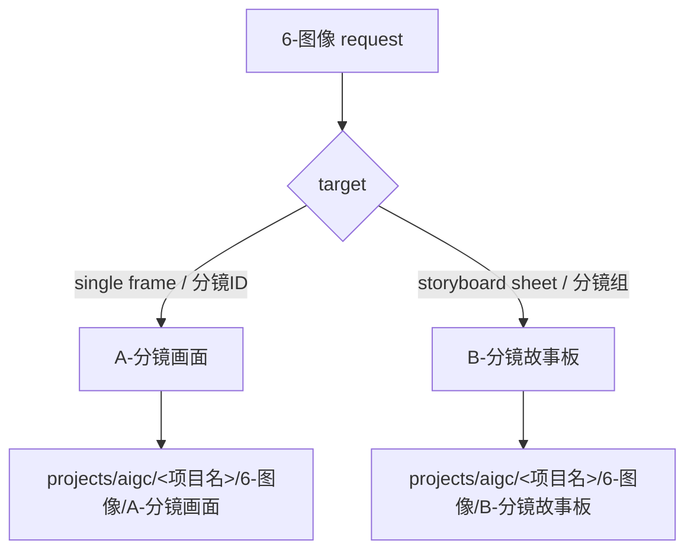

# aigc 6-图像

`6-图像` 是 AIGC 项目的图像阶段父级入口。它负责把来自 `4-分组` 与 `5-设计` 的信息路由到叶子技能，不直接主创 prompt 正文，也不直接替代 `.agents/skills/cli/imagegen` 生成图像。

## Context Loading Contract

- 每次调用 `$aigc-image-stage` 时，必须同时加载同目录 `CONTEXT.md`。
- 每次调用本技能时，必须同时加载同目录 `CONTEXT.md`。
- 若任务绑定 `projects/aigc/<项目名>/`，必须先加载项目根 `MEMORY.md`、`0-初始化/north_star.yaml`，再按需加载项目 `CONTEXT/`。
- prompt 正文、画面裁决与主体选择由叶子技能中的 LLM 主创完成；父级只裁决路由和阶段边界。

## Multi-Subskill Continuous Workflow

当本主技能包被整体调用时，视为用户已授权按本级声明的同级子技能包自动完成整个技能组任务；在满足本技能必要输入、显式选择和安全门后，不再为“是否继续下一步”额外确认。

- 无序号同级子技能包默认全选并发执行，由本父级汇总、裁决和写回唯一 canonical 输出。
- 数字序号子技能包或节点（如 `1-`、`2-`、`3-`）默认按数字升序串行执行，前一节点产物自动作为后一节点输入。
- 英文序号子技能包或路线（如 `A-分镜画面`、`B-分镜故事板`）默认按用户意图、父级路由或输入类型单选分流；只有用户明确要求对比、并跑或批量多路线时才多选。
- 连续调度不得绕过本技能的阻断门：缺少必需输入、图像目标无法唯一判断、叶子技能缺失或路线歧义会造成错误 canonical 写回时，必须先停下并给出最小澄清或阻断报告。
- 每个被调度的叶子包仍必须加载自身 `SKILL.md + CONTEXT.md`；脚本只能承担机械辅助，不得替代 LLM 图像 prompt 主创或父级最终裁决。

## Input Contract

Accepted input:

- 用户命中 `6-图像`、分镜画面、生图提示词、AIGC 生图、分镜故事板或图像阶段批量生成。
- 来自 `projects/aigc/<项目名>/4-分组/` 的分镜组稿。
- 来自 `projects/aigc/<项目名>/5-设计/*/3-生成` 的主体生成资产。

Required input:

- 项目名或项目根。
- 可读的上游分镜、主体资产或已有图像阶段工件。

Reject or clarify when:

- 任务实际是视频首帧、视频参照或运动提示词，应转入 `7-视频` 或对应视频技能。
- 用户要求父级脚本替代叶子技能生成 prompt 正文。

## Mode Selection

| mode | trigger | route |
| --- | --- | --- |
| `frame_image` | 单镜、四段式 `分镜ID`、分镜画面、AIGC 生图 prompt | `A-分镜画面/SKILL.md` |
| `storyboard_sheet` | 分镜故事板、多格 storyboard、组级画面板 | `B-分镜故事板/SKILL.md` |
| `repair` | 图像阶段工件漂移 | 先定位叶子技能，再执行 repair |

## Reference Loading Guide

| 场景 | 读取文件 |
| --- | --- |
| 单镜分镜画面、生图 prompt、主体参照绑定、批量 imagegen | `A-分镜画面/SKILL.md` + `A-分镜画面/CONTEXT.md` |
| 分镜故事板或组级多格画面 | `B-分镜故事板/SKILL.md` + `B-分镜故事板/CONTEXT.md`，若该叶子缺失则报告未配置 |

## Visual Maps

## Execution Contract

1. 读取本 `SKILL.md + CONTEXT.md`，锁定项目根和任务类型。
2. 若目标是镜级单帧，进入 `A-分镜画面/SKILL.md`。
3. 若目标是组级故事板，进入 `B-分镜故事板/SKILL.md`；若 B 叶子尚未配置，报告缺口，不伪造输出。
4. 父级不直接写镜级 prompt、不直接生成图片、不改写 `4-分组`。

## Field Mapping

| field_id | owner | must_contain |
| --- | --- | --- |
| `IMG-STAGE-01` | 父级路由 | 项目根、任务类型、目标叶子 |
| `IMG-STAGE-02` | 目标叶子 | 叶子 `SKILL.md + CONTEXT.md` 加载证据 |
| `IMG-STAGE-03` | 边界 | 父级不替代 prompt 主创或 imagegen 执行 |

## Field Master

| field_id | owner | must contain | fail code |
| --- | --- | --- | --- |
| `FIELD-IMG-STAGE-01` | route lock | 项目根、任务类型、目标叶子 | `FAIL-IMG-STAGE-ROUTE` |
| `FIELD-IMG-STAGE-02` | leaf handoff | 进入叶子技能并加载其 `SKILL.md + CONTEXT.md` | `FAIL-IMG-STAGE-HANDOFF` |
| `FIELD-IMG-STAGE-03` | boundary | 父级不替代 prompt 主创或 imagegen 执行 | `FAIL-IMG-STAGE-BOUNDARY` |

## Thought Pass Map

| pass_id | focus field | action | evidence |
| --- | --- | --- | --- |
| `PASS-IMG-STAGE-01` | `FIELD-IMG-STAGE-01` | 判定 frame / storyboard / repair | route note |
| `PASS-IMG-STAGE-02` | `FIELD-IMG-STAGE-02` | 加载目标叶子技能 | loaded skill pair |
| `PASS-IMG-STAGE-03` | `FIELD-IMG-STAGE-03` | 检查父级没有越权主创 | closeout note |

## Pass Table

| pass_id | pass standard | fail code | rework entry |
| --- | --- | --- | --- |
| `PASS-IMG-STAGE-01` | 目标叶子唯一 | `FAIL-IMG-STAGE-ROUTE` | Mode Selection |
| `PASS-IMG-STAGE-02` | 叶子 `SKILL.md + CONTEXT.md` 可读 | `FAIL-IMG-STAGE-HANDOFF` | Reference Loading Guide |
| `PASS-IMG-STAGE-03` | 父级只路由不主创 | `FAIL-IMG-STAGE-BOUNDARY` | Execution Contract |

## Root-Cause Execution Contract (Mandatory)

失败链路：

`Symptom -> Direct Cause -> Parent Route Owner -> Leaf Skill Contract -> AGENTS.md / skill-工作车间`

## Output Contract

- Required output: 路由到唯一叶子技能，或报告叶子缺失/未配置。
- Output format: 路由说明或叶子技能产物。
- Output path: 父级不直接落业务产物；`A-分镜画面` 叶子技能固定写入 `projects/aigc/<项目名>/6-图像/A-分镜画面`。
- Naming convention: 叶子技能自定命名；父级不创建平行真源。
- Completion gate: 目标叶子明确且已加载；若叶子缺失，明确报告缺口。
