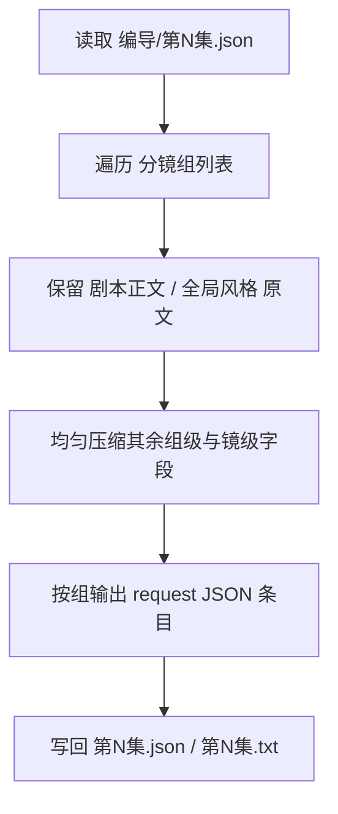
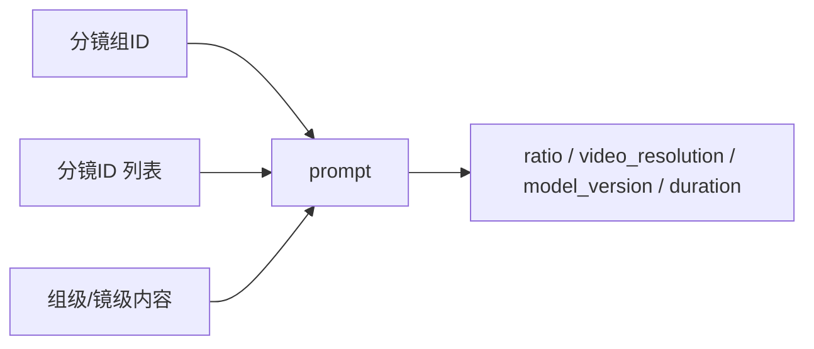

# 6-视频 / 全能参照

## 概述

`全能参照` 是 `6-视频` 阶段当前首个可执行叶子子技能，负责当前仓的主体参照型视频请求整理。

当前子技能名描述的是“参照组织能力”，输出结构可对齐 `seedance2.0` 系列视频请求格式。
当前加载路径固定为 `.agents/skills/aigc/6-视频/subtypes/1-提示词蒸馏/全能参照/`。

它负责把 `projects/<项目名>/编导/第N集.json` 中 **分镜组维度下的全部内容** 蒸馏为通用视频 API / 即梦 CLI 可消费的 **组级请求 JSON**，并同步产出便于人工审阅的文本视图。

当前设计重点不是提交视频任务，而是先把每个分镜组整理成：

1. `reference_images` 预留位
2. 符合即梦风格字段的 `prompt`
3. 独立的 `model` 区块，承载留空的模型参数骨架与图片标记
4. 对应同集 `txt` 阅读视图，承载提示词正文与字数统计

其中：

- 上游默认路径固定为 `projects/<项目名>/编导/第N集.json`
- shared schema 固定为 `.agents/skills/aigc/_shared/director_episode_output.schema.json`
- 参照图信息当前统一留空，不在本子技能中处理
- 每个分镜组的 `prompt` 目标字数为 `1800-2000` 中文字符

## When to Use

- 需要把导演 JSON 的分镜组内容改写成视频工具入参 JSON。
- 需要输出 `第N集.json + 第N集.txt` 双文件结果。
- 需要输出 `meta + prompt_style + model + prompt + prompt_char_count` 结构化视频请求 JSON。
- 需要遵守“`剧本正文` / `全局风格` 原文不变，其余字段压缩蒸馏”的硬规则。
- 需要为后续 `.agents/skills/cli/dreamina-cli/SKILL.md` 提供 `multimodal2video` 风格输入对象。

## When Not to Use

- 需要真正提交 `dreamina multimodal2video` 命令或轮询任务结果。
- 当前任务是单帧或首尾帧参照，而不是分镜组整体蒸馏。
- 上游 `编导/第N集.json` 还没形成合法 `分镜组列表`。

## 子技能边界

### `全能参照` 拥有

- 分镜组 -> 视频请求条目的一对一转换合同
- 1800-2000 字 prompt 蒸馏规则
- 字段隐藏与保留规则
- 对 `6-视频/_shared` 共享视频入参模板的局部填充规则

### `全能参照` 不拥有

- 实际上传参照图
- 真实视频模型提交
- 重新改写上游导演事实

## Visual Maps

## Canonical Module References

| 模块 | 作用 | 真源文件 |
| --- | --- | --- |
| 思维链 | 承载字段主表、判断链与返工入口 | `references/chain-of-thought.md` |
| 执行流程 | 承载输入、落点与手动生成步骤 | `references/execution-flow.md` |
| 类型策略 | 承载字数压力、字段压缩与回退规则 | `references/type-strategies.md` |
| 输出契约 | 承载 JSON 结构、prompt 规则与模板路径 | `references/output-template.md` |

## Execution Summary

- 每个 `分镜组` 只生成 1 条视频请求对象。
- `prompt` 的原始信息来源必须覆盖该分镜组内的全部组级与镜级内容。
- `剧本正文` 与 `组间设计.全局风格` 必须原文保留，不允许改写或净化。
- `prompt_style` 独立承载类型、语言和提示词字数限制。
- `prompt_char_count` 位于顶层，用于字数验收而不是远端提交。
- `model.reference_images` 保留实际上传顺序位。
- `model.image_markers` 承担图片 URL、关联主体和 `图1/图2/...` 顺序标记。
- 同集还要额外产出 `第N集.txt`，用于按共享文本模板直出提示词与字数统计。
- `第N集.txt` 只是 derived display view，不是 canonical completeness carrier；完整性与下游消费能力以 `第N集.json` 为准。
- 详细 workflow、落点与 handoff 见 `references/execution-flow.md`。

## Output Summary

- canonical 主产物：`projects/<项目名>/视频/全能参照/第N集/第N集.json`
- canonical 文本视图：`projects/<项目名>/视频/全能参照/第N集/第N集.txt`
- 辅助文件：`projects/<项目名>/视频/全能参照/第N集/_manifest.json`
- 共享模板真源：`.agents/skills/aigc/6-视频/_shared/video-generation-input.template.json`
- 共享文本模板真源：`.agents/skills/aigc/6-视频/_shared/视频生成入参.template.txt`
- 详细 JSON 结构与 prompt 编排规则见 `references/output-template.md`

## Strategy Summary

- 固定保留：`剧本正文`、`全局风格`
- 均匀压缩：`类型元素`、`导演意图` 与全部镜级字段
- 字段标题隐藏：除 `分镜组ID` 和 `分镜ID` 之外，其余字段名不显式出现
- 详细变量、情况判定与 fallback 见 `references/type-strategies.md`

## Field System Summary

- 字段体系保持 `FIELD-VID-SUBJ-01` 到 `FIELD-VID-SUBJ-04`
- 详细字段表、thought pass 与 pass table 见 `references/chain-of-thought.md`

## Root-Cause Execution Contract (Mandatory)

当出现以下症状时，必须先修本子技能合同：

- prompt 没覆盖整个分镜组，只摘了几句局部文案
- `剧本正文` 或 `全局风格` 被二次改写
- prompt 里仍然残留 `场景及方位:` 这类字段标题
- 压缩过猛只剩碎片，或压缩过松超过预算很多
- `reference_images` 被删掉或被擅自填入虚构 URL

必经链路：

`Symptom -> Direct Technical Cause -> Rule Source -> Meta Rule Source -> Fix Landing Points`

优先检查：

- `Rule Source`
  - `.agents/skills/aigc/6-视频/subtypes/1-提示词蒸馏/全能参照/SKILL.md`
  - `.agents/skills/aigc/6-视频/subtypes/1-提示词蒸馏/全能参照/CONTEXT.md`
- `Meta Rule Source`
  - `.agents/skills/aigc/6-视频/SKILL.md`
  - `.agents/skills/aigc/SKILL.md`
  - 根 `AGENTS.md`

## Context Preload (Mandatory)

- 执行前先加载 `.agents/skills/aigc/6-视频/SKILL.md + CONTEXT.md`。
- 再加载本 `SKILL.md + CONTEXT.md`。
- 建议同时读取 `references/*.md`、`.agents/skills/aigc/6-视频/_shared/video-generation-input.template.json` 与 `.agents/skills/aigc/6-视频/_shared/视频生成入参.template.txt`。
- 优先级遵循：用户显式请求 > 根 `AGENTS.md` > `.agents/skills/aigc/SKILL.md` > `.agents/skills/aigc/6-视频/SKILL.md` > 本 `SKILL.md` > 各级 `CONTEXT.md`。
