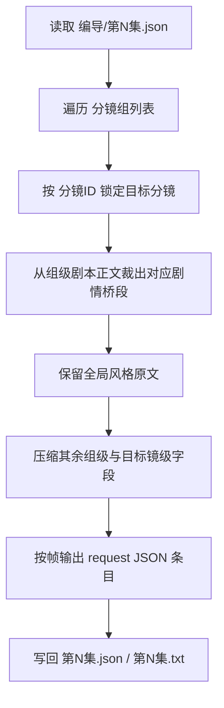
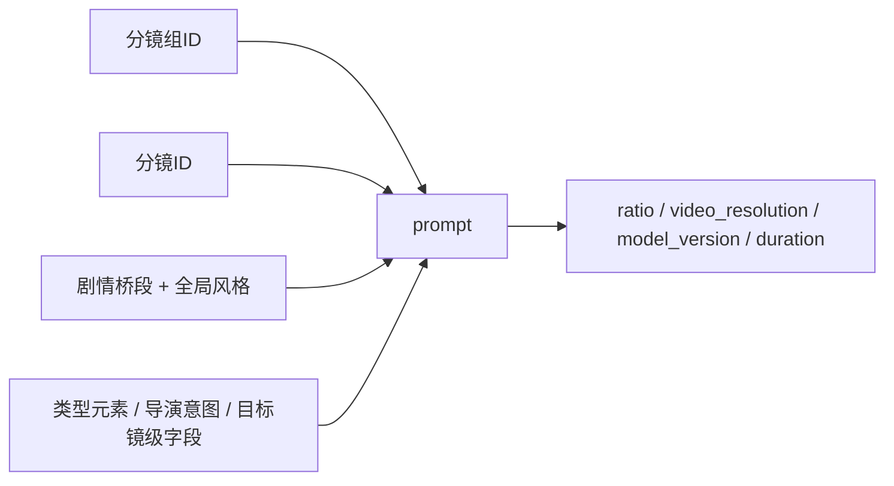

# 6-视频 / 首帧参照

## 概述

`首帧参照` 是 `6-视频` 阶段位于 `1-提示词蒸馏` tranche 的帧级叶子子技能。

当前加载路径固定为 `.agents/skills/aigc/6-视频/subtypes/1-提示词蒸馏/首帧参照/`。

它负责把 `projects/<项目名>/编导/第N集.json` 中 **分镜组维度下的上下文** 收束到 **单一 `分镜ID`**，并把该分镜帧组织为可供视频工具消费的 **帧级请求 JSON** 与人工审阅文本视图。

当前设计重点不是直接提交视频任务，而是先把每个目标分镜帧整理成：

1. 以 `分镜ID` 为锚点的 `prompt`
2. 兼容 `6-视频/_shared` 共享模板的 `meta + prompt_style + model + prompt + prompt_char_count`
3. 留空不处理的参照图字段骨架
4. 对应同集 `txt` 阅读视图，承载提示词正文与字数统计

其中：

- 上游默认路径固定为 `projects/<项目名>/编导/第N集.json`
- shared schema 固定为 `.agents/skills/aigc/_shared/director_episode_output.schema.json`
- 参照图信息当前统一留空不处理，不在本子技能中展开
- 每个目标 `分镜ID` 的 `prompt` 默认目标字数为 `800-1200` 中文字符；如用户另有要求，以显式约束覆盖

## When to Use

- 需要把导演 JSON 中单一 `分镜ID` 蒸馏成视频工具入参 JSON。
- 需要输出 `第N集.json + 第N集.txt` 双文件结果。
- 需要输出 `meta + prompt_style + model + prompt + prompt_char_count` 结构化视频请求 JSON。
- 需要保留 `组间设计.全局风格` 原文不变，并把 `剧本正文` 解析为该分镜帧对应的剧情桥段。
- 需要在 prompt 中隐藏字段标题，只保留 `分镜组ID` 与 `分镜ID` 的显式标签。

## When Not to Use

- 需要按整个分镜组全覆盖地蒸馏视频请求，应进入 `全能参照`。
- 需要真正提交 `dreamina multimodal2video` 或轮询任务结果。
- 上游 `编导/第N集.json` 还没形成合法 `分镜组列表`，或目标 `分镜ID` 不存在。

## 子技能边界

### `首帧参照` 拥有

- 单一 `分镜ID` -> 视频请求条目的一对一转换合同
- `剧本正文 -> 对应分镜帧剧情桥段` 的解析规则
- 帧级 prompt 的字数窗与压缩策略
- 对 `6-视频/_shared` 双模板的局部填充规则

### `首帧参照` 不拥有

- 实际上传参照图
- 真实视频模型提交
- 重新改写上游导演事实

## Visual Maps

## Canonical Module References

| 模块 | 作用 | 真源文件 |
| --- | --- | --- |
| 思维链 | 承载字段主表、判断链与返工入口 | `references/chain-of-thought.md` |
| 执行流程 | 承载输入、剧情桥段提取与落点 | `references/execution-flow.md` |
| 类型策略 | 承载桥段判定、字数预算与回退规则 | `references/type-strategies.md` |
| 输出契约 | 承载 JSON 结构、双输出与 manifest 最低要求 | `references/output-template.md` |

## Execution Summary

- 每个目标 `分镜ID` 只生成 1 条视频请求对象。
- `prompt` 的原始信息来源必须覆盖目标分镜所属组的上下文与该目标分镜的全部镜级内容。
- `组间设计.全局风格` 必须原文保留，不允许改写或净化。
- `剧本正文` 不再整段直贴；必须解析为对应目标分镜帧的剧情桥段。
- `prompt_style` 独立承载类型、语言和提示词字数限制。
- `meta.source_shot_ids` 在本子技能中固定承载长度为 1 的目标 `分镜ID` 列表。
- `model.reference_images` 与 `model.image_markers` 当前按共享模板骨架保留，不参与本轮处理。
- 同集还要额外产出 `第N集.txt`，用于按共享文本模板直出提示词与字数统计。
- `第N集.txt` 只是 derived display view，不是 canonical completeness carrier；完整性与下游消费能力以 `第N集.json` 为准。

## Output Summary

- canonical 主产物：`projects/<项目名>/视频/首帧参照/第N集/第N集.json`
- canonical 文本视图：`projects/<项目名>/视频/首帧参照/第N集/第N集.txt`
- 辅助文件：`projects/<项目名>/视频/首帧参照/第N集/_manifest.json`
- 共享模板真源：`.agents/skills/aigc/6-视频/_shared/video-generation-input.template.json`
- 共享文本模板真源：`.agents/skills/aigc/6-视频/_shared/视频生成入参.template.txt`

## Strategy Summary

- 固定保留：`组间设计.全局风格`
- 解析提取：`剧本正文 -> 对应分镜帧剧情桥段`
- 均匀压缩：`组间设计.类型元素`、`组间设计.导演意图` 与目标镜级字段
- 辅助裁切：同组其他分镜仅作为剧情桥段切分依据，不得整段迁入 prompt 主体
- 字段标题隐藏：除 `分镜组ID` 和 `分镜ID` 之外，其余字段名不显式出现

## Field System Summary

- 字段体系保持 `FIELD-VID-FFR-01` 到 `FIELD-VID-FFR-04`
- 详细字段表、thought pass 与 pass table 见 `references/chain-of-thought.md`

## Root-Cause Execution Contract (Mandatory)

当出现以下症状时，必须先修本子技能合同：

- prompt 明明是帧级任务，却直接复用了整组 `剧本正文`
- prompt 对应错了 `分镜ID`，或没能回链到所属 `分镜组ID`
- `全局风格` 被改写，或 `剧情桥段` 中新增了上游没有的事实
- prompt 里仍然残留 `角色及站位:` 这类字段标题
- 参照图字段被擅自填入虚构 URL 或主体

必经链路：

`Symptom -> Direct Technical Cause -> Rule Source -> Meta Rule Source -> Fix Landing Points`

优先检查：

- `Rule Source`
  - `.agents/skills/aigc/6-视频/subtypes/1-提示词蒸馏/首帧参照/SKILL.md`
  - `.agents/skills/aigc/6-视频/subtypes/1-提示词蒸馏/首帧参照/CONTEXT.md`
- `Meta Rule Source`
  - `.agents/skills/aigc/6-视频/SKILL.md`
  - `.agents/skills/aigc/SKILL.md`
  - 根 `AGENTS.md`

## Context Preload (Mandatory)

- 执行前先加载 `.agents/skills/aigc/6-视频/SKILL.md + CONTEXT.md`。
- 再加载本 `SKILL.md + CONTEXT.md`。
- 建议同时读取 `references/*.md`、`.agents/skills/aigc/6-视频/_shared/video-generation-input.template.json` 与 `.agents/skills/aigc/6-视频/_shared/视频生成入参.template.txt`。
- 优先级遵循：用户显式请求 > 根 `AGENTS.md` > `.agents/skills/aigc/SKILL.md` > `.agents/skills/aigc/6-视频/SKILL.md` > 本 `SKILL.md` > 各级 `CONTEXT.md`。
